# REQ-2025-003-user-login 文件追溯图

## 功能概述

本文档展示了REQ-2025-003-user-login需求的所有相关文件及其追溯关系，使用Mermaid格式可视化展示文件之间的依赖关系和追溯链。

## 用户故事

作为开发人员或项目管理者，我希望能够快速了解REQ-2025-003-user-login需求涉及的所有文件及其关系，以便进行代码审查、维护和追溯。

## 验收标准

- ✅ 追溯图包含所有实现文件（后端和前端）
- ✅ 追溯图包含所有测试文件（单元测试、集成测试、E2E测试）
- ✅ 追溯图展示文件之间的依赖关系
- ✅ 追溯图使用Mermaid格式，可在支持Mermaid的Markdown查看器中渲染
- ✅ 文档包含文件统计信息

## 测试用例

无需测试用例，本文档为技术文档。

## Mermaid追溯图

```mermaid
graph TB
    %% PRD文档 - 根节点
    PRD[REQ-2025-003-user-login.md<br/>产品需求文档]

    %% API契约
    API[REQ-2025-003-user-login-api.yaml<br/>API契约定义]

    %% 后端核心实现
    subgraph Backend["后端实现 (Backend)"]
        direction TB
        Models[models.py<br/>数据模型]
        Views[views.py<br/>API视图]
        Serializers[serializers.py<br/>序列化器]
        Utils[utils.py<br/>工具函数]
        Throttling[throttling.py<br/>频率限制]
        Tasks[tasks.py<br/>Celery任务]
        Urls[urls.py<br/>URL路由]
    end

    %% 后端测试
    subgraph BackendTests["后端测试 (Backend Tests)"]
        direction TB
        TestModels[test_auth_models.py<br/>模型单元测试]
        TestCaptcha[test_captcha.py<br/>验证码单元测试]
        TestPreview[test_auth_preview.py<br/>预验证单元测试]
        TestAuthAPI[test_auth_api.py<br/>认证API集成测试]
        TestRegisterAPI[test_register_api.py<br/>注册API集成测试]
        TestLoginAPI[test_login_api.py<br/>登录API集成测试]
        TestTokenAPI[test_token_api.py<br/>Token API集成测试]
        TestPasswordReset[test_password_reset.py<br/>密码重置集成测试]
        TestPreviewThrottling[test_preview_throttling.py<br/>预验证频率限制测试]
    end

    %% 前端Store
    subgraph FrontendStore["前端状态管理 (Frontend Store)"]
        direction TB
        AuthStore[auth.ts<br/>认证状态管理]
        AuthStoreTest[auth.spec.ts<br/>Store单元测试]
    end

    %% 前端视图
    subgraph FrontendViews["前端视图 (Frontend Views)"]
        direction TB
        LoginView[Login.vue<br/>登录页面]
        LoginViewTest[Login.spec.ts<br/>登录页面测试]
        VerifyEmailView[VerifyEmailView.vue<br/>邮箱验证页面]
        VerifyEmailViewTest[VerifyEmailView.spec.ts<br/>邮箱验证页面测试]
    end

    %% 前端组件
    subgraph FrontendComponents["前端组件 (Frontend Components)"]
        direction TB
        LoginForm[LoginForm.vue<br/>登录表单]
        LoginFormTest[LoginForm.spec.ts<br/>登录表单测试]
        RegisterForm[RegisterForm.vue<br/>注册表单]
        RegisterFormTest[RegisterForm.spec.ts<br/>注册表单测试]
        PasswordResetForm[PasswordResetForm.vue<br/>密码重置请求表单]
        PasswordResetFormTest[PasswordResetForm.spec.ts<br/>密码重置表单测试]
        ResetPasswordForm[ResetPasswordForm.vue<br/>密码重置确认表单]
        ResetPasswordFormTest[ResetPasswordForm.spec.ts<br/>密码重置确认测试]
        Captcha[Captcha.vue<br/>验证码组件]
        CaptchaTest[Captcha.spec.ts<br/>验证码组件测试]
        FloatingInput[FloatingInput.vue<br/>悬浮输入框]
        FloatingInputTest[FloatingInput.spec.ts<br/>悬浮输入框测试]
        PasswordStrength[PasswordStrength.vue<br/>密码强度指示器]
        PasswordStrengthTest[PasswordStrength.spec.ts<br/>密码强度测试]
        UserPreview[UserPreview.vue<br/>用户预览组件]
        UserPreviewTest[UserPreview.spec.ts<br/>用户预览测试]
        DefaultAvatar[DefaultAvatar.vue<br/>默认头像组件]
        DefaultAvatarTest[DefaultAvatar.spec.ts<br/>默认头像测试]
    end

    %% 前端工具和样式
    subgraph FrontendUtils["前端工具和样式 (Frontend Utils & Styles)"]
        direction TB
        Validation[validation.ts<br/>表单验证工具]
        Debounce[debounce.ts<br/>防抖工具]
        BrandColors[brand-colors.css<br/>品牌配色方案]
        AuthCommon[auth-common.css<br/>认证通用样式]
        Router[index.ts<br/>路由配置]
        RouterTest[index.spec.ts<br/>路由测试]
        Main[main.ts<br/>应用入口]
    end

    %% E2E测试
    subgraph E2ETests["端到端测试 (E2E Tests)"]
        direction TB
        E2ELogin[login.spec.ts<br/>登录E2E测试]
        E2ERegister[register.spec.ts<br/>注册E2E测试]
        E2EPasswordReset[password-reset.spec.ts<br/>密码重置E2E测试]
        E2ELoginPreview[login-preview.spec.ts<br/>登录预览E2E测试]
    end

    %% 文档
    subgraph Docs["文档 (Documentation)"]
        direction TB
        UIAudit[ui-ux-audit-REQ-2025-003.md<br/>UI/UX验收报告]
    end

    %% PRD到实现文件的连接
    PRD --> API
    PRD --> Models
    PRD --> Views
    PRD --> Serializers
    PRD --> Utils
    PRD --> Throttling
    PRD --> Tasks
    PRD --> AuthStore
    PRD --> LoginView
    PRD --> VerifyEmailView
    PRD --> LoginForm
    PRD --> RegisterForm
    PRD --> PasswordResetForm
    PRD --> ResetPasswordForm
    PRD --> Captcha
    PRD --> FloatingInput
    PRD --> PasswordStrength
    PRD --> UserPreview
    PRD --> DefaultAvatar
    PRD --> UIAudit

    %% API契约到实现的连接
    API --> Views
    API --> Serializers

    %% 后端实现文件之间的依赖
    Views --> Models
    Views --> Serializers
    Views --> Utils
    Views --> Throttling
    Views --> Tasks
    Views --> Urls
    Serializers --> Models
    Utils --> Models
    Tasks --> Models

    %% 后端测试到实现的连接
    TestModels --> Models
    TestCaptcha --> Utils
    TestPreview --> Views
    TestPreview --> Throttling
    TestAuthAPI --> Views
    TestRegisterAPI --> Views
    TestLoginAPI --> Views
    TestTokenAPI --> Views
    TestPasswordReset --> Views
    TestPreviewThrottling --> Views
    TestPreviewThrottling --> Throttling

    %% 前端Store到后端API的连接
    AuthStore --> Views
    AuthStoreTest --> AuthStore

    %% 前端视图到组件的连接
    LoginView --> LoginForm
    LoginView --> AuthStore
    LoginView --> BrandColors
    LoginView --> AuthCommon
    LoginViewTest --> LoginView
    VerifyEmailView --> AuthStore
    VerifyEmailView --> BrandColors
    VerifyEmailViewTest --> VerifyEmailView

    %% 前端组件之间的依赖
    LoginForm --> FloatingInput
    LoginForm --> Captcha
    LoginForm --> UserPreview
    LoginForm --> AuthStore
    LoginForm --> Validation
    LoginForm --> Debounce
    LoginForm --> BrandColors
    LoginFormTest --> LoginForm

    RegisterForm --> FloatingInput
    RegisterForm --> Captcha
    RegisterForm --> PasswordStrength
    RegisterForm --> AuthStore
    RegisterForm --> Validation
    RegisterForm --> BrandColors
    RegisterFormTest --> RegisterForm

    PasswordResetForm --> FloatingInput
    PasswordResetForm --> Captcha
    PasswordResetForm --> AuthStore
    PasswordResetForm --> Validation
    PasswordResetForm --> BrandColors
    PasswordResetFormTest --> PasswordResetForm

    ResetPasswordForm --> FloatingInput
    ResetPasswordForm --> PasswordStrength
    ResetPasswordForm --> AuthStore
    ResetPasswordForm --> Validation
    ResetPasswordForm --> BrandColors
    ResetPasswordFormTest --> ResetPasswordForm

    UserPreview --> DefaultAvatar
    UserPreview --> AuthStore
    UserPreview --> BrandColors
    UserPreviewTest --> UserPreview

    Captcha --> AuthStore
    Captcha --> BrandColors
    CaptchaTest --> Captcha

    FloatingInput --> BrandColors
    FloatingInputTest --> FloatingInput

    PasswordStrength --> BrandColors
    PasswordStrengthTest --> PasswordStrength

    DefaultAvatar --> BrandColors
    DefaultAvatarTest --> DefaultAvatar

    %% 工具和样式文件的连接
    Validation --> LoginForm
    Validation --> RegisterForm
    Validation --> PasswordResetForm
    Validation --> ResetPasswordForm

    Debounce --> LoginForm

    BrandColors --> LoginView
    BrandColors --> VerifyEmailView
    BrandColors --> LoginForm
    BrandColors --> RegisterForm
    BrandColors --> PasswordResetForm
    BrandColors --> ResetPasswordForm
    BrandColors --> Captcha
    BrandColors --> FloatingInput
    BrandColors --> PasswordStrength
    BrandColors --> UserPreview
    BrandColors --> DefaultAvatar

    AuthCommon --> LoginForm
    AuthCommon --> RegisterForm
    AuthCommon --> PasswordResetForm
    AuthCommon --> ResetPasswordForm

    Router --> LoginView
    Router --> VerifyEmailView
    RouterTest --> Router

    Main --> BrandColors
    Main --> AuthCommon
    Main --> Router
    Main --> AuthStore

    %% E2E测试到实现的连接
    E2ELogin --> LoginView
    E2ELogin --> LoginForm
    E2ERegister --> RegisterForm
    E2EPasswordReset --> PasswordResetForm
    E2EPasswordReset --> ResetPasswordForm
    E2ELoginPreview --> LoginForm
    E2ELoginPreview --> UserPreview

    %% 样式定义
    classDef prdNode fill:#1a237e,stroke:#ffd700,stroke-width:3px,color:#fff
    classDef backendNode fill:#667eea,stroke:#764ba2,stroke-width:2px,color:#fff
    classDef frontendNode fill:#10b981,stroke:#059669,stroke-width:2px,color:#fff
    classDef testNode fill:#ef4444,stroke:#dc2626,stroke-width:2px,color:#fff
    classDef utilNode fill:#f59e0b,stroke:#d97706,stroke-width:2px,color:#fff
    classDef docNode fill:#6b7280,stroke:#4b5563,stroke-width:2px,color:#fff

    class PRD,API prdNode
    class Models,Views,Serializers,Utils,Throttling,Tasks,Urls backendNode
    class AuthStore,LoginView,VerifyEmailView,LoginForm,RegisterForm,PasswordResetForm,ResetPasswordForm,Captcha,FloatingInput,PasswordStrength,UserPreview,DefaultAvatar frontendNode
    class TestModels,TestCaptcha,TestPreview,TestAuthAPI,TestRegisterAPI,TestLoginAPI,TestTokenAPI,TestPasswordReset,TestPreviewThrottling,AuthStoreTest,LoginViewTest,VerifyEmailViewTest,LoginFormTest,RegisterFormTest,PasswordResetFormTest,ResetPasswordFormTest,CaptchaTest,FloatingInputTest,PasswordStrengthTest,UserPreviewTest,DefaultAvatarTest,RouterTest,E2ELogin,E2ERegister,E2EPasswordReset,E2ELoginPreview testNode
    class Validation,Debounce,BrandColors,AuthCommon,Router,Main utilNode
    class UIAudit docNode
```

## 文件统计

### 后端实现文件 (7个)

- `backend/apps/users/models.py` - 数据模型
- `backend/apps/users/views.py` - API视图
- `backend/apps/users/serializers.py` - 序列化器
- `backend/apps/users/utils.py` - 工具函数
- `backend/apps/users/throttling.py` - 频率限制
- `backend/apps/users/tasks.py` - Celery任务
- `backend/apps/users/urls.py` - URL路由

### 后端测试文件 (9个)

- `backend/tests/unit/test_auth_models.py` - 模型单元测试
- `backend/tests/unit/test_captcha.py` - 验证码单元测试
- `backend/tests/unit/test_auth_preview.py` - 预验证单元测试
- `backend/tests/integration/test_auth_api.py` - 认证API集成测试
- `backend/tests/integration/test_register_api.py` - 注册API集成测试
- `backend/tests/integration/test_login_api.py` - 登录API集成测试
- `backend/tests/integration/test_token_api.py` - Token API集成测试
- `backend/tests/integration/test_password_reset.py` - 密码重置集成测试
- `backend/tests/integration/test_preview_throttling.py` - 预验证频率限制测试

### 前端实现文件 (15个)

- `frontend/src/stores/auth.ts` - 认证状态管理
- `frontend/src/views/Login.vue` - 登录页面
- `frontend/src/views/VerifyEmailView.vue` - 邮箱验证页面
- `frontend/src/components/auth/LoginForm.vue` - 登录表单
- `frontend/src/components/auth/RegisterForm.vue` - 注册表单
- `frontend/src/components/auth/PasswordResetForm.vue` - 密码重置请求表单
- `frontend/src/components/auth/ResetPasswordForm.vue` - 密码重置确认表单
- `frontend/src/components/auth/Captcha.vue` - 验证码组件
- `frontend/src/components/auth/FloatingInput.vue` - 悬浮输入框
- `frontend/src/components/auth/PasswordStrength.vue` - 密码强度指示器
- `frontend/src/components/auth/UserPreview.vue` - 用户预览组件
- `frontend/src/components/auth/DefaultAvatar.vue` - 默认头像组件
- `frontend/src/router/index.ts` - 路由配置
- `frontend/src/utils/validation.ts` - 表单验证工具
- `frontend/src/utils/debounce.ts` - 防抖工具

### 前端测试文件 (13个)

- `frontend/src/stores/__tests__/auth.spec.ts` - Store单元测试
- `frontend/src/views/Login.spec.ts` - 登录页面测试
- `frontend/src/views/__tests__/VerifyEmailView.spec.ts` - 邮箱验证页面测试
- `frontend/src/components/auth/__tests__/LoginForm.spec.ts` - 登录表单测试
- `frontend/src/components/auth/__tests__/RegisterForm.spec.ts` - 注册表单测试
- `frontend/src/components/auth/__tests__/PasswordResetForm.spec.ts` - 密码重置表单测试
- `frontend/src/components/auth/__tests__/ResetPasswordForm.spec.ts` - 密码重置确认测试
- `frontend/src/components/auth/__tests__/Captcha.spec.ts` - 验证码组件测试
- `frontend/src/components/auth/__tests__/FloatingInput.spec.ts` - 悬浮输入框测试
- `frontend/src/components/auth/__tests__/PasswordStrength.spec.ts` - 密码强度测试
- `frontend/src/components/auth/__tests__/UserPreview.spec.ts` - 用户预览测试
- `frontend/src/components/auth/__tests__/DefaultAvatar.spec.ts` - 默认头像测试
- `frontend/src/router/index.spec.ts` - 路由测试

### E2E测试文件 (4个)

- `e2e/tests/auth/login.spec.ts` - 登录E2E测试
- `e2e/tests/auth/register.spec.ts` - 注册E2E测试
- `e2e/tests/auth/password-reset.spec.ts` - 密码重置E2E测试
- `e2e/tests/auth/login-preview.spec.ts` - 登录预览E2E测试

### 样式文件 (2个)

- `frontend/src/assets/styles/brand-colors.css` - 品牌配色方案
- `frontend/src/assets/styles/auth-common.css` - 认证通用样式

### 配置文件 (1个)

- `frontend/src/main.ts` - 应用入口（导入样式和配置）

### API契约文件 (1个)

- `docs/01_guideline/api-contracts/REQ-2025-003-user-login/REQ-2025-003-user-login-api.yaml` - API契约定义

### 文档文件 (2个)

- `docs/00_product/requirements/REQ-2025-003-user-login/REQ-2025-003-user-login.md` - 产品需求文档
- `docs/ui-ux-audit-REQ-2025-003.md` - UI/UX验收报告

## 总计

- **实现文件**: 22个（后端7个 + 前端15个）
- **测试文件**: 26个（后端9个 + 前端13个 + E2E 4个）
- **样式文件**: 2个
- **工具文件**: 2个
- **配置文件**: 1个
- **API契约**: 1个
- **文档文件**: 2个
- **总计**: 56个文件

## 依赖关系说明

1. **后端层**：

   - `views.py` 依赖 `models.py`, `serializers.py`, `utils.py`, `throttling.py`, `tasks.py`
   - `serializers.py` 依赖 `models.py`
   - `utils.py` 依赖 `models.py`
   - `tasks.py` 依赖 `models.py`

2. **前端层**：

   - 所有组件依赖 `auth.ts` store
   - 表单组件依赖 `validation.ts` 和 `debounce.ts`
   - 所有组件依赖 `brand-colors.css` 和 `auth-common.css`
   - `LoginView` 依赖 `LoginForm` 组件
   - `UserPreview` 依赖 `DefaultAvatar` 组件

3. **测试层**：

   - 所有测试文件对应相应的实现文件
   - E2E测试覆盖完整的用户流程

4. **API契约**：
   - 定义了后端API的接口规范
   - 被 `views.py` 和 `serializers.py` 实现
