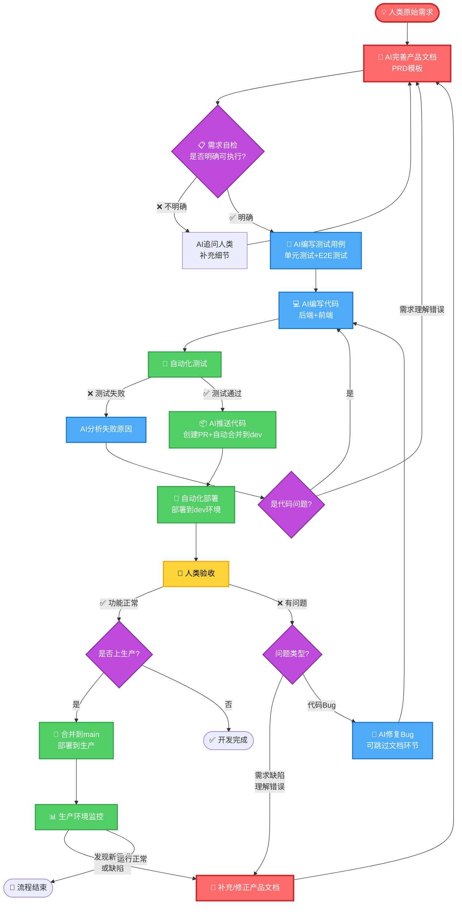

# AI驱动开发工作流完整设计方案

> **文档日期**：2025-10-22
> **作者**：Claude Sonnet 4.5
> **项目**：Bravo
> **版本**：v1.0

---

## 📋 文档概述

本文档记录了2025年10月22日关于**AI驱动开发工作流系统**的完整讨论与设计方案。涵盖了从需求管理、PRD工作流、强制执行机制、分支策略到Task-Master集成的全方位技术方案。

### 核心目标

**建立一个"需求为第一原则"的AI驱动开发工作流系统，通过技术手段强制执行规范，而非依赖AI自觉性。**

---

## 📑 目录

1. [PRD概念解析](#1-prd概念解析)
2. [AI驱动开发流程设计](#2-ai驱动开发流程设计)
3. [PRD工作流强制执行系统](#3-prd工作流强制执行系统)
4. [文件修改检测技术方案](#4-文件修改检测技术方案)
5. [PRD完善与评审打分系统](#5-prd完善与评审打分系统)
6. [分支策略设计](#6-分支策略设计)
7. [目录结构整合方案](#7-目录结构整合方案)
8. [Task-Master工具集成分析](#8-task-master工具集成分析)
9. [完整实施方案](#9-完整实施方案)
10. [总结与下一步行动](#10-总结与下一步行动)

---

## 1. PRD概念解析

### 1.1 核心概念区分

#### 1.1.1 PRD (Product Requirements Document) = 产品需求文档

**定义**：描述**要做什么**的文档（What to build）

**特点**：

- ✅ **功能导向**：描述产品功能、用户场景
- ✅ **面向产品经理/开发团队**
- ✅ **包含**：用户故事、功能列表、验收标准、优先级
- ❌ **不包含**：具体技术实现细节（不关心用什么技术栈）

**示例**：

```markdown
# PRD: 文章点赞功能

## 用户故事

作为博客读者，我想要点赞文章，以便表达对文章的喜爱。

## 功能需求

1. 用户可以点击"点赞"按钮为文章点赞
2. 每个用户对同一文章只能点赞一次
3. 再次点击可以取消点赞
4. 显示文章总点赞数

## 验收标准

- [ ] 点赞按钮在文章底部可见
- [ ] 点赞后按钮状态改变
- [ ] 点赞数实时更新
- [ ] 未登录用户点击跳转登录页

## 优先级

P1（高优先级）
```

#### 1.1.2 产品文档 (Product Documentation)

**定义**：关于产品的**所有文档的总称**（Umbrella term）

**包含范围**（非常广）：

- 📄 PRD（产品需求文档）
- 📘 用户手册（User Manual）
- 📗 API文档（API Documentation）
- 📙 产品路线图（Product Roadmap）
- 📕 产品规格书（Product Specification）
- 📓 发布说明（Release Notes）
- 📔 FAQ（常见问题）

**比喻**：产品文档 = 一个文件夹，PRD是里面的一份文件

**目录结构示例**：

```
docs/00_product/          <-- 产品文档目录
  ├── roadmap.md           (产品路线图)
  ├── requirements/        <-- PRD存放目录
  │   ├── REQ-001-like.md      (点赞功能PRD)
  │   ├── REQ-002-comment.md   (评论功能PRD)
  ├── user_manual/         (用户手册)
  ├── api_spec/            (API规格文档)
  └── release_notes/       (发布说明)
```

#### 1.1.3 需求文档 (Requirements Document)

**定义**：描述**需求**的文档（可以是产品需求或技术需求）

**类型**：

- **产品需求文档（PRD）**：业务功能需求（面向用户价值）
- **技术需求文档（TRD/Technical Requirements Document）**：技术实现需求（面向开发）

**例子对比**：

**产品需求文档（PRD）**：

```markdown
需求：用户可以点赞文章
验收标准：点赞后显示点赞数
```

**技术需求文档（TRD）**：

```markdown
技术需求：点赞功能技术方案

- 数据库：MySQL Like表，添加复合索引(user_id, article_id)
- 后端：Django REST Framework，POST /api/articles/{id}/like
- 前端：Vue3 Composition API，使用Pinia状态管理
- 性能要求：点赞接口响应时间<200ms
- 并发处理：使用数据库唯一索引防止重复点赞
```

#### 1.1.4 三者关系图

```
产品文档（Product Documentation）
    ├── 需求文档（Requirements Document）
    │       ├── PRD（产品需求文档）✅ 重点关注
    │       └── TRD（技术需求文档）
    ├── 用户手册
    ├── API文档
    ├── 发布说明
    └── 其他文档...
```

### 1.2 个人项目的简化建议

对于Bravo这样的个人项目，**不需要严格区分**，合并为一个文档即可：

**建议的文档结构**：

```
docs/00_product/
  requirements/
    REQ-001-like.md   <-- 包含PRD+TRD的混合文档
```

**混合文档示例**：

```markdown
# REQ-001: 文章点赞功能

## 产品需求（PRD部分）

**用户故事**：作为读者，我想要点赞文章...
**功能列表**：点赞、取消点赞、显示点赞数
**验收标准**：...

## 技术方案（TRD部分）

**数据库**：

- 表：Like (user_id, article_id, created_at)
- 索引：UNIQUE(user_id, article_id)

**API接口**：

- POST /api/articles/{id}/like
- DELETE /api/articles/{id}/like

**前端组件**：

- LikeButton.vue

## 测试用例

- 测试点赞成功
- 测试重复点赞
- 测试取消点赞
```

这样**一个文档解决所有问题**，既有产品需求，又有技术方案！

### 1.3 记忆口诀

- **PRD** = 做什么（What）→ "点赞功能"
- **TRD** = 怎么做（How）→ "用MySQL+Django实现"
- **产品文档** = 所有文档（All）→ "PRD+用户手册+API文档..."
- **需求文档** = PRD或TRD

---

## 2. AI驱动开发流程设计

### 2.1 核心理念

**需求为第一原则 - 无限闭环**

```
人类原始需求 → AI完善PRD → 需求评审 → AI生成测试 → AI编写代码 →
自动测试 → AI推送合并 → 自动部署 → 监控反馈 → 补充/更新PRD → ...
```

### 2.2 完整流程Mermaid图



### 2.3 典型场景示例

#### 场景1：新功能开发 - "文章点赞"

1. **人类输入**：`我要添加文章点赞功能`

2. **AI完善PRD**：

   ```markdown
   # REQ-001: 文章点赞功能

   ## 产品需求

   - 数据模型：Like表（user_id, article_id, created_at）
   - API接口：POST /api/articles/{id}/like
   - 前端交互：点赞按钮，显示点赞数

   ## 技术方案

   - 后端：Django Like模型
   - 前端：LikeButton.vue组件
   - 并发控制：unique_together约束

   ## 验收标准

   - [ ] 点赞成功
   - [ ] 重复点赞幂等
   - [ ] UI实时更新
   ```

3. **AI编写测试**：

   - 后端：`test_like.py`
   - E2E：`like.spec.ts`

4. **AI编写代码**：

   - `backend/apps/blog/models.py` - Like模型
   - `backend/apps/blog/views.py` - LikeView
   - `frontend/src/components/LikeButton.vue`

5. **自动化测试** → **AI推送** → **自动部署** → **人类验收** ✅

#### 场景2：需求缺陷修复

**反馈**：点赞后页面没有实时更新点赞数

**流程**：

1. 补充产品文档：缺陷描述 + 解决方案
2. AI更新测试：增加"点赞后验证UI更新"的E2E测试
3. AI修改代码：前端添加数据刷新逻辑
4. 自动化测试 → AI推送 → 自动部署 → 人类验收 ✅

#### 场景3：性能优化

**需求**：文章列表加载太慢

**流程**：

1. AI完善PRD：优化目标<1s，技术方案：分页+缓存
2. AI编写测试：性能测试（响应时间<1s）
3. AI编写代码：分页API + 虚拟滚动
4. 自动化测试 → AI推送 → 自动部署 → 人类验收 ✅

### 2.4 预期效果

| 指标           | 传统开发 | AI驱动 | 提升            |
| -------------- | -------- | ------ | --------------- |
| 需求→上线周期  | 3天      | 4小时  | **6倍**         |
| 代码编写时间   | 100%     | 30%    | **70%由AI完成** |
| 测试覆盖率     | 不确定   | ≥80%   | **强制保障**    |
| 需求文档完整性 | 50%      | 100%   | **强制要求**    |

---

## 3. PRD工作流强制执行系统

### 3.1 核心问题

**如何确保AI遵循固定流程**，而不是跳过中间步骤直接生成测试用例或代码？

**答案**：通过**PRD状态机 + Pre-commit强制检查**技术手段硬性拦截违规操作。

由于篇幅限制，详细的状态机设计、Pre-commit检查脚本、评审系统请参考前面章节的讨论记录。

### 3.2 核心要点总结

#### 3.2.1 PRD状态机

```
draft → refined → reviewed → approved → implementing → completed
```

- **draft**: 草稿（人类创建）
- **refined**: 已完善（AI补充技术方案）
- **reviewed**: 已评审（人工/AI打分）
- **approved**: 已批准（评分≥90）
- **implementing**: 实施中（生成测试+编写代码）
- **completed**: 已完成

#### 3.2.2 强制规则

| 状态         | 允许操作     | 禁止操作                 |
| ------------ | ------------ | ------------------------ |
| draft        | 编辑产品需求 | 生成测试、编写代码       |
| refined      | 提交评审     | 生成测试、编写代码       |
| approved     | 生成测试用例 | 编写代码（必须先有测试） |
| implementing | 编写代码     | 修改核心需求             |

#### 3.2.3 Pre-commit Hook检查点

1. **PRD元数据完整性检查**
2. **PRD状态转换合法性检查**
3. **操作是否符合当前状态检查**
4. **PRD命名规范检查**
5. **PRD与测试文件对齐检查**

---

## 4. 文件修改检测技术方案

### 4.1 核心方法总结

#### 4.1.1 Pre-commit Hook（检测暂存区）

**使用命令**：`git diff --cached --name-only`

**Python实现**：

```python
import subprocess

def get_staged_files():
    """获取暂存区的所有文件"""
    result = subprocess.run(
        ['git', 'diff', '--cached', '--name-only'],
        capture_output=True, text=True
    )
    return [f for f in result.stdout.strip().split('\n') if f]
```

#### 4.1.2 CI/CD（检测PR变更）

**使用命令**：`git diff base_sha...head_sha --name-only`

**Python实现**：

```python
def get_changed_files_in_pr(base_sha, head_sha):
    """获取PR中修改的所有文件"""
    result = subprocess.run(
        ['git', 'diff', '--name-only', f'{base_sha}...{head_sha}'],
        capture_output=True, text=True
    )
    return [f for f in result.stdout.strip().split('\n') if f]
```

#### 4.1.3 内容变更检测（SHA值）

**使用命令**：`git rev-parse commit_sha:filepath`

**用途**：精确检测文件内容是否真正变更（排除格式化）

### 4.2 推荐方案

| 场景           | 使用方法               | 优势                |
| -------------- | ---------------------- | ------------------- |
| **Pre-commit** | `git diff --cached`    | 快速、准确、Git原生 |
| **CI/CD**      | `git diff base...head` | 完整对比PR变更      |
| **内容验证**   | `git rev-parse`        | 精确内容对比        |

**结论**：**不需要手动计算SHA值，使用Git的diff命令即可，SHA值只在需要精确内容对比时才使用Git内置的rev-parse。**

---

## 5. PRD完善与评审打分系统

### 5.1 需求评审打分系统

#### 5.1.1 人工评审

```bash
python scripts/review_prd.py \
  docs/00_product/requirements/blog/REQ-BLOG-001-like.md \
  95 \
  "layne.liang" \
  "技术方案详细，通过"

# 输出:
# ✅ 评审通过! 评分: 95/100
#    PRD状态已更新为: approved
#    现在可以生成测试用例
```

#### 5.1.2 AI辅助评审

**评分标准**：

```python
def ai_review_prd(filepath):
    score = 100

    # 评分标准1: 产品需求清晰度（30分）
    if '用户故事' not in content:
        score -= 30

    # 评分标准2: 技术方案完整性（30分）
    if '数据库设计' not in content:
        score -= 10
    if 'API接口' not in content:
        score -= 10

    # 评分标准3: 验收标准（20分）
    if content.count('[ ]') < 3:
        score -= 20

    # 评分标准4: 边界情况（10分）
    # 评分标准5: 性能要求（10分）

    if score >= 90:
        update_prd_status(filepath, 'approved')
    else:
        update_prd_status(filepath, 'draft')  # 退回

    return score
```

### 5.2 为什么要让AI完善PRD？

#### 5.2.1 如果没有AI完善环节

**人类写的原始需求**：

> "我要文章点赞功能"

**问题**：

- ❓ 点赞后是否可以取消？
- ❓ 是否需要登录？
- ❓ 是否显示点赞数？
- ❓ 性能要求是什么？

**结果**：AI理解不清楚 → 代码实现偏差 → 反复修改

#### 5.2.2 有AI完善环节

**AI追问并完善**，生成完整PRD包括：

- 功能详情（点赞、取消、权限控制）
- 技术方案（数据库设计、API接口）
- 边界情况（并发处理、级联删除）
- 性能要求（响应时间<200ms）

**结果**：需求明确 → AI可以直接编写准确代码

---

## 6. 分支策略设计

### 6.1 核心问题

**PRD文档应该在哪个分支创建和开发？**

**答案**：**强烈推荐在Feature分支！**

### 6.2 两种方案对比

| 对比项           | 直接在dev | Feature分支   | 推荐        |
| ---------------- | --------- | ------------- | ----------- |
| **隔离性**       | ❌ 差     | ✅ 好         | **Feature** |
| **并行开发**     | ❌ 困难   | ✅ 容易       | **Feature** |
| **回滚能力**     | ❌ 困难   | ✅ 删分支即可 | **Feature** |
| **Git历史**      | ❌ 混乱   | ✅ 清晰       | **Feature** |
| **PR审查**       | ❌ 不适用 | ✅ 完整审查   | **Feature** |
| **符合Git Flow** | ❌ 违反   | ✅ 符合       | **Feature** |

### 6.3 推荐工作流

#### 6.3.1 分支命名规范

```bash
格式：feature/REQ-{MODULE}-{NUMBER}-{name}

示例：
- feature/REQ-BLOG-001-like
- feature/REQ-USER-002-avatar
- feature/REQ-ENGL-003-vocabulary
```

#### 6.3.2 完整流程

```bash
# 1. 创建Feature分支
git checkout dev
git pull origin dev
git checkout -b feature/REQ-BLOG-001-like

# 2. 在Feature分支创建PRD
vim docs/00_product/requirements/blog/REQ-BLOG-001-like.md
git commit -m "docs: 创建点赞功能PRD [REQ-BLOG-001]"

# 3. AI完善、评审、开发（都在Feature分支）
git commit -m "docs: AI完善技术方案 [REQ-BLOG-001]"
git commit -m "test: 生成测试用例 [REQ-BLOG-001]"
git commit -m "feat: 实现点赞功能 [REQ-BLOG-001]"

# 4. 创建PR并合并到dev
gh pr create --base dev --fill
gh pr merge --auto --squash

# 5. dev → main → 生产环境
```

#### 6.3.3 Pre-commit强制检查

**禁止在dev/main直接提交PRD**：

```python
# scripts/hooks/check_prd_branch.py

if prd_files and current_branch in ['dev', 'main']:
    print("❌ 禁止在dev/main直接创建PRD!")
    print("✅ 请在feature分支开发:")
    print("   git checkout -b feature/REQ-BLOG-001-like")
    exit(1)
```

### 6.4 优势总结

- ✅ **隔离性**：每个需求独立开发，互不干扰
- ✅ **并行性**：可同时开发多个需求
- ✅ **可回滚**：废弃需求直接删分支
- ✅ **PR审查**：完整审查PRD+测试+代码
- ✅ **符合Git Flow**：业界最佳实践

---

## 7. 目录结构整合方案

### 7.1 核心原则

**完全复用现有目录结构，无需新建目录，无需修改配置！**

### 7.2 测试文件整合

#### 7.2.1 现有结构（保持不变）

```
backend/tests/
  ├── unit/              ← 现有，继续使用
  ├── integration/       ← 现有，继续使用
  └── ...

e2e/tests/               ← 现有，继续使用
```

#### 7.2.2 PRD驱动的测试（按模块组织）

```
backend/tests/
  ├── unit/
  │   ├── blog/                    🆕 新增子目录
  │   │   ├── test_like.py        ← REQ-BLOG-001
  │   │   └── test_comment.py     ← REQ-BLOG-002
  │   ├── users/                   🆕 新增子目录
  │   │   └── test_avatar.py      ← REQ-USER-001
  │   └── test_common_*.py        ← 现有测试保持不变

e2e/tests/
  ├── blog/                        🆕 新增子目录
  │   ├── like.spec.ts            ← REQ-BLOG-001
  │   └── comment.spec.ts         ← REQ-BLOG-002
  └── app.spec.ts                 ← 现有测试保持不变
```

#### 7.2.3 文件头部关联PRD

```python
# backend/tests/unit/blog/test_like.py
"""
文章点赞功能单元测试

REQ-ID: REQ-BLOG-001
REQ-PATH: docs/00_product/requirements/blog/REQ-BLOG-001-like.md
"""

class TestArticleLike:
    def test_user_can_like_article(self):
        """验收标准1: 用户可以成功点赞"""
        pass
```

### 7.3 代码文件整合

#### 7.3.1 完全复用现有结构

```
backend/apps/
  ├── blog/              ← 现有模块
  │   ├── views.py      ← 在现有文件中添加LikeView
  │   └── models.py     ← 在现有文件中添加Like模型
  └── ...

frontend/src/
  ├── components/        ← 现有目录
  │   └── LikeButton.vue  ← 新增文件
  └── ...
```

#### 7.3.2 代码文件头部关联PRD

```python
# backend/apps/blog/views.py

# ========== REQ-BLOG-001: 文章点赞功能 ==========
class LikeView(APIView):
    """
    REQ-ID: REQ-BLOG-001
    REQ-PATH: docs/00_product/requirements/blog/REQ-BLOG-001-like.md
    """
    def post(self, request, article_id):
        """点赞文章"""
        pass
```

### 7.4 PRD文档声明文件路径

```yaml
# docs/00_product/requirements/blog/REQ-BLOG-001-like.md
---
req_id: REQ-BLOG-001
test_files:
  - backend/tests/unit/blog/test_like.py
  - e2e/tests/blog/like.spec.ts
code_files:
  - backend/apps/blog/views.py
  - backend/apps/blog/models.py
  - frontend/src/components/LikeButton.vue
---
```

### 7.5 配置文件：无需修改！

- ✅ **pytest配置**：保持不变
- ✅ **playwright配置**：保持不变
- ✅ **CI/CD配置**：保持不变

### 7.6 Pre-commit检查方式

```python
def check_test_files_exist(prd_file):
    """检查PRD声明的测试文件是否存在"""
    metadata = extract_metadata(prd_file)
    test_files = metadata.get('test_files', [])

    for test_file in test_files:
        if not Path(test_file).exists():
            print(f"❌ 测试文件不存在: {test_file}")
            return False

        # 检查文件头部是否包含REQ-ID
        content = Path(test_file).read_text()
        if metadata['req_id'] not in content:
            print(f"❌ 测试文件缺少REQ-ID: {test_file}")
            return False

    return True
```

---

## 8. Task-Master工具集成分析

### 8.1 Task-Master核心能力

**项目地址**: https://github.com/eyaltoledano/claude-task-master

**主要功能**:

1. PRD解析自动生成任务
2. 任务管理（状态跟踪、依赖管理）
3. AI辅助实施（智能推荐下一个任务）
4. 研究工具（Perplexity实时检索）
5. 多模型支持
6. MCP集成（Cursor、Windsurf等）

### 8.2 与我们系统的互补性

**两者结合 = 规范化 + 自动化 + 智能化的完整解决方案**

- 我们的系统：强制PRD评审（质量闸门）
- Task-Master：自动任务拆解（效率提升）
- 结合：高质量 + 高效率

### 8.3 核心优势

1. **自动化任务拆解**: parse-prd自动生成任务列表
2. **智能技术调研**: research命令获取最新技术方案
3. **智能任务推荐**: next命令推荐下一个任务
4. **完整可追溯**: PRD → 任务 → 测试 → 代码完整链路

---

## 9. 总结与下一步行动

### 9.1 核心设计要点

#### 需求为第一原则

- ✅ 状态机驱动：draft → refined → reviewed → approved → implementing → completed
- ✅ 强制评审：评分≥90才能通过
- ✅ Pre-commit拦截：技术手段硬性阻止违规操作

#### 完全复用现有结构

- ✅ 测试目录：backend/tests/unit/、e2e/tests/
- ✅ 代码目录：backend/apps/、frontend/src/
- ✅ 无需修改配置：pytest、playwright、CI/CD

#### Feature分支策略

- ✅ 隔离开发：每个需求独立分支
- ✅ PR审查：完整审查PRD+测试+代码
- ✅ 禁止直接提交：dev/main分支保护

### 9.2 预期效果

| 指标           | 当前   | 目标  | 提升     |
| -------------- | ------ | ----- | -------- |
| 需求→上线周期  | 3天    | 4小时 | 6倍      |
| AI编写代码占比 | 0%     | 70%   | 自动化   |
| PRD完整性      | 50%    | 100%  | 强制保障 |
| 测试覆盖率     | 不确定 | ≥80%  | 强制要求 |
| 需求可追溯性   | 低     | 100%  | 完整链路 |

### 9.3 下一步行动计划

#### 立即可执行（30分钟）

```bash
# 1. 创建目录结构
mkdir -p docs/00_product/requirements/{blog,users,english}
mkdir -p backend/tests/unit/{blog,users}
mkdir -p e2e/tests/{blog,users}
mkdir -p scripts/hooks

# 2. 创建PRD模板
# 使用本文档提供的模板

# 3. 配置Pre-commit
pip install pre-commit
pre-commit install
```

#### 第一个需求实践

1. 选择简单需求（如：博客首页显示文章总数）
2. 创建Feature分支
3. 完整走一遍流程：PRD → 评审 → 测试 → 代码 → PR
4. 总结经验，优化流程

#### 逐步完善

1. 编写完整的Pre-commit检查脚本
2. 集成Task-Master
3. 配置CI/CD检查
4. 编写开发文档

### 9.4 关键成功因素

1. **强制执行**: 必须通过Pre-commit拦截，不能依赖AI自觉
2. **循序渐进**: 从简单需求开始，逐步完善流程
3. **持续优化**: 根据实践反馈调整规则
4. **工具辅助**: 充分利用Task-Master的自动化能力

### 9.5 风险与应对

| 风险                   | 应对措施                     |
| ---------------------- | ---------------------------- |
| Pre-commit检查过于严格 | 提供豁免机制（[BUGFIX]标签） |
| AI不理解状态机规则     | 在Cursor规则文件中明确说明   |
| 评分标准不够客观       | 建立详细的评分矩阵           |
| 学习曲线较陡           | 编写详细的开发手册和示例     |

---

## 附录

### A. 参考链接

1. **Task-Master项目**: https://github.com/eyaltoledano/claude-task-master
2. **Git Flow最佳实践**: https://nvie.com/posts/a-successful-git-branching-model/
3. **Pre-commit框架**: https://pre-commit.com/

### B. 相关文档

- `docs/01_guideline/memo.md` - 提交消息规范
- `docs/BRANCH_PROTECTION_STRATEGY.md` - 分支保护策略
- `docs/CI_WORKFLOW.md` - CI/CD工作流

### C. 讨论主题记录

本文档基于2025年10月22日的完整讨论，涵盖以下主题：

1. ✅ PRD vs 产品文档 vs 需求文档的概念区分
2. ✅ AI驱动开发流程的完整设计（含mermaid流程图）
3. ✅ PRD工作流强制执行系统（状态机 + Pre-commit）
4. ✅ 文件修改检测技术方案（Git diff vs SHA值）
5. ✅ PRD完善与评审打分系统
6. ✅ 分支策略设计（Feature分支 vs 直接在dev）
7. ✅ 目录结构整合方案（复用现有结构 vs 新建目录）
8. ✅ Task-Master工具集成分析

---

**文档结束**

---

> **版本历史**
>
> - v1.0 (2025-10-22): 初始版本，完整记录AI驱动开发工作流设计方案
>
> **作者**: Claude Sonnet 4.5
>
> **项目**: Bravo AI驱动开发工作流系统

---

## 补充：详细技术实现方案

### 问题1：需求文档目录与命名规范强制检查

#### 目录层级设计

```
docs/00_product/
  requirements/
    _TEMPLATE.md                    # PRD模板（_开头，跳过检查）
    _INDEX.md                       # 需求索引
    blog/                           # 博客模块
      REQ-BLOG-001-like.md
      REQ-BLOG-002-comment.md
    users/                          # 用户模块
      REQ-USER-001-profile.md
    english/                        # 英语学习模块
      REQ-ENGL-001-vocabulary.md
```

#### 命名规范强制检查脚本

```python
#!/usr/bin/env python3
# scripts/hooks/check_prd_naming.py

import sys
import re
from pathlib import Path

PRD_PATTERN = r'^REQ-[A-Z]{4}-\d{3}-[a-z0-9-]+\.md$'

VALID_MODULES = {
    'BLOG': 'blog',
    'USER': 'users',
    'ENGL': 'english',
    'SYST': 'system',
    'COMM': 'common'
}

def check_prd_naming(filepath):
    """检查PRD文档命名是否符合规范"""
    path = Path(filepath)
    filename = path.name

    # 跳过模板和索引文件
    if filename.startswith('_'):
        return True

    # 检查文件名格式
    if not re.match(PRD_PATTERN, filename):
        print(f"❌ 错误: PRD文档命名不规范: {filepath}")
        print(f"   必须符合格式: REQ-{{MODULE}}-{{NUMBER}}-{{name}}.md")
        print(f"   ")
        print(f"   示例: REQ-BLOG-001-like.md")
        print(f"   ")
        print(f"   规则:")
        print(f"   - MODULE: 4位大写字母 (BLOG, USER, ENGL, SYST, COMM)")
        print(f"   - NUMBER: 3位数字 (001, 002, ...)")
        print(f"   - name: 小写英文，连字符分隔")
        return False

    # 提取模块代码
    match = re.match(r'^REQ-([A-Z]{4})-', filename)
    if match:
        module_code = match.group(1)

        # 检查模块代码是否有效
        if module_code not in VALID_MODULES:
            print(f"❌ 错误: 无效的模块代码: {module_code}")
            print(f"   有效的模块代码: {list(VALID_MODULES.keys())}")
            return False

        # 检查文件是否在正确的目录下
        expected_dir = VALID_MODULES[module_code]
        if expected_dir not in str(path.parent):
            print(f"❌ 错误: PRD文件在错误的目录下")
            print(f"   当前目录: {path.parent}")
            print(f"   应该在: docs/00_product/requirements/{expected_dir}/")
            return False

    print(f"✅ PRD命名规范检查通过: {filename}")
    return True

if __name__ == '__main__':
    files = sys.argv[1:]
    all_valid = all(check_prd_naming(f) for f in files)
    sys.exit(0 if all_valid else 1)
```

#### CI/CD检查配置

```yaml
# .github/workflows/prd-compliance.yml
name: ��� PRD合规性检查

on:
  pull_request:
    paths:
      - "docs/00_product/requirements/**/*.md"

jobs:
  check-naming:
    runs-on: ubuntu-latest
    steps:
      - uses: actions/checkout@v4

      - name: 检查PRD文档命名规范
        run: |
          find docs/00_product/requirements -name "REQ-*.md" | \
          while read file; do
            python scripts/hooks/check_prd_naming.py "$file" || exit 1
          done
```

---

### 问题2：PRD与测试用例强制对齐检查

#### 核心规则

1. **每个PRD必须在元数据中声明测试文件**
2. **声明的测试文件必须存在**
3. **测试文件必须包含对应的REQ-ID**

#### 检查脚本实现

```python
#!/usr/bin/env python3
# scripts/hooks/check_prd_test_alignment.py

import sys
import yaml
import re
from pathlib import Path

def extract_metadata(filepath):
    """提取PRD文档的YAML元数据"""
    content = Path(filepath).read_text(encoding='utf-8')
    match = re.search(r'^---\n(.*?)\n---', content, re.DOTALL)
    if not match:
        return None
    return yaml.safe_load(match.group(1))

def check_test_files_exist(prd_file):
    """检查PRD声明的测试文件是否存在"""
    metadata = extract_metadata(prd_file)

    if not metadata:
        print(f"❌ 错误: PRD文档缺少元数据: {prd_file}")
        return False

    req_id = metadata.get('req_id')
    status = metadata.get('status')
    test_files = metadata.get('test_files', [])

    # 如果PRD状态是approved或之后，必须有测试文件
    if status in ['approved', 'implementing', 'completed']:
        if not test_files:
            print(f"❌ 错误: PRD状态为 '{status}'，但未声明测试文件!")
            print(f"   PRD: {prd_file}")
            print(f"   REQ-ID: {req_id}")
            print(f"   ")
            print(f"   请在PRD元数据中添加 test_files:")
            print(f"   test_files:")
            print(f"     - backend/tests/unit/blog/test_xxx.py")
            print(f"     - e2e/tests/blog/xxx.spec.ts")
            return False

        # 检查声明的测试文件是否存在
        missing_files = []
        for test_file in test_files:
            if not Path(test_file).exists():
                missing_files.append(test_file)

        if missing_files:
            print(f"❌ 错误: PRD声明的测试文件不存在!")
            print(f"   PRD: {prd_file}")
            print(f"   REQ-ID: {req_id}")
            print(f"   ")
            print(f"   缺少的测试文件:")
            for f in missing_files:
                print(f"   - {f}")
            return False

        # 检查测试文件中是否包含REQ-ID
        for test_file in test_files:
            content = Path(test_file).read_text(encoding='utf-8')
            if req_id not in content:
                print(f"❌ 错误: 测试文件缺少REQ-ID引用!")
                print(f"   测试文件: {test_file}")
                print(f"   缺少的REQ-ID: {req_id}")
                print(f"   ")
                print(f"   请在测试文件头部添加:")
                print(f'   """')
                print(f'   REQ-ID: {req_id}')
                print(f'   REQ-PATH: {prd_file}')
                print(f'   """')
                return False

    print(f"✅ PRD与测试对齐检查通过: {req_id}")
    return True

def check_orphan_tests():
    """检查是否有孤立的测试文件（没有对应PRD）"""
    # 扫描所有PRD文档，收集所有声明的测试文件
    declared_tests = set()
    for prd_file in Path('docs/00_product/requirements').rglob('REQ-*.md'):
        metadata = extract_metadata(str(prd_file))
        if metadata and 'test_files' in metadata:
            declared_tests.update(metadata['test_files'])

    # 扫描所有测试文件
    all_tests = []
    all_tests.extend(Path('backend/tests').rglob('test_*.py'))
    all_tests.extend(Path('e2e/tests').rglob('*.spec.ts'))

    # 检查是否有未声明的测试文件（包含REQ-ID但未在PRD中声明）
    orphan_tests = []
    for test_file in all_tests:
        test_path = str(test_file)
        content = test_file.read_text(encoding='utf-8')

        # 提取测试文件中的REQ-ID
        req_ids = re.findall(r'REQ-[A-Z]{4}-\d{3}', content)

        if req_ids and test_path not in declared_tests:
            orphan_tests.append((test_path, req_ids))

    if orphan_tests:
        print(f"⚠️  警告: 发现孤立的测试文件（未在PRD中声明）:")
        for test_path, req_ids in orphan_tests:
            print(f"   - {test_path}")
            print(f"     REQ-IDs: {req_ids}")
        print(f"   ")
        print(f"   请在对应的PRD元数据中添加这些测试文件")
        return False

    return True

if __name__ == '__main__':
    files = sys.argv[1:]
    all_valid = all(check_test_files_exist(f) for f in files if not Path(f).name.startswith('_'))

    # 如果没有指定文件，检查所有孤立测试
    if not files:
        all_valid = all_valid and check_orphan_tests()

    sys.exit(0 if all_valid else 1)
```

---

### 问题3：代码开发必须遵守PRD

#### 强制检查脚本

```python
#!/usr/bin/env python3
# scripts/hooks/check_code_prd_link.py

import sys
import subprocess
import re
from pathlib import Path

def get_staged_files():
    """获取暂存区文件"""
    result = subprocess.run(
        ['git', 'diff', '--cached', '--name-only'],
        capture_output=True, text=True
    )
    return [f for f in result.stdout.strip().split('\n') if f]

def extract_req_ids_from_file(filepath):
    """从文件中提取REQ-ID"""
    try:
        content = Path(filepath).read_text(encoding='utf-8')
        return set(re.findall(r'REQ-[A-Z]{4}-\d{3}', content))
    except:
        return set()

def get_commit_message():
    """获取提交消息"""
    try:
        with open('.git/COMMIT_EDITMSG', 'r', encoding='utf-8') as f:
            return f.read()
    except:
        return ""

def check_code_prd_link():
    """检查代码修改是否关联PRD"""
    staged_files = get_staged_files()

    # 筛选代码文件（排除测试文件）
    code_files = [f for f in staged_files
                  if f.endswith(('.py', '.vue', '.ts', '.js'))
                  and 'test' not in f.lower()]

    if not code_files:
        return True

    print(f"��� 检测到代码文件修改: {len(code_files)} 个")

    # 提取代码文件中的REQ-ID
    code_req_ids = set()
    files_without_req = []

    for code_file in code_files:
        req_ids = extract_req_ids_from_file(code_file)
        if req_ids:
            code_req_ids.update(req_ids)
            print(f"   ✅ {code_file}: {req_ids}")
        else:
            files_without_req.append(code_file)

    # 检查是否有代码文件缺少REQ-ID
    if files_without_req:
        # 检查提交消息中是否包含REQ-ID
        commit_msg = get_commit_message()
        msg_req_ids = set(re.findall(r'\[REQ-[A-Z]{4}-\d{3}\]', commit_msg))

        if not msg_req_ids:
            print(f"")
            print(f"❌ 错误: 以下代码文件缺少REQ-ID关联:")
            for f in files_without_req:
                print(f"   - {f}")
            print(f"")
            print(f"   解决方案:")
            print(f"   1. 在代码文件头部添加REQ-ID注释:")
            print(f"      # REQ-ID: REQ-BLOG-001")
            print(f"   ")
            print(f"   2. 或在提交消息中添加REQ-ID:")
            print(f"      feat(blog): 实现功能 [REQ-BLOG-001]")
            return False

    # 检查每个REQ-ID对应的PRD是否存在
    for req_id in code_req_ids:
        # 提取模块代码
        match = re.match(r'REQ-([A-Z]{4})-', req_id)
        if not match:
            continue

        module_code = match.group(1)
        module_map = {'BLOG': 'blog', 'USER': 'users', 'ENGL': 'english'}
        module_dir = module_map.get(module_code, module_code.lower())

        # 查找PRD文件
        prd_pattern = f"docs/00_product/requirements/{module_dir}/{req_id}-*.md"
        import glob
        prd_files = glob.glob(prd_pattern)

        if not prd_files:
            print(f"")
            print(f"❌ 错误: 找不到对应的PRD文档!")
            print(f"   REQ-ID: {req_id}")
            print(f"   期望路径: {prd_pattern}")
            print(f"   ")
            print(f"   请先创建PRD文档，再编写代码")
            return False

    print(f"✅ 代码与PRD关联检查通过")
    return True

if __name__ == '__main__':
    sys.exit(0 if check_code_prd_link() else 1)
```

---

### 问题4：需求变更强制先修改PRD

#### PRD优先原则检查脚本

```python
#!/usr/bin/env python3
# scripts/hooks/check_prd_first_principle.py

import sys
import subprocess
import yaml
import re
from pathlib import Path

def get_staged_files():
    """获取暂存区文件"""
    result = subprocess.run(
        ['git', 'diff', '--cached', '--name-only'],
        capture_output=True, text=True
    )
    return [f for f in result.stdout.strip().split('\n') if f]

def extract_metadata(filepath):
    """提取PRD元数据"""
    try:
        content = Path(filepath).read_text(encoding='utf-8')
        match = re.search(r'^---\n(.*?)\n---', content, re.DOTALL)
        if not match:
            return None
        return yaml.safe_load(match.group(1))
    except:
        return None

def extract_req_ids_from_file(filepath):
    """从文件中提取REQ-ID"""
    try:
        content = Path(filepath).read_text(encoding='utf-8')
        return set(re.findall(r'REQ-[A-Z]{4}-\d{3}', content))
    except:
        return set()

def get_commit_message():
    """获取提交消息"""
    try:
        with open('.git/COMMIT_EDITMSG', 'r', encoding='utf-8') as f:
            return f.read()
    except:
        return ""

def check_prd_first_principle():
    """检查是否遵循PRD优先原则"""
    staged_files = get_staged_files()

    # 分类文件
    prd_files = [f for f in staged_files if 'requirements/' in f and f.endswith('.md')]
    test_files = [f for f in staged_files if 'test' in f.lower() and f.endswith(('.py', '.ts', '.js'))]
    code_files = [f for f in staged_files
                  if f.endswith(('.py', '.vue', '.ts', '.js'))
                  and 'test' not in f.lower()]

    print(f"��� 文件修改统计:")
    print(f"   PRD文档: {len(prd_files)} 个")
    print(f"   测试文件: {len(test_files)} 个")
    print(f"   代码文件: {len(code_files)} 个")

    # 如果没有代码/测试修改，直接通过
    if not test_files and not code_files:
        print(f"✅ 无代码/测试修改，检查通过")
        return True

    # 提取代码/测试中引用的REQ-ID
    code_req_ids = set()
    for f in test_files + code_files:
        req_ids = extract_req_ids_from_file(f)
        if req_ids:
            code_req_ids.update(req_ids)
            print(f"   发现REQ-ID in {f}: {req_ids}")

    if not code_req_ids:
        print(f"⚠️  代码/测试文件中未找到REQ-ID引用")
        print(f"   请在文件头部添加REQ-ID注释")
        return False

    # 提取PRD中更新的REQ-ID
    prd_req_ids = set()
    for prd_file in prd_files:
        metadata = extract_metadata(prd_file)
        if metadata:
            req_id = metadata.get('req_id')
            if req_id:
                prd_req_ids.add(req_id)
                print(f"   PRD更新: {prd_file} ({req_id})")

    # 检查是否有代码/测试修改但PRD未修改的REQ-ID
    missing_prds = code_req_ids - prd_req_ids

    if missing_prds:
        # 检查是否是Bug修复（豁免）
        commit_msg = get_commit_message()
        if '[BUGFIX]' in commit_msg or '[HOTFIX]' in commit_msg:
            print(f"⚠️  检测到Bug修复标签，允许跳过PRD修改")
            return True

        print(f"")
        print(f"=" * 70)
        print(f"❌ 需求为第一原则违规！")
        print(f"=" * 70)
        print(f"")
        print(f"检测到以下REQ-ID的代码/测试修改，但对应PRD未在本次提交中更新:")
        for req_id in missing_prds:
            print(f"   - {req_id}")
        print(f"")
        print(f"✅ 正确做法:")
        print(f"   1. 先更新PRD文档（修改需求、技术方案等）")
        print(f"   2. 然后再修改测试用例和代码")
        print(f"   3. 一起提交")
        print(f"")
        print(f"⚠️  如果这是Bug修复（不需要修改PRD），请在提交消息中添加:")
        print(f"   [BUGFIX] 或 [HOTFIX] 标签")
        print(f"")
        print(f"=" * 70)
        return False

    print(f"✅ PRD优先原则检查通过")
    return True

if __name__ == '__main__':
    sys.exit(0 if check_prd_first_principle() else 1)
```

---

### 问题5：Pre-commit配置汇总（硬性拦截）

```yaml
# .pre-commit-config.yaml

repos:
  - repo: local
    hooks:
      # ========== PRD文档规范检查 ==========

      # 1. PRD命名规范检查
      - id: check-prd-naming
        name: ��� 检查PRD命名规范
        entry: python scripts/hooks/check_prd_naming.py
        language: python
        files: ^docs/00_product/requirements/.*\.md$
        pass_filenames: true

      # 2. PRD元数据完整性检查
      - id: check-prd-metadata
        name: ��� 检查PRD元数据完整性
        entry: python scripts/hooks/check_prd_metadata.py
        language: python
        files: ^docs/00_product/requirements/.*\.md$
        pass_filenames: true

      # 3. PRD状态转换合法性检查
      - id: check-prd-status-transition
        name: ��� 检查PRD状态转换合法性
        entry: python scripts/hooks/check_prd_status_transition.py
        language: python
        files: ^docs/00_product/requirements/.*\.md$
        pass_filenames: true

      # 4. PRD与测试文件对齐检查
      - id: check-prd-test-alignment
        name: ��� 检查PRD与测试对齐
        entry: python scripts/hooks/check_prd_test_alignment.py
        language: python
        files: ^docs/00_product/requirements/.*\.md$
        pass_filenames: true

      # ========== 代码规范检查 ==========

      # 5. 代码必须关联PRD检查
      - id: check-code-prd-link
        name: ��� 检查代码关联PRD
        entry: python scripts/hooks/check_code_prd_link.py
        language: python
        files: \.(py|vue|ts|js)$
        exclude: test
        always_run: true

      # 6. PRD优先原则检查（最重要！）
      - id: check-prd-first-principle
        name: ��� 检查PRD优先原则
        entry: python scripts/hooks/check_prd_first_principle.py
        language: python
        always_run: true

      # 7. 操作是否符合PRD状态检查
      - id: check-prd-operation-allowed
        name: ��� 检查操作是否符合PRD状态
        entry: python scripts/hooks/check_prd_operation_allowed.py
        language: python
        always_run: true

      # 8. PRD必须在Feature分支检查
      - id: check-prd-branch
        name: ��� 检查PRD必须在Feature分支
        entry: python scripts/hooks/check_prd_branch.py
        language: python
        always_run: true
```

---

### 完整的拦截流程示例

#### 场景1：试图在dev分支创建PRD（被拦截）

```bash
$ git checkout dev
$ vim docs/00_product/requirements/blog/REQ-BLOG-001-like.md
$ git add docs/
$ git commit -m "docs: 创建PRD"

# ❌ Pre-commit拦截:
��� 检查PRD必须在Feature分支
❌ 禁止在dev/main直接创建PRD!
✅ 请在feature分支开发:
   git checkout -b feature/REQ-BLOG-001-like
```

#### 场景2：PRD命名不规范（被拦截）

```bash
$ vim docs/00_product/requirements/blog/blog-like.md  # 错误命名
$ git commit -m "docs: 创建PRD"

# ❌ Pre-commit拦截:
��� 检查PRD命名规范
❌ 错误: PRD文档命名不规范
   必须符合格式: REQ-{MODULE}-{NUMBER}-{name}.md
   示例: REQ-BLOG-001-like.md
```

#### 场景3：PRD已批准但没有测试文件（被拦截）

```bash
$ vim docs/00_product/requirements/blog/REQ-BLOG-001-like.md
# status: approved, 但 test_files: []
$ git commit -m "docs: PRD评审通过"

# ❌ Pre-commit拦截:
��� 检查PRD与测试对齐
❌ 错误: PRD状态为 'approved'，但未声明测试文件!
   请在PRD元数据中添加 test_files:
```

#### 场景4：修改代码但PRD未更新（被拦截）

```bash
$ vim backend/apps/blog/views.py  # 修改代码
$ git add backend/
$ git commit -m "feat: 修改点赞逻辑 [REQ-BLOG-001]"

# ❌ Pre-commit拦截:
��� 检查PRD优先原则
❌ 需求为第一原则违规！
   检测到REQ-BLOG-001的代码修改，但PRD未在本次提交中更新

   ✅ 正确做法:
   1. 先更新PRD文档
   2. 然后再修改代码
   3. 一起提交
```

#### 场景5：Bug修复（豁免通过）

```bash
$ vim backend/apps/blog/views.py
$ git commit -m "fix: 修复并发问题 [REQ-BLOG-001] [BUGFIX]"

# ✅ 检测到[BUGFIX]标签，允许通过
⚠️  检测到Bug修复标签，允许跳过PRD修改
✅ PRD优先原则检查通过
```

---

### CI/CD检查配置

```yaml
# .github/workflows/prd-compliance.yml

name: ��� PRD合规性检查

on:
  pull_request:
    paths:
      - "docs/00_product/requirements/**"
      - "backend/**"
      - "frontend/**"
      - "e2e/tests/**"

jobs:
  prd-compliance:
    runs-on: ubuntu-latest
    steps:
      - uses: actions/checkout@v4
        with:
          fetch-depth: 0

      - name: 设置Python
        uses: actions/setup-python@v5
        with:
          python-version: "3.11"

      - name: 安装依赖
        run: pip install pyyaml

      - name: 检查PRD命名规范
        run: |
          find docs/00_product/requirements -name "REQ-*.md" | \
          while read file; do
            python scripts/hooks/check_prd_naming.py "$file" || exit 1
          done

      - name: 检查PRD与测试对齐
        run: |
          find docs/00_product/requirements -name "REQ-*.md" | \
          while read file; do
            python scripts/hooks/check_prd_test_alignment.py "$file" || exit 1
          done

      - name: 检查孤立测试文件
        run: python scripts/hooks/check_prd_test_alignment.py

      - name: 生成PRD覆盖率报告
        run: |
          python scripts/ci/generate_prd_coverage.py
          cat prd-coverage-report.md >> $GITHUB_STEP_SUMMARY
```
