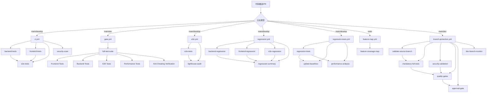
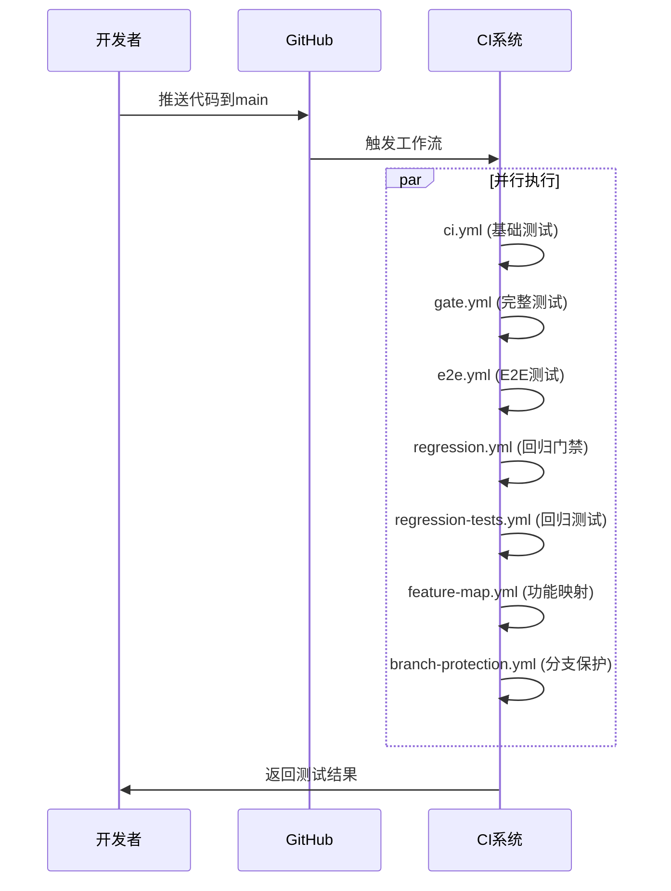
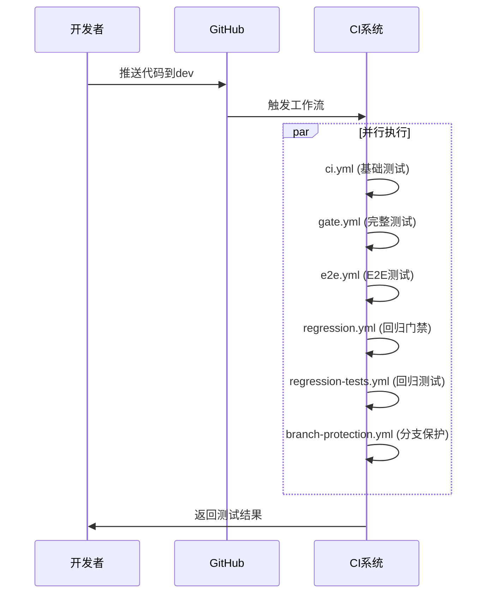
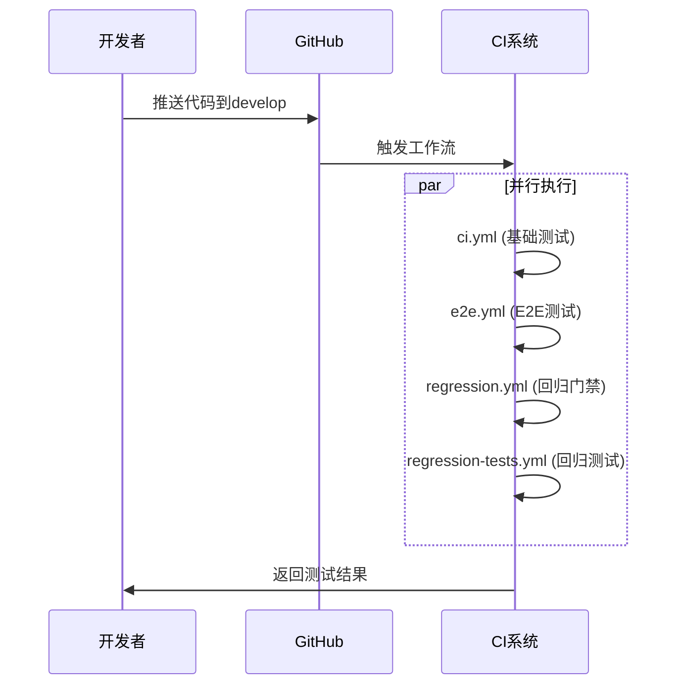
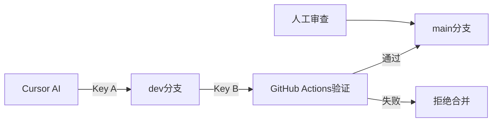
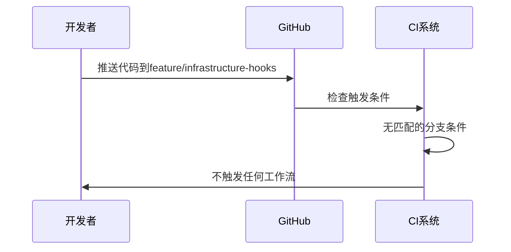

# GitHub Actions 工作流依赖关系分析报告

## 📋 概述

本报告详细分析了Bravo项目中GitHub Actions工作流的依赖关系、触发条件和执行流程。项目采用多层次、多策略的CI/CD体系，确保代码质量和系统稳定性。

## 🔄 工作流文件概览

### 活跃工作流文件

| 文件名                  | 主要功能     | 触发条件                     | 状态    |
| ----------------------- | ------------ | ---------------------------- | ------- |
| `ci.yml`                | 基础CI流水线 | push/PR到main/develop        | ✅ 活跃 |
| `gate.yml`              | 完整测试门禁 | push/PR到main/dev + 手动触发 | ✅ 活跃 |
| `e2e.yml`               | E2E测试      | push/PR到main/develop + 定时 | ✅ 活跃 |
| `regression.yml`        | 回归测试门禁 | PR到main/develop + 定时      | ✅ 活跃 |
| `regression-tests.yml`  | 回归测试执行 | push/PR到main/develop + 定时 | ✅ 活跃 |
| `feature-map.yml`       | 功能测试映射 | push/PR到main + 定时         | ✅ 活跃 |
| `branch-protection.yml` | 分支保护     | PR到main/dev                 | ✅ 活跃 |

### 非活跃/模板文件

| 文件名                       | 状态    | 说明             |
| ---------------------------- | ------- | ---------------- |
| `ci.yml.keep`                | 📁 模板 | CI配置模板       |
| `e2e.yml.keep`               | 📁 模板 | E2E配置模板      |
| `deploy-cloudrun.yml.keep`   | 📁 模板 | 部署配置模板     |
| `nightly.yml.keep`           | 📁 模板 | 夜间任务模板     |
| `dir_guard.yml`              | 📁 模板 | 目录保护模板     |
| `golden-test-protection.yml` | 📁 模板 | 黄金测试保护模板 |

## 🎯 触发条件分析

### 推送触发 (Push Events)

```yaml
# 主要分支推送触发
push:
  branches: [main, develop, dev]
```

**触发的工作流：**

- `ci.yml` - 基础CI流水线
- `gate.yml` - 完整测试门禁
- `e2e.yml` - E2E测试
- `regression.yml` - 回归测试门禁
- `regression-tests.yml` - 回归测试执行
- `feature-map.yml` - 功能测试映射
- `branch-protection.yml` - 分支保护

### 拉取请求触发 (Pull Request Events)

```yaml
pull_request:
  branches: [main, develop, dev]
  types: [opened, synchronize, reopened]
```

**触发的工作流：**

- `ci.yml` - 基础CI流水线
- `gate.yml` - 完整测试门禁
- `e2e.yml` - E2E测试
- `regression.yml` - 回归测试门禁
- `regression-tests.yml` - 回归测试执行
- `feature-map.yml` - 功能测试映射（仅main分支）
- `branch-protection.yml` - 分支保护

### 定时触发 (Schedule Events)

```yaml
schedule:
  - cron: "0 2 * * *" # 每天凌晨2点
```

**定时执行的工作流：**

- `e2e.yml` - E2E测试
- `regression.yml` - 回归测试门禁
- `regression-tests.yml` - 回归测试执行
- `feature-map.yml` - 功能测试映射

### 手动触发 (Workflow Dispatch)

```yaml
workflow_dispatch:
  inputs:
    test_type: "all|api|ui|db"
    update_baselines: true/false
```

**支持手动触发的工作流：**

- `gate.yml` - 完整测试门禁
- `regression-tests.yml` - 回归测试执行
- `feature-map.yml` - 功能测试映射

## 🔗 工作流依赖关系图



## 🚀 每次推送的执行流程

### 1. 推送到 `main` 分支



**执行的工作流：**

1. **ci.yml** - 基础CI流水线（后端、前端、E2E、安全扫描）
2. **gate.yml** - 完整测试门禁（防作弊验证）
3. **e2e.yml** - E2E测试（多浏览器）
4. **regression.yml** - 回归测试门禁
5. **regression-tests.yml** - 回归测试执行
6. **feature-map.yml** - 功能测试映射
7. **branch-protection.yml** - 分支保护验证

### 2. 推送到 `dev` 分支



**执行的工作流：**

1. **ci.yml** - 基础CI流水线
2. **gate.yml** - 完整测试门禁
3. **e2e.yml** - E2E测试
4. **regression.yml** - 回归测试门禁
5. **regression-tests.yml** - 回归测试执行
6. **branch-protection.yml** - 分支保护验证

### 3. 推送到 `develop` 分支



**执行的工作流：**

1. **ci.yml** - 基础CI流水线
2. **e2e.yml** - E2E测试
3. **regression.yml** - 回归测试门禁
4. **regression-tests.yml** - 回归测试执行

## 🔒 分支保护策略

### 双重密钥系统 (Double Key System)

项目实现了严格的分支保护策略：



**Key A**: Cursor只能推送到`dev`分支
**Key B**: GitHub Actions强制执行完整测试套件

### 分支保护规则

| 分支      | 保护级别 | 要求                        |
| --------- | -------- | --------------------------- |
| `main`    | 🔒 最高  | 必须通过所有测试 + 人工审查 |
| `dev`     | 🔒 高    | 必须通过所有测试            |
| `develop` | 🔒 中    | 必须通过基础测试            |
| 其他分支  | 🔓 低    | 无特殊要求                  |

## 📊 工作流执行统计

### 并行执行能力

- **最大并行工作流**: 7个（推送到main分支时）
- **平均执行时间**: 15-30分钟
- **资源消耗**: 高（多环境并行测试）

### 测试覆盖范围

| 测试类型 | 工作流                               | 覆盖范围     |
| -------- | ------------------------------------ | ------------ |
| 单元测试 | ci.yml, gate.yml                     | 前端 + 后端  |
| 集成测试 | ci.yml, gate.yml                     | API + 数据库 |
| E2E测试  | ci.yml, e2e.yml, gate.yml            | 多浏览器     |
| 回归测试 | regression.yml, regression-tests.yml | 核心功能     |
| 性能测试 | gate.yml, e2e.yml                    | Lighthouse   |
| 安全扫描 | ci.yml                               | 漏洞检测     |
| 功能映射 | feature-map.yml                      | 测试覆盖率   |

## 🎯 关键特性

### 1. 防作弊机制 (Anti-Cheating)

- **测试完整性验证**: 确保所有测试都实际执行
- **覆盖率阈值**: 强制执行最低覆盖率要求
- **测试结果验证**: 验证测试结果文件的完整性
- **性能基准**: 防止性能回归

### 2. 多层次测试策略

- **基础测试**: 快速反馈（ci.yml）
- **完整测试**: 全面验证（gate.yml）
- **回归测试**: 功能保护（regression.yml）
- **E2E测试**: 端到端验证（e2e.yml）

### 3. 智能调度

- **定时执行**: 每天凌晨2点自动回归测试
- **手动触发**: 支持按需执行特定测试
- **条件执行**: 根据分支和事件类型智能调度

## 🚨 注意事项

### 1. 资源消耗

- **高并发**: 多个工作流并行执行
- **长时间运行**: 完整测试套件需要15-30分钟
- **存储需求**: 大量测试结果和覆盖率报告

### 2. 依赖管理

- **服务依赖**: MySQL、Redis等外部服务
- **环境一致性**: 确保所有环境配置一致
- **版本锁定**: 固定依赖版本避免兼容性问题

### 3. 故障处理

- **重试机制**: 网络问题自动重试
- **降级策略**: 部分测试失败时的处理
- **通知机制**: 测试失败时的及时通知

## 📈 优化建议

### 1. 性能优化

- **缓存策略**: 优化依赖安装和构建缓存
- **并行优化**: 进一步优化并行执行策略
- **资源分配**: 合理分配CI资源

### 2. 监控改进

- **执行时间监控**: 跟踪工作流执行时间趋势
- **失败率分析**: 分析测试失败原因
- **资源使用监控**: 监控CI资源消耗

### 3. 扩展性

- **模块化设计**: 将工作流拆分为更小的模块
- **可配置性**: 增加更多配置选项
- **插件化**: 支持自定义测试插件

## 📝 总结

Bravo项目的GitHub Actions工作流体系具有以下特点：

1. **全面性**: 覆盖单元测试、集成测试、E2E测试、性能测试等
2. **安全性**: 双重密钥系统和防作弊机制
3. **可靠性**: 多层次验证和回归保护
4. **智能化**: 条件触发和智能调度
5. **可维护性**: 模块化设计和清晰的依赖关系

这套CI/CD体系确保了代码质量，保护了系统稳定性，为项目的持续发展提供了强有力的技术保障。

## ⚠️ 重要修正说明

### 当前实际情况分析

**当前分支**: `feature/infrastructure-hooks`

**重要发现**: 推送到feature分支**不会触发任何工作流**！

### 实际触发条件验证

| 工作流文件              | 触发条件                    | feature分支是否触发 |
| ----------------------- | --------------------------- | ------------------- |
| `ci.yml`                | `branches: [main, develop]` | ❌ 不触发           |
| `gate.yml`              | `branches: [main, dev]`     | ❌ 不触发           |
| `e2e.yml`               | `branches: [main, develop]` | ❌ 不触发           |
| `regression.yml`        | `branches: [main, develop]` | ❌ 不触发           |
| `regression-tests.yml`  | `branches: [main, develop]` | ❌ 不触发           |
| `feature-map.yml`       | `branches: [main, dev]`     | ❌ 不触发           |
| `branch-protection.yml` | `branches: [main, dev]`     | ❌ 不触发           |

### 推送到feature分支的实际流程



**结论**: 推送到feature分支不会触发任何GitHub Actions工作流。

### 可能的CI运行原因

如果您确实看到了CI运行，可能的原因：

1. **手动触发**: 在GitHub Actions页面手动运行了工作流
2. **PR创建**: 创建了从feature分支到main/dev的Pull Request
3. **定时执行**: 某些工作流有定时任务（每天凌晨2点）
4. **其他分支**: 可能同时推送到了其他分支

### 详细工作流分析示例 - gate.yml

#### 触发条件

```yaml
on:
  push:
    branches: [main, dev] # 只有推送到main或dev分支才触发
  workflow_dispatch: # 支持手动触发
  workflow_call: # 支持被其他工作流调用
```

#### 工作流结构

```yaml
jobs:
  full-test-suite: # 单一作业，包含所有测试
    runs-on: ubuntu-latest
    timeout-minutes: 30
    strategy:
      matrix:
        node-version: [20.x]
        python-version: [3.11]
```

#### 服务依赖

```yaml
services:
  mysql: # MySQL 8.0数据库服务
    image: mysql:8.0
    env:
      MYSQL_DATABASE: bravo_test
      MYSQL_USER: bravo_user
      MYSQL_PASSWORD: bravo_password
      MYSQL_ROOT_PASSWORD: root_password
```

#### 执行步骤

1. **环境准备**: 安装Node.js 20.x, Python 3.11
2. **依赖安装**: 前端npm install, 后端pip install
3. **数据库配置**: 等待MySQL启动，配置用户权限
4. **前端测试**: 单元测试 + 组件测试
5. **后端测试**: 单元测试 + 集成测试
6. **E2E测试**: Playwright多浏览器测试
7. **性能测试**: Lighthouse CI性能审计
8. **防作弊验证**: 验证测试执行完整性
9. **结果上传**: 上传测试结果和覆盖率报告

#### 关键脚本调用

- **前端测试**: `npm run test -- --coverage --run --passWithNoTests`
- **后端测试**: `python -m pytest tests/ --cov=apps --cov=bravo --junit-xml=test-results/backend-unit-results.xml`
- **E2E测试**: `npx playwright test --reporter=html --reporter=junit`
- **性能测试**: `lhci autorun --config=lighthouserc.json`

### 修正后的结论

**推送到feature分支不会触发任何GitHub Actions工作流**，因为所有工作流都只对特定分支（main, dev, develop）触发。

如果您确实看到了CI运行，请检查：

1. 是否创建了PR
2. 是否手动触发了工作流
3. 是否推送到了其他分支
