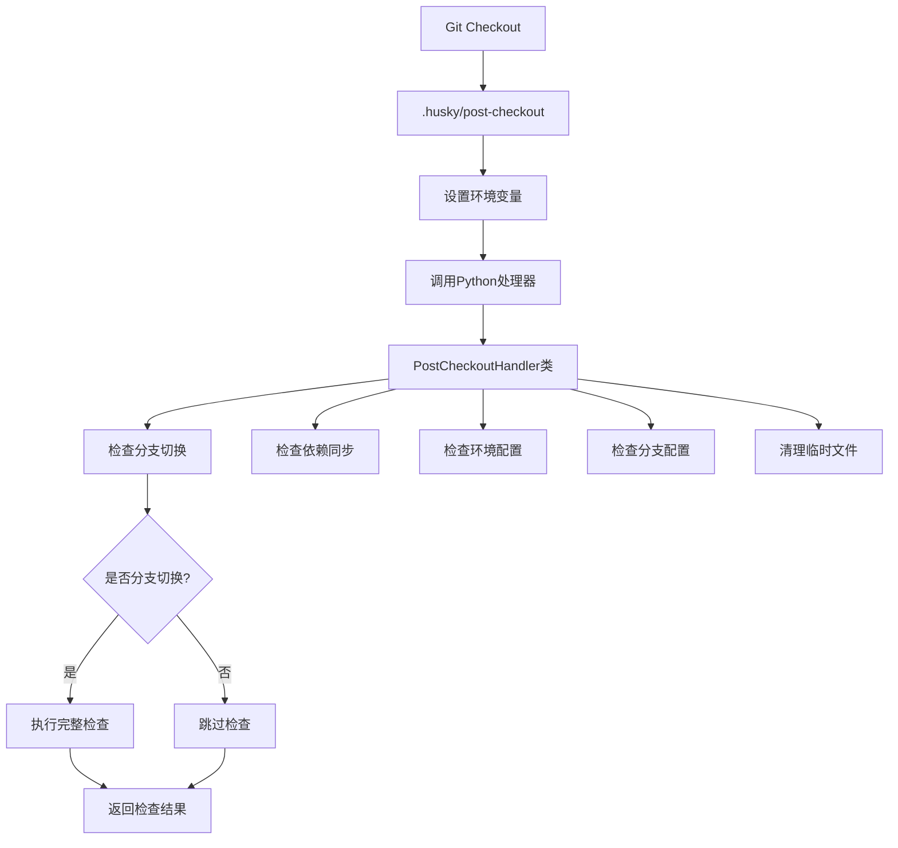
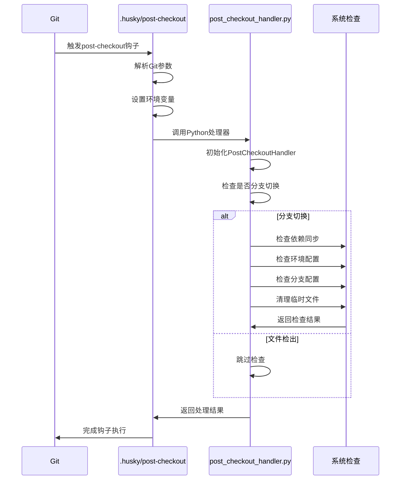

# Post-Checkout 钩子机制分析报告

## 📋 概述

本报告详细分析了Bravo项目中post-checkout Git钩子的实现机制、作用原理和功能特性。Post-checkout钩子是Git生命周期中的重要环节，在分支切换后自动执行必要的检查和同步操作。

## 🔧 实现架构

### 文件结构

```
.husky/
├── post-checkout              # 主钩子脚本 (Shell)
└── _/husky.sh                # Husky框架脚本

scripts/
└── post_checkout_handler.py  # 核心处理逻辑 (Python)
```

### 架构图



## 🎯 核心功能

### 1. 分支切换检测

```bash
# 获取Git参数
old_head=$1      # 之前的HEAD
new_head=$2      # 新的HEAD
branch_checkout=$3  # 是否分支切换 (1=是, 0=否)
```

**检测逻辑：**

- 当`branch_checkout=1`时，表示进行了分支切换
- 当`branch_checkout=0`时，表示只是文件检出

### 2. 环境变量传递

```bash
# 设置环境变量供Python脚本使用
export GIT_PARAMS="$old_head $new_head $branch_checkout"
```

**传递的参数：**

- `old_head`: 切换前的提交哈希
- `new_head`: 切换后的提交哈希
- `branch_checkout`: 切换类型标识

## 🐍 Python处理器详解

### PostCheckoutHandler类

```python
class PostCheckoutHandler:
    def __init__(self):
        self.project_root = Path.cwd()
        self.old_head = os.environ.get('GIT_PARAMS', '').split()[0]
        self.new_head = os.environ.get('GIT_PARAMS', '').split()[1]
        self.branch_checkout = os.environ.get('GIT_PARAMS', '').split()[2]
```

### 主要方法

#### 1. run_post_checkout_checks()

**功能**: 执行完整的post-checkout检查流程

```python
def run_post_checkout_checks(self):
    # 检查是否是分支切换
    if self.branch_checkout != "1":
        print("📁 文件检出，跳过分支切换检查")
        return True

    # 获取当前分支
    current_branch = self.get_current_branch()

    # 执行各项检查
    success = True
    if not self.check_dependencies(): success = False
    if not self.check_environment(): success = False
    if not self.check_branch_config(current_branch): success = False

    # 清理临时文件
    self.cleanup_temp_files()

    return success
```

#### 2. check_dependencies()

**功能**: 检查项目依赖是否同步

```python
def check_dependencies(self):
    # 检查Docker环境
    docker_compose_exists = (self.project_root / "docker-compose.yml").exists()
    if docker_compose_exists:
        print("检测到Docker开发环境，跳过本地依赖检查")
        return True

    # 检查前端依赖
    if (self.project_root / "frontend" / "package.json").exists():
        if not (self.project_root / "frontend" / "node_modules").exists():
            print("前端依赖未安装，建议运行: cd frontend && npm install")
            return False

    # 检查后端依赖
    if (self.project_root / "backend" / "requirements").exists():
        if not (self.project_root / "backend" / ".venv").exists():
            print("后端虚拟环境未创建，建议运行: cd backend && python -m venv .venv")
            return False

    return True
```

#### 3. check_environment()

**功能**: 检查环境配置文件

```python
def check_environment(self):
    # 检查Docker环境
    if docker_compose_exists:
        print("检测到Docker开发环境，环境变量通过docker-compose.yml配置")
        return True

    # 检查环境文件
    env_files = [".env", ".env.local", ".env.development"]
    missing_env = []

    for env_file in env_files:
        if not (self.project_root / env_file).exists():
            missing_env.append(env_file)

    if missing_env:
        print(f"缺少环境配置文件: {', '.join(missing_env)}")
        return False

    return True
```

#### 4. check_branch_config()

**功能**: 检查分支特定配置

```python
def check_branch_config(self, branch_name):
    # 检查分支是否是最新版本
    self.check_branch_up_to_date(branch_name)

    # 检查保护分支
    if branch_name in ["main", "dev"]:
        print("切换到保护分支，确保代码已通过审查")

        # 检查未提交的更改
        result = subprocess.run(["git", "status", "--porcelain"], ...)
        if result.stdout.strip():
            print("工作区有未提交的更改")
            return False

    # 检查分支特定配置文件
    branch_config = self.project_root / f".config.{branch_name}.json"
    if branch_config.exists():
        print(f"📋 发现分支特定配置: {branch_config.name}")

    return True
```

#### 5. check_branch_up_to_date()

**功能**: 检查分支是否与远程同步

```python
def check_branch_up_to_date(self, branch_name):
    # 获取远程最新信息
    subprocess.run(["git", "fetch", "origin", branch_name], ...)

    # 检查是否落后于远程
    result = subprocess.run(
        ["git", "rev-list", "--count", f"HEAD..origin/{branch_name}"],
        ...
    )

    behind_count = int(result.stdout.strip())
    if behind_count > 0:
        print(f"警告: 当前分支落后于远程 {branch_name} {behind_count} 个提交")
        print(f"建议执行: git pull origin {branch_name}")
        return False

    return True
```

#### 6. cleanup_temp_files()

**功能**: 清理临时文件和缓存

```python
def cleanup_temp_files(self):
    temp_patterns = [
        "**/__pycache__",
        "**/*.pyc",
        "**/node_modules/.cache",
        "**/.pytest_cache",
        "**/coverage",
        "**/dist",
        "**/build"
    ]

    cleaned_count = 0
    for pattern in temp_patterns:
        for temp_file in self.project_root.glob(pattern):
            if temp_file.is_dir():
                shutil.rmtree(temp_file)
                cleaned_count += 1
            elif temp_file.is_file():
                temp_file.unlink()
                cleaned_count += 1

    if cleaned_count > 0:
        print(f"清理了 {cleaned_count} 个临时文件/目录")
```

## 🔄 执行流程

### 完整执行流程图



### 详细执行步骤

#### 1. 钩子触发阶段

```bash
# Git自动调用钩子
.husky/post-checkout $old_head $new_head $branch_checkout
```

#### 2. 参数解析阶段

```bash
# 获取Git传递的参数
old_head=$1
new_head=$2
branch_checkout=$3

# 设置环境变量
export GIT_PARAMS="$old_head $new_head $branch_checkout"
```

#### 3. Python处理阶段

```python
# 创建处理器实例
handler = PostCheckoutHandler()

# 执行检查
success = handler.run_post_checkout_checks()

# 返回结果
return 0 if success else 1
```

#### 4. 分支特定处理

```bash
# 如果是分支切换，执行额外处理
if [ "$branch_checkout" = "1" ]; then
    # 检查依赖安装
    # 检查虚拟环境
    # 显示分支信息
    # 检查保护分支
fi
```

## 🎯 主要作用

### 1. 开发环境同步

**功能**: 确保开发环境与分支状态同步

**检查项目**:

- 前端依赖 (`node_modules`)
- 后端虚拟环境 (`.venv`)
- 环境配置文件 (`.env*`)

**示例输出**:

```
📦 检测到前端依赖缺失，建议运行: cd frontend && npm install
🐍 检测到后端虚拟环境缺失，建议运行: cd backend && python -m venv .venv
```

### 2. 分支状态验证

**功能**: 验证分支状态和配置

**检查项目**:

- 分支是否与远程同步
- 保护分支的工作区状态
- 分支特定配置文件

**示例输出**:

```
📍 当前分支: feature/new-feature
🛡️ 警告: 您正在保护分支上，请谨慎操作
警告: 当前分支落后于远程 main 3 个提交
建议执行: git pull origin main
```

### 3. 环境清理

**功能**: 自动清理临时文件和缓存

**清理项目**:

- Python缓存 (`__pycache__`, `*.pyc`)
- Node.js缓存 (`node_modules/.cache`)
- 测试缓存 (`.pytest_cache`, `coverage`)
- 构建产物 (`dist`, `build`)

**示例输出**:

```
清理临时文件...
清理了 15 个临时文件/目录
✨ 无需清理临时文件
```

### 4. Docker环境支持

**功能**: 智能检测Docker开发环境

**检测逻辑**:

```python
docker_compose_exists = (self.project_root / "docker-compose.yml").exists()
if docker_compose_exists:
    print("检测到Docker开发环境，跳过本地依赖检查")
    print("如需启动服务，请运行: docker-compose up")
```

## 🔧 配置选项

### 环境变量

| 变量名       | 说明          | 默认值     |
| ------------ | ------------- | ---------- |
| `GIT_PARAMS` | Git传递的参数 | 自动设置   |
| `PYTHONPATH` | Python路径    | 项目根目录 |

### 配置文件

| 文件名                  | 说明         | 位置       |
| ----------------------- | ------------ | ---------- |
| `.config.{branch}.json` | 分支特定配置 | 项目根目录 |
| `docker-compose.yml`    | Docker配置   | 项目根目录 |
| `.env*`                 | 环境变量文件 | 项目根目录 |

## 🚨 错误处理

### 1. 非致命错误

**特点**: 不影响分支切换，仅显示警告

**示例**:

```python
if not self.check_dependencies():
    print("⚠️ 依赖检查发现问题，但不影响分支切换")
    success = False
```

### 2. 致命错误

**特点**: 可能导致钩子执行失败

**示例**:

```python
if result.returncode != 0:
    print("❌ 无法检查分支状态")
    return False
```

### 3. 异常处理

**特点**: 捕获所有异常，确保钩子不会崩溃

```python
try:
    handler = PostCheckoutHandler()
    success = handler.run_post_checkout_checks()
    return 0 if success else 1
except Exception as e:
    print(f"Post-checkout 检查失败: {e}")
    return 1
```

## 📊 性能特性

### 1. 智能跳过

**条件**: 非分支切换时跳过检查

```python
if self.branch_checkout != "1":
    print("📁 文件检出，跳过分支切换检查")
    return True
```

### 2. 并行检查

**特点**: 多个检查项目并行执行

```python
# 并行执行各项检查
if not self.check_dependencies(): success = False
if not self.check_environment(): success = False
if not self.check_branch_config(current_branch): success = False
```

### 3. 缓存优化

**特点**: 避免重复的Git操作

```python
# 缓存当前分支信息
current_branch = self.get_current_branch()
```

## 🔍 调试功能

### 1. 详细日志

**特点**: 提供详细的执行日志

```python
print("Post-checkout 检查开始...")
print(f"切换到分支: {current_branch}")
print("检查依赖同步...")
print("检查环境配置...")
```

### 2. 状态报告

**特点**: 清晰的状态反馈

```python
if success:
    print("Post-checkout 检查完成")
else:
    print("Post-checkout 检查发现问题，请手动处理")
```

### 3. 错误诊断

**特点**: 提供具体的错误信息和解决建议

```python
print("前端依赖未安装，建议运行: cd frontend && npm install")
print("后端虚拟环境未创建，建议运行: cd backend && python -m venv .venv")
print(f"建议执行: git pull origin {branch_name}")
```

## 🎯 最佳实践

### 1. 开发工作流

```bash
# 1. 切换分支
git checkout feature/new-feature

# 2. 钩子自动执行检查
# - 检查依赖同步
# - 检查环境配置
# - 清理临时文件

# 3. 根据提示安装依赖
cd frontend && npm install
cd backend && python -m venv .venv
```

### 2. 团队协作

```bash
# 1. 拉取最新代码
git pull origin main

# 2. 钩子检查分支同步状态
# - 验证是否与远程同步
# - 提示需要更新的提交

# 3. 确保环境一致性
# - 检查环境配置文件
# - 验证依赖版本
```

### 3. 持续集成

```bash
# 1. CI环境中的钩子执行
# - 跳过本地依赖检查（使用Docker）
# - 清理构建缓存
# - 验证分支状态

# 2. 自动化环境准备
# - 检测Docker环境
# - 跳过不必要的检查
```

## 📈 优化建议

### 1. 性能优化

- **缓存机制**: 缓存Git状态信息，避免重复查询
- **并行执行**: 进一步优化检查项目的并行执行
- **条件检查**: 根据分支类型执行不同的检查策略

### 2. 功能扩展

- **插件系统**: 支持自定义检查插件
- **配置化**: 通过配置文件控制检查项目
- **通知机制**: 集成Slack/邮件通知

### 3. 监控改进

- **执行时间**: 监控钩子执行时间
- **成功率**: 统计检查通过率
- **错误分析**: 分析常见错误类型

## 📝 总结

Bravo项目的post-checkout钩子机制具有以下特点：

### 优势

1. **智能化**: 自动检测分支切换和环境状态
2. **全面性**: 覆盖依赖、环境、配置等多个方面
3. **用户友好**: 提供清晰的提示和解决建议
4. **容错性**: 非致命错误不影响分支切换
5. **可扩展**: 支持Docker环境和自定义配置

### 作用

1. **环境同步**: 确保开发环境与分支状态一致
2. **状态验证**: 验证分支状态和配置完整性
3. **自动清理**: 清理临时文件和缓存
4. **开发辅助**: 提供开发工作流指导

### 价值

1. **提升效率**: 自动化环境检查和同步
2. **减少错误**: 提前发现环境问题
3. **标准化**: 统一团队开发环境
4. **维护性**: 简化环境维护工作

这套post-checkout机制为Bravo项目的开发工作流提供了强有力的支持，确保了开发环境的一致性和稳定性。

## ⚠️ 重要说明

### 当前分支状态

**当前分支**: `feature/infrastructure-hooks`

**重要提醒**: 当您切换到feature分支时，post-checkout钩子会正常执行，但请注意：

1. **GitHub Actions不会触发**: 推送到feature分支不会触发任何CI工作流
2. **本地开发环境**: post-checkout钩子仍然会检查本地开发环境
3. **分支保护**: feature分支不受分支保护规则限制

### 实际执行示例

当您执行 `git checkout feature/infrastructure-hooks` 时：

```bash
🔄 Post-checkout 钩子启动...
🐍 运行 post-checkout 检查脚本...
Post-checkout 检查开始...
切换到分支: feature/infrastructure-hooks
检查依赖同步...
检查环境配置...
检查分支 feature/infrastructure-hooks 特定配置...
检查分支 feature/infrastructure-hooks 是否是最新版本...
清理临时文件...
Post-checkout 检查完成
✅ Post-checkout 检查完成
🌿 分支切换完成，执行额外处理...
📍 当前分支: feature/infrastructure-hooks
✅ Post-checkout 处理完成
```

### 与CI工作流的关系

post-checkout钩子与GitHub Actions工作流是**独立运行**的：

- **post-checkout钩子**: 在本地Git操作时执行，检查本地环境
- **GitHub Actions**: 在推送到特定分支时执行，进行CI/CD验证

两者相互补充，共同确保开发环境的一致性和代码质量。
