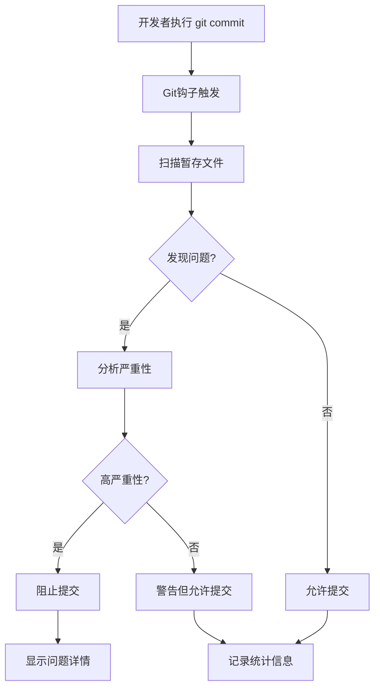

# 代码变更追踪系统 - 团队培训指南

## 培训概述

本培训旨在帮助团队成员了解和掌握代码变更追踪系统的使用，确保系统在团队中得到有效应用。

### 培训目标

- 理解系统的工作原理和价值
- 掌握日常使用方法
- 学会处理常见问题
- 建立良好的代码习惯

## 第一部分：系统介绍

### 1.1 为什么需要这个系统？

**问题背景**：

- 开发过程中经常使用TODO、FIXME等临时标记
- 这些标记容易被遗忘，导致技术债务积累
- 临时调试代码可能意外进入生产环境
- 缺乏统一的代码质量检查机制

**系统价值**：

- 🛡️ **质量保障**: 防止临时代码进入生产
- ⚡ **效率提升**: 快速检测，不影响开发流程
- 📊 **可视化**: 清晰展示代码质量状况
- 🔧 **可配置**: 根据团队需求调整规则

### 1.2 系统工作原理



## 第二部分：检测规则详解

### 2.1 严重性分级

#### 🔴 高严重性（阻止提交）

| 标记   | 含义         | 示例                           |
| ------ | ------------ | ------------------------------ |
| TODO   | 待办事项     | `// TODO: 实现用户认证`        |
| FIXME  | 需要修复     | `// FIXME: 内存泄漏问题`       |
| HACK   | 临时解决方案 | `// HACK: 绕过验证逻辑`        |
| XXX    | 需要注意     | `// XXX: 这里可能有并发问题`   |
| BUG    | 已知错误     | `// BUG: 边界条件未处理`       |
| TEMP   | 临时代码     | `// TEMP: 测试用代码`          |
| DEBUG  | 调试代码     | `console.log('DEBUG: 用户ID')` |
| REMOVE | 待删除       | `// REMOVE: 旧版本兼容代码`    |

#### 🟡 中等严重性（警告）

| 标记     | 含义     | 示例                        |
| -------- | -------- | --------------------------- |
| NOTE     | 注释说明 | `// NOTE: 此方法性能较低`   |
| REVIEW   | 需要审查 | `// REVIEW: 算法复杂度`     |
| OPTIMIZE | 性能优化 | `// OPTIMIZE: 可以使用缓存` |
| REFACTOR | 重构建议 | `// REFACTOR: 提取公共方法` |

### 2.2 特殊规则

#### 文档文件例外

- Markdown文件（.md）中的TODO和FIXME被允许
- README文件中的计划性TODO不会被阻止

#### 敏感信息检测

```javascript
// ❌ 会被检测到
const password = "123456";
const apiKey = "sk-1234567890abcdef";

// ✅ 推荐做法
const password = process.env.PASSWORD;
const apiKey = process.env.API_KEY;
```

## 第三部分：日常使用指南

### 3.1 正常提交流程

```bash
# 1. 添加文件到暂存区
git add .

# 2. 提交（自动触发检查）
git commit -m "实现用户登录功能"

# 3. 查看检查结果
# [INFO] 快速提交前检查启动
# [INFO] 扫描 3 个暂存文件，耗时 0.02 秒
# [RESULT] 发现 0 个问题
# [SUCCESS] 提交检查通过
```

### 3.2 发现问题时的处理

#### 场景1：发现高严重性问题

```bash
git commit -m "修复登录bug"

# 输出：
# [FAILED] 提交被阻止 - 发现 2 个高严重性问题
# 详细问题列表:
#   [HIGH] src/auth.js:15 - // TODO: 添加密码强度验证
#   [HIGH] src/auth.js:28 - console.log('DEBUG: 用户密码')
# [TIP] 紧急情况可使用 --no-verify 跳过检查
```

**处理步骤**：

1. 根据提示修复问题
2. 重新提交
3. 或创建issue跟踪TODO项

#### 场景2：紧急情况绕过检查

```bash
# 生产环境紧急修复
git commit -m "紧急修复：修复支付接口" --no-verify

# ⚠️ 注意：使用后应立即创建issue跟踪临时修改
```

### 3.3 最佳实践

#### ✅ 推荐做法

```javascript
// 1. 使用具体的issue编号
// TODO: #123 - 实现OAuth2.0认证

// 2. 添加负责人和时间
// FIXME: @张三 2024-01-15 - 修复内存泄漏

// 3. 使用低严重性标记做文档
// NOTE: 此算法时间复杂度为O(n²)
```

#### ❌ 避免的做法

```javascript
// 1. 模糊的TODO
// TODO: 优化这里

// 2. 遗留的调试代码
console.log("test");

// 3. 硬编码的敏感信息
const secret = "my-secret-key";
```

## 第四部分：问题处理

### 4.1 常见问题及解决方案

#### Q1: 系统没有触发检查

**症状**: 提交时没有看到检查输出

**解决方案**:

```bash
# 检查husky是否正确安装
ls -la .husky/pre-commit

# 重新安装husky
npx husky install

# 手动测试脚本
python scripts/fast_pre_commit.py
```

#### Q2: 编码错误

**症状**: 出现乱码或编码错误

**解决方案**:

```bash
# 设置环境变量
export PYTHONIOENCODING=utf-8
export LANG=en_US.UTF-8

# 或在Windows中
set PYTHONIOENCODING=utf-8
```

#### Q3: 检查速度过慢

**症状**: 扫描时间超过1秒

**可能原因**:

- 暂存文件过多
- 文件过大
- 正则表达式复杂

**解决方案**:

- 分批提交大量文件
- 检查是否有意外的大文件
- 联系管理员优化规则

### 4.2 调试技巧

#### 手动运行检查

```bash
# 详细模式运行
python scripts/fast_pre_commit.py --debug

# 查看Git钩子日志
GIT_TRACE=1 git commit -m "测试"

# 检查配置
python scripts/production_config.py
```

#### 查看统计信息

```bash
# 查看历史统计（如果启用）
cat .git/hooks/statistics.json
```

## 第五部分：团队协作

### 5.1 代码审查集成

在Pull Request中关注：

- 是否有遗留的临时标记
- TODO项是否有对应的issue
- 是否使用了--no-verify绕过检查

### 5.2 项目管理集成

**建议工作流程**：

1. 发现TODO → 创建对应issue
2. 完成功能 → 清理相关TODO
3. 定期审查 → 清理过期标记

### 5.3 团队规范

#### 临时标记使用规范

```javascript
// ✅ 标准格式
// TODO: #issue编号 @负责人 截止日期 - 具体描述
// TODO: #123 @张三 2024-02-01 - 实现用户权限验证

// FIXME: 描述问题和影响范围
// FIXME: 并发访问时可能导致数据不一致

// HACK: 说明临时方案和后续计划
// HACK: 临时绕过验证，待#456完成后移除
```

## 第六部分：进阶配置

### 6.1 自定义规则

团队可以根据需要调整检测规则：

```python
# 在 production_config.py 中添加自定义规则
HIGH_SEVERITY_PATTERNS.append(r'\bCRITICAL\b')
MEDIUM_SEVERITY_PATTERNS.append(r'\bIMPROVE\b')
```

### 6.2 环境特定配置

```bash
# 开发环境（更宽松）
export ENVIRONMENT=development

# 预发布环境（严格）
export ENVIRONMENT=staging

# 生产环境（最严格）
export ENVIRONMENT=production
```

## 第七部分：培训验证

### 7.1 实践练习

#### 练习1：基础检测

1. 创建包含TODO的文件
2. 尝试提交并观察结果
3. 修复问题后重新提交

#### 练习2：紧急绕过

1. 模拟紧急情况
2. 使用--no-verify提交
3. 创建后续跟踪issue

#### 练习3：配置调整

1. 修改检测规则
2. 测试新规则效果
3. 恢复原始配置

### 7.2 知识检查

**问题1**: 哪些标记会阻止提交？
**答案**: TODO, FIXME, HACK, XXX, BUG, TEMP, DEBUG, REMOVE

**问题2**: 如何在紧急情况下跳过检查？
**答案**: 使用 `git commit --no-verify`

**问题3**: 系统检查哪些文件？
**答案**: 仅检查Git暂存区的文件

**问题4**: 如何查看检查统计信息？
**答案**: 查看 `.git/hooks/statistics.json` 文件

## 第八部分：持续改进

### 8.1 反馈收集

团队应定期收集使用反馈：

- 检测规则是否合适
- 是否有误报或漏报
- 性能是否满足要求
- 使用体验如何

### 8.2 规则优化

根据团队实际情况调整：

- 添加项目特定的检测规则
- 调整严重性分级
- 优化性能参数
- 更新消息模板

### 8.3 培训更新

定期更新培训内容：

- 新功能介绍
- 最佳实践分享
- 常见问题解答
- 成功案例展示

## 总结

代码变更追踪系统是提升代码质量的重要工具。通过本培训，团队成员应该能够：

✅ 理解系统的价值和工作原理
✅ 掌握日常使用方法
✅ 处理常见问题
✅ 遵循团队规范
✅ 参与系统改进

**记住**: 工具是为了帮助我们写出更好的代码，而不是阻碍开发效率。正确使用这个系统，将显著提升团队的代码质量和开发体验。

---

**培训资源**:

- 📖 [系统使用指南](./code_change_tracking_system.md)
- 🔧 [故障排除文档](./code_change_tracking_system.md#故障排除)
- 📊 [配置参考](../scripts/production_config.py)
- 💬 [团队讨论群](团队内部链接)

_培训版本: v1.0_
_最后更新: 2024年1月_
