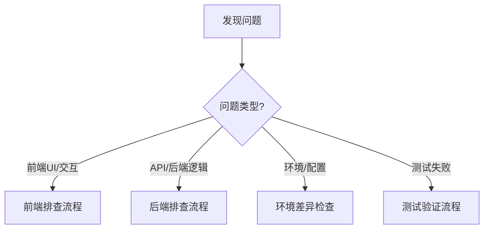

# Bug排查和处理流程指南

> 基于V4架构的完整排查方法论，结合30轮CI修复经验和项目规范

## 📋 目录

1. [快速诊断流程](#快速诊断流程)
2. [问题抽象层次识别](#问题抽象层次识别)
3. [前端问题排查流程](#前端问题排查流程)
4. [后端问题排查流程](#后端问题排查流程)
5. [环境差异检查](#环境差异检查)
6. [系统性搜索策略](#系统性搜索策略)
7. [浏览器环境验证（强制）](#浏览器环境验证强制)
8. [自我质疑机制](#自我质疑机制)
9. [问题记录要求](#问题记录要求)

---

## 🚀 快速诊断流程

### 第一步：问题分类



### 第二步：初步检查清单

```
□ 错误消息是什么？（复制完整错误信息）
□ 问题在哪个环境出现？（本地/测试/生产）
□ 问题是否可复现？（步骤是什么？）
□ 是否有相关测试用例？（检查测试文件）
□ 代码是否有REQ-ID注释？（追溯需求）
□ 最近的代码变更是什么？（git log）
```

### 第三步：追溯链检查

根据V4架构要求，所有代码必须可追溯到PRD：

```bash
# 1. 从代码文件提取REQ-ID
grep -r "REQ-ID" frontend/src/views/Register.vue

# 2. 查找对应的PRD
find docs/00_product/requirements -name "*REQ-2025-003*"

# 3. 查看PRD状态
cat docs/00_product/requirements/REQ-2025-003-user-login/REQ-2025-003-user-login.md | grep "status:"

# 4. 检查测试用例CSV
cat docs/00_product/requirements/REQ-2025-003-user-login/*test-cases.csv

# 5. 查找对应的测试代码
find backend/tests e2e/tests -name "*login*" -o -name "*register*"
```

---

## 🔍 问题抽象层次识别

**核心原则**：在正确的抽象层次寻找问题根因

### 抽象层次矩阵

| 错误现象    | 可能的抽象层次         | 验证命令                        | 排查方向                   |
| ----------- | ---------------------- | ------------------------------- | -------------------------- |
| 语法错误    | bash脚本层、配置文件层 | `act`, `yamllint`, `eslint`     | 检查语法、缩进、格式       |
| 命令不存在  | 环境依赖层、路径配置层 | `which`, `whereis`, `docker ps` | 检查依赖安装、PATH配置     |
| 连接超时    | 网络层、服务配置层     | `curl`, `netstat`, `ping`       | 检查服务状态、端口、网络   |
| 404/500错误 | 应用层、路由配置层     | API测试、日志检查               | 检查路由、视图、中间件     |
| 数据库错误  | 数据层、权限配置层     | SQL测试、权限检查               | 检查数据库连接、权限、迁移 |
| 容器退出    | 容器层、依赖关系层     | `docker logs`, `docker inspect` | 检查容器配置、依赖、资源   |

### 层次跳跃策略

如果当前层次修复无效：

1. **向上层检查**（更抽象的问题）

   - 容器问题 → 检查docker-compose配置
   - 应用问题 → 检查环境变量配置
   - API问题 → 检查API契约定义

2. **向下层检查**（更具体的问题）
   - 配置问题 → 检查实际执行命令
   - 路由问题 → 检查具体视图函数
   - 数据库问题 → 检查具体SQL语句

---

## 🎨 前端问题排查流程

### 阶段1：浏览器环境验证（强制）

⚠️ **V4架构强制要求**：每次修复前端问题后，必须使用MCP工具验证浏览器环境

#### 1.1 使用MCP工具验证

```typescript
// 必须执行的检查清单：

// 1. 打开页面
browser_navigate("http://localhost:3000/register");

// 2. 检查控制台错误（关键！）
const consoleMessages = browser_console_messages();
// 查找: CORS错误、网络错误、JavaScript错误

// 3. 检查网络请求
const networkRequests = browser_network_requests();
// 验证: API调用是否成功、状态码、响应数据

// 4. 验证CORS配置
// 浏览器环境 vs 容器环境差异
// - 测试环境: http://backend:8000（无CORS）
// - 浏览器: http://localhost:8000（需要CORS头）
```

#### 1.2 环境差异检查

```
□ 测试环境（容器内）vs 浏览器环境（宿主机）
  - CORS配置是否正确？
  - API地址是否正确？
  - 环境变量是否一致？

□ E2E测试通过 ≠ 浏览器正常
  - E2E: 容器内运行，使用容器名
  - 浏览器: 宿主机运行，使用localhost
```

#### 1.3 常见前端问题

**问题1：CORS错误**

```bash
# 检查后端CORS配置
grep -r "CORS" backend/bravo/settings/

# 检查前端API配置
grep -r "localhost:8000\|backend:8000" frontend/src/

# 修复：确保后端允许前端域名
# backend/bravo/settings/base.py
CORS_ALLOWED_ORIGINS = [
    "http://localhost:3000",
    "http://127.0.0.1:3000",
]
```

**问题2：CSS变量未定义**

```bash
# 检查CSS变量定义
grep -r "var(--" frontend/src/

# 检查变量定义文件
cat frontend/src/assets/styles/brand-colors.css

# 修复：确保所有使用的变量都在brand-colors.css中定义
```

**问题3：组件实例数量问题（响应式布局）**

```typescript
// 检查是否有多个组件实例同时激活
// 使用浏览器开发者工具检查DOM
// 或添加测试验证组件实例数量
```

### 阶段2：代码检查

```bash
# 1. 语法检查
cd frontend && npm run lint
cd frontend && npm run type-check

# 2. 检查REQ-ID注释
grep -r "REQ-ID" frontend/src/views/Register.vue

# 3. 检查相关组件
find frontend/src -name "*.vue" -o -name "*.ts" | xargs grep -l "Register\|register"

# 4. 检查测试文件
find e2e/tests -name "*register*"
```

### 阶段3：测试验证

```bash
# 1. 运行单元测试
cd frontend && npm test

# 2. 运行E2E测试（但记住：E2E通过 ≠ 浏览器正常）
cd e2e && npm test -- register

# 3. 检查测试用例覆盖
cat docs/00_product/requirements/*/register*test-cases.csv
```

---

## ⚙️ 后端问题排查流程

### 阶段1：容器和日志检查

```bash
# 1. 检查容器状态
docker-compose ps

# 2. 查看后端日志
docker-compose logs backend
docker-compose logs -f backend  # 实时跟踪

# 3. 查看所有服务日志
docker-compose logs

# 4. 检查容器资源使用
docker stats
```

### 阶段2：进入容器调试

```bash
# 进入backend容器
docker-compose exec backend bash

# 在容器内执行命令
docker-compose exec backend python manage.py shell
docker-compose exec backend python manage.py check
docker-compose exec backend pytest -v

# 检查数据库连接
docker-compose exec backend python manage.py dbshell
```

### 阶段3：API测试

```bash
# 测试API端点
curl -X POST http://localhost:8000/api/users/register/ \
  -H "Content-Type: application/json" \
  -d '{"username":"test","email":"test@example.com","password":"test123"}'

# 检查API响应
curl -v http://localhost:8000/api/users/register/

# 检查API契约
cat docs/01_guideline/api-contracts/*/register*-api.yaml
```

### 阶段4：代码和测试检查

```bash
# 1. 语法检查
cd backend && python -m flake8 apps/users/
cd backend && python -m mypy apps/users/

# 2. 检查REQ-ID注释
grep -r "REQ-ID" backend/apps/users/

# 3. 运行测试
cd backend && pytest tests/integration/test_register_api.py -v

# 4. 检查测试覆盖率
cd backend && pytest --cov=apps/users tests/
```

---

## 🔄 环境差异检查

### 配置文件对比

```bash
# 1. 对比不同环境的Django设置
diff backend/bravo/settings/development.py backend/bravo/settings/test.py
diff backend/bravo/settings/test.py backend/bravo/settings/production.py

# 2. 对比docker-compose配置
diff docker-compose.yml docker-compose.test.yml
diff docker-compose.yml docker-compose.prod.yml

# 3. 对比GitHub Actions工作流
diff .github/workflows/on-pr.yml .github/workflows/on-push-dev.yml

# 4. 检查版本一致性
docker --version
node --version
python --version
# 对比: package.json, requirements.txt, Dockerfile
```

### 环境变量检查

```bash
# 检查.env文件
cat .env

# 检查docker-compose中的环境变量
grep -A 10 "environment:" docker-compose.yml

# 对比不同环境的.env文件
diff .env.development .env.production
```

---

## 🔎 系统性搜索策略

**规则**：发现一个问题时，系统性搜索所有相同问题

### 全局搜索相同错误模式

```bash
# 1. 搜索错误关键词
grep -r "错误关键词" .

# 2. 查找所有相关文件
find . -name "*.py" -o -name "*.ts" | xargs grep "错误模式"

# 3. 检查历史修复记录
git log --all --grep="类似问题"
git log --all -S "错误模式"

# 4. 检查所有使用相同模式的地方
grep -r "相同的代码模式" . --include="*.py" --include="*.ts"
```

### 避免"打地鼠式修复"

**原则**：避免修复一个文件，遗漏其他文件

```
✅ 正确做法：
1. 全局搜索相同模式
2. 一次性修复所有相关文件
3. 验证所有修复

❌ 错误做法：
1. 只修复发现的第一个文件
2. 忽略其他可能有相同问题的文件
3. 导致问题反复出现
```

---

## 🌐 浏览器环境验证（强制）

### V4架构强制要求

根据V4核心原则，**每次修复前端问题后，必须使用MCP工具验证浏览器环境**

### 必须执行的检查清单

```typescript
// ✅ 1. 打开页面
browser_navigate("http://localhost:3000/register");

// ✅ 2. 检查控制台错误
const consoleMessages = browser_console_messages();
if (consoleMessages.some((msg) => msg.type === "error")) {
  // 立即修复错误
  // 常见错误：
  // - CORS错误
  // - 网络错误（404, 500）
  // - JavaScript运行时错误
  // - 资源加载失败
}

// ✅ 3. 检查网络请求
const networkRequests = browser_network_requests();
// 验证：
// - API调用是否成功
// - 状态码是否正确（200, 201等）
// - 响应数据是否符合预期
// - CORS头是否正确

// ✅ 4. 验证实际用户操作
// 使用browser_click, browser_type等工具
// 模拟真实用户操作流程
```

### 环境差异说明

| 环境类型    | API地址                 | CORS要求 | 网络隔离   |
| ----------- | ----------------------- | -------- | ---------- |
| **E2E测试** | `http://backend:8000`   | 不需要   | 容器内网络 |
| **浏览器**  | `http://localhost:8000` | 必需     | 宿主机网络 |

**关键差异**：

- E2E测试通过 ≠ 浏览器正常
- 必须验证浏览器环境的CORS配置
- 必须检查浏览器控制台错误

### 禁止行为

```
❌ 不能只验证容器内测试，忽略浏览器环境
❌ 不能等用户报告浏览器错误才修复
❌ 不能假设测试通过就等于浏览器正常
❌ 不能跳过MCP工具验证
```

---

## 🤔 自我质疑机制

### 触发条件

**连续失败3次后，必须质疑基础假设和方法论**

### 检查清单

```
□ 我在正确的抽象层次修复问题吗？
  - bash层 vs 容器层 vs 应用层 vs 数据层？
  - 问题可能在其他层次吗？

□ 我有搜索所有相关的文件吗？
  - grep -r "错误模式" . 执行了吗？
  - 是否有其他文件也有相同问题？

□ 我验证了不同环境的配置差异吗？
  - 开发环境 vs 测试环境 vs 生产环境
  - PR环境 vs post-merge环境

□ 我使用了合适的验证工具链吗？
  - 语法验证 → 环境验证 → 功能验证 → 浏览器验证
  - 是否跳过了某些验证步骤？

□ 用户的反馈是否指向了不同方向？
  - 质疑信号是否被忽视了？
  - 是否需要考虑完全不同的问题根因？

□ 我是否在"打地鼠式修复"？
  - 系统性搜索 vs 单点修复
  - 是否遗漏了相同问题的其他位置？
```

### 方法论调整

如果连续失败3次：

1. **停止当前修复方向**
2. **重新审视问题**
   - 从更抽象的层次思考
   - 考虑完全不同的问题根因
   - 咨询用户反馈
3. **采用不同的排查方法**
   - 使用不同的工具
   - 检查不同的层次
   - 参考历史修复记录

---

## 📝 问题记录要求

### 规则

**解决困难问题后必须记录**（根据debugging.mdc规则）

### 记录位置

`docs/FAQ.md` 或创建专门的 `docs/TROUBLESHOOTING-RECORDS.md`

### 记录内容

```markdown
## 问题：[问题标题]

### 问题描述

- 错误现象
- 错误消息（完整）
- 出现环境

### 排查过程

1. 尝试的解决方案1（失败原因）
2. 尝试的解决方案2（失败原因）
3. 尝试的解决方案3（失败原因）

### 最终解决方案

- 问题根因
- 修复方法
- 验证方法

### 经验教训

- 抽象层次判断经验
- 方法论教训
- 避免的陷阱

### 相关文件

- 代码文件
- 配置文件
- 测试文件
- PRD/测试用例
```

---

## 📚 参考文档

- [Debug阶段规则](.cursor/rules/workflows/debugging.mdc)
- [V4核心原则](.cursor/rules/principles/v4-core.mdc)
- [开发阶段规则](.cursor/rules/workflows/development.mdc)
- [测试阶段规则](.cursor/rules/quality/testing.mdc)
- [合规检查规则](.cursor/rules/quality/compliance.mdc)

---

## ✅ 完整排查流程检查清单

使用此清单确保不遗漏任何步骤：

### 问题发现阶段

- [ ] 收集完整错误信息
- [ ] 确定问题类型（前端/后端/环境/测试）
- [ ] 检查问题是否可复现
- [ ] 查找相关REQ-ID和PRD
- [ ] 检查最近代码变更（git log）

### 初步排查阶段

- [ ] 根据抽象层次矩阵定位问题层次
- [ ] 执行对应的验证命令
- [ ] 系统性搜索相同错误模式
- [ ] 检查环境差异（配置文件对比）

### 前端问题

- [ ] 使用MCP工具验证浏览器环境（强制）
- [ ] 检查控制台错误
- [ ] 检查网络请求
- [ ] 验证CORS配置
- [ ] 运行lint和type-check
- [ ] 运行E2E测试（但记住E2E≠浏览器）

### 后端问题

- [ ] 检查容器状态（docker-compose ps）
- [ ] 查看容器日志（docker-compose logs）
- [ ] 进入容器调试（docker-compose exec）
- [ ] 测试API端点（curl）
- [ ] 运行测试（pytest）
- [ ] 检查数据库连接和迁移

### 修复验证阶段

- [ ] 修复代码
- [ ] 运行所有相关测试
- [ ] **前端必须：使用MCP工具验证浏览器环境**
- [ ] 检查pre-commit通过
- [ ] 检查合规警告（REQ-ID、测试文件等）
- [ ] 验证修复后问题不再出现

### 记录阶段

- [ ] 记录问题到docs/FAQ.md
- [ ] 包含问题描述、排查过程、解决方案
- [ ] 记录经验教训

### 自我质疑（如果失败3次）

- [ ] 停止当前方向
- [ ] 重新审视问题
- [ ] 检查是否在正确抽象层次
- [ ] 考虑完全不同的问题根因
- [ ] 采用不同的排查方法

---

**记住**：系统性思考 > 单点修复，正确抽象层次 > 表面修复，浏览器验证 > 容器测试
