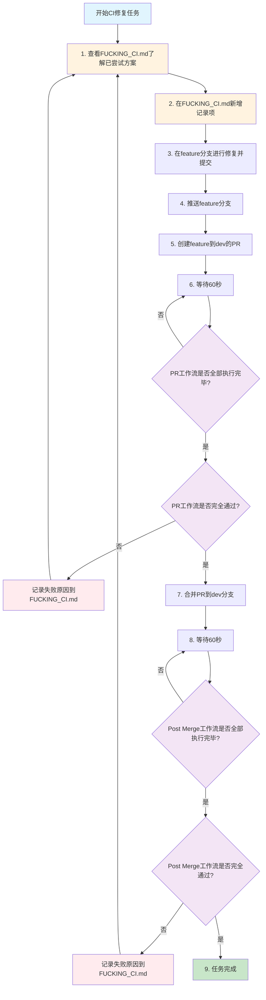

# CI工作流程图

## CI问题修复完整流程



## 关键节点说明

### 📋 记录节点 (橙色)

- **步骤1**: 查看FUCKING_CI.md了解历史尝试
- **步骤2**: 记录新的修复方案

### 🔄 循环监控节点 (紫色)

- **步骤6**: 监控PR工作流状态
- **步骤8**: 监控Post Merge工作流状态
- 使用60秒间隔，避免频繁查询

### ❌ 失败处理节点 (红色)

- PR工作流失败 → 记录原因并重新开始
- Post Merge工作流失败 → 记录原因并重新开始

### ✅ 成功节点 (绿色)

- 所有工作流通过，任务完成

## 监控工具推荐

```bash
# 使用GitHub CLI监控PR状态
gh pr view <PR-NUMBER> --json statusCheckRollup

# 使用GitHub CLI监控工作流
gh run list --branch dev --limit 5

# 等待60秒（避免使用watch参数）
sleep 60
```

## 重要提醒

⚠️ **循环原则**: 任何工作流失败都回到步骤1，重新分析和规划
🕐 **时间间隔**: 严格遵守60秒监控间隔，保持动态对话
📝 **记录完整**: 每次失败都要在FUCKING_CI.md中详细记录原因和证据
🔧 **工具使用**: 优先使用GitHub CLI、act等工具，避免手动操作
