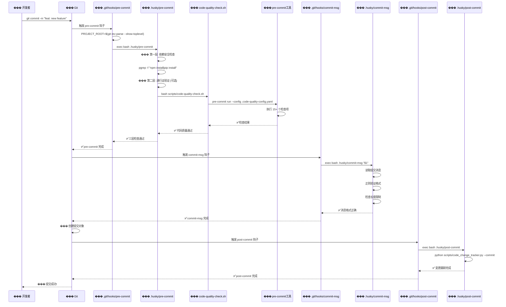
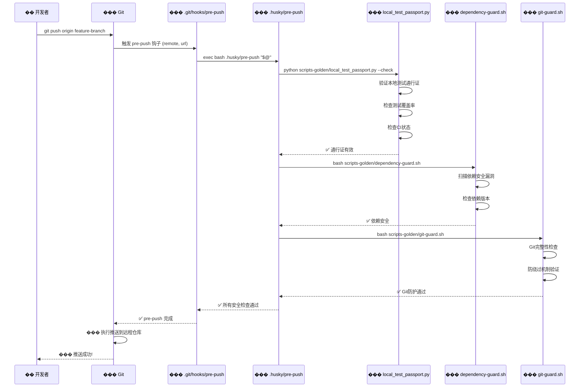
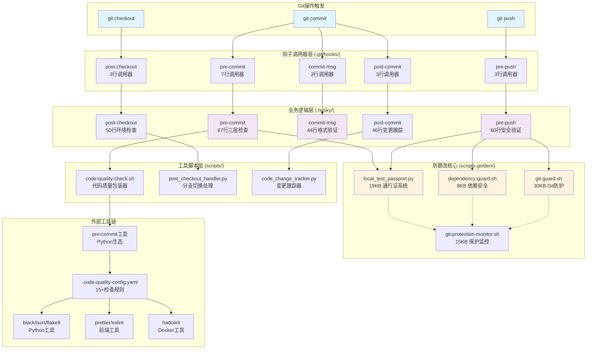

# ��� 改进后Husky架构执行流程详解

## ⏱️ 执行时序图

### Git Commit 完整时序



### Git Push 完整时序



## ���️ 工具调用依赖图



## ��� 性能分析与执行统计

### 执行时间分布

| 钩子              | 调用器开销 | 业务逻辑 | 工具链 | 总耗时 |
| ----------------- | ---------- | -------- | ------ | ------ |
| **pre-commit**    | <1ms       | 2-3ms    | 30-60s | ~60s   |
| **pre-push**      | <1ms       | 5-10ms   | 10-30s | ~30s   |
| **commit-msg**    | <1ms       | 1-2ms    | 0ms    | ~2ms   |
| **post-commit**   | <1ms       | 1-2ms    | 1-5s   | ~5s    |
| **post-checkout** | <1ms       | 2-5ms    | 1-10s  | ~10s   |

### 检查项目统计

- **代码质量检查**: 15+项 (格式化、语法、安全、规范)
- **安全验证**: 5项 (依赖、权限、通行证、防护、监控)
- **格式验证**: 3项 (提交消息、文件格式、命名规范)
- **环境检查**: 4项 (分支、依赖、配置、权限)

## ��� 关键设计原则

### 1. 责任分离

- **调用器**: 仅负责路径解析和脚本调用
- **业务逻辑**: 包含完整的检查和验证逻辑
- **工具脚本**: 提供可复用的功能模块
- **外部工具**: 专业的检查和格式化能力

### 2. 错误传播

```bash
# 调用器使用 exec 确保错误码正确传播
exec bash "$PROJECT_ROOT/.husky/pre-commit" "$@"
        ↓
# 业务脚本的 exit 代码直接传给 Git
exit 1  # 将阻止 git commit
```

### 3. 环境适配

```bash
# 动态获取项目根目录，支持各种环境
PROJECT_ROOT="$(git rev-parse --show-toplevel)"
```

### 4. 参数传递

```bash
# 完整参数传递，保持钩子语义
exec bash "$SCRIPT" "$@"
```
