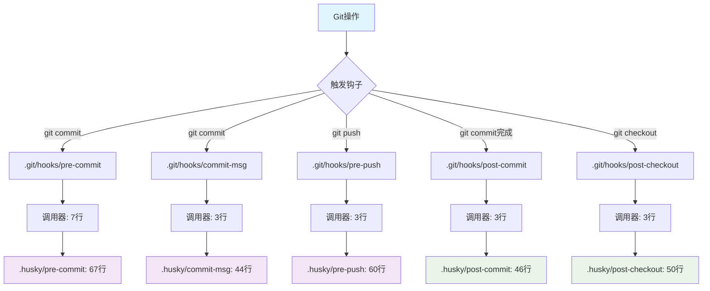
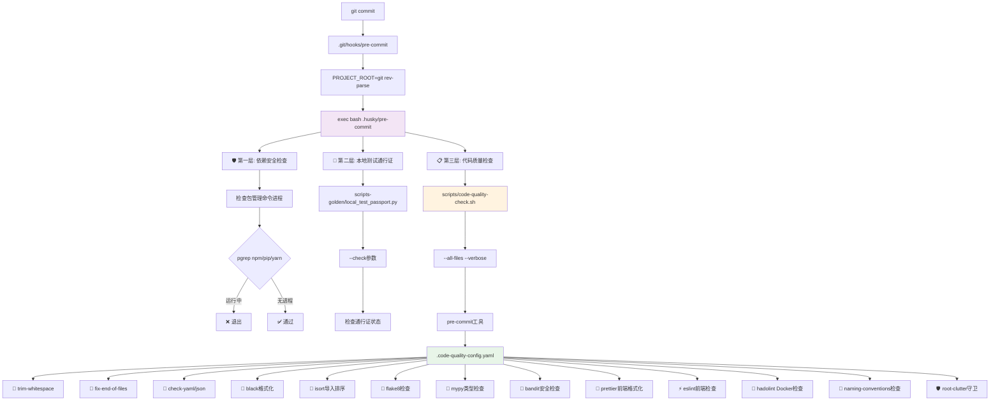
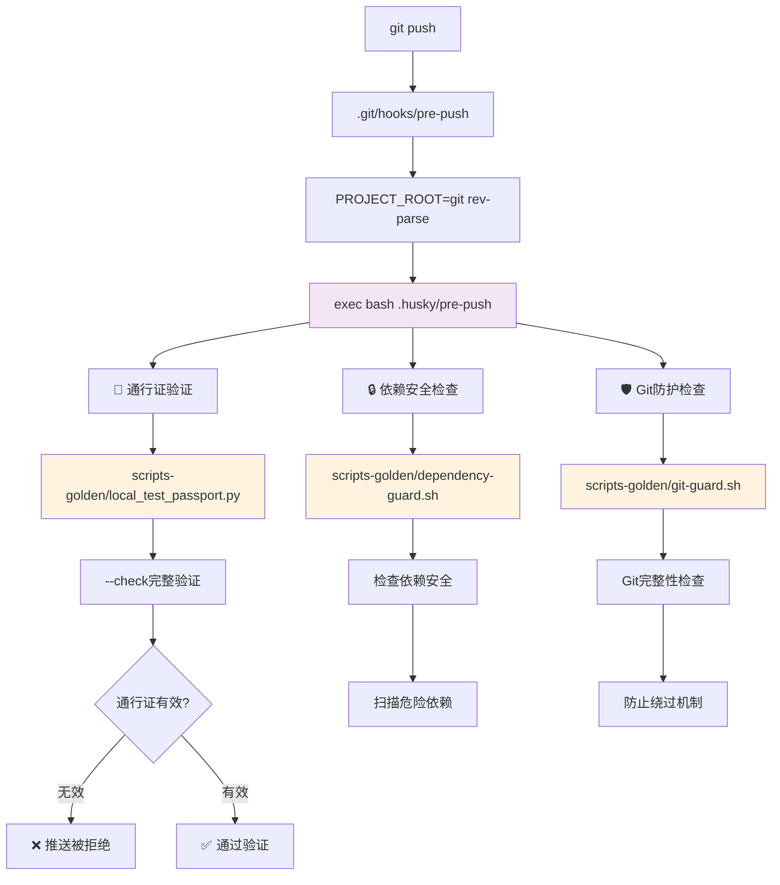
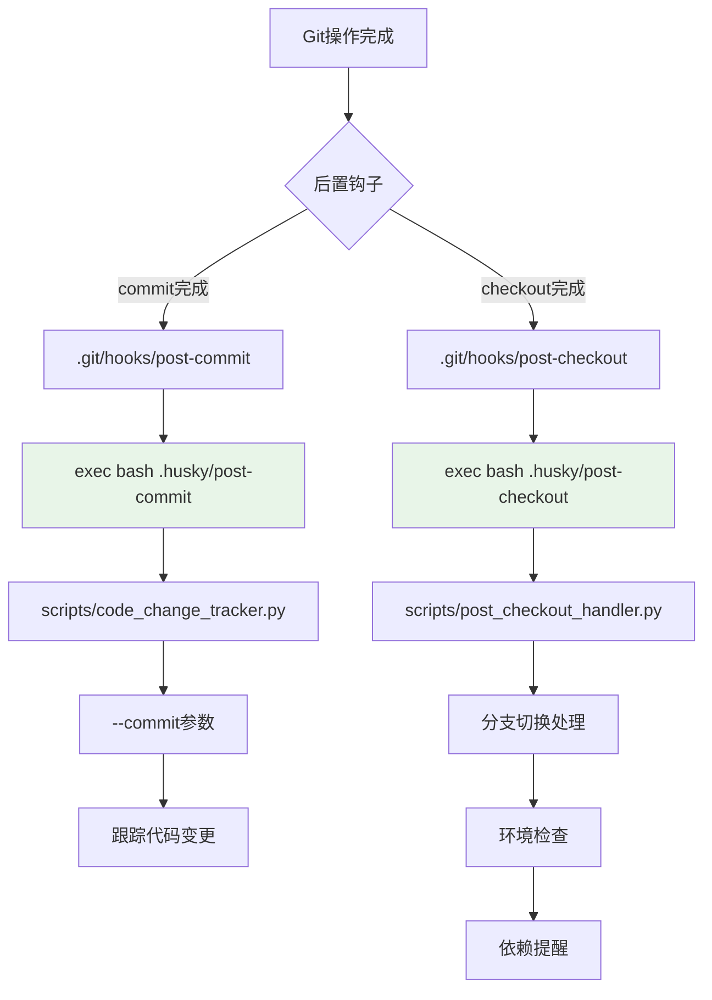

# 🏗️ 改进后的标准Husky架构流程与调用拓扑图

## 🎯 整体架构概览



## 🔧 详细调用链拓扑图

### 1. Pre-commit 三层检查架构



### 2. Pre-push 通行证与安全验证



### 3. Commit-msg 消息格式验证

```mermaid
graph TD
    A[git commit -m] --> B[.git/hooks/commit-msg]
    B --> C[exec bash .husky/commit-msg]
    C --> D[读取提交消息 $1]

    D --> E[正则表达式验证]
    E --> F{格式检查}
    F -->|匹配| G[长度检查]
    F -->|不匹配| H[❌ 格式错误提示]

    G --> I{< 500字符?}
    I -->|是| J[✅ 验证通过]
    I -->|否| K[❌ 消息过长]

    H --> L[显示格式规范]
    L --> M[feat|fix|docs等类型说明]
    M --> N[示例消息展示]

    style C fill:#f3e5f5
    style E fill:#e8f5e8
```

### 4. Post-hooks 监控与跟踪



## 🗂️ 关键组件说明

### Git钩子调用器 (.git/hooks/)

```bash
#!/usr/bin/env sh
PROJECT_ROOT="$(git rev-parse --show-toplevel)"
exec bash "$PROJECT_ROOT/.husky/[hook-name]" "$@"
```

- **作用**: 轻量级调用器，动态获取项目路径
- **优势**: 跨平台兼容，路径自适应

### 实际逻辑脚本 (.husky/)

- **pre-commit**: 67行三层检查逻辑
- **pre-push**: 60行通行证和安全验证
- **commit-msg**: 44行消息格式验证
- **post-\***: 后置监控和处理

### 工具链脚本 (scripts/)

- **code-quality-check.sh**: 代码质量检查包装器
- **post_checkout_handler.py**: 分支切换处理器
- **code_change_tracker.py**: 代码变更跟踪器

### 防篡改脚本 (scripts-golden/)

- **local_test_passport.py**: 通行证生成和验证
- **dependency-guard.sh**: 依赖安全检查
- **git-guard.sh**: Git防护机制

## 🔄 流程优化对比

| 阶段         | 迁移前流程                | 迁移后流程             |
| ------------ | ------------------------- | ---------------------- |
| **开发**     | 修改.husky/ → 手动sync    | 修改.husky/ ✨         |
| **提交**     | Git → .git/hooks/直接执行 | Git → 调用器 → .husky/ |
| **团队协作** | 需要记住同步命令          | 标准化流程             |
| **维护**     | 双重配置维护              | 单一配置维护           |

## ⚡ 性能与可靠性

- **调用开销**: 调用器仅增加~1ms延迟
- **错误处理**: exec确保错误码正确传递
- **路径解析**: 动态路径解析，支持各种环境
- **权限管理**: 自动继承执行权限

---

_架构设计: 标准Husky + 复杂业务逻辑的最佳实践_
