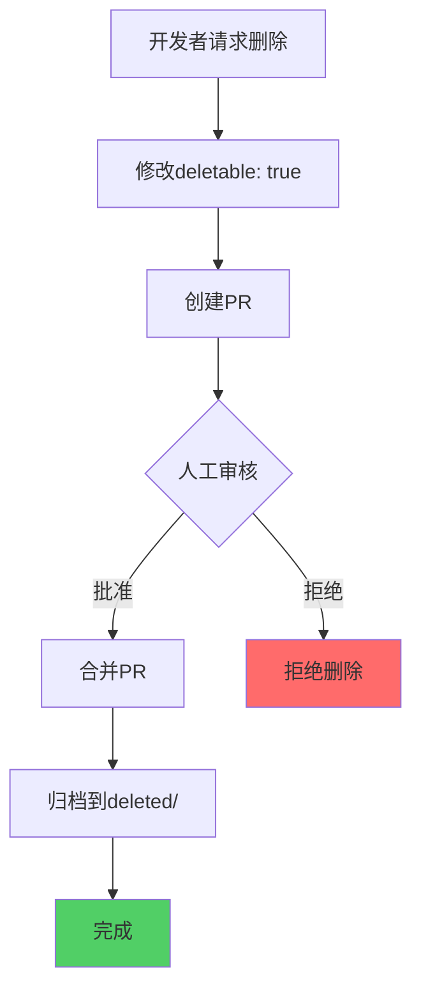
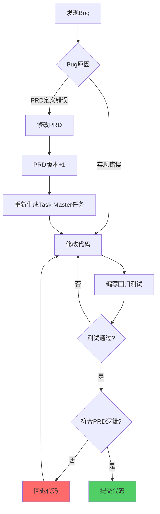

# APPENDIX: 核心问题Q&A映射

> **版本**: V4.0
> **主题**: 26个核心问题的详细解答
> **定位**: 直接回答用户提出的所有关键问题，映射到V4设计方案

---

## 问题索引

### 任务管理相关 (Q1-Q9)

- [Q1: Task-Master任务命名规范](#q1-task-master任务命名规范)
- [Q2: Task-Master任务管理的目录结构和文件生成](#q2-task-master任务管理的目录结构和文件生成)
- [Q3: 测试文件目录层级和类型的强制检查](#q3-测试文件目录层级和类型的强制检查)
- [Q4: Task-Master作为管家vs Cursor作为工人](#q4-task-master作为管家vs-cursor作为工人)
- [Q5: Cursor精化PRD vs Task-Master解析PRD](#q5-cursor精化prd-vs-task-master解析prd)
- [Q6: 任务细化与子任务管理](#q6-任务细化与子任务管理)
- [Q7: 多个PRD对应一个代码文件 vs 原子代码实现](#q7-多个prd对应一个代码文件-vs-原子代码实现)
- [Q8: 提交频率与任务完成关联](#q8-提交频率与任务完成关联)
- [Q9: 跨电脑协作的Task-Master任务管理](#q9-跨电脑协作的task-master任务管理)

### Bug修复与需求变更 (Q10-Q13)

- [Q10: Bug修复如何更新Task-ID](#q10-bug修复如何更新task-id)
- [Q11: PRD元数据在任务创建前如何强制执行](#q11-prd元数据在任务创建前如何强制执行)
- [Q12: PRD内容要求（数据库、Redis设计）](#q12-prd内容要求数据库redis设计)
- [Q13: PRD命名规范的可扩展性](#q13-prd命名规范的可扩展性)

### 测试与开发 (Q14-Q20)

- [Q14: PRD对前端开发的细节要求](#q14-prd对前端开发的细节要求)
- [Q15: PRD、任务列表、任务文件的删除保护](#q15-prd任务列表任务文件的删除保护)
- [Q16: PRD修改策略（多次提交、多PRD）](#q16-prd修改策略多次提交多prd)
- [Q17: 流程优化任务如何适用工作流](#q17-流程优化任务如何适用工作流)
- [Q18: Task-Master自检与测试文件验证](#q18-task-master自检与测试文件验证)
- [Q19: 防止Cursor修改/跳过测试文件](#q19-防止cursor修改跳过测试文件)
- [Q20: API契约驱动并行开发](#q20-api契约驱动并行开发)

### 质量保障 (Q21-Q26)

- [Q21: 拦截Cursor简化/删除功能的伪Bug修复](#q21-拦截cursor简化删除功能的伪bug修复)
- [Q22: Debug任务在Task-Master中的管理](#q22-debug任务在task-master中的管理)
- [Q23: 自动回滚未授权的功能删除](#q23-自动回滚未授权的功能删除)
- [Q24: 确保Cursor在Bug修复时遵循PRD逻辑](#q24-确保cursor在bug修复时遵循prd逻辑)
- [Q25: 代码文件与测试文件的TDD关联](#q25-代码文件与测试文件的tdd关联)
- [Q26: Post-commit Hook的实现](#q26-post-commit-hook的实现)

---

## Q1: Task-Master任务命名规范

**问题**: Task-Master生成的任务如何命名？是否有统一的命名规范？

**解决方案**: **三层命名体系**

### 第一层: REQ-ID

**格式**: `REQ-{YEAR}-{NUMBER}-{SLUG}`

- **示例**: `REQ-2025-001-user-login`
- **可扩展**: 支持按年份、按模块前缀、按优先级

### 第二层: Task-ID

**格式**: `task-{NUMBER}-{SLUG}`

- **Task-0**: 强制的自检任务（`task-0-self-check`）
- **Task-1+**: 功能任务（`task-1-implement-backend-api`）
- **自动生成**: 适配层根据Task-Master输出生成

### 第三层: Subtask-ID

**格式**: `subtask-{NUMBER}-{SLUG}`

- **示例**: `subtask-1-create-user-model`
- **自动推断**: 适配层根据任务类型推断

**文档参考**:

- [PART1-目录结构规范](./AI-WORKFLOW-V4-PART1-ARCH.md#32-目录命名规范)
- [PART2-三层任务管理](./AI-WORKFLOW-V4-PART2-TM-ADAPTER.md#3-三层任务管理设计)

---

## Q2: Task-Master任务管理的目录结构和文件生成

**问题**: Task-Master生成tasks.json和task.md，目录结构如何组织？

**解决方案**: **适配层转换为三层结构**

### 原始输出（Task-Master）

```
.taskmaster/tasks/REQ-2025-001/tasks.json  # 扁平JSON
```

### 适配层转换后

```
.taskmaster/tasks/REQ-2025-001/
├── tasks.json (增强版)
├── task-0-self-check/
│   ├── task.md
│   ├── subtask-1-validate-prd.md
│   ├── subtask-2-check-dirs.md
│   └── subtask-3-verify-api.md
├── task-1-implement-backend-api/
│   ├── task.md
│   ├── subtask-1-create-models.md
│   ├── subtask-2-implement-views.md
│   └── subtask-3-write-tests.md
└── task-2-implement-frontend-ui/
    └── ...
```

### 文件生成流程

1. **Task-Master生成**: 扁平`tasks.json`
2. **适配层处理**: `python scripts/task-master/adapter.py REQ-ID`
3. **自动生成**:
   - Task-0自检任务
   - 为每个任务创建目录
   - 生成`task.md`（任务主文件）
   - 推断并生成`subtask-X.md`（子任务文件）

**文档参考**:

- [PART2-适配层实现详解](./AI-WORKFLOW-V4-PART2-TM-ADAPTER.md#5-适配层实现详解)
- [PART6-Task-Master适配层完整实现](./AI-WORKFLOW-V4-PART6-IMPL.md#4-task-master适配层完整实现)

---

## Q3: 测试文件目录层级和类型的强制检查

**问题**: 如何强制检查测试文件的目录层级（unit/integration/e2e/regression）？

**解决方案**: **Pre-commit Hook + 合规引擎强制验证**

### 强制目录结构

```
backend/tests/
├── unit/           ← 单元测试
├── integration/    ← 集成测试
├── regression/     ← 回归测试
└── fixtures/       ← 测试数据

e2e/tests/
├── smoke/          ← 冒烟测试
├── regression/     ← 回归测试
└── performance/    ← 性能测试
```

### 检查机制

**Pre-commit Hook检查**:

```python
# .compliance/checkers/test_checker.py

def check_test_directory(test_file):
    # 后端测试必须在指定目录
    if test_file.startswith('backend/tests/'):
        valid_dirs = ['unit/', 'integration/', 'regression/', 'fixtures/']
        parent_dir = test_file.split('/')[2] + '/'

        if parent_dir not in valid_dirs:
            raise ComplianceError(
                f"后端测试文件必须在以下目录之一: {valid_dirs}"
            )

    # E2E测试必须在e2e/tests/
    if test_file.endswith('.spec.ts') and not test_file.startswith('e2e/tests/'):
        raise ComplianceError("E2E测试文件必须在 e2e/tests/ 目录")

    # 命名检查
    if test_file.endswith('.py') and not os.path.basename(test_file).startswith('test_'):
        raise ComplianceError("Python测试文件必须以 test_ 开头")
```

**CI/CD二次验证**: 重新执行所有检查，无法绕过

**文档参考**:

- [PART4-测试目录强制规范](./AI-WORKFLOW-V4-PART4-TDD-TEST.md#3-测试目录强制规范)
- [PART5-Pre-commit Hook](./AI-WORKFLOW-V4-PART5-COMPLIANCE.md#3-第一道防线pre-commit-hook)

---

## Q4: Task-Master作为管家vs Cursor作为工人

**问题**: Task-Master作为"管家"，Cursor作为"工人"，如何体现这种角色分工？

**解决方案**: **明确的职责边界**

### Task-Master（管家）

**职责**:

1. **解析PRD**: 从精化后的PRD中提取任务
2. **生成任务列表**: 创建`tasks.json`
3. **监督进度**: 跟踪任务状态（通过`sync_status.py`）
4. **验证完成度**: 检查测试、代码、提交是否完整

**不做**:

- 不直接编写代码
- 不直接编写测试
- 不修改PRD

### Cursor（工人）

**职责**:

1. **精化PRD**: 补充技术细节（数据库、Redis、API、测试用例）
2. **执行任务**: 根据Task-Master分配的任务编写代码
3. **编写测试**: TDD红-绿-重构
4. **提交代码**: 遵循提交规范

**不能**:

- 不能绕过Task-Master直接开始实现
- 不能跳过测试
- 不能删除PRD功能（除非先修改PRD）

### 协作流程

```
人类: 提出模糊需求
  ↓
Cursor: 精化PRD（补充技术细节）
  ↓
Task-Master: 解析PRD → 生成tasks.json
  ↓
适配层: 转换为三层结构
  ↓
Cursor: 执行Task-0自检
  ↓
Task-Master: 验证自检通过
  ↓
Cursor: 执行Task-1, 2, 3...
  ↓
Task-Master: 监督进度，验证完成度
  ↓
所有任务完成 → 标记PRD为completed
```

**文档参考**:

- [PART1-AI角色分工体系](./AI-WORKFLOW-V4-PART1-ARCH.md#4-ai角色分工体系)
- [PART2-角色定位](./AI-WORKFLOW-V4-PART2-TM-ADAPTER.md#13-角色定位)

---

## Q5: Cursor精化PRD vs Task-Master解析PRD

**问题**: 为什么不让Task-Master直接解析人类的模糊需求？Cursor精化PRD的职责是什么？

**解决方案**: **上下文感知 vs 独立解析**

### Task-Master的局限性

1. **无项目上下文**: Task-Master是独立CLI工具，不了解项目架构、现有代码、依赖关系
2. **无感知能力**: 无法推断数据库设计、Redis策略、API接口
3. **通用性导向**: 设计为通用工具，不针对特定项目

### Cursor精化PRD的优势

1. **项目上下文**: 在项目中运行，了解代码库结构
2. **技术推断**: 可以根据现有代码推断技术方案
3. **历史学习**: 分析历史PRD，优化新PRD结构

### Cursor精化的具体内容

```markdown
人类原始需求:
"实现用户登录功能，支持邮箱和密码登录"

↓ Cursor精化后 ↓

---

req_id: REQ-2025-001-user-login
test_files: # ← Cursor推断

- backend/tests/unit/test_user_login.py
- backend/tests/integration/test_user_authentication.py
- e2e/tests/test-user-login.spec.ts
  implementation_files: # ← Cursor推断
- backend/apps/users/models.py
- backend/apps/users/views.py
- frontend/src/views/LoginView.vue
  api_contract: docs/01_guideline/api-contracts/REQ-2025-001/api.yaml

---

# 数据库设计（Cursor补充）

| 字段  | 类型         | 说明 | 索引    |
| ----- | ------------ | ---- | ------- |
| id    | BigInt       | 主键 | PRIMARY |
| email | VARCHAR(255) | 邮箱 | UNIQUE  |

...

# Redis缓存策略（Cursor补充）

- Key: login:attempts:{email}
- TTL: 15分钟
  ...

# API接口定义（Cursor补充）

POST /api/auth/login
Request: {email, password, remember_me}
Response: {token, user}
...

# 测试用例（Cursor补充）

- test_login_success
- test_login_invalid_email
- test_login_rate_limit
  ...

# 前端UI/UX（Cursor补充）

- LoginView.vue
  - EmailInput组件
  - PasswordInput组件
  - RememberMeCheckbox组件
    ...
```

### 工作流

```
人类模糊需求 → Cursor精化PRD → Task-Master解析精化PRD → 生成详细任务
```

**文档参考**:

- [PART1-Cursor精化PRD的职责](./AI-WORKFLOW-V4-PART1-ARCH.md#12-task-master作为任务管家)
- [PART1-PRD精化流程详解](./AI-WORKFLOW-V4-PART1-ARCH.md#52-prd精化流程详解)

---

## Q6: 任务细化与子任务管理

**问题**: 如何确保Task-Master按照三层结构执行？如何管理子任务？

**解决方案**: **Task-Master AI生成子任务 + 适配层增强**

### Task-Master的子任务生成

Task-Master通过AI驱动的`expand`命令自动生成子任务：

**步骤1**: 解析PRD生成主任务

```bash
task-master parse-prd --input=PRD.md
```

输出：

```json
{
  "tasks": [
    {
      "id": 1,
      "title": "Implement backend API",
      "description": "...",
      "subtasks": []
    },
    {
      "id": 2,
      "title": "Implement frontend UI",
      "description": "...",
      "subtasks": []
    }
  ]
}
```

**步骤2**: AI分析复杂度并展开为子任务

```bash
task-master analyze-complexity --threshold=5
task-master expand --all --research
```

输出（AI自动生成）：

```json
{
  "tasks": [
    {
      "id": 1,
      "title": "Implement backend API",
      "subtasks": [
        {
          "id": 1,
          "title": "Create database models",
          "description": "Design User model..."
        },
        {
          "id": 2,
          "title": "Implement API views",
          "description": "Create login/logout views..."
        },
        {
          "id": 3,
          "title": "Create serializers",
          "description": "Implement validation..."
        },
        {
          "id": 4,
          "title": "Write unit tests",
          "description": "Test models and views..."
        },
        {
          "id": 5,
          "title": "Write integration tests",
          "description": "Test API endpoints..."
        }
      ]
    }
  ]
}
```

### 适配层的真实作用

适配层**不生成子任务**，而是为Task-Master生成的子任务添加项目集成信息：

1. **添加Task-0**: 注入自检任务（Task-Master不会自动生成）
2. **文件关联**: 为每个子任务关联测试文件和代码文件路径
3. **目录组织**: 创建三层目录结构
4. **PRD链接**: 关联子任务到PRD具体章节

**适配层增强示例**:

```json
{
  "id": 1,
  "title": "Create database models",
  "test_files": ["backend/tests/unit/test_users_model.py"],
  "implementation_files": ["backend/apps/users/models.py"],
  "prd_section": "#database-design"
}
```

### 子任务管理

1. **AI生成**: Task-Master通过`expand`命令AI生成子任务
2. **独立文件**: 适配层为每个子任务生成`subtask-X.md`
3. **状态跟踪**: 通过`sync_status.py`双向同步状态
4. **完成检测**: 所有子任务完成后，自动标记Task为completed

**文档参考**:

- [PART2-Task-Master子任务生成](./AI-WORKFLOW-V4-PART2-TM-ADAPTER.md#1-task-master集成架构)
- [PART2-文件关联逻辑](./AI-WORKFLOW-V4-PART2-TM-ADAPTER.md#52-文件关联逻辑)
- [PART2-任务状态同步机制](./AI-WORKFLOW-V4-PART2-TM-ADAPTER.md#6-任务状态同步机制)
- [Task-Master研究报告](./TASK-MASTER-RESEARCH.md)

---

## Q7: 多个PRD对应一个代码文件 vs 原子代码实现

**问题**: 如何处理多个PRD共享一个代码文件？如何保证代码的原子性？

**解决方案**: **PRD元数据冗余 + 代码注释关联**

### 场景1: 多个PRD对应一个代码文件

**示例**: `backend/apps/users/views.py` 被多个PRD使用

```yaml
# REQ-2025-001-user-login.md
implementation_files:
  - backend/apps/users/views.py  # 共享文件

# REQ-2025-002-user-profile.md
implementation_files:
  - backend/apps/users/views.py  # 共享文件
```

**代码文件中使用注释标注**:

```python
# backend/apps/users/views.py

# REQ-2025-001: 用户登录
class LoginView(APIView):
    def post(self, request):
        ...

# REQ-2025-002: 用户资料
class ProfileView(APIView):
    def get(self, request):
        ...
```

### 场景2: 一个PRD对应多次提交

**问题**: 一个PRD的实现需要多次提交（如Task-1, Task-2, Task-3）

**解决方案**: PRD状态保持`implementing`

```yaml
# PRD元数据中记录所有提交
commits:
  - sha: abc123
    task_id: task-1
    subtask_id: subtask-2
    timestamp: 2025-10-24T10:00:00Z
  - sha: def456
    task_id: task-1
    subtask_id: subtask-3
    timestamp: 2025-10-24T11:00:00Z
  - sha: ghi789
    task_id: task-2
    subtask_id: subtask-1
    timestamp: 2025-10-24T12:00:00Z
```

**所有Task完成后**: 自动标记PRD为`completed`

### 原子性保障

1. **子任务粒度**: 每个子任务是原子的（一次提交完成）
2. **测试验证**: 每个子任务都有对应测试
3. **回滚能力**: 可以回滚单个子任务的提交

**文档参考**:

- [PART3-PRD修改策略](./AI-WORKFLOW-V4-PART3-PRD-TRD.md#7-prd修改策略)
- [PART5-测试文件与代码文件关联](./AI-WORKFLOW-V4-PART4-TDD-TEST.md#5-测试文件与代码文件关联)

---

## Q8: 提交频率与任务完成关联

**问题**: 多久提交一次？如何与Task-Master任务完成关联？Commit消息如何验证？

**解决方案**: **子任务完成即提交 + 强制Commit消息格式**

### 提交频率

**原则**: **每完成一个子任务就提交**

```
Task-1: Implement backend API
  ├── Subtask-1: Create models → Commit 1
  ├── Subtask-2: Implement views → Commit 2
  ├── Subtask-3: Create serializers → Commit 3
  ├── Subtask-4: Write unit tests → Commit 4
  └── Subtask-5: Write integration tests → Commit 5
```

### Commit消息格式

**强制格式**: `[REQ-ID] Task-X Subtask-Y 描述`

**示例**:

```bash
git commit -m "[REQ-2025-001-user-login] Task-1 Subtask-2 实现登录API视图"
```

### Commit-msg Hook验证

```bash
# .githooks/commit-msg

if echo "$COMMIT_MSG" | grep -qE '^\[REQ-[0-9]{4}-[0-9]{3}-[a-z0-9-]+\] Task-[0-9]+ Subtask-[0-9]+'; then
    # 验证REQ-ID是否存在
    # 验证Task-ID是否存在
    # 验证Subtask-ID是否存在
    exit 0
else
    echo "❌ 提交消息格式错误"
    exit 1
fi
```

### 任务状态同步

**Post-commit Hook自动同步**:

```bash
# .githooks/post-commit

REQ_ID=$(提取REQ-ID)
TASK_ID=$(提取Task-ID)
SUBTASK_ID=$(提取Subtask-ID)

python scripts/task-master/sync_status.py \
  --req-id $REQ_ID \
  --task-id $TASK_ID \
  --subtask-id $SUBTASK_ID \
  --status completed \
  --commit-sha $(git rev-parse HEAD)
```

**文档参考**:

- [PART5-Commit-msg Hook](./AI-WORKFLOW-V4-PART5-COMPLIANCE.md#4-第二道防线commit-msg-hook)
- [PART2-任务状态同步](./AI-WORKFLOW-V4-PART2-TM-ADAPTER.md#6-任务状态同步机制)

---

## Q9: 跨电脑协作的Task-Master任务管理

**问题**: 如何在多台电脑上协作Task-Master任务？

**解决方案**: **Git同步.taskmaster目录 + 锁机制**

### 协作流程

```
电脑A:
1. 拉取最新代码
2. 执行Task-1 Subtask-1
3. 提交并推送（包括.taskmaster目录）

电脑B:
1. 拉取最新代码（包括.taskmaster目录）
2. 看到Task-1 Subtask-1已完成
3. 继续执行Task-1 Subtask-2
4. 提交并推送
```

### 冲突避免

**原则**: 不同人负责不同Task

```
电脑A: Task-1（后端API）
电脑B: Task-2（前端UI）
```

### 锁机制

**同时修改同一个tasks.json的处理**:

```python
# scripts/task-master/sync_status.py

import fcntl

def sync_status_with_lock(req_id, task_id, subtask_id, status):
    lock_file = f'.taskmaster/tasks/{req_id}/.lock'

    # 获取锁（最多重试5次）
    for i in range(5):
        try:
            with open(lock_file, 'w') as lock:
                fcntl.flock(lock, fcntl.LOCK_EX | fcntl.LOCK_NB)

                # 读取tasks.json
                # 更新状态
                # 写回tasks.json

                fcntl.flock(lock, fcntl.LOCK_UN)
                break
        except IOError:
            time.sleep(1)  # 等待1秒后重试
```

### 最佳实践

1. **频繁同步**: 每完成一个子任务就推送
2. **清晰Commit**: `[REQ-ID] Task-X Subtask-Y 完成XXX`
3. **避免并行**: 不同人不要同时修改同一个Task
4. **使用分支**: 每个Task在独立Feature分支开发

**文档参考**:

- [PART2-跨电脑协作支持](./AI-WORKFLOW-V4-PART2-TM-ADAPTER.md#7-跨电脑协作支持)

---

## Q10: Bug修复如何更新Task-ID

**问题**: 如果发现需求有缺陷（Bug），如何生成新的Task？如何更新Task-ID？

**解决方案**: **Bug修复创建回归测试任务**

### Bug修复流程

```
1. 发现Bug → 创建GitHub Issue (#123)
  ↓
2. 编写回归测试 (test_issue_123.py)
  ↓
3. 测试失败（红色）
  ↓
4. 修复Bug
  ↓
5. 测试通过（绿色）
  ↓
6. 提交: [BUGFIX] 修复Issue#123 密码特殊字符问题
```

### 是否更新PRD？

**情况1: Bug是PRD缺陷**

- **修改PRD**: 修正PRD中的错误描述
- **版本升级**: PRD version从1.0升级到1.1
- **重新生成任务**: 运行Task-Master生成新任务

**情况2: Bug是实现缺陷**

- **不修改PRD**: PRD没有错
- **创建回归测试**: `backend/tests/regression/test_issue_123.py`
- **Commit消息**: `[BUGFIX] 修复Issue#123`（不关联REQ-ID）

### 回归测试任务管理

**不需要Task-Master生成**，直接提交：

```bash
# 1. 创建回归测试
cat > backend/tests/regression/test_issue_123.py << 'EOF'
def test_issue_123_password_special_chars():
    """Bug #123: 密码包含特殊字符时登录失败"""
    # 测试代码
EOF

# 2. 运行测试（失败）
pytest backend/tests/regression/test_issue_123.py

# 3. 修复Bug
vim backend/apps/users/services.py

# 4. 运行测试（通过）
pytest backend/tests/regression/test_issue_123.py

# 5. 提交
git commit -m "[BUGFIX] 修复Issue#123 密码特殊字符验证失败"
```

**文档参考**:

- [PART4-回归测试机制](./AI-WORKFLOW-V4-PART4-TDD-TEST.md#8-回归测试机制)
- [PART3-PRD修改策略](./AI-WORKFLOW-V4-PART3-PRD-TRD.md#7-prd修改策略)

---

## Q11: PRD元数据在任务创建前如何强制执行

**问题**: 如何确保即使在Task-Master还没生成任务时，PRD元数据也必须填写完整？

**解决方案**: **Pre-commit Hook验证PRD完整性**

### 验证时机

**第一次提交PRD时**:

```bash
# 1. 创建PRD
vim docs/00_product/requirements/REQ-2025-001/REQ-2025-001.md

# 2. 提交PRD（Pre-commit自动验证）
git add docs/00_product/requirements/REQ-2025-001/REQ-2025-001.md
git commit -m "[REQ-2025-001] 创建PRD"

# Pre-commit Hook验证:
# ✅ YAML frontmatter完整性
# ✅ 必填字段存在
# ✅ test_files非空
# ✅ implementation_files非空
# ✅ api_contract存在
```

### 验证脚本

```python
# scripts/compliance/validate_prd.py

def validate_prd(prd_path):
    # 1. 读取PRD
    with open(prd_path, 'r') as f:
        content = f.read()

    # 2. 解析YAML frontmatter
    if not content.startswith('---'):
        raise ValidationError("PRD必须包含YAML frontmatter")

    metadata = parse_yaml_frontmatter(content)

    # 3. 验证必填字段
    required_fields = [
        'req_id', 'title', 'status', 'test_files',
        'implementation_files', 'api_contract', 'deletable'
    ]

    for field in required_fields:
        if field not in metadata:
            raise ValidationError(f"缺少必填字段: {field}")

    # 4. 验证test_files非空
    if not metadata['test_files'] or len(metadata['test_files']) == 0:
        raise ValidationError("test_files不能为空")

    # 5. 验证implementation_files非空
    if not metadata['implementation_files'] or len(metadata['implementation_files']) == 0:
        raise ValidationError("implementation_files不能为空")

    # 6. 验证字段格式
    if not re.match(r'^REQ-\d{4}-\d{3}-.+$', metadata['req_id']):
        raise ValidationError("req_id格式错误")

    print("✅ PRD验证通过")
```

### Task-Master执行前验证

```bash
# Task-0 Subtask-1: 验证PRD元数据
python scripts/compliance/validate_prd.py REQ-2025-001-user-login

# 只有验证通过，才能继续执行后续任务
```

**文档参考**:

- [PART3-PRD元数据标准](./AI-WORKFLOW-V4-PART3-PRD-TRD.md#3-prd元数据标准)
- [PART3-PRD验证规则](./AI-WORKFLOW-V4-PART3-PRD-TRD.md#6-prd验证规则)

---

## Q12: PRD内容要求（数据库、Redis设计）

**问题**: PRD中是否必须包含数据库设计、Redis设计？如何验证？

**解决方案**: **内容结构检查**

### 必需章节

```yaml
# .compliance/rules/prd.yaml

content_structure_checks:
  enabled: true
  required_sections:
    - "功能概述"
    - "用户故事"
    - "验收标准"
    - "数据库设计" # ← 必需
    - "Redis缓存策略" # ← 必需（如果使用Redis）
    - "API接口定义" # ← 必需
    - "测试用例"
    - "前端UI/UX细节" # ← 前端需求必需
```

### 验证逻辑

```python
# .compliance/checkers/prd_checker.py

def check_content_structure(prd_content, rule):
    required_sections = rule['content_structure_checks']['required_sections']

    missing_sections = []
    for section in required_sections:
        # 检查是否包含该章节（使用正则匹配标题）
        pattern = rf'##\s+\d*\.?\s*{re.escape(section)}'
        if not re.search(pattern, prd_content, re.IGNORECASE):
            missing_sections.append(section)

    if missing_sections:
        if rule['content_structure_checks'].get('warn_missing_sections'):
            # 警告但不阻止
            print(f"⚠️ PRD缺少以下章节: {', '.join(missing_sections)}")
        else:
            # 阻止提交
            raise ComplianceError(f"PRD缺少必需章节: {', '.join(missing_sections)}")
```

### 数据库设计要求

**最低要求**:

- 表名
- 字段定义（名称、类型、说明）
- 主键、外键
- 索引设计
- 迁移文件路径

**示例**:

```markdown
## 数据库设计

### 用户表 (users)

| 字段  | 类型         | 说明 | 约束     | 索引    |
| ----- | ------------ | ---- | -------- | ------- |
| id    | BigInt       | 主键 | NOT NULL | PRIMARY |
| email | VARCHAR(255) | 邮箱 | UNIQUE   | UNIQUE  |

**迁移文件**: `backend/apps/users/migrations/0001_create_users_table.py`
```

### Redis设计要求

**最低要求**:

- Key格式
- 数据类型
- TTL策略
- 值结构

**示例**:

```markdown
## Redis缓存策略

### 登录限流

- **Key**: `login:attempts:{email}`
- **类型**: String
- **TTL**: 900秒（15分钟）
- **值**: 尝试次数（0-5）
```

**文档参考**:

- [PART3-PRD核心规范](./AI-WORKFLOW-V4-PART3-PRD-TRD.md#1-prd核心规范)

---

## Q13: PRD命名规范的可扩展性

**问题**: REQ-{YEAR}-{NUMBER}-{SLUG}的命名是否可以扩展？

**解决方案**: **支持多种扩展模式**

### 基础格式

`REQ-{YEAR}-{NUMBER}-{SLUG}`

- **示例**: `REQ-2025-001-user-login`

### 扩展模式1: 按模块前缀

`REQ-{YEAR}-{MODULE}-{NUMBER}-{SLUG}`

- **示例**:
  - `REQ-2025-AUTH-001-user-login`
  - `REQ-2025-PRODUCT-001-product-catalog`
  - `REQ-2025-ORDER-001-order-management`

### 扩展模式2: 按优先级前缀

`REQ-{YEAR}-{PRIORITY}-{NUMBER}-{SLUG}`

- **示例**:
  - `REQ-2025-P1-001-critical-security-fix`
  - `REQ-2025-P2-001-important-feature`
  - `REQ-2025-P3-001-nice-to-have`

### 扩展模式3: 按类型前缀

`REQ-{YEAR}-{TYPE}-{NUMBER}-{SLUG}`

- **示例**:
  - `REQ-2025-FEATURE-001-user-login`
  - `REQ-2025-BUGFIX-001-password-validation`
  - `REQ-2025-REFACTOR-001-database-optimization`

### 配置扩展规则

```yaml
# .compliance/rules/prd.yaml

metadata_validation:
  req_id:
    # 基础格式
    pattern: "^REQ-\\d{4}-\\d{3}-.+$"

    # 扩展格式（可选）
    extended_patterns:
      - "^REQ-\\d{4}-[A-Z]+-\\d{3}-.+$" # 模块前缀
      - "^REQ-\\d{4}-P[1-3]-\\d{3}-.+$" # 优先级前缀
      - "^REQ-\\d{4}-(FEATURE|BUGFIX|REFACTOR)-\\d{3}-.+$" # 类型前缀
```

**文档参考**:

- [PART1-REQ-ID命名规范](./AI-WORKFLOW-V4-PART1-ARCH.md#32-目录命名规范)

---

## Q14: PRD对前端开发的细节要求

**问题**: 前端开发（如打字练习网站）的PRD需要多详细？UI/UX元素如何描述？

**解决方案**: **分层描述 + 原型图**

### 前端PRD必需章节

```markdown
## 前端UI/UX细节

### 页面结构

- **路由**: `/typing-practice`
- **Layout**: MainLayout
- **组件树**:
  - TypingPracticeView
    - TypingArea (打字区域)
    - StatisticsPanel (统计面板)
    - KeyboardHints (键盘提示)

### 组件详细设计

#### TypingArea组件

**功能**: 显示待输入文本，高亮已输入文本
**Props**:

- `text`: string (待输入文本)
- `userInput`: string (用户已输入)
  **Events**:
- `@input`: 用户输入事件
  **样式**:
- 字体: Monospace 18px
- 正确字符: 绿色
- 错误字符: 红色背景

#### StatisticsPanel组件

**功能**: 显示实时统计
**显示内容**:

- WPM (每分钟字数)
- 准确率
- 已用时间
- 进度条

### 交互逻辑

1. 用户进入页面 → 显示随机文本
2. 用户开始输入 → 启动计时器
3. 每输入一个字符:
   - 正确 → 绿色高亮
   - 错误 → 红色背景，播放错误音效
4. 完成所有文本 → 显示成绩统计

### 原型图


### 样式规范

- **配色方案**:
  - 主色: #4dabf7
  - 成功: #51cf66
  - 错误: #ff6b6b
- **间距**: 16px网格系统
- **动画**: 输入时的平滑过渡（200ms）
```

### 组件级别测试用例

```markdown
### E2E测试用例 (e2e/tests/test-typing-practice.spec.ts)

**test_user_can_start_typing**:

- 访问 `/typing-practice`
- 看到待输入文本
- 点击输入框
- 输入第一个字符
- 验证计时器启动

**test_correct_input_highlights_green**:

- 输入正确字符
- 验证字符变为绿色

**test_incorrect_input_shows_error**:

- 输入错误字符
- 验证字符背景变为红色
- 验证播放错误音效
```

**文档参考**:

- [PART3-PRD核心规范（前端UI/UX章节）](./AI-WORKFLOW-V4-PART3-PRD-TRD.md#9-前端uiux细节)

---

## Q15: PRD、任务列表、任务文件的删除保护

**问题**: 如何防止PRD、Task-Master任务列表、任务文件被误删除？

**解决方案**: **元数据标记 + Pre-commit Hook + 审批流程**

### PRD删除保护

**元数据标记**:

```yaml
deletable: false # 默认不可删除
delete_requires_review: true # 删除需要审核
```

**Pre-commit Hook检查**:

```python
# .githooks/pre-commit

def check_prd_deletion(deleted_files):
    for file in deleted_files:
        if '/requirements/' in file and file.endswith('.md'):
            metadata = read_prd_metadata(file)

            if not metadata.get('deletable', False):
                print(f"❌ 禁止删除PRD: {file}")
                print("💡 如需删除，请先修改PRD元数据中的 deletable 为 true")
                sys.exit(1)

            if metadata.get('delete_requires_review', True):
                print(f"⚠️ 删除PRD需要人工审核")
                print("💡 请创建PR并请求审核")
                # 允许提交，但需要PR审核
```

### Task-Master文件删除保护

**.gitignore排除**（防止误删除）:

```
# .gitignore
!.taskmaster/tasks/**/*.json
!.taskmaster/tasks/**/*.md
```

**Pre-commit Hook检查**:

```bash
# 检测.taskmaster目录下的删除
DELETED_TASK_FILES=$(git diff --name-status --cached | grep "^D" | grep ".taskmaster/tasks")

if [ -n "$DELETED_TASK_FILES" ]; then
    echo "❌ 禁止删除Task-Master任务文件"
    echo "💡 如需删除，请先归档任务并创建PR"
    exit 1
fi
```

### 删除审批流程



### 已删除文件归档

```
docs/00_product/requirements/deleted/
└── REQ-2025-001-user-login/
    ├── REQ-2025-001-user-login.md
    ├── REQ-2025-001-TRD.md
    ├── deleted_at.txt (2025-10-24T15:30:00Z)
    └── deleted_by.txt (张三)
```

**文档参考**:

- [PART3-PRD删除保护](./AI-WORKFLOW-V4-PART3-PRD-TRD.md#8-prd删除保护)

---

## Q16: PRD修改策略（多次提交、多PRD）

**问题**: 一个PRD需要多次提交如何处理？多个PRD对应一个代码文件如何处理？

**解决方案**: **状态管理 + 元数据记录**

### 一个PRD多次提交

**PRD状态保持`implementing`**:

```yaml
# REQ-2025-001-user-login.md
status: implementing

commits:
  - sha: abc123
    task_id: task-1
    subtask_id: subtask-2
    message: "实现登录API视图"
    timestamp: 2025-10-24T10:00:00Z

  - sha: def456
    task_id: task-1
    subtask_id: subtask-3
    message: "实现序列化器"
    timestamp: 2025-10-24T11:00:00Z

  - sha: ghi789
    task_id: task-2
    subtask_id: subtask-1
    message: "实现前端登录页面"
    timestamp: 2025-10-24T12:00:00Z
```

**所有Task完成后**: 自动标记为`completed`

### 多个PRD对应一个代码文件

**每个PRD都记录**:

```yaml
# REQ-2025-001-user-login.md
implementation_files:
  - backend/apps/users/views.py

# REQ-2025-002-user-profile.md
implementation_files:
  - backend/apps/users/views.py  # 共享
```

**代码文件中标注**:

```python
# backend/apps/users/views.py

# REQ-2025-001: 用户登录
class LoginView(APIView):
    pass

# REQ-2025-002: 用户资料
class ProfileView(APIView):
    pass
```

### PRD版本管理

**需求变更创建新版本**:

```
docs/00_product/requirements/REQ-2025-001-user-login/
├── REQ-2025-001-user-login.md (v1.1 当前版本)
└── history/
    ├── REQ-2025-001-user-login-v1.0.md
    └── REQ-2025-001-user-login-v1.1.md
```

**文档参考**:

- [PART3-PRD修改策略](./AI-WORKFLOW-V4-PART3-PRD-TRD.md#7-prd修改策略)

---

## Q17: 流程优化任务如何适用工作流

**问题**: 如何将工作流应用到流程优化任务（如优化GitHub Actions、AI工作流）？

**解决方案**: **流程优化也是需求**

### 创建流程优化PRD

```yaml
---
req_id: REQ-2025-050-optimize-github-actions
title: 优化GitHub Actions CI/CD流程
type: refactor  # ← 类型为refactor
priority: medium
test_files:
  - scripts/test_github_actions.py  # ← 验证脚本
implementation_files:
  - .github/workflows/on-pr.yml
  - .github/workflows/on-push-dev.yml
---

# REQ-2025-050: 优化GitHub Actions CI/CD流程

## 优化目标
- 减少CI运行时间从10分钟到5分钟
- 降低CI失败率从20%到5%

## 当前问题
- 依赖安装慢（每次都重新安装）
- 测试运行慢（没有并行）
- 缓存未生效

## 优化方案
### 1. 使用依赖缓存
### 2. 并行运行测试
### 3. 使用Docker缓存

## 验证标准
- [ ] CI运行时间 < 5分钟
- [ ] CI失败率 < 5%
- [ ] 缓存命中率 > 80%

## 测试方案
- 创建测试脚本验证工作流语法
- 使用act本地测试工作流
- 监控10次CI运行的平均时间
```

### 流程优化的测试

**验证脚本**:

```python
# scripts/test_github_actions.py

def test_workflow_syntax():
    """测试工作流语法正确性"""
    result = subprocess.run(['act', '--dry-run'], capture_output=True)
    assert result.returncode == 0

def test_workflow_performance():
    """测试工作流性能"""
    # 本地运行工作流
    start = time.time()
    subprocess.run(['act', '-j', 'test'])
    duration = time.time() - start

    assert duration < 300  # 少于5分钟
```

### Task-Master生成任务

```json
{
  "tasks": [
    { "id": 1, "title": "Add dependency caching" },
    { "id": 2, "title": "Enable test parallelization" },
    { "id": 3, "title": "Configure Docker cache" },
    { "id": 4, "title": "Monitor and validate" }
  ]
}
```

**文档参考**:

- [PART3-PRD类型定义](./AI-WORKFLOW-V4-PART3-PRD-TRD.md#31-元数据字段定义)

---

## Q18: Task-Master自检与测试文件验证

**问题**: Task-0自检是否应该作为Task-Master的第一个subtask？测试文件验证是否是后续task？

**解决方案**: **Task-0强制第一个任务**

### Task-0结构

```
Task-0: Self-check and validation（强制第一个）
  ├── Subtask-1: 验证PRD元数据
  ├── Subtask-2: 检查测试目录存在性
  └── Subtask-3: 验证API契约
```

### Subtask-1: 验证PRD元数据

```bash
python scripts/compliance/validate_prd.py REQ-2025-001-user-login
```

**检查项**:

- [x] YAML frontmatter完整
- [x] 必填字段存在
- [x] `test_files`非空
- [x] `implementation_files`非空
- [x] `api_contract`存在

### Subtask-2: 检查测试目录

```bash
python scripts/compliance/check_test_directories.py
```

**检查项**:

- [x] `backend/tests/unit/` 存在
- [x] `backend/tests/integration/` 存在
- [x] `backend/tests/regression/` 存在
- [x] `e2e/tests/` 存在

**不存在则自动创建**

### Subtask-3: 验证API契约

```bash
python scripts/compliance/validate_api_contract.py REQ-2025-001-user-login
```

**检查项**:

- [x] API契约文件存在
- [x] OpenAPI版本3.0+
- [x] 所有接口定义完整

### 测试文件验证在后续Task

```
Task-1: Implement backend API
  ├── Subtask-1: Create models
  ├── Subtask-2: Implement views
  ├── Subtask-3: Create serializers
  ├── Subtask-4: Write unit tests  ← 测试文件验证
  └── Subtask-5: Write integration tests  ← 测试文件验证
```

**Subtask-4执行时验证**:

1. 测试文件是否创建？
2. 测试文件是否在正确目录？
3. 测试是否运行通过？

**文档参考**:

- [PART2-Task-0自检任务](./AI-WORKFLOW-V4-PART2-TM-ADAPTER.md#4-task-0自检任务)

---

## Q19: 防止Cursor修改/跳过测试文件

**问题**: 如何防止Cursor在测试失败时修改测试或跳过测试？

**解决方案**: **Cursor规则 + Pre-commit Hook + Git Hooks**

### Cursor规则约束

```yaml
# .cursorrules

- name: no-skip-tests
  trigger: "测试失败"
  system_prompt: |
    检测到测试失败，你应该：
    1. 分析测试失败原因
    2. 修复代码使测试通过
    3. 重新运行测试验证

    你不应该：
    - 删除失败的测试
    - 注释掉失败的测试
    - 使用@pytest.mark.skip跳过测试
    - 修改测试期望值使其通过（除非测试本身有Bug）

    如果测试本身有Bug，请先确认PRD中的测试用例是否正确。

- name: no-modify-tests-without-reason
  trigger: "修改测试文件"
  system_prompt: |
    你正在修改测试文件，请确认：
    1. 是否是因为PRD需求变更？
    2. 是否是因为测试本身有Bug？
    3. 是否有充分理由修改测试？

    如果只是因为代码无法通过测试，应该修改代码而不是测试。
```

### Pre-commit Hook检测

```python
# scripts/compliance/check_test_modifications.py

def check_test_modifications():
    # 获取修改的测试文件
    modified_tests = git diff --cached --name-only | grep test_

    for test_file in modified_tests:
        # 检查是否删除了测试用例
        deleted_tests = git diff --cached test_file | grep "^-def test_"

        if deleted_tests:
            print(f"⚠️ 检测到删除测试用例: {test_file}")
            print("💡 请确认是否有充分理由删除测试")
            print("💡 如果是PRD变更，请先更新PRD")

            # 要求提供理由（通过Commit消息）
            if "[TEST-DELETION]" not in commit_message:
                print("❌ 删除测试需要在Commit消息中添加[TEST-DELETION]标记")
                sys.exit(1)
```

### Git Diff审计

**Post-commit Hook记录测试修改**:

```bash
# .githooks/post-commit

# 检查是否修改了测试文件
MODIFIED_TESTS=$(git diff --name-only HEAD~1 HEAD | grep -E "test_|test-")

if [ -n "$MODIFIED_TESTS" ]; then
    echo "⚠️ 检测到测试文件修改:"
    echo "$MODIFIED_TESTS"

    # 记录到审计日志
    python scripts/compliance/log_test_modification.py \
        --commit-sha $(git rev-parse HEAD) \
        --files "$MODIFIED_TESTS"
fi
```

### CI/CD验证

**GitHub Actions检查**:

```yaml
- name: Check test modifications
  run: |
    # 检查是否有测试被删除或跳过
    python scripts/compliance/detect_skipped_tests.py
```

**文档参考**:

- [PART4-测试失败处理](./AI-WORKFLOW-V4-PART4-TDD-TEST.md#7-测试失败处理)
- [PART5-Cursor行为约束](./AI-WORKFLOW-V4-PART5-COMPLIANCE.md#72-cursor行为约束)

---

## Q20: API契约驱动并行开发

**问题**: 如何引入API契约概念，实现前后端并行开发？

**解决方案**: **OpenAPI契约 + Mock Server**

### API契约流程

```
1. 架构师设计API契约（OpenAPI 3.0）
  ↓
2. 前端基于Mock Server开发
  ↓
3. 后端独立实现API
  ↓
4. 契约测试验证前后端一致性
```

### OpenAPI契约示例

**文件**: `docs/01_guideline/api-contracts/REQ-2025-001/api.yaml`

```yaml
openapi: 3.0.0
info:
  title: 用户登录API
  version: 1.0.0

paths:
  /api/auth/login:
    post:
      summary: 用户登录
      requestBody:
        required: true
        content:
          application/json:
            schema:
              type: object
              required: [email, password]
              properties:
                email:
                  type: string
                  format: email
                password:
                  type: string
                  minLength: 8
      responses:
        "200":
          description: 登录成功
          content:
            application/json:
              schema:
                type: object
                properties:
                  token:
                    type: string
                  user:
                    type: object
```

### Mock Server（前端使用）

```bash
# 安装Mock Server
npm install -g @stoplight/prism-cli

# 启动Mock Server
prism mock docs/01_guideline/api-contracts/REQ-2025-001/api.yaml
```

**前端调用Mock API**:

```typescript
// frontend/src/api/auth.ts

// 开发环境：使用Mock Server
const BASE_URL =
  process.env.NODE_ENV === "development"
    ? "http://localhost:4010" // Mock Server
    : "http://localhost:8000"; // 真实后端

export const login = async (email: string, password: string) => {
  const response = await axios.post(`${BASE_URL}/api/auth/login`, {
    email,
    password,
  });
  return response.data;
};
```

### 契约测试（验证一致性）

**工具**: Dredd

```bash
# 安装Dredd
npm install -g dredd

# 运行契约测试
dredd docs/01_guideline/api-contracts/REQ-2025-001/api.yaml http://localhost:8000
```

**CI/CD集成**:

```yaml
# .github/workflows/contract-test.yml

- name: Run contract tests
  run: |
    # 启动后端
    docker-compose up -d backend

    # 等待后端就绪
    sleep 10

    # 运行契约测试
    dredd docs/01_guideline/api-contracts/**/api.yaml http://localhost:8000
```

**文档参考**:

- [PART3-API契约标准](./AI-WORKFLOW-V4-PART3-PRD-TRD.md#5-api契约标准)

---

## Q21: 拦截Cursor简化/删除功能的伪Bug修复

**问题**: 如何拦截Cursor在Bug修复名义下删除/简化已开发功能？

**解决方案**: **Pre-commit检测 + PRD作为第一原则**

### 检测逻辑

```python
# scripts/compliance/check_feature_deletion.py

def detect_feature_deletion():
    # 1. 获取删除的代码行
    deleted_lines = get_deleted_lines()

    # 2. 判断是否是PRD定义的功能
    for line in deleted_lines:
        if is_prd_feature(line):
            # 3. 检查提交消息是否有[BUGFIX]标记
            if has_bugfix_tag():
                # 4. 提示修改PRD
                show_prd_prompt(line)

                # 5. 要求用户选择
                choice = ask_user_choice()

                if choice == "修改PRD":
                    return "update_prd"
                else:
                    # 拒绝提交
                    raise ComplianceError("未经授权删除PRD功能")
            else:
                # 没有[BUGFIX]标记，直接拒绝
                raise ComplianceError("删除功能必须先修改PRD或添加[BUGFIX]标记")
```

### 交互流程

```mermaid
graph TB
    Commit[Cursor提交代码] --> Detect{检测到功能删除?}

    Detect -->|否| Allow[✅ 允许提交]
    Detect -->|是| CheckTag{有[BUGFIX]标记?}

    CheckTag -->|否| Block1[❌ 拒绝提交 提示修改PRD]
    CheckTag -->|是| ShowPRD[显示相关PRD章节]

    ShowPRD --> Prompt[💬 提示: 检测到删除PRD功能 请先修改PRD]
    Prompt --> Choice{Cursor选择}

    Choice -->|修改PRD| UpdatePRD[更新PRD]
    Choice -->|坚持删除| Block2[❌ 拒绝提交 记录审计日志]

    UpdatePRD --> Verify{验证PRD修改}
    Verify -->|通过| Allow
    Verify -->|失败| Block2

    style Block1 fill:#ff6b6b
    style Block2 fill:#ff6b6b
    style Allow fill:#51cf66
```

### Cursor规则强化

```yaml
# .cursorrules

- name: prd-first-principle
  trigger: "Bug修复"
  system_prompt: |
    在修复Bug时，PRD是第一原则。

    如果Bug修复需要删除/简化功能：
    1. 先检查PRD中是否定义了该功能
    2. 如果定义了，必须先修改PRD
    3. 在PRD中说明为什么要删除/简化该功能
    4. 然后再修改代码

    你不能在Bug修复的名义下删除PRD定义的功能。
```

**文档参考**:

- [PART5-功能删除检查](./AI-WORKFLOW-V4-PART5-COMPLIANCE.md#33-功能删除检查脚本)

---

## Q22: Debug任务在Task-Master中的管理

**问题**: Debug任务如何在Task-Master的目录结构中管理？

**解决方案**: **回归测试任务 vs 独立Debug目录**

### 方案1: 回归测试任务（推荐）

**适用**: Bug修复

```
backend/tests/regression/
├── test_issue_123.py  # ← 回归测试（防止Bug复现）
├── test_issue_456.py
└── test_issue_789.py
```

**Commit消息**:

```bash
git commit -m "[BUGFIX] 修复Issue#123 密码特殊字符验证失败"
```

**不需要Task-Master任务**，直接提交

### 方案2: Debug任务目录（复杂Bug）

**适用**: 复杂Bug需要多步骤调试

```
.taskmaster/tasks/DEBUG-2025-001-login-performance/
├── tasks.json
├── task-1-profile-performance/
│   ├── task.md
│   ├── subtask-1-collect-metrics.md
│   └── subtask-2-identify-bottleneck.md
├── task-2-optimize-queries/
│   └── ...
└── task-3-add-caching/
    └── ...
```

**创建Debug PRD**:

```yaml
---
req_id: DEBUG-2025-001-login-performance
title: 优化登录性能
type: bugfix
priority: high
related_req: REQ-2025-001-user-login # ← 关联原始需求
---
```

### 选择标准

| Bug复杂度 | 修复时间 | 方案                          |
| --------- | -------- | ----------------------------- |
| 简单Bug   | < 2小时  | 回归测试（不需要Task-Master） |
| 复杂Bug   | > 2小时  | Debug任务（使用Task-Master）  |

**文档参考**:

- [PART4-回归测试机制](./AI-WORKFLOW-V4-PART4-TDD-TEST.md#8-回归测试机制)

---

## Q23: 自动回滚未授权的功能删除

**问题**: 如果Cursor删除/简化了已实现的功能（无PRD审查），如何自动回滚？

**解决方案**: **Post-merge Hook自动检测并回滚**

### 触发条件

1. **检测到功能删除**: 删除的函数/类超过阈值
2. **无PRD授权**: PRD中未标记该功能为删除
3. **非BUGFIX提交**: Commit消息无`[BUGFIX]`标记

### Post-merge Hook实现

```bash
# .githooks/post-merge

MERGE_COMMIT=$(git rev-parse HEAD)
PREV_COMMIT=$(git rev-parse HEAD~1)

# 检测功能删除
DELETED_FUNCTIONS=$(git diff $PREV_COMMIT $MERGE_COMMIT | \
    grep -E '^-\s*(def|class|function)' | wc -l)

if [ "$DELETED_FUNCTIONS" -gt 5 ]; then
    # 大量功能删除
    AUTHORIZED=$(python scripts/compliance/check_merge_authorized.py "$MERGE_COMMIT")

    if [ "$AUTHORIZED" != "true" ]; then
        echo "❌ 检测到未授权的大量功能删除（$DELETED_FUNCTIONS个）"

        # 记录审计日志
        python scripts/compliance/log_unauthorized_deletion.py \
            --commit-sha "$MERGE_COMMIT" \
            --count "$DELETED_FUNCTIONS"

        # 自动回滚
        git revert HEAD --no-edit
        git push origin $(git rev-parse --abbrev-ref HEAD)

        # 发送通知
        python scripts/notifications/send_slack.py \
            --message "⚠️ 检测到未授权删除，已自动回滚提交 $MERGE_COMMIT"

        exit 1
    fi
fi
```

### 授权检查逻辑

```python
# scripts/compliance/check_merge_authorized.py

def check_merge_authorized(commit_sha):
    # 1. 提取Commit消息
    commit_msg = get_commit_message(commit_sha)

    # 2. 如果有[BUGFIX]标记，检查是否在PRD中授权
    if "[BUGFIX]" in commit_msg:
        # 提取REQ-ID
        req_id = extract_req_id(commit_msg)

        # 读取PRD
        prd = read_prd(req_id)

        # 检查PRD是否授权删除
        if "删除" in prd.content or "移除" in prd.content:
            return True

    # 3. 否则检测为未授权
    return False
```

### 通知示例

**Slack通知**:

```
⚠️ 自动回滚警报

检测到未授权的功能删除，已自动回滚：

提交: abc123def
作者: @Cursor
分支: feature/user-login
删除: 15个函数/类

原因: PRD未授权删除

已回滚到: def456abc

请修改PRD后重新提交。
```

**文档参考**:

- [PART5-第五道防线自动回滚](./AI-WORKFLOW-V4-PART5-COMPLIANCE.md#7-第五道防线自动回滚机制)

---

## Q24: 确保Cursor在Bug修复时遵循PRD逻辑

**问题**: 如何确保Cursor在Bug修复和新功能开发时一致遵循PRD逻辑？

**解决方案**: **PRD作为唯一真理来源**

### 核心原则

```
PRD = 唯一真理来源 (Single Source of Truth)
所有代码变更（Bug修复、新功能、重构）都必须符合PRD
```

### Bug修复流程



### Pre-commit逻辑验证

```python
# scripts/compliance/verify_prd_logic.py

def verify_code_matches_prd(req_id, modified_files):
    """验证代码修改是否符合PRD逻辑"""

    # 1. 读取PRD
    prd = read_prd(req_id)

    # 2. 提取PRD中的业务逻辑
    business_rules = extract_business_rules(prd)

    # 3. 分析代码修改
    code_changes = analyze_code_changes(modified_files)

    # 4. 验证是否违反业务规则
    violations = []
    for rule in business_rules:
        if violates_rule(code_changes, rule):
            violations.append(rule)

    if violations:
        print("❌ 代码修改违反PRD业务逻辑:")
        for violation in violations:
            print(f"   • {violation}")
        print("\n💡 请修改代码或更新PRD")
        return False

    return True
```

### Cursor规则强化

```yaml
# .cursorrules

- name: always-follow-prd
  trigger: "所有代码修改"
  system_prompt: |
    在修改代码时（无论是新功能、Bug修复还是重构），你必须：

    1. 先阅读对应的PRD
    2. 确认你的修改符合PRD中的业务逻辑
    3. 如果PRD有错误，先修改PRD
    4. 如果PRD缺少细节，先完善PRD

    PRD是唯一的真理来源，任何代码修改都不能违反PRD。
```

**文档参考**:

- [PART1-需求第一原则](./AI-WORKFLOW-V4-PART1-ARCH.md#11-需求第一原则-requirement-first)

---

## Q25: 代码文件与测试文件的TDD关联

**问题**: 如何关联代码文件与测试文件，确保TDD执行？

**解决方案**: **PRD元数据 + Pre-commit验证**

### PRD元数据关联

```yaml
# REQ-2025-001-user-login.md

test_files:
  - backend/tests/unit/test_user_login.py
  - backend/tests/integration/test_user_authentication.py
  - e2e/tests/test-user-login.spec.ts

implementation_files:
  - backend/apps/users/models.py
  - backend/apps/users/views.py
  - backend/apps/users/serializers.py
```

### Pre-commit验证流程

```python
# scripts/compliance/check_test_files.py

def check_test_files(modified_files):
    """检查是否有对应的测试文件"""

    code_files = [f for f in modified_files if is_code_file(f)]

    for code_file in code_files:
        # 1. 查找关联的PRD
        prd = find_prd_for_file(code_file)

        if not prd:
            print(f"❌ 代码文件未关联到PRD: {code_file}")
            return False

        # 2. 获取PRD中定义的测试文件
        test_files = prd.metadata['test_files']

        # 3. 检查测试文件是否存在
        missing_tests = [f for f in test_files if not os.path.exists(f)]

        if missing_tests:
            print(f"❌ 缺少测试文件: {', '.join(missing_tests)}")
            print(f"💡 PRD定义了测试文件，但文件不存在")
            return False

    return True
```

### TDD工作流强制执行

```
1. Cursor编写测试文件 (backend/tests/unit/test_user_login.py)
  ↓
2. 运行测试，确认失败（红色）
  ↓
3. Cursor编写代码文件 (backend/apps/users/views.py)
  ↓
4. 运行测试，确认通过（绿色）
  ↓
5. Pre-commit验证:
   ✅ 测试文件存在
   ✅ 代码文件存在
   ✅ 测试通过
  ↓
6. 允许提交
```

**文档参考**:

- [PART4-TDD工作流](./AI-WORKFLOW-V4-PART4-TDD-TEST.md#4-tdd工作流)
- [PART4-测试文件与代码文件关联](./AI-WORKFLOW-V4-PART4-TDD-TEST.md#5-测试文件与代码文件关联)

---

## Q26: Post-commit Hook的实现

**问题**: Post-commit Hook应该做什么？如何实现？

**解决方案**: **审计日志 + 状态同步 + 检测违规**

### Post-commit Hook职责

1. **记录审计日志**: 所有提交都记录
2. **同步任务状态**: 更新Task-Master任务状态
3. **更新PRD元数据**: 记录提交到PRD
4. **检测违规操作**: 测试文件删除、功能删除

### 完整实现

```bash
# .githooks/post-commit

#!/bin/bash

COMMIT_SHA=$(git rev-parse HEAD)
COMMIT_MSG=$(git log -1 --pretty=%B)
COMMIT_AUTHOR=$(git log -1 --pretty=%an)
COMMIT_DATE=$(git log -1 --pretty=%ci)

echo "📝 执行Post-commit操作..."

# 1. 记录审计日志
echo "1/4 记录审计日志..."
python scripts/compliance/log_commit.py \
    --commit-sha "$COMMIT_SHA" \
    --commit-msg "$COMMIT_MSG" \
    --author "$COMMIT_AUTHOR" \
    --date "$COMMIT_DATE"

# 2. 同步任务状态
echo "2/4 同步任务状态..."
if echo "$COMMIT_MSG" | grep -qE '^\[REQ-'; then
    REQ_ID=$(echo "$COMMIT_MSG" | sed -E 's/^\[([^]]+)\].*/\1/')
    TASK_ID=$(echo "$COMMIT_MSG" | sed -E 's/.*Task-([0-9]+).*/\1/')
    SUBTASK_ID=$(echo "$COMMIT_MSG" | sed -E 's/.*Subtask-([0-9]+).*/\1/')

    if [ -n "$SUBTASK_ID" ]; then
        python scripts/task-master/sync_status.py \
            --req-id "$REQ_ID" \
            --task-id "task-$TASK_ID" \
            --subtask-id "subtask-$SUBTASK_ID" \
            --status completed \
            --commit-sha "$COMMIT_SHA"
    fi
fi

# 3. 检查测试文件删除
echo "3/4 检查测试文件删除..."
DELETED_TESTS=$(git diff --name-status HEAD~1 HEAD | grep "^D" | grep -E "test_|test-")

if [ -n "$DELETED_TESTS" ]; then
    echo "⚠️ 检测到删除测试文件:"
    echo "$DELETED_TESTS"

    # 检查授权
    for test_file in $DELETED_TESTS; do
        AUTHORIZED=$(python scripts/compliance/check_test_deletion_authorized.py "$test_file" "$REQ_ID")

        if [ "$AUTHORIZED" != "true" ]; then
            echo "❌ 未经授权删除测试文件: $test_file"

            # 记录到审计日志
            python scripts/compliance/log_unauthorized_deletion.py \
                --file "$test_file" \
                --commit-sha "$COMMIT_SHA" \
                --type "test"
        fi
    done
fi

# 4. 更新PRD元数据
echo "4/4 更新PRD元数据..."
if echo "$COMMIT_MSG" | grep -qE '^\[REQ-'; then
    python scripts/compliance/update_prd_commits.py \
        --req-id "$REQ_ID" \
        --commit-sha "$COMMIT_SHA"
fi

echo "✅ Post-commit操作完成"
exit 0
```

### 审计日志格式

```json
{
  "timestamp": "2025-10-24T15:30:00Z",
  "commit_sha": "abc123def",
  "commit_msg": "[REQ-2025-001-user-login] Task-1 Subtask-2 实现登录API",
  "author": "Cursor",
  "req_id": "REQ-2025-001-user-login",
  "task_id": "task-1",
  "subtask_id": "subtask-2",
  "type": "commit"
}
```

**文档参考**:

- [PART5-第三道防线Post-commit Hook](./AI-WORKFLOW-V4-PART5-COMPLIANCE.md#5-第三道防线post-commit-hook)

---

## 总结

本附录详细解答了26个核心问题，涵盖：

1. **任务管理**: Task-Master命名、目录结构、角色分工、跨电脑协作
2. **需求管理**: PRD精化、元数据强制、内容要求、删除保护、修改策略
3. **测试驱动**: 目录强制、TDD工作流、测试验证、防止跳过测试
4. **质量保障**: 功能删除拦截、自动回滚、PRD逻辑验证、契约测试
5. **工具集成**: Commit Hook实现、审计日志、状态同步、CI/CD验证

**所有问题的解决方案都已在V4架构中完整实现，具有可落地性和可操作性。**

**完整文档**: 请参阅 [AI-WORKFLOW-V4-README.md](./AI-WORKFLOW-V4-README.md) 开始使用。

---

**🎓 模型信息**: 本文档由 **Claude Sonnet 4.5** 生成，确保高质量和详细性。
