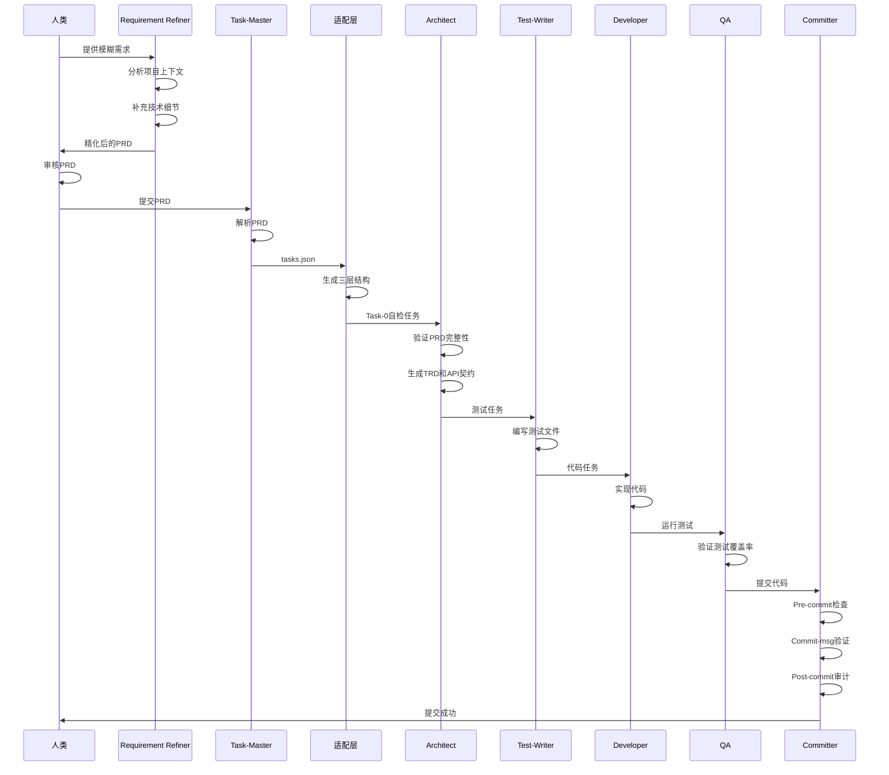
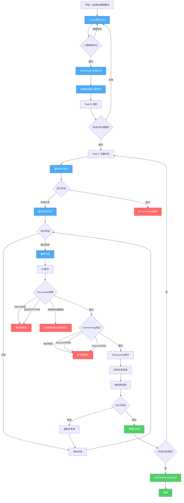

# PART1: 核心架构与哲学

> **版本**: V4.0
> **主题**: 架构设计、目录规范、核心原则、工作流程
> **定位**: 理解整个工作流的设计理念与架构全貌

---

## 目录

- [1. 核心设计哲学](#1-核心设计哲学)
- [2. 架构分层设计](#2-架构分层设计)
- [3. 目录结构规范](#3-目录结构规范)
- [4. AI角色分工体系](#4-ai角色分工体系)
- [5. 核心工作流程](#5-核心工作流程)
- [6. 追溯链设计](#6-追溯链设计)

---

## 1. 核心设计哲学

### 1.1 需求第一原则 (Requirement First)

**核心信念**: 所有开发活动必须从明确的需求出发，所有代码变更必须可追溯到原始需求。

#### 为什么需要"需求第一"？

在AI驱动开发中，常见的问题包括：

1. **失控修改**: AI在修复Bug时，随意删除或简化已实现的功能
2. **文档失联**: 代码与文档脱节，无法追溯为什么这样实现
3. **需求飘移**: 需求不断口头变更，没有文档记录
4. **测试缺失**: 先写代码后补测试，或者根本不写测试

**解决方案**: 建立一个严格的约束体系：

```
需求(PRD) → 任务(Task-Master) → 测试(TDD) → 代码(Implementation) → 验证(CI/CD)
     ↑                                                                    ↓
     └────────────────────── 追溯链 ──────────────────────────────────┘
```

#### 核心约束

| 约束            | 规则                            | 执行层                   |
| --------------- | ------------------------------- | ------------------------ |
| **PRD先行**     | 没有PRD不能写代码               | Pre-commit Hook          |
| **测试先行**    | 没有测试文件不能提交代码        | Pre-commit Hook          |
| **任务先行**    | 没有Task-Master任务不能开始实现 | Cursor规则 + Pre-commit  |
| **修改PRD先行** | 删除/简化功能必须先修改PRD      | Pre-commit + Post-commit |
| **不可绕过**    | 禁止`--no-verify`绕过检查       | Git wrapper + CI/CD      |

### 1.2 Task-Master作为任务管家

**身份定位**:

- **Task-Master**: 任务管家，负责生成任务、监督进度、验证完成度
- **Cursor**: 执行工人，负责精化PRD、写代码、写测试、提交代码

**工作流**:

```
人类: 编写模糊需求 (Fuzzy Requirement)
  ↓
Cursor: 精化PRD (补充技术细节、测试用例、数据库设计)
  ↓
Task-Master parse-prd: 解析精化后的PRD，生成主任务列表
  ↓
Task-Master analyze-complexity: AI分析任务复杂度
  ↓
Task-Master expand: AI自动展开任务为子任务
  ↓
适配层: 为子任务添加文件关联，创建三层目录结构
  ↓
Cursor: 执行任务，从Task-0(自检)开始
  ↓
Task-Master: 监督任务状态，验证完成度
```

**为什么不能直接让Task-Master解析人类的模糊需求？**

1. **上下文缺失**: Task-Master是独立的CLI工具,无法感知项目架构、现有代码、依赖关系
2. **精化能力**: Cursor在项目上下文中，可以补充技术细节、推断测试用例、设计数据库
3. **迭代优化**: Cursor可以根据项目历史需求，优化PRD结构

**Cursor精化PRD的职责**:

- 补充数据库表设计（字段、索引、关系）
- 补充Redis缓存策略
- 补充API接口定义（OpenAPI格式）
- 补充测试用例（单元、集成、E2E）
- 补充前端UI/UX细节（组件、样式、交互）
- 推断需要哪些测试文件（路径、类型）
- 推断需要哪些代码文件（路径）

### 1.3 测试驱动开发 (TDD)

**强制执行TDD**:

1. **PRD阶段**: PRD必须包含测试用例清单
2. **任务阶段**: Task-Master生成的任务中，测试任务先于代码任务
3. **提交阶段**: Pre-commit检查测试文件是否存在
4. **CI阶段**: 运行所有测试，强制最低覆盖率

**四层测试体系**:

```
backend/tests/
├── unit/           # 单元测试（函数、类、模块级别）
├── integration/    # 集成测试（多模块、数据库交互）
├── regression/     # 回归测试（防止Bug复现）
└── fixtures/       # 测试数据

e2e/tests/          # E2E测试（完整用户流程）
├── smoke/          # 冒烟测试（核心功能快速验证）
├── regression/     # 回归测试（防止UI/功能回退）
└── performance/    # 性能测试（响应时间、并发）
```

### 1.4 可追溯性 (Traceability)

**追溯链**:

```
REQ-ID → Task-ID → Test-File → Code-File → Commit → Deployment
```

**追溯矩阵示例**:
| REQ-ID | Task-ID | Test-File | Code-File | Commit | Status |
|--------|---------|-----------|-----------|--------|--------|
| REQ-2025-001 | task-1 | test_user_login.py | views.py:login_view | abc123 | ✅ Deployed |
| REQ-2025-001 | task-2 | test-login.spec.ts | LoginView.vue | def456 | ✅ Deployed |

**实现方式**:

1. **PRD元数据**: 在PRD头部记录所有关联文件
2. **Commit消息**: 强制格式 `[REQ-ID] Task-X 描述`
3. **Git钩子**: 自动提取关联关系，更新追溯矩阵
4. **CI/CD**: 自动验证追溯链完整性

---

## 2. 架构分层设计

### 2.1 五层架构

```
┌─────────────────────────────────────────────────────────┐
│              1. 需求层 (Requirement Layer)                │
│  - PRD (产品需求文档)                                      │
│  - TRD (技术需求文档)                                      │
│  - API契约 (OpenAPI/Swagger)                             │
└─────────────────────────────────────────────────────────┘
                          ↓
┌─────────────────────────────────────────────────────────┐
│              2. 任务层 (Task Layer)                       │
│  - Task-Master生成任务                                     │
│  - 适配层转换三层结构                                       │
│  - 任务状态同步                                            │
└─────────────────────────────────────────────────────────┘
                          ↓
┌─────────────────────────────────────────────────────────┐
│              3. 测试层 (Test Layer)                       │
│  - 单元测试 (Unit Tests)                                  │
│  - 集成测试 (Integration Tests)                           │
│  - E2E测试 (E2E Tests)                                    │
│  - 回归测试 (Regression Tests)                            │
└─────────────────────────────────────────────────────────┘
                          ↓
┌─────────────────────────────────────────────────────────┐
│              4. 代码层 (Code Layer)                       │
│  - 后端代码 (Backend)                                     │
│  - 前端代码 (Frontend)                                    │
│  - 基础设施代码 (Infrastructure)                           │
└─────────────────────────────────────────────────────────┘
                          ↓
┌─────────────────────────────────────────────────────────┐
│              5. 防护层 (Protection Layer)                 │
│  - Pre-commit Hook (本地拦截)                             │
│  - Commit-msg Hook (消息验证)                             │
│  - Post-commit Hook (提交后审计)                          │
│  - CI/CD Pipeline (云端验证)                              │
│  - 自动回滚机制 (违规撤销)                                 │
└─────────────────────────────────────────────────────────┘
```

### 2.2 层间交互规则

#### 需求层 → 任务层

**输入**: PRD文档（Cursor精化后）
**处理**: Task-Master解析PRD，生成tasks.json
**输出**: 三层结构化任务目录
**验证**:

- PRD必须包含元数据（测试文件、实现文件）
- PRD必须处于`reviewed`或`approved`状态
- Task-Master必须生成Task-0(自检)

#### 任务层 → 测试层

**输入**: Task-Master生成的测试任务
**处理**: Cursor根据任务编写测试文件
**输出**: 四层测试文件（unit/integration/e2e/regression）
**验证**:

- 测试文件必须在指定目录
- 测试文件命名必须符合规范
- 测试用例必须覆盖PRD中的所有测试用例

#### 测试层 → 代码层

**输入**: 已编写的测试文件（红色阶段）
**处理**: Cursor根据测试编写代码（绿色阶段）
**输出**: 后端/前端代码文件
**验证**:

- 代码文件必须关联到PRD
- 代码必须通过所有测试
- 代码必须符合Lint规则

#### 代码层 → 防护层

**输入**: 待提交的代码修改
**处理**: 五道防线逐层验证
**输出**: 通过则提交，失败则拒绝
**验证**:

- Pre-commit: 检查PRD、测试、代码关联
- Commit-msg: 验证提交消息格式
- Post-commit: 审计日志、更新任务状态
- CI/CD: 重新验证所有规则
- 自动回滚: 检测未授权的功能删除

---

## 3. 目录结构规范

### 3.1 完整目录结构

```
Bravo/
├── docs/                           # 文档根目录
│   ├── 00_product/                 # 产品文档
│   │   └── requirements/           # PRD需求文档
│   │       └── {REQ-ID}/           # 单个需求目录
│   │           ├── {REQ-ID}.md     # PRD主文件
│   │           ├── {REQ-ID}-TRD.md # 技术需求文档
│   │           ├── attachments/    # 附件（图片、原型）
│   │           └── history/        # 历史版本
│   ├── 01_guideline/               # 开发指南
│   │   ├── api-contracts/          # API契约（OpenAPI）
│   │   │   └── {REQ-ID}/
│   │   │       └── {REQ-ID}-api.yaml
│   │   ├── coding-standards.md     # 代码规范
│   │   └── testing-guide.md        # 测试指南
│   ├── 02_test_report/             # 测试报告
│   └── architecture/               # 架构文档
│       └── AI-WORKFLOW-V4-*.md     # 本工作流文档
│
├── .taskmaster/                    # Task-Master任务管理
│   ├── config.yaml                 # Task-Master配置
│   └── tasks/                      # 任务目录
│       └── {REQ-ID}/               # 单个需求的任务
│           ├── tasks.json          # Task-Master原始输出
│           ├── task-0-self-check/  # 自检任务（强制）
│           │   ├── task.md         # 任务主文件
│           │   └── subtask-1-validate-prd.md
│           ├── task-1-{slug}/      # 功能任务
│           │   ├── task.md
│           │   ├── subtask-1-{slug}.md
│           │   └── subtask-2-{slug}.md
│           └── task-2-{slug}/
│               └── ...
│
├── backend/                        # 后端代码
│   ├── apps/                       # Django应用
│   │   └── {app_name}/
│   │       ├── models.py
│   │       ├── views.py
│   │       ├── serializers.py
│   │       └── urls.py
│   └── tests/                      # 后端测试
│       ├── unit/                   # 单元测试
│       │   └── test_{module}.py
│       ├── integration/            # 集成测试
│       │   └── test_{feature}.py
│       ├── regression/             # 回归测试
│       │   └── test_{bug_id}.py
│       └── fixtures/               # 测试数据
│
├── frontend/                       # 前端代码
│   └── src/
│       ├── views/                  # 页面视图
│       ├── components/             # 组件
│       └── api/                    # API调用层
│
├── e2e/                            # E2E测试
│   └── tests/
│       ├── smoke/                  # 冒烟测试
│       ├── regression/             # 回归测试
│       └── performance/            # 性能测试
│
├── .compliance/                    # 合规引擎
│   ├── config.yaml                 # 全局配置
│   ├── rules/                      # 规则定义
│   │   ├── prd.yaml                # PRD规则
│   │   ├── test.yaml               # 测试规则
│   │   └── code.yaml               # 代码规则
│   ├── checkers/                   # 检查器插件
│   │   ├── prd_checker.py
│   │   ├── test_checker.py
│   │   └── code_checker.py
│   ├── engine.py                   # 规则引擎核心
│   └── runner.py                   # Pre-commit入口
│
├── scripts/                        # 脚本工具
│   ├── task-master/
│   │   ├── adapter.py              # Task-Master适配层
│   │   └── sync_status.py          # 任务状态同步
│   ├── compliance/
│   │   ├── validate_prd.py         # PRD验证
│   │   ├── check_traceability.py   # 追溯链检查
│   │   └── auto_rollback.py        # 自动回滚
│   └── setup/
│       ├── install_compliance.sh   # 一键安装
│       └── verify_installation.sh  # 安装验证
│
├── .githooks/                      # Git Hooks
│   ├── pre-commit                  # Pre-commit Hook
│   ├── commit-msg                  # Commit-msg Hook
│   └── post-commit                 # Post-commit Hook
│
└── .github/                        # GitHub配置
    └── workflows/                  # CI/CD工作流
        ├── on-pr.yml               # PR验证
        ├── on-push-dev.yml         # Dev分支CI
        └── on-push-main.yml        # Main分支CD
```

### 3.2 目录命名规范

#### REQ-ID命名规范

**格式**: `REQ-{YEAR}-{NUMBER}-{SLUG}`

- `YEAR`: 4位年份（如2025）
- `NUMBER`: 3位递增编号（001, 002, ...）
- `SLUG`: 短横线分隔的描述性名称（小写）

**示例**:

- `REQ-2025-001-user-login`
- `REQ-2025-002-password-reset`
- `REQ-2025-003-profile-edit`

**扩展能力**:

- 支持按年份归档
- 支持按模块前缀（如`REQ-2025-AUTH-001-user-login`）
- 支持按优先级前缀（如`REQ-2025-P1-001-critical-fix`）

#### Task-ID命名规范

**格式**: `task-{NUMBER}-{SLUG}`

- `NUMBER`: Task-Master生成的递增编号（0, 1, 2, ...）
- `SLUG`: 任务描述的短横线分隔名称（小写）

**示例**:

- `task-0-self-check`（强制第一个任务）
- `task-1-implement-backend-api`
- `task-2-implement-frontend-ui`

#### Subtask-ID命名规范

**格式**: `subtask-{NUMBER}-{SLUG}`

- `NUMBER`: 子任务递增编号（1, 2, 3, ...）
- `SLUG`: 子任务描述的短横线分隔名称（小写）

**示例**:

- `subtask-1-create-user-model`
- `subtask-2-implement-login-endpoint`
- `subtask-3-write-unit-tests`

#### 测试文件命名规范

| 测试类型 | 目录                         | 命名格式                 | 示例                          |
| -------- | ---------------------------- | ------------------------ | ----------------------------- |
| 单元测试 | `backend/tests/unit/`        | `test_{module}.py`       | `test_user_login.py`          |
| 集成测试 | `backend/tests/integration/` | `test_{feature}.py`      | `test_user_authentication.py` |
| 回归测试 | `backend/tests/regression/`  | `test_{bug_id}.py`       | `test_issue_123.py`           |
| E2E测试  | `e2e/tests/`                 | `test-{feature}.spec.ts` | `test-user-login.spec.ts`     |

---

## 4. AI角色分工体系

### 4.1 角色定义

在AI驱动开发中，我们定义了7个角色，每个角色有明确的职责边界：

| 角色                    | 职责     | 工具            | 输入        | 输出         |
| ----------------------- | -------- | --------------- | ----------- | ------------ |
| **Task-Master**         | 任务管家 | task-master CLI | 精化后的PRD | tasks.json   |
| **Architect**           | 架构设计 | Cursor          | PRD         | TRD、API契约 |
| **Requirement Refiner** | 需求精化 | Cursor          | 模糊需求    | 精化PRD      |
| **Test-Writer**         | 测试编写 | Cursor          | 测试任务    | 测试文件     |
| **Developer**           | 代码实现 | Cursor          | 代码任务    | 代码文件     |
| **QA**                  | 质量保证 | Cursor          | 测试结果    | 测试报告     |
| **Committer**           | 提交验证 | Git Hooks       | 代码修改    | 合规报告     |

### 4.2 角色协作流程



### 4.3 Cursor角色切换机制

**实现方式**: 在Cursor规则中定义不同角色的System Prompt

**示例** (`.cursorrules`):

```yaml
# Requirement Refiner角色
- name: requirement-refiner
  trigger: "精化需求"
  system_prompt: |
    你是一个需求精化专家，负责将人类的模糊需求转化为结构化的PRD。
    你的职责：
    1. 分析项目现有架构和代码
    2. 补充数据库表设计（字段、索引、外键）
    3. 补充Redis缓存策略
    4. 补充API接口定义（OpenAPI格式）
    5. 补充测试用例（单元、集成、E2E）
    6. 补充前端UI/UX细节
    7. 推断需要的测试文件和代码文件

    你不应该：
    - 直接生成代码
    - 修改现有代码
    - 编写测试

# Test-Writer角色
- name: test-writer
  trigger: "编写测试"
  system_prompt: |
    你是一个测试工程师，负责根据PRD和Task-Master任务编写测试。
    你的职责：
    1. 根据PRD中的测试用例编写测试代码
    2. 确保测试文件在正确的目录（unit/integration/e2e/regression）
    3. 确保测试覆盖所有场景（正常、异常、边界）
    4. 编写清晰的测试断言和错误消息

    你不应该：
    - 直接实现功能代码
    - 跳过测试用例
    - 修改PRD

# Developer角色
- name: developer
  trigger: "实现代码"
  system_prompt: |
    你是一个开发工程师，负责根据测试文件实现功能代码。
    你的职责：
    1. 运行测试，确认测试失败（红色阶段）
    2. 编写最少的代码使测试通过（绿色阶段）
    3. 重构代码提高质量（重构阶段）
    4. 确保代码符合Lint规则

    你不应该：
    - 修改测试文件（除非测试本身有Bug）
    - 删除PRD中定义的功能
    - 跳过测试
```

### 4.4 Task-Master监督机制

**Task-Master的职责**:

1. 解析精化后的PRD，生成任务列表
2. 监督Cursor执行任务的进度
3. 验证任务完成度（通过检查测试、代码、提交）
4. 更新任务状态（pending → in_progress → completed）

**监督流程**:

```bash
# 1. Cursor完成一个子任务后，运行状态同步脚本
python scripts/task-master/sync_status.py \
  --req-id REQ-2025-001-user-login \
  --task-id task-1 \
  --subtask-id subtask-2 \
  --status completed

# 2. 脚本会：
#    - 检查subtask-2关联的测试文件是否存在
#    - 检查测试是否通过
#    - 检查代码是否提交
#    - 更新tasks.json中的状态
#    - 更新PRD元数据中的任务状态

# 3. 如果所有subtasks完成，自动标记task为completed
# 4. 如果所有tasks完成，自动标记PRD为completed状态
```

---

## 5. 核心工作流程

### 5.1 完整开发流程



### 5.2 PRD精化流程详解

**输入**: 人类提供的模糊需求

**示例模糊需求**:

```
实现用户登录功能，支持邮箱和密码登录。
```

**Cursor精化后的PRD**:

````markdown
---
req_id: REQ-2025-001-user-login
title: 用户登录功能
status: draft
created_at: 2025-10-24
updated_at: 2025-10-24
author: human
refined_by: cursor
task_master_task: .taskmaster/tasks/REQ-2025-001-user-login/tasks.json
test_files:
  - backend/tests/unit/test_user_login.py
  - backend/tests/integration/test_user_authentication.py
  - e2e/tests/test-user-login.spec.ts
implementation_files:
  - backend/apps/users/views.py
  - backend/apps/users/serializers.py
  - frontend/src/views/LoginView.vue
  - frontend/src/api/auth.ts
api_contract: docs/01_guideline/api-contracts/REQ-2025-001/REQ-2025-001-api.yaml
---

# REQ-2025-001: 用户登录功能

## 1. 功能概述

实现用户通过邮箱和密码进行登录的功能。

## 2. 用户故事

作为一个用户，我希望能够使用邮箱和密码登录系统，以便访问我的个人信息。

## 3. 验收标准

- [ ] 用户可以输入邮箱和密码
- [ ] 系统验证邮箱格式和密码长度
- [ ] 验证成功后返回JWT Token
- [ ] 验证失败返回明确的错误消息
- [ ] 支持"记住我"功能（7天免登录）

## 4. 数据库设计

### 4.1 用户表 (users)

| 字段          | 类型         | 说明         | 索引    |
| ------------- | ------------ | ------------ | ------- |
| id            | BigInt       | 主键         | PRIMARY |
| email         | VARCHAR(255) | 邮箱         | UNIQUE  |
| password_hash | VARCHAR(255) | 密码哈希     | -       |
| last_login_at | TIMESTAMP    | 最后登录时间 | INDEX   |
| created_at    | TIMESTAMP    | 创建时间     | -       |

### 4.2 登录令牌表 (auth_tokens)

| 字段       | 类型         | 说明      | 索引                |
| ---------- | ------------ | --------- | ------------------- |
| id         | BigInt       | 主键      | PRIMARY             |
| user_id    | BigInt       | 用户ID    | INDEX, FK(users.id) |
| token      | VARCHAR(255) | JWT Token | UNIQUE              |
| expires_at | TIMESTAMP    | 过期时间  | INDEX               |
| created_at | TIMESTAMP    | 创建时间  | -                   |

## 5. Redis缓存策略

### 5.1 登录尝试限流

- **Key**: `login:attempts:{email}`
- **TTL**: 15分钟
- **值**: 尝试次数（最多5次）

### 5.2 Token缓存

- **Key**: `auth:token:{token}`
- **TTL**: 与Token过期时间一致
- **值**: 用户ID

## 6. API接口定义

### 6.1 登录接口

```yaml
POST /api/auth/login
Content-Type: application/json

Request:
{
  "email": "user@example.com",
  "password": "password123",
  "remember_me": true
}

Response (200):
{
  "token": "eyJhbGciOiJIUzI1NiIsInR5cCI6IkpXVCJ9...",
  "user": {
    "id": 1,
    "email": "user@example.com",
    "last_login_at": "2025-10-24T10:00:00Z"
  }
}

Response (401):
{
  "error": "Invalid email or password"
}

Response (429):
{
  "error": "Too many login attempts. Please try again in 15 minutes."
}
```
````

## 7. 测试用例

### 7.1 单元测试 (backend/tests/unit/test_user_login.py)

- `test_validate_email_format`: 验证邮箱格式
- `test_validate_password_length`: 验证密码长度
- `test_hash_password`: 验证密码哈希
- `test_generate_jwt_token`: 验证JWT Token生成

### 7.2 集成测试 (backend/tests/integration/test_user_authentication.py)

- `test_login_success`: 正常登录流程
- `test_login_invalid_email`: 邮箱不存在
- `test_login_wrong_password`: 密码错误
- `test_login_rate_limit`: 登录限流

### 7.3 E2E测试 (e2e/tests/test-user-login.spec.ts)

- `test_user_can_login_with_valid_credentials`: 用户可以使用有效凭证登录
- `test_user_sees_error_with_invalid_credentials`: 用户看到无效凭证错误
- `test_user_stays_logged_in_with_remember_me`: 用户勾选"记住我"后保持登录

## 8. 前端UI/UX细节

### 8.1 组件结构

- `LoginView.vue`: 登录页面
  - `LoginForm.vue`: 登录表单组件
    - `EmailInput.vue`: 邮箱输入框
    - `PasswordInput.vue`: 密码输入框
    - `RememberMeCheckbox.vue`: 记住我复选框
    - `SubmitButton.vue`: 提交按钮

### 8.2 表单验证

- 邮箱: 实时验证格式（使用正则表达式）
- 密码: 最少8位，失焦时验证
- 提交: 所有字段验证通过后才能提交

### 8.3 错误提示

- 邮箱格式错误: "请输入有效的邮箱地址"
- 密码长度不足: "密码至少8位"
- 登录失败: "邮箱或密码错误"
- 登录限流: "登录尝试过多，请15分钟后再试"

### 8.4 加载状态

- 提交按钮显示Loading动画
- 禁用表单输入，防止重复提交

## 9. 安全考虑

- 密码使用bcrypt哈希，cost factor为12
- JWT Token有效期为1小时（remember_me为7天）
- 登录限流：15分钟内最多5次尝试
- HTTPS强制

## 10. 依赖项

- Django REST Framework (后端)
- PyJWT (JWT Token生成)
- Redis (限流和缓存)
- Vue 3 + Composition API (前端)
- Axios (HTTP客户端)

## 11. 里程碑

- [ ] PRD审核通过
- [ ] TRD和API契约生成
- [ ] Task-Master生成任务
- [ ] 后端实现和测试
- [ ] 前端实现和测试
- [ ] E2E测试通过
- [ ] 部署到Dev环境

````

**精化要点**:
1. ✅ 补充了完整的数据库表设计
2. ✅ 补充了Redis缓存策略
3. ✅ 补充了详细的API接口定义
4. ✅ 补充了三层测试用例
5. ✅ 补充了前端UI/UX细节
6. ✅ 推断了测试文件路径
7. ✅ 推断了实现文件路径
8. ✅ 补充了安全考虑和依赖项

### 5.3 Task-Master任务生成流程

**输入**: 精化后的PRD

**命令**:
```bash
task-master -r docs/00_product/requirements/REQ-2025-001-user-login/REQ-2025-001-user-login.md
````

**输出**: `.taskmaster/tasks/REQ-2025-001-user-login/tasks.json`

```json
{
  "req_id": "REQ-2025-001-user-login",
  "tasks": [
    {
      "id": 1,
      "title": "Implement backend authentication API",
      "description": "Create Django views, serializers, and tests for user login",
      "status": "pending",
      "dependencies": [],
      "estimated_time": "4 hours"
    },
    {
      "id": 2,
      "title": "Implement frontend login UI",
      "description": "Create Vue components and E2E tests for login page",
      "status": "pending",
      "dependencies": [1],
      "estimated_time": "3 hours"
    },
    {
      "id": 3,
      "title": "Integrate Redis rate limiting",
      "description": "Add Redis-based rate limiting for login attempts",
      "status": "pending",
      "dependencies": [1],
      "estimated_time": "2 hours"
    }
  ]
}
```

### 5.4 适配层转换流程

**输入**: tasks.json

**命令**:

```bash
python scripts/task-master/adapter.py REQ-2025-001-user-login
```

**处理**:

1. 读取`tasks.json`
2. 生成`Task-0: 自检任务`
3. 为每个任务生成子任务
4. 创建三层目录结构
5. 生成任务和子任务的Markdown文件

**输出**: 三层结构化目录

```
.taskmaster/tasks/REQ-2025-001-user-login/
├── tasks.json (更新后)
├── task-0-self-check/
│   ├── task.md
│   ├── subtask-1-validate-prd-metadata.md
│   ├── subtask-2-check-test-directories.md
│   └── subtask-3-verify-api-contract.md
├── task-1-implement-backend-api/
│   ├── task.md
│   ├── subtask-1-create-user-model.md
│   ├── subtask-2-implement-login-view.md
│   ├── subtask-3-create-serializer.md
│   ├── subtask-4-write-unit-tests.md
│   └── subtask-5-write-integration-tests.md
├── task-2-implement-frontend-ui/
│   ├── task.md
│   ├── subtask-1-create-login-view.md
│   ├── subtask-2-create-form-components.md
│   ├── subtask-3-implement-api-client.md
│   └── subtask-4-write-e2e-tests.md
└── task-3-integrate-redis-rate-limiting/
    ├── task.md
    ├── subtask-1-setup-redis-client.md
    ├── subtask-2-implement-rate-limiter.md
    └── subtask-3-add-rate-limit-tests.md
```

**更新后的tasks.json**:

```json
{
  "req_id": "REQ-2025-001-user-login",
  "tasks": [
    {
      "id": 0,
      "title": "Self-check and validation",
      "description": "Validate PRD completeness and setup",
      "status": "pending",
      "dependencies": [],
      "subtasks": [
        {"id": 1, "title": "Validate PRD metadata", "status": "pending"},
        {"id": 2, "title": "Check test directories", "status": "pending"},
        {"id": 3, "title": "Verify API contract", "status": "pending"}
      ]
    },
    {
      "id": 1,
      "title": "Implement backend authentication API",
      "description": "Create Django views, serializers, and tests for user login",
      "status": "pending",
      "dependencies": [0],
      "subtasks": [
        {"id": 1, "title": "Create user model", "status": "pending"},
        {"id": 2, "title": "Implement login view", "status": "pending"},
        {"id": 3, "title": "Create serializer", "status": "pending"},
        {"id": 4, "title": "Write unit tests", "status": "pending"},
        {"id": 5, "title": "Write integration tests", "status": "pending"}
      ]
    },
    ...
  ]
}
```

---

## 6. 追溯链设计

### 6.1 追溯链组成

```
REQ-ID → Task-ID → Subtask-ID → Test-File → Code-File → Commit-SHA → Deployment
```

### 6.2 追溯矩阵自动生成

**脚本**: `scripts/compliance/check_traceability.py`

**功能**:

1. 扫描所有PRD文件
2. 读取PRD元数据（test_files, implementation_files, task_master_task）
3. 读取tasks.json，获取所有任务和子任务
4. 扫描Git提交历史，提取`[REQ-ID] Task-X`关联
5. 生成追溯矩阵（CSV/JSON）

**示例矩阵**:
| REQ-ID | Task-ID | Subtask-ID | Test-File | Code-File | Commit-SHA | Deployed-At | Status |
|--------|---------|------------|-----------|-----------|------------|-------------|--------|
| REQ-2025-001 | task-1 | subtask-1 | test_user_login.py | models.py | abc123 | 2025-10-24 10:00 | ✅ |
| REQ-2025-001 | task-1 | subtask-2 | test_user_login.py | views.py | def456 | 2025-10-24 11:00 | ✅ |
| REQ-2025-001 | task-2 | subtask-1 | test-login.spec.ts | LoginView.vue | ghi789 | 2025-10-24 12:00 | ✅ |

### 6.3 PRD元数据同步

**触发时机**: Post-commit Hook

**脚本**: `scripts/task-master/sync_status.py`

**逻辑**:

```python
def sync_prd_metadata(req_id, task_id, subtask_id, commit_sha):
    # 1. 读取PRD文件
    prd = read_prd(req_id)

    # 2. 更新元数据
    if 'commits' not in prd.metadata:
        prd.metadata['commits'] = []
    prd.metadata['commits'].append({
        'task_id': task_id,
        'subtask_id': subtask_id,
        'commit_sha': commit_sha,
        'timestamp': datetime.now().isoformat()
    })

    # 3. 更新任务状态
    tasks = read_tasks_json(req_id)
    for task in tasks['tasks']:
        if task['id'] == task_id:
            for subtask in task['subtasks']:
                if subtask['id'] == subtask_id:
                    subtask['status'] = 'completed'
                    subtask['commit_sha'] = commit_sha

    # 4. 写回文件
    write_prd(req_id, prd)
    write_tasks_json(req_id, tasks)
```

---

## 小结

本章节阐述了AI驱动开发工作流的核心架构与设计哲学，包括：

1. **需求第一原则**: 所有开发从PRD出发，所有变更可追溯
2. **五层架构**: 需求层、任务层、测试层、代码层、防护层
3. **目录结构规范**: 清晰的目录组织和命名规范
4. **AI角色分工**: Task-Master管家 + Cursor工人，职责明确
5. **核心工作流**: 从模糊需求到部署的完整流程
6. **追溯链设计**: 自动生成追溯矩阵，确保全链路可追溯

**下一步**: 阅读 [PART2-Task-Master深度集成](./AI-WORKFLOW-V4-PART2-TM-ADAPTER.md) 了解Task-Master的集成细节和适配层实现。
