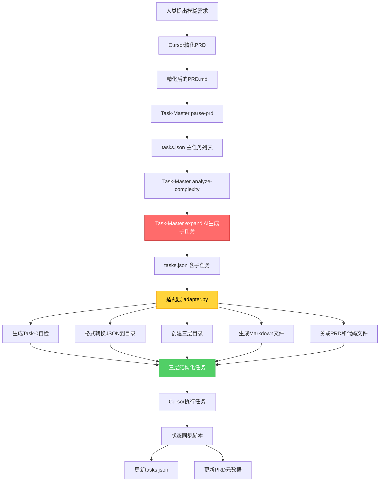
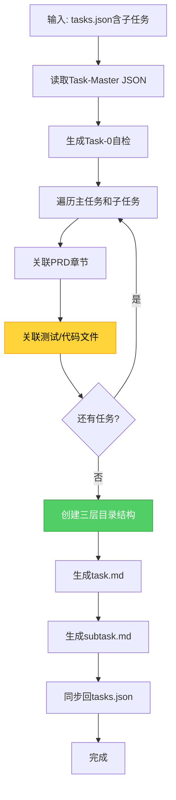
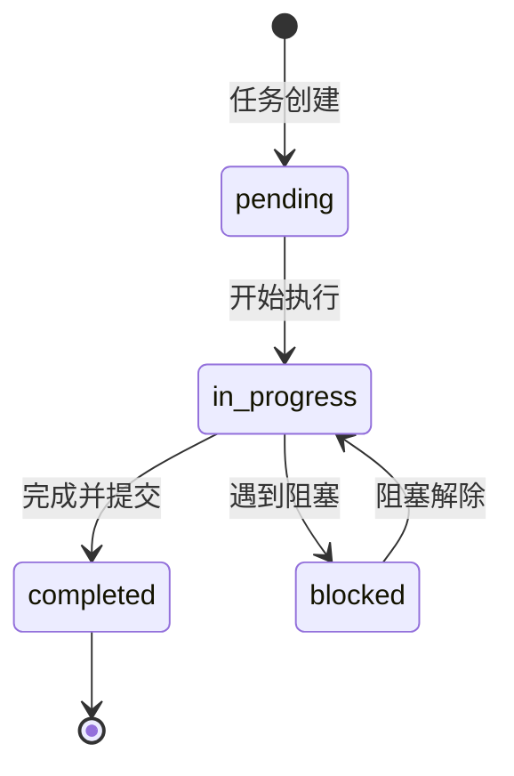

# PART2: Task-Master深度集成

> **版本**: V4.0
> **主题**: Task-Master集成、适配层设计、三层任务管理、状态同步
> **定位**: 理解如何将Task-Master作为任务管家集成到工作流中

---

## 目录

- [1. Task-Master集成架构](#1-task-master集成架构)
- [2. 为什么需要适配层](#2-为什么需要适配层)
- [3. 三层任务管理设计](#3-三层任务管理设计)
- [4. Task-0自检任务](#4-task-0自检任务)
- [5. 适配层实现详解](#5-适配层实现详解)
- [6. 任务状态同步机制](#6-任务状态同步机制)
- [7. 跨电脑协作支持](#7-跨电脑协作支持)

---

## 1. Task-Master集成架构

### 1.1 Task-Master简介

**Task-Master** 是一个AI驱动的任务管理工具，可以从PRD中提取任务并生成结构化的任务列表。

**GitHub**: https://github.com/eyaltoledano/claude-task-master

**核心能力**:

- 解析Markdown格式的PRD
- 提取任务和依赖关系
- 生成JSON格式的任务列表
- **AI驱动的子任务生成**（通过`expand`命令）
- 支持任务状态跟踪
- 复杂度分析和任务展开
- 依赖关系管理

**与项目集成的差距**:

- 输出为JSON结构（`tasks.json`），需要转换为项目目录结构
- 不支持自定义目录组织（需要适配层）
- 不支持生成任务的Markdown文件（需要适配层）
- 不支持直接关联PRD章节和代码文件（需要适配层）

### 1.2 集成架构图



### 1.3 角色定位

| 角色            | 职责                                                                             | 不能做                                                                  |
| --------------- | -------------------------------------------------------------------------------- | ----------------------------------------------------------------------- |
| **人类**        | • 提出模糊需求<br>• 审核精化后的PRD                                              | • 不负责技术细节<br>• 不负责任务分解                                    |
| **Cursor**      | • 精化PRD（补充技术细节）<br>• 执行任务<br>• 编写测试和代码                      | • 不能绕过Task-Master<br>• 不能跳过任务<br>• 不能删除PRD功能            |
| **Task-Master** | • 解析PRD生成主任务<br>• AI生成子任务（expand）<br>• 监督任务进度                | • 不直接执行代码<br>• 不修改PRD                                         |
| **适配层**      | • 格式转换（JSON→目录）<br>• 生成三层结构<br>• 关联PRD和文件<br>• 添加Task-0自检 | • 不生成子任务（由Task-Master完成）<br>• 不修改任务逻辑<br>• 不执行代码 |

---

## 2. 为什么需要适配层

### 2.1 Task-Master原生输出

**Task-Master工作流**:

```bash
# 1. 解析PRD生成主任务
task-master parse-prd --input=PRD.md

# 2. 分析任务复杂度
task-master analyze-complexity --threshold=5

# 3. AI自动展开为子任务
task-master expand --all --research
```

**Task-Master输出** (`tasks.json`):

```json
{
  "req_id": "REQ-2025-001-user-login",
  "tasks": [
    {
      "id": 1,
      "title": "Implement backend authentication API",
      "description": "Create Django views, serializers, and tests for user login",
      "status": "pending",
      "dependencies": [],
      "subtasks": [
        {
          "id": 1,
          "title": "Create database models",
          "description": "Design User model with authentication fields",
          "status": "pending"
        },
        {
          "id": 2,
          "title": "Implement API views",
          "description": "Create login/logout views with DRF",
          "status": "pending"
        }
      ]
    }
  ]
}
```

**与项目需求的差距**:

1. ⚠️ **JSON格式**: 需要转换为项目目录结构
2. ⚠️ **没有Task-0**: 缺少强制性的自检任务
3. ⚠️ **无文件关联**: 不知道需要创建哪些测试文件和代码文件
4. ⚠️ **无目录组织**: tasks.json文件单独存在，需要组织为三层目录
5. ⚠️ **无PRD链接**: 子任务未关联到PRD具体章节
6. ⚠️ **无测试策略**: 子任务未指定对应的测试文件路径

### 2.2 适配层的解决方案

**适配层转换后**:

```
.taskmaster/tasks/REQ-2025-001-user-login/
├── tasks.json (增强版)
├── task-0-self-check/
│   ├── task.md
│   ├── subtask-1-validate-prd-metadata.md
│   ├── subtask-2-check-test-directories.md
│   └── subtask-3-verify-api-contract.md
├── task-1-implement-backend-api/
│   ├── task.md
│   ├── subtask-1-create-database-models.md
│   ├── subtask-2-implement-api-views.md
│   ├── subtask-3-create-serializers.md
│   ├── subtask-4-write-unit-tests.md
│   └── subtask-5-write-integration-tests.md
└── task-2-implement-frontend-ui/
    ├── task.md
    ├── subtask-1-create-vue-components.md
    ├── subtask-2-implement-api-client.md
    └── subtask-3-write-e2e-tests.md
```

**适配层提供的增强**:

1. ✅ **格式转换**: JSON结构 → 项目目录结构
2. ✅ **Task-0注入**: 强制添加自检任务（Task-Master不会生成）
3. ✅ **文件关联**: 为每个子任务关联测试文件和代码文件路径
4. ✅ **目录组织**: 创建清晰的三层目录结构
5. ✅ **PRD链接**: 子任务关联到PRD具体章节
6. ✅ **双向同步**: 文件系统状态 ↔ Task-Master tasks.json

---

## 3. 三层任务管理设计

### 3.1 三层结构

```
第一层: REQ-ID (需求ID)
  └── 第二层: task-{id}-{slug} (任务目录)
      └── 第三层: subtask-{id}-{slug}.md (子任务文件)
```

### 3.2 每一层的职责

#### 第一层: REQ-ID

**职责**: 需求级别的组织

**示例**: `REQ-2025-001-user-login/`

**包含**:

- `tasks.json` (增强版)
- 多个任务目录

**元数据**:

```json
{
  "req_id": "REQ-2025-001-user-login",
  "project": "Bravo",
  "prd_path": "docs/00_product/requirements/REQ-2025-001-user-login/REQ-2025-001-user-login.md",
  "created_at": "2025-10-24T10:00:00Z",
  "updated_at": "2025-10-24T15:00:00Z",
  "tasks": [...]
}
```

#### 第二层: task-{id}-{slug}

**职责**: 任务级别的组织

**示例**: `task-1-implement-backend-api/`

**包含**:

- `task.md` (任务主文件)
- 多个子任务Markdown文件

**task.md结构**:

```markdown
# Implement backend authentication API

**Task ID**: task-1
**Status**: in_progress
**Priority**: high
**Estimated Time**: 4 hours
**Dependencies**: task-0

## Description

Create Django views, serializers, and tests for user login

## Subtasks

- [✅] Create database models ([subtask-1](./subtask-1-create-database-models.md))
- [⏳] Implement API views ([subtask-2](./subtask-2-implement-api-views.md))
- [⬜] Create serializers ([subtask-3](./subtask-3-create-serializers.md))
- [⬜] Write unit tests ([subtask-4](./subtask-4-write-unit-tests.md))
- [⬜] Write integration tests ([subtask-5](./subtask-5-write-integration-tests.md))

## Test Files

- `backend/tests/unit/test_user_login.py`
- `backend/tests/integration/test_user_authentication.py`

## Implementation Files

- `backend/apps/users/models.py`
- `backend/apps/users/views.py`
- `backend/apps/users/serializers.py`

## Notes

- 已完成User模型定义
- 下一步实现login_view
```

#### 第三层: subtask-{id}-{slug}.md

**职责**: 子任务级别的执行指南

**示例**: `subtask-2-implement-api-views.md`

**结构**:

```markdown
# Implement API views/endpoints

**Subtask ID**: subtask-2
**Parent Task**: [Implement backend authentication API](./task.md)
**Status**: in_progress

## Description

Create Django REST Framework views for API endpoints

## Checklist

- [✅] 理解任务需求
- [✅] 编写测试用例（TDD红色阶段）
- [⏳] 实现login_view函数
- [ ] 运行测试并确保通过
- [ ] 代码重构和优化
- [ ] 更新任务状态

## Test Files

- `backend/tests/unit/test_user_login.py`

## Implementation Files

- `backend/apps/users/views.py`

## Notes

**问题**: JWT Token生成逻辑应该放在哪里？
**解决**: 创建utils/jwt.py专门处理Token

**当前进度**: login_view基本框架完成，待实现密码验证逻辑
```

### 3.3 任务编号规则

#### Task-ID编号

- **Task-0**: 强制自检任务（始终是第一个）
- **Task-1, 2, 3...**: 功能任务（从1开始递增）

**依赖关系**:

- 所有任务必须依赖Task-0
- 功能任务之间可以有依赖

**示例**:

```json
{
  "tasks": [
    { "id": 0, "dependencies": [] }, // 自检
    { "id": 1, "dependencies": [0] }, // 后端API（依赖自检）
    { "id": 2, "dependencies": [0, 1] }, // 前端UI（依赖自检和后端）
    { "id": 3, "dependencies": [0, 1] } // Redis限流（依赖自检和后端）
  ]
}
```

#### Subtask-ID编号

- **每个Task内部从1开始递增**
- **编号独立**（不同Task的Subtask可以有相同ID）

**示例**:

```
task-1/
  ├── subtask-1-create-models.md
  ├── subtask-2-implement-views.md
  └── subtask-3-write-tests.md

task-2/
  ├── subtask-1-create-components.md (ID可以重复)
  └── subtask-2-write-e2e-tests.md
```

---

## 4. Task-0自检任务

### 4.1 为什么需要Task-0

**问题场景**:

1. Cursor开始实现功能，发现PRD缺少数据库设计
2. Cursor写测试文件，发现目录不存在
3. Cursor实现API，发现没有OpenAPI契约

**解决方案**: 在所有功能任务之前，强制执行Task-0自检

### 4.2 Task-0职责

```
Task-0: 自检与验证
  ├── Subtask-1: 验证PRD元数据
  ├── Subtask-2: 检查测试目录
  └── Subtask-3: 验证API契约
```

### 4.3 Subtask-1: 验证PRD元数据

**检查项**:

- [ ] PRD文件存在
- [ ] YAML frontmatter完整
- [ ] `test_files`字段非空
- [ ] `implementation_files`字段非空
- [ ] `api_contract`字段存在
- [ ] 所有字段格式正确

**检查脚本**: `scripts/compliance/validate_prd.py`

```bash
python scripts/compliance/validate_prd.py REQ-2025-001-user-login
```

**预期输出**:

```
✅ PRD文件存在: docs/00_product/requirements/REQ-2025-001-user-login/REQ-2025-001-user-login.md
✅ YAML frontmatter解析成功
✅ test_files字段: 3个测试文件
✅ implementation_files字段: 4个实现文件
✅ api_contract字段: docs/01_guideline/api-contracts/REQ-2025-001/REQ-2025-001-api.yaml
✅ 所有字段格式正确

🎉 PRD验证通过！
```

### 4.4 Subtask-2: 检查测试目录

**检查项**:

- [ ] `backend/tests/unit/` 存在
- [ ] `backend/tests/integration/` 存在
- [ ] `backend/tests/regression/` 存在
- [ ] `e2e/tests/` 存在

**检查脚本**: `scripts/compliance/check_test_directories.py`

```bash
python scripts/compliance/check_test_directories.py
```

**预期输出**:

```
✅ backend/tests/unit/ 存在
✅ backend/tests/integration/ 存在
✅ backend/tests/regression/ 存在
✅ e2e/tests/ 存在

🎉 测试目录检查通过！
```

**失败处理**:
如果目录不存在，自动创建：

```bash
mkdir -p backend/tests/{unit,integration,regression,fixtures}
mkdir -p e2e/tests/{smoke,regression,performance}
```

### 4.5 Subtask-3: 验证API契约

**检查项**:

- [ ] API契约文件存在
- [ ] OpenAPI版本为3.0或更高
- [ ] 所有接口定义完整
- [ ] Request/Response Schema定义

**检查脚本**: `scripts/compliance/validate_api_contract.py`

```bash
python scripts/compliance/validate_api_contract.py REQ-2025-001-user-login
```

**预期输出**:

```
✅ API契约文件存在: docs/01_guideline/api-contracts/REQ-2025-001/REQ-2025-001-api.yaml
✅ OpenAPI版本: 3.0.0
✅ 接口定义: 1个POST接口
✅ POST /api/auth/login: Request Schema完整
✅ POST /api/auth/login: Response Schema完整 (200, 401, 429)

🎉 API契约验证通过！
```

---

## 5. 适配层实现详解

### 5.1 适配层工作流程



### 5.2 文件关联逻辑

**核心职责**: 为Task-Master生成的子任务关联具体的测试文件和代码文件路径

**输入**: Task-Master的subtasks（已由AI生成）
**输出**: 增强后的subtasks（包含test_files和implementation_files）

#### 后端文件关联

**触发条件**: 子任务标题包含 `backend`, `api`, `django`, `model`, `view`, `serializer`

**关联规则**:

```python
def link_backend_files(subtask):
    title_lower = subtask['title'].lower()
    app_name = guess_app_name(subtask)  # 从任务描述推断app名称

    if 'model' in title_lower or '数据库' in title_lower:
        subtask['implementation_files'] = [f'backend/apps/{app_name}/models.py']
        subtask['test_files'] = [f'backend/tests/unit/test_{app_name}_model.py']

    elif 'view' in title_lower or 'endpoint' in title_lower:
        subtask['implementation_files'] = [f'backend/apps/{app_name}/views.py']
        subtask['test_files'] = [f'backend/tests/unit/test_{app_name}_views.py']

    elif 'serializer' in title_lower:
        subtask['implementation_files'] = [f'backend/apps/{app_name}/serializers.py']
        subtask['test_files'] = [f'backend/tests/unit/test_{app_name}_serializers.py']

    elif 'test' in title_lower:
        # 测试子任务根据类型关联
        if 'integration' in title_lower:
            subtask['test_files'] = [f'backend/tests/integration/test_{app_name}.py']
        else:
            subtask['test_files'] = [f'backend/tests/unit/test_{app_name}.py']
```

#### 前端文件关联

**触发条件**: 子任务标题包含 `frontend`, `ui`, `vue`, `component`

**关联规则**:

```python
def link_frontend_files(subtask):
    title_lower = subtask['title'].lower()
    feature_name = extract_feature_name(subtask)

    if 'component' in title_lower or 'ui' in title_lower:
        # Vue组件文件
        subtask['implementation_files'] = [
            f'frontend/src/components/{feature_name}.vue',
            f'frontend/src/views/{feature_name}View.vue'
        ]

    elif 'api' in title_lower or 'http' in title_lower:
        # API客户端文件
        subtask['implementation_files'] = [f'frontend/src/api/{feature_name}.ts']

    elif 'test' in title_lower or 'e2e' in title_lower:
        # E2E测试文件
        subtask['test_files'] = [f'e2e/tests/test-{feature_name}.spec.ts']

    else:
        # 默认关联
        subtask['implementation_files'] = [f'frontend/src/views/{feature_name}View.vue']
        subtask['test_files'] = [f'e2e/tests/test-{feature_name}.spec.ts']
```

### 5.3 App名称智能推断

**逻辑**: 从子任务描述和父任务标题中推断Django App名称

```python
def guess_app_name(subtask, parent_task=None):
    """从子任务和父任务中推断App名称"""
    # 合并标题和描述进行分析
    text = f"{subtask['title']} {subtask.get('description', '')}"
    if parent_task:
        text += f" {parent_task['title']}"
    text_lower = text.lower()

    # 常见业务领域映射
    domain_mapping = {
        ('user', 'auth', 'login', 'register'): 'users',
        ('product', 'item', 'catalog'): 'products',
        ('order', 'cart', 'checkout'): 'orders',
        ('payment', 'billing', 'invoice'): 'payments',
        ('notification', 'email', 'sms'): 'notifications',
        ('blog', 'post', 'article'): 'blog',
        ('comment', 'review', 'rating'): 'reviews'
    }

    for keywords, app_name in domain_mapping.items():
        if any(kw in text_lower for kw in keywords):
            return app_name

    # 从PRD提取App名称（优先）
    if parent_task and 'app_name' in parent_task:
        return parent_task['app_name']

    # 默认返回通用名称
    return 'core'
```

**示例**:
| 子任务标题 | 父任务 | 推断App |
|-----------|--------|---------|
| "Create User model" | "Implement authentication" | `users` |
| "Implement login view" | "User login API" | `users` |
| "Product serializer" | "Product catalog API" | `products` |
| "Order validation" | - | `orders` |

### 5.4 PRD章节关联

**逻辑**: 根据PRD的章节结构，将子任务关联到具体章节

```python
def link_prd_section(subtask, prd_content):
    """关联PRD章节到子任务"""
    subtask_keywords = extract_keywords(subtask['title'], subtask['description'])

    # 解析PRD章节
    prd_sections = parse_prd_sections(prd_content)

    # 计算相似度，找到最匹配的章节
    best_match = None
    max_score = 0

    for section in prd_sections:
        score = calculate_similarity(subtask_keywords, section['content'])
        if score > max_score:
            max_score = score
            best_match = section

    if best_match and max_score > 0.5:
        subtask['prd_section'] = {
            'title': best_match['title'],
            'anchor': best_match['anchor'],
            'line_range': best_match['line_range']
        }
```

### 5.5 文件路径标准

**测试文件路径**:
| 测试类型 | 目录 | 命名格式 |
|---------|------|----------|
| 单元测试 | `backend/tests/unit/` | `test_{app}_{module}.py` |
| 集成测试 | `backend/tests/integration/` | `test_{feature}_integration.py` |
| 回归测试 | `backend/tests/regression/` | `test_{bug_id}.py` |
| E2E测试 | `e2e/tests/` | `test-{feature}.spec.ts` |

**代码文件路径**:
| 代码类型 | 目录 | 命名格式 |
|---------|------|----------|
| Django Model | `backend/apps/{app}/` | `models.py` |
| Django View | `backend/apps/{app}/` | `views.py` |
| Django Serializer | `backend/apps/{app}/` | `serializers.py` |
| Vue View | `frontend/src/views/` | `{Name}View.vue` |
| Vue Component | `frontend/src/components/` | `{Name}.vue` |
| API Client | `frontend/src/api/` | `{feature}.ts` |

---

## 6. 任务状态同步机制

### 6.1 状态流转



### 6.2 状态同步时机

| 触发时机         | 脚本                                  | 操作                   |
| ---------------- | ------------------------------------- | ---------------------- |
| 开始子任务       | `sync_status.py --status in_progress` | 标记子任务为进行中     |
| 完成子任务       | `sync_status.py --status completed`   | 标记子任务为完成       |
| Post-commit Hook | 自动调用 `sync_status.py`             | 根据Commit消息更新状态 |
| 所有子任务完成   | 自动检测                              | 标记Task为completed    |
| 所有Task完成     | 自动检测                              | 标记PRD为completed     |

### 6.3 sync_status.py脚本

**命令格式**:

```bash
python scripts/task-master/sync_status.py \
  --req-id REQ-2025-001-user-login \
  --task-id task-1 \
  --subtask-id subtask-2 \
  --status completed \
  --commit-sha abc123def
```

**功能**:

1. 读取`tasks.json`
2. 更新指定子任务的状态
3. 记录Commit SHA
4. 检查是否所有子任务完成，自动更新Task状态
5. 检查是否所有Task完成，自动更新PRD状态
6. 写回`tasks.json`
7. 更新PRD元数据

**增强后的tasks.json**:

```json
{
  "tasks": [
    {
      "id": 1,
      "subtasks": [
        {
          "id": 2,
          "status": "completed",
          "commit_sha": "abc123def",
          "completed_at": "2025-10-24T15:30:00Z"
        }
      ]
    }
  ]
}
```

### 6.4 自动检测完成

**检测逻辑**:

```python
def auto_update_task_status(req_id, task_id):
    tasks = read_tasks_json(req_id)
    task = find_task(tasks, task_id)

    # 检查所有子任务是否完成
    all_completed = all(
        subtask['status'] == 'completed'
        for subtask in task['subtasks']
    )

    if all_completed:
        task['status'] = 'completed'
        task['completed_at'] = datetime.now().isoformat()
        write_tasks_json(req_id, tasks)

        # 检查是否所有任务完成
        if all(t['status'] == 'completed' for t in tasks['tasks']):
            update_prd_status(req_id, 'completed')
```

---

## 7. 跨电脑协作支持

### 7.1 协作场景

**场景1**: A负责后端，B负责前端

- A执行 `task-1-implement-backend-api/`
- B执行 `task-2-implement-frontend-ui/`
- 通过Git同步`.taskmaster/`目录

**场景2**: A完成部分子任务后交接给B

- A完成 `task-1/subtask-1` 和 `subtask-2`
- A提交并推送`.taskmaster/`目录
- B拉取最新代码，继续完成 `subtask-3` 和 `subtask-4`

### 7.2 协作冲突处理

**问题**: 两人同时修改同一个`tasks.json`

**解决方案**:

1. **使用锁文件**: 创建`.taskmaster/tasks/{REQ-ID}/.lock`
2. **原子操作**: 使用文件锁确保同时只有一人更新
3. **冲突检测**: 提交前检查远程版本是否更新

**锁机制**:

```bash
# sync_status.py内置锁机制
python scripts/task-master/sync_status.py \
  --req-id REQ-2025-001-user-login \
  --task-id task-1 \
  --subtask-id subtask-2 \
  --status completed

# 内部流程：
# 1. 尝试获取锁文件（最多重试5次，间隔1秒）
# 2. 获取锁后，读取tasks.json
# 3. 更新状态
# 4. 写回tasks.json
# 5. 释放锁
```

### 7.3 协作最佳实践

1. **频繁同步**: 每完成一个子任务就提交并推送
2. **清晰Commit消息**: `[REQ-ID] Task-X Subtask-Y 完成XXX`
3. **避免并行修改**: 不同人负责不同Task，避免修改同一个`tasks.json`
4. **使用分支**: 每个Task在独立的Feature分支上开发

---

## 小结

本章节详细阐述了Task-Master的深度集成方案，包括：

1. **Task-Master原生能力**: AI驱动的任务生成和子任务展开（`expand`命令）
2. **适配层真实职责**: 格式转换、目录组织、文件关联、PRD链接
3. **三层任务管理**: REQ-ID → Task-ID → Subtask-ID
4. **Task-0自检**: 强制第一个任务验证PRD完整性
5. **文件关联逻辑**: 为Task-Master生成的子任务智能关联测试文件和代码文件
6. **状态双向同步**: Task-Master tasks.json ↔ 项目文件系统
7. **跨电脑协作**: 支持多人协作，锁机制避免冲突

**关键澄清**:

- ✅ Task-Master通过AI自动生成子任务（不是适配层推断）
- ✅ 适配层专注于格式转换和项目集成（不是任务分解）

**完整实现**: 查看 [PART6-实施落地手册](./AI-WORKFLOW-V4-PART6-IMPL.md) 中的完整`adapter.py`代码和Task-Master命令用法

**下一步**: 阅读 [PART3-PRD与TRD标准](./AI-WORKFLOW-V4-PART3-PRD-TRD.md) 了解需求文档的详细规范。
