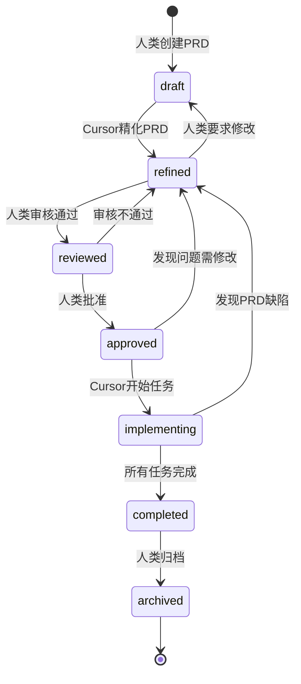
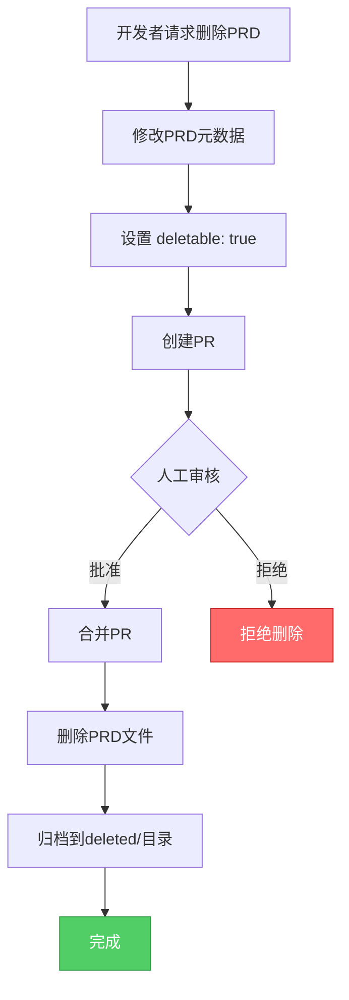

# PART3: PRD与TRD标准

> **版本**: V4.0
> **主题**: PRD/TRD模板、元数据标准、状态机、验证规则
> **定位**: 理解需求文档的详细规范和元数据管理

---

## 目录

- [1. PRD核心规范](#1-prd核心规范)
- [2. TRD核心规范](#2-trd核心规范)
- [3. PRD元数据标准](#3-prd元数据标准)
- [4. PRD状态机](#4-prd状态机)
- [5. API契约标准](#5-api契约标准)
- [6. PRD验证规则](#6-prd验证规则)
- [7. PRD修改策略](#7-prd修改策略)
- [8. PRD删除保护](#8-prd删除保护)

---

## 1. PRD核心规范

### 1.1 PRD模板

**路径**: `docs/00_product/requirements/{REQ-ID}/{REQ-ID}.md`

**完整模板**:

````markdown
---
# ========== 元数据区域（YAML Frontmatter） ==========
req_id: REQ-2025-001-user-login
title: 用户登录功能
version: "1.0"
status: draft # draft | refined | reviewed | approved | implementing | completed | archived
priority: high # low | medium | high | critical
type: feature # feature | enhancement | bugfix | refactor
created_at: 2025-10-24T10:00:00Z
updated_at: 2025-10-24T10:00:00Z
author: human
refined_by: cursor
reviewed_by: []
approved_by: []

# Task-Master任务
task_master_task: .taskmaster/tasks/REQ-2025-001-user-login/tasks.json
task_status:
  total_tasks: 3
  completed_tasks: 0
  in_progress_tasks: 0
  pending_tasks: 3

# 关联文件
test_files:
  - backend/tests/unit/test_user_login.py
  - backend/tests/integration/test_user_authentication.py
  - e2e/tests/test-user-login.spec.ts
implementation_files:
  - backend/apps/users/models.py
  - backend/apps/users/views.py
  - backend/apps/users/serializers.py
  - frontend/src/views/LoginView.vue
  - frontend/src/api/auth.ts
api_contract: docs/01_guideline/api-contracts/REQ-2025-001/REQ-2025-001-api.yaml

# 技术文档
trd: docs/00_product/requirements/REQ-2025-001-user-login/REQ-2025-001-TRD.md

# Git提交关联
commits: []

# 删除标记
deletable: false # PRD默认不可删除
delete_requires_review: true # 删除需要人工审核
---

# REQ-2025-001: 用户登录功能

## 1. 功能概述

用户通过邮箱和密码进行身份验证，成功后获取JWT Token用于后续API请求。

## 2. 业务背景

- **问题**: 当前系统无用户认证机制，任何人都可以访问所有数据
- **目标**: 实现安全的用户登录功能，保护敏感数据
- **预期收益**: 提高系统安全性，支持用户个性化服务

## 3. 用户故事

```gherkin
Feature: 用户登录
  作为一个用户
  我希望能够使用邮箱和密码登录系统
  以便访问我的个人信息

Scenario: 使用有效凭证登录
  Given 我已注册账号 user@example.com
  When 我输入正确的邮箱和密码
  And 我点击登录按钮
  Then 我应该看到登录成功消息
  And 我应该被重定向到首页
  And 我应该获得JWT Token

Scenario: 使用无效密码登录
  Given 我已注册账号 user@example.com
  When 我输入错误的密码
  And 我点击登录按钮
  Then 我应该看到"邮箱或密码错误"消息
  And 我应该停留在登录页面

Scenario: 登录尝试次数限制
  Given 我已注册账号 user@example.com
  When 我连续5次输入错误密码
  Then 我应该看到"登录尝试过多，请15分钟后再试"消息
  And 我的账号应该被临时锁定15分钟
```
````

## 4. 验收标准

### 4.1 功能验收

- [ ] 用户可以输入邮箱和密码
- [ ] 系统验证邮箱格式和密码长度
- [ ] 验证成功后返回JWT Token
- [ ] 验证失败返回明确的错误消息
- [ ] 支持"记住我"功能（7天免登录）
- [ ] 登录限流：15分钟内最多5次尝试

### 4.2 非功能验收

- [ ] 登录响应时间 < 500ms（P95）
- [ ] 并发支持: 100 req/s
- [ ] 密码哈希使用bcrypt，cost factor为12
- [ ] JWT Token有效期为1小时（remember_me为7天）
- [ ] 所有通信必须使用HTTPS

## 5. 数据库设计

### 5.1 用户表 (users)

| 字段           | 类型         | 说明         | 约束                                                  | 索引    |
| -------------- | ------------ | ------------ | ----------------------------------------------------- | ------- |
| id             | BigInt       | 主键         | NOT NULL, AUTO_INCREMENT                              | PRIMARY |
| email          | VARCHAR(255) | 邮箱         | NOT NULL, UNIQUE                                      | UNIQUE  |
| password_hash  | VARCHAR(255) | 密码哈希     | NOT NULL                                              | -       |
| last_login_at  | TIMESTAMP    | 最后登录时间 | NULL                                                  | INDEX   |
| login_attempts | INT          | 登录尝试次数 | DEFAULT 0                                             | -       |
| locked_until   | TIMESTAMP    | 锁定到期时间 | NULL                                                  | INDEX   |
| created_at     | TIMESTAMP    | 创建时间     | DEFAULT CURRENT_TIMESTAMP                             | -       |
| updated_at     | TIMESTAMP    | 更新时间     | DEFAULT CURRENT_TIMESTAMP ON UPDATE CURRENT_TIMESTAMP | -       |

**索引设计**:

```sql
CREATE INDEX idx_email ON users(email);
CREATE INDEX idx_last_login_at ON users(last_login_at);
CREATE INDEX idx_locked_until ON users(locked_until);
```

**迁移文件**: `backend/apps/users/migrations/0001_create_users_table.py`

### 5.2 登录令牌表 (auth_tokens)

| 字段       | 类型         | 说明      | 约束                      | 索引                |
| ---------- | ------------ | --------- | ------------------------- | ------------------- |
| id         | BigInt       | 主键      | NOT NULL, AUTO_INCREMENT  | PRIMARY             |
| user_id    | BigInt       | 用户ID    | NOT NULL                  | INDEX, FK(users.id) |
| token_hash | VARCHAR(255) | Token哈希 | NOT NULL, UNIQUE          | UNIQUE              |
| expires_at | TIMESTAMP    | 过期时间  | NOT NULL                  | INDEX               |
| created_at | TIMESTAMP    | 创建时间  | DEFAULT CURRENT_TIMESTAMP | -                   |

**索引设计**:

```sql
CREATE INDEX idx_user_id ON auth_tokens(user_id);
CREATE INDEX idx_token_hash ON auth_tokens(token_hash);
CREATE INDEX idx_expires_at ON auth_tokens(expires_at);
CREATE INDEX idx_user_expires ON auth_tokens(user_id, expires_at);
```

**迁移文件**: `backend/apps/users/migrations/0002_create_auth_tokens_table.py`

## 6. Redis缓存策略

### 6.1 登录尝试限流

**Key格式**: `login:attempts:{email}`
**数据类型**: String（存储数字）
**TTL**: 15分钟（900秒）
**值范围**: 0-5

**逻辑**:

```python
# 每次登录失败时
redis.incr(f"login:attempts:{email}")
redis.expire(f"login:attempts:{email}", 900)

# 检查是否超过限制
attempts = redis.get(f"login:attempts:{email}")
if attempts and int(attempts) >= 5:
    raise TooManyAttempts("请15分钟后再试")

# 登录成功后清除
redis.delete(f"login:attempts:{email}")
```

### 6.2 Token缓存

**Key格式**: `auth:token:{token_hash}`
**数据类型**: Hash
**TTL**: 与Token过期时间一致
**值**:

```json
{
  "user_id": 123,
  "email": "user@example.com",
  "created_at": "2025-10-24T10:00:00Z"
}
```

**逻辑**:

```python
# Token生成后缓存
redis.hset(f"auth:token:{token_hash}", mapping={
    "user_id": user_id,
    "email": email,
    "created_at": datetime.now().isoformat()
})
redis.expire(f"auth:token:{token_hash}", expires_in_seconds)

# 验证Token时先查Redis
cached = redis.hgetall(f"auth:token:{token_hash}")
if cached:
    return User(id=cached['user_id'], email=cached['email'])
else:
    # Redis未命中，查数据库
    return db.query(AuthToken).filter_by(token_hash=token_hash).first()
```

### 6.3 用户会话缓存

**Key格式**: `session:user:{user_id}`
**数据类型**: Hash
**TTL**: 1小时（3600秒）
**值**:

```json
{
  "email": "user@example.com",
  "last_login_at": "2025-10-24T10:00:00Z",
  "permissions": "['read', 'write']"
}
```

## 7. API接口定义

### 7.1 登录接口

**端点**: `POST /api/auth/login`
**Content-Type**: `application/json`

**Request Body**:

```json
{
  "email": "user@example.com",
  "password": "password123",
  "remember_me": true
}
```

**Request Schema**:

```json
{
  "type": "object",
  "required": ["email", "password"],
  "properties": {
    "email": {
      "type": "string",
      "format": "email",
      "description": "用户邮箱"
    },
    "password": {
      "type": "string",
      "minLength": 8,
      "maxLength": 128,
      "description": "用户密码"
    },
    "remember_me": {
      "type": "boolean",
      "default": false,
      "description": "是否记住登录状态（7天）"
    }
  }
}
```

**Response 200 (成功)**:

```json
{
  "token": "eyJhbGciOiJIUzI1NiIsInR5cCI6IkpXVCJ9...",
  "expires_in": 3600,
  "user": {
    "id": 123,
    "email": "user@example.com",
    "last_login_at": "2025-10-24T10:00:00Z"
  }
}
```

**Response 401 (认证失败)**:

```json
{
  "error": "INVALID_CREDENTIALS",
  "message": "邮箱或密码错误",
  "details": {
    "remaining_attempts": 3
  }
}
```

**Response 429 (限流)**:

```json
{
  "error": "TOO_MANY_ATTEMPTS",
  "message": "登录尝试过多，请15分钟后再试",
  "details": {
    "retry_after": 900
  }
}
```

**Response 422 (验证错误)**:

```json
{
  "error": "VALIDATION_ERROR",
  "message": "请求参数验证失败",
  "details": {
    "email": ["必须是有效的邮箱地址"],
    "password": ["密码长度必须至少8位"]
  }
}
```

### 7.2 退出登录接口

**端点**: `POST /api/auth/logout`
**Authorization**: `Bearer {token}`

**Response 200**:

```json
{
  "message": "成功退出登录"
}
```

### 7.3 Token验证接口

**端点**: `GET /api/auth/verify`
**Authorization**: `Bearer {token}`

**Response 200**:

```json
{
  "valid": true,
  "user": {
    "id": 123,
    "email": "user@example.com"
  }
}
```

**Response 401**:

```json
{
  "valid": false,
  "error": "TOKEN_EXPIRED",
  "message": "Token已过期"
}
```

## 8. 测试用例

### 8.1 单元测试 (backend/tests/unit/test_user_login.py)

```python
# test_validate_email_format
def test_validate_email_format():
    assert validate_email("user@example.com") == True
    assert validate_email("invalid-email") == False

# test_validate_password_length
def test_validate_password_length():
    assert validate_password("12345678") == True
    assert validate_password("1234567") == False

# test_hash_password
def test_hash_password():
    hashed = hash_password("password123")
    assert hashed != "password123"
    assert verify_password("password123", hashed) == True

# test_generate_jwt_token
def test_generate_jwt_token():
    token = generate_jwt_token(user_id=123, expires_in=3600)
    payload = decode_jwt_token(token)
    assert payload['user_id'] == 123
```

### 8.2 集成测试 (backend/tests/integration/test_user_authentication.py)

```python
# test_login_success
def test_login_success(client, test_user):
    response = client.post('/api/auth/login', json={
        'email': 'user@example.com',
        'password': 'password123'
    })
    assert response.status_code == 200
    assert 'token' in response.json()

# test_login_invalid_email
def test_login_invalid_email(client):
    response = client.post('/api/auth/login', json={
        'email': 'nonexistent@example.com',
        'password': 'password123'
    })
    assert response.status_code == 401
    assert response.json()['error'] == 'INVALID_CREDENTIALS'

# test_login_wrong_password
def test_login_wrong_password(client, test_user):
    response = client.post('/api/auth/login', json={
        'email': 'user@example.com',
        'password': 'wrongpassword'
    })
    assert response.status_code == 401

# test_login_rate_limit
def test_login_rate_limit(client, test_user):
    # 连续5次错误登录
    for _ in range(5):
        client.post('/api/auth/login', json={
            'email': 'user@example.com',
            'password': 'wrongpassword'
        })

    # 第6次应该被限流
    response = client.post('/api/auth/login', json={
        'email': 'user@example.com',
        'password': 'wrongpassword'
    })
    assert response.status_code == 429
    assert response.json()['error'] == 'TOO_MANY_ATTEMPTS'
```

### 8.3 E2E测试 (e2e/tests/test-user-login.spec.ts)

```typescript
// test_user_can_login_with_valid_credentials
test("用户可以使用有效凭证登录", async ({ page }) => {
  await page.goto("/login");

  await page.fill('input[name="email"]', "user@example.com");
  await page.fill('input[name="password"]', "password123");
  await page.click('button[type="submit"]');

  await page.waitForURL("/");
  expect(await page.textContent("h1")).toBe("欢迎回来");
});

// test_user_sees_error_with_invalid_credentials
test("用户看到无效凭证错误", async ({ page }) => {
  await page.goto("/login");

  await page.fill('input[name="email"]', "user@example.com");
  await page.fill('input[name="password"]', "wrongpassword");
  await page.click('button[type="submit"]');

  expect(await page.textContent(".error-message")).toBe("邮箱或密码错误");
});

// test_user_stays_logged_in_with_remember_me
test("用户勾选记住我后保持登录", async ({ page, context }) => {
  await page.goto("/login");

  await page.fill('input[name="email"]', "user@example.com");
  await page.fill('input[name="password"]', "password123");
  await page.check('input[name="remember_me"]');
  await page.click('button[type="submit"]');

  // 关闭页面
  await page.close();

  // 打开新页面
  const newPage = await context.newPage();
  await newPage.goto("/");

  // 应该已登录
  expect(await newPage.textContent("h1")).toBe("欢迎回来");
});
```

## 9. 前端UI/UX细节

### 9.1 组件结构

```
LoginView.vue (登录页面)
  ├── LoginForm.vue (登录表单)
  │   ├── EmailInput.vue (邮箱输入框)
  │   ├── PasswordInput.vue (密码输入框)
  │   ├── RememberMeCheckbox.vue (记住我复选框)
  │   └── SubmitButton.vue (提交按钮)
  └── ErrorMessage.vue (错误提示)
```

### 9.2 表单验证

| 字段 | 验证规则     | 触发时机        | 错误消息               |
| ---- | ------------ | --------------- | ---------------------- |
| 邮箱 | 邮箱格式     | 实时（onInput） | "请输入有效的邮箱地址" |
| 密码 | 最少8位      | 失焦（onBlur）  | "密码至少8位"          |
| 提交 | 所有字段通过 | 点击提交        | -                      |

### 9.3 错误提示

| 错误类型     | 提示消息                       | 样式             |
| ------------ | ------------------------------ | ---------------- |
| 邮箱格式错误 | "请输入有效的邮箱地址"         | 红色，输入框下方 |
| 密码长度不足 | "密码至少8位"                  | 红色，输入框下方 |
| 登录失败     | "邮箱或密码错误"               | 红色，表单顶部   |
| 登录限流     | "登录尝试过多，请15分钟后再试" | 橙色，表单顶部   |

### 9.4 加载状态

- **提交按钮**: 显示Loading图标，文字改为"登录中..."
- **表单输入**: 禁用所有输入框，防止重复提交
- **背景**: 显示半透明遮罩层

## 10. 安全考虑

| 威胁      | 防护措施                                                                                   |
| --------- | ------------------------------------------------------------------------------------------ |
| 密码泄露  | • 使用bcrypt哈希，cost factor为12<br>• 数据库中只存储密码哈希，不存储明文                  |
| 暴力破解  | • Redis限流：15分钟内最多5次尝试<br>• 失败次数记录到数据库<br>• 账号临时锁定机制           |
| Token泄露 | • JWT Token有效期为1小时<br>• Token存储在HttpOnly Cookie中，防止XSS攻击<br>• Token刷新机制 |
| MITM攻击  | • 强制HTTPS<br>• HSTS头部<br>• 证书校验                                                    |
| CSRF攻击  | • CSRF Token验证<br>• SameSite Cookie属性                                                  |
| SQL注入   | • 使用ORM（Django ORM）<br>• 参数化查询                                                    |

## 11. 性能优化

| 优化点       | 措施                                    | 预期效果      |
| ------------ | --------------------------------------- | ------------- |
| 登录响应时间 | • Redis缓存Token<br>• 数据库索引优化    | < 500ms (P95) |
| 并发性能     | • 连接池<br>• 异步处理                  | 100 req/s     |
| 密码验证     | • bcrypt cost factor平衡安全与性能      | < 200ms       |
| Token验证    | • Redis缓存用户会话<br>• 减少数据库查询 | < 50ms        |

## 12. 依赖项

| 依赖                  | 版本  | 用途               |
| --------------------- | ----- | ------------------ |
| Django                | 4.2+  | 后端框架           |
| Django REST Framework | 3.14+ | API框架            |
| PyJWT                 | 2.8+  | JWT Token生成/验证 |
| bcrypt                | 4.0+  | 密码哈希           |
| Redis                 | 7.0+  | 限流和缓存         |
| Vue                   | 3.3+  | 前端框架           |
| Axios                 | 1.5+  | HTTP客户端         |

## 13. 里程碑

- [x] PRD编写
- [ ] PRD审核通过
- [ ] TRD生成
- [ ] API契约生成
- [ ] Task-Master生成任务
- [ ] Task-0自检通过
- [ ] 后端实现
- [ ] 前端实现
- [ ] 单元测试通过
- [ ] 集成测试通过
- [ ] E2E测试通过
- [ ] 部署到Dev环境
- [ ] QA验收通过
- [ ] 部署到生产环境

## 14. 备注

### 14.1 开发注意事项

- **密码明文传输**: 虽然密码在后端哈希，但前端到后端的传输必须HTTPS
- **Token刷新**: 考虑实现Refresh Token机制，避免用户频繁登录
- **多设备登录**: 当前设计允许多设备同时登录，如需限制请添加设备管理表

### 14.2 未来扩展

- [ ] 支持OAuth登录（Google、GitHub）
- [ ] 支持双因素认证（2FA）
- [ ] 支持生物识别登录（指纹、FaceID）
- [ ] 支持邮箱/手机验证码登录

````

---

## 2. TRD核心规范

### 2.1 TRD模板

**路径**: `docs/00_product/requirements/{REQ-ID}/{REQ-ID}-TRD.md`

**简化模板**（TRD关注技术实现细节）:

```markdown
---
req_id: REQ-2025-001-user-login
prd: docs/00_product/requirements/REQ-2025-001-user-login/REQ-2025-001-user-login.md
title: 用户登录功能技术设计
version: "1.0"
created_at: 2025-10-24T11:00:00Z
updated_at: 2025-10-24T11:00:00Z
author: cursor
reviewed_by: []
---

# REQ-2025-001-TRD: 用户登录功能技术设计

## 1. 技术栈选择

| 层级 | 技术 | 版本 | 理由 |
|------|------|------|------|
| 后端框架 | Django | 4.2+ | 项目已使用，成熟的ORM和Admin |
| API框架 | Django REST Framework | 3.14+ | RESTful API标准，序列化方便 |
| 认证库 | PyJWT | 2.8+ | JWT Token生成和验证 |
| 密码哈希 | bcrypt | 4.0+ | 业界标准，安全性高 |
| 缓存 | Redis | 7.0+ | 高性能，支持限流和Session |
| 前端框架 | Vue 3 | 3.3+ | 项目已使用，Composition API |
| HTTP客户端 | Axios | 1.5+ | Promise风格，拦截器支持 |

## 2. 架构设计

### 2.1 系统架构图

````

┌─────────────┐ ┌─────────────┐ ┌─────────────┐
│ Browser │────────>│ Nginx │────────>│ Django │
│ (Vue App) │<────────│ (Reverse │<────────│ (Backend) │
└─────────────┘ │ Proxy) │ └─────────────┘
└─────────────┘ │
│
┌─────────────┐ │
│ Redis │<──────────────┘
│ (Cache & │
│ Limiter) │
└─────────────┘
│
┌─────────────┐
│ MySQL │
│ (Database) │
└─────────────┘

````

### 2.2 请求流程

```mermaid
sequenceDiagram
    participant Browser
    participant Nginx
    participant Django
    participant Redis
    participant MySQL

    Browser->>Nginx: POST /api/auth/login
    Nginx->>Django: 转发请求
    Django->>Redis: 检查登录尝试次数
    Redis-->>Django: 尝试次数: 2
    Django->>MySQL: SELECT * FROM users WHERE email=?
    MySQL-->>Django: 用户记录
    Django->>Django: 验证密码（bcrypt）
    Django->>Django: 生成JWT Token
    Django->>Redis: 缓存Token
    Django->>MySQL: UPDATE users SET last_login_at=?
    Django-->>Nginx: 返回Token
    Nginx-->>Browser: 返回Token
````

## 3. 数据库迁移

### 3.1 迁移文件

**文件**: `backend/apps/users/migrations/0001_create_users_table.py`

```python
from django.db import migrations, models

class Migration(migrations.Migration):
    initial = True
    dependencies = []

    operations = [
        migrations.CreateModel(
            name='User',
            fields=[
                ('id', models.BigAutoField(primary_key=True)),
                ('email', models.EmailField(unique=True, max_length=255)),
                ('password_hash', models.CharField(max_length=255)),
                ('last_login_at', models.DateTimeField(null=True, db_index=True)),
                ('login_attempts', models.IntegerField(default=0)),
                ('locked_until', models.DateTimeField(null=True, db_index=True)),
                ('created_at', models.DateTimeField(auto_now_add=True)),
                ('updated_at', models.DateTimeField(auto_now=True)),
            ],
            options={
                'db_table': 'users',
            },
        ),
    ]
```

**文件**: `backend/apps/users/migrations/0002_create_auth_tokens_table.py`

```python
from django.db import migrations, models

class Migration(migrations.Migration):
    dependencies = [
        ('users', '0001_create_users_table'),
    ]

    operations=[
        migrations.CreateModel(
            name='AuthToken',
            fields=[
                ('id', models.BigAutoField(primary_key=True)),
                ('user', models.ForeignKey(on_delete=models.CASCADE, to='users.user')),
                ('token_hash', models.CharField(unique=True, max_length=255)),
                ('expires_at', models.DateTimeField(db_index=True)),
                ('created_at', models.DateTimeField(auto_now_add=True)),
            ],
            options={
                'db_table': 'auth_tokens',
            },
        ),
        migrations.AddIndex(
            model_name='authtoken',
            index=models.Index(fields=['user', 'expires_at'], name='idx_user_expires'),
        ),
    ]
```

### 3.2 回滚计划

```bash
# 回滚到迁移前
python manage.py migrate users zero

# 回滚单个迁移
python manage.py migrate users 0001
```

## 4. Redis Key设计

### 4.1 Key命名规范

**格式**: `{namespace}:{resource}:{identifier}`

**示例**:

- `login:attempts:user@example.com`
- `auth:token:abc123def`
- `session:user:123`

### 4.2 Key过期策略

| Key模式            | TTL           | 过期策略               |
| ------------------ | ------------- | ---------------------- |
| `login:attempts:*` | 900秒(15分钟) | 被动过期（访问时检查） |
| `auth:token:*`     | 3600秒(1小时) | 主动过期（定时清理）   |
| `session:user:*`   | 3600秒(1小时) | LRU淘汰                |

### 4.3 内存优化

- **预估内存**: 100万用户，每个Session 1KB，总计约1GB
- **淘汰策略**: `maxmemory-policy allkeys-lru`
- **持久化**: AOF + RDB混合持久化

## 5. API实现细节

### 5.1 Django View

**文件**: `backend/apps/users/views.py`

```python
from rest_framework.views import APIView
from rest_framework.response import Response
from rest_framework import status
from .serializers import LoginSerializer
from .services import AuthService

class LoginView(APIView):
    def post(self, request):
        serializer = LoginSerializer(data=request.data)
        if not serializer.is_valid():
            return Response(serializer.errors, status=status.HTTP_422_UNPROCESSABLE_ENTITY)

        email = serializer.validated_data['email']
        password = serializer.validated_data['password']
        remember_me = serializer.validated_data.get('remember_me', False)

        auth_service = AuthService()
        try:
            result = auth_service.login(email, password, remember_me)
            return Response(result, status=status.HTTP_200_OK)
        except TooManyAttempts as e:
            return Response({'error': 'TOO_MANY_ATTEMPTS', 'message': str(e)}, status=status.HTTP_429_TOO_MANY_REQUESTS)
        except InvalidCredentials as e:
            return Response({'error': 'INVALID_CREDENTIALS', 'message': str(e)}, status=status.HTTP_401_UNAUTHORIZED)
```

### 5.2 Service层

**文件**: `backend/apps/users/services.py`

```python
class AuthService:
    def login(self, email, password, remember_me=False):
        # 1. 检查限流
        self._check_rate_limit(email)

        # 2. 查询用户
        user = User.objects.filter(email=email).first()
        if not user:
            self._increment_attempts(email)
            raise InvalidCredentials("邮箱或密码错误")

        # 3. 验证密码
        if not bcrypt.checkpw(password.encode(), user.password_hash.encode()):
            self._increment_attempts(email)
            raise InvalidCredentials("邮箱或密码错误")

        # 4. 生成Token
        expires_in = 7 * 24 * 3600 if remember_me else 3600
        token = self._generate_token(user.id, expires_in)

        # 5. 缓存Token
        self._cache_token(token, user.id, expires_in)

        # 6. 清除限流记录
        self._clear_attempts(email)

        # 7. 更新最后登录时间
        user.last_login_at = timezone.now()
        user.save(update_fields=['last_login_at'])

        return {
            'token': token,
            'expires_in': expires_in,
            'user': {
                'id': user.id,
                'email': user.email,
                'last_login_at': user.last_login_at.isoformat()
            }
        }

    def _check_rate_limit(self, email):
        key = f"login:attempts:{email}"
        attempts = redis_client.get(key)
        if attempts and int(attempts) >= 5:
            raise TooManyAttempts("登录尝试过多，请15分钟后再试")
```

## 6. 前端实现细节

### 6.1 API Client

**文件**: `frontend/src/api/auth.ts`

```typescript
import axios from "axios";

export interface LoginRequest {
  email: string;
  password: string;
  remember_me?: boolean;
}

export interface LoginResponse {
  token: string;
  expires_in: number;
  user: {
    id: number;
    email: string;
    last_login_at: string;
  };
}

export const login = async (data: LoginRequest): Promise<LoginResponse> => {
  const response = await axios.post<LoginResponse>("/api/auth/login", data);
  return response.data;
};
```

### 6.2 Vue Component

**文件**: `frontend/src/views/LoginView.vue`

```vue
<script setup lang="ts">
import { ref } from "vue";
import { useRouter } from "vue-router";
import { login } from "@/api/auth";

const router = useRouter();
const email = ref("");
const password = ref("");
const rememberMe = ref(false);
const loading = ref(false);
const errorMessage = ref("");

const handleSubmit = async () => {
  loading.value = true;
  errorMessage.value = "";

  try {
    const result = await login({
      email: email.value,
      password: password.value,
      remember_me: rememberMe.value,
    });

    // 保存Token到LocalStorage
    localStorage.setItem("auth_token", result.token);

    // 跳转到首页
    router.push("/");
  } catch (error: any) {
    if (error.response?.status === 401) {
      errorMessage.value = "邮箱或密码错误";
    } else if (error.response?.status === 429) {
      errorMessage.value = "登录尝试过多，请15分钟后再试";
    } else {
      errorMessage.value = "登录失败，请稍后再试";
    }
  } finally {
    loading.value = false;
  }
};
</script>

<template>
  <div class="login-view">
    <form @submit.prevent="handleSubmit">
      <input v-model="email" type="email" placeholder="邮箱" required />
      <input v-model="password" type="password" placeholder="密码" required />
      <label>
        <input v-model="rememberMe" type="checkbox" />
        记住我（7天）
      </label>
      <button type="submit" :disabled="loading">
        {{ loading ? "登录中..." : "登录" }}
      </button>
      <p v-if="errorMessage" class="error">{{ errorMessage }}</p>
    </form>
  </div>
</template>
```

## 7. 性能测试

### 7.1 基准测试

**工具**: Locust

**测试脚本**: `tests/performance/test_login_performance.py`

```python
from locust import HttpUser, task, between

class LoginUser(HttpUser):
    wait_time = between(1, 3)

    @task
    def login(self):
        self.client.post("/api/auth/login", json={
            "email": "user@example.com",
            "password": "password123"
        })
```

**测试目标**:

- 并发用户: 100
- 响应时间: P95 < 500ms
- 错误率: < 1%

### 7.2 负载测试

**场景**: 模拟1000个并发用户登录

**命令**:

```bash
locust -f tests/performance/test_login_performance.py \
  --host=http://localhost:8000 \
  --users=1000 \
  --spawn-rate=10 \
  --run-time=5m
```

## 8. 监控与告警

### 8.1 监控指标

| 指标              | 阈值    | 告警级别 |
| ----------------- | ------- | -------- |
| 登录成功率        | < 95%   | Warning  |
| 登录响应时间(P95) | > 500ms | Warning  |
| 登录限流触发率    | > 10%   | Info     |
| Redis连接失败率   | > 1%    | Critical |
| 数据库慢查询      | > 100ms | Warning  |

### 8.2 日志记录

**格式**: JSON

**示例**:

```json
{
  "timestamp": "2025-10-24T10:00:00Z",
  "level": "INFO",
  "event": "login_success",
  "user_id": 123,
  "email": "user@example.com",
  "ip": "192.168.1.1",
  "user_agent": "Mozilla/5.0..."
}
```

## 9. 部署清单

- [ ] 数据库迁移执行
- [ ] Redis配置部署
- [ ] 环境变量配置（JWT_SECRET, REDIS_URL）
- [ ] Nginx配置更新
- [ ] SSL证书安装
- [ ] 监控告警配置
- [ ] 性能测试通过
- [ ] 安全扫描通过

````

---

## 3. PRD元数据标准

### 3.1 元数据字段定义

| 字段 | 类型 | 必填 | 说明 | 示例 |
|------|------|------|------|------|
| `req_id` | string | ✅ | 需求唯一标识符 | `REQ-2025-001-user-login` |
| `title` | string | ✅ | 需求标题 | `用户登录功能` |
| `version` | string | ✅ | PRD版本号 | `1.0`, `1.1` |
| `status` | enum | ✅ | PRD状态 | `draft`, `approved`, `completed` |
| `priority` | enum | ✅ | 优先级 | `low`, `medium`, `high`, `critical` |
| `type` | enum | ✅ | 需求类型 | `feature`, `bugfix`, `refactor` |
| `created_at` | datetime | ✅ | 创建时间 | `2025-10-24T10:00:00Z` |
| `updated_at` | datetime | ✅ | 更新时间 | `2025-10-24T15:00:00Z` |
| `author` | string | ✅ | 作者 | `human`, `cursor` |
| `refined_by` | string | ❌ | 精化者 | `cursor` |
| `reviewed_by` | array | ❌ | 审核者列表 | `["张三", "李四"]` |
| `approved_by` | array | ❌ | 批准者列表 | `["王五"]` |
| `task_master_task` | string | ✅ | Task-Master任务文件 | `.taskmaster/tasks/REQ-2025-001/tasks.json` |
| `task_status` | object | ✅ | 任务状态统计 | `{"total_tasks": 3, "completed_tasks": 1}` |
| `test_files` | array | ✅ | 测试文件列表 | `["backend/tests/unit/test_login.py"]` |
| `implementation_files` | array | ✅ | 实现文件列表 | `["backend/apps/users/views.py"]` |
| `api_contract` | string | ✅ | API契约文件 | `docs/01_guideline/api-contracts/REQ-2025-001/api.yaml` |
| `trd` | string | ❌ | TRD文件路径 | `docs/00_product/requirements/REQ-2025-001/TRD.md` |
| `commits` | array | ❌ | 关联Git提交 | `[{"sha": "abc123", "task_id": "task-1"}]` |
| `deletable` | boolean | ✅ | 是否可删除 | `false` |
| `delete_requires_review` | boolean | ✅ | 删除是否需要审核 | `true` |

### 3.2 元数据验证规则

**验证脚本**: `scripts/compliance/validate_prd.py`

```python
def validate_prd_metadata(prd_path):
    # 1. 读取PRD文件
    with open(prd_path, 'r', encoding='utf-8') as f:
        content = f.read()

    # 2. 解析YAML frontmatter
    if not content.startswith('---'):
        raise ValidationError("PRD必须包含YAML frontmatter")

    parts = content.split('---', 2)
    if len(parts) < 3:
        raise ValidationError("YAML frontmatter格式错误")

    metadata = yaml.safe_load(parts[1])

    # 3. 验证必填字段
    required_fields = ['req_id', 'title', 'version', 'status', 'priority', 'type',
                       'created_at', 'updated_at', 'author', 'task_master_task',
                       'task_status', 'test_files', 'implementation_files', 'api_contract',
                       'deletable', 'delete_requires_review']

    for field in required_fields:
        if field not in metadata:
            raise ValidationError(f"缺少必填字段: {field}")

    # 4. 验证字段格式
    if not re.match(r'^REQ-\d{4}-\d{3}-.+$', metadata['req_id']):
        raise ValidationError("req_id格式错误，应为 REQ-YYYY-NNN-slug")

    if metadata['status'] not in ['draft', 'refined', 'reviewed', 'approved', 'implementing', 'completed', 'archived']:
        raise ValidationError(f"status值无效: {metadata['status']}")

    if metadata['priority'] not in ['low', 'medium', 'high', 'critical']:
        raise ValidationError(f"priority值无效: {metadata['priority']}")

    if metadata['type'] not in ['feature', 'enhancement', 'bugfix', 'refactor']:
        raise ValidationError(f"type值无效: {metadata['type']}")

    # 5. 验证测试文件和实现文件是否为数组
    if not isinstance(metadata['test_files'], list):
        raise ValidationError("test_files必须是数组")

    if not isinstance(metadata['implementation_files'], list):
        raise ValidationError("implementation_files必须是数组")

    # 6. 验证task_status结构
    task_status = metadata['task_status']
    if not all(k in task_status for k in ['total_tasks', 'completed_tasks', 'in_progress_tasks', 'pending_tasks']):
        raise ValidationError("task_status字段不完整")

    # 7. 验证deletable和delete_requires_review为布尔值
    if not isinstance(metadata['deletable'], bool):
        raise ValidationError("deletable必须是布尔值")

    if not isinstance(metadata['delete_requires_review'], bool):
        raise ValidationError("delete_requires_review必须是布尔值")

    print("✅ PRD元数据验证通过")
    return metadata
````

---

## 4. PRD状态机

### 4.1 状态定义

| 状态           | 说明     | 可进入该状态的角色         |
| -------------- | -------- | -------------------------- |
| `draft`        | 草稿     | 人类、Cursor               |
| `refined`      | 精化完成 | Cursor                     |
| `reviewed`     | 审核通过 | 人类                       |
| `approved`     | 批准     | 人类                       |
| `implementing` | 实施中   | Cursor（开始任务时自动）   |
| `completed`    | 完成     | 系统（所有任务完成时自动） |
| `archived`     | 归档     | 人类                       |

### 4.2 状态流转图



### 4.3 状态转换规则

| 当前状态       | 允许转换到     | 触发条件             | 执行者         |
| -------------- | -------------- | -------------------- | -------------- |
| `draft`        | `refined`      | Cursor完成PRD精化    | Cursor         |
| `refined`      | `reviewed`     | 人类审核通过         | 人类           |
| `refined`      | `draft`        | 人类要求修改         | 人类           |
| `reviewed`     | `approved`     | 人类批准             | 人类           |
| `reviewed`     | `refined`      | 审核不通过           | 人类           |
| `approved`     | `implementing` | Cursor开始第一个任务 | Cursor（自动） |
| `approved`     | `refined`      | 发现PRD问题          | 人类           |
| `implementing` | `completed`    | 所有Task完成         | 系统（自动）   |
| `implementing` | `refined`      | 发现PRD缺陷          | Cursor         |
| `completed`    | `archived`     | 需求归档             | 人类           |

### 4.4 状态转换脚本

**脚本**: `scripts/compliance/update_prd_status.py`

```bash
# 人类审核通过
python scripts/compliance/update_prd_status.py \
  --req-id REQ-2025-001-user-login \
  --status reviewed \
  --reviewer "张三"

# Cursor开始任务，自动更新为implementing
# （在sync_status.py中自动调用）
python scripts/compliance/update_prd_status.py \
  --req-id REQ-2025-001-user-login \
  --status implementing \
  --auto

# 所有任务完成，自动更新为completed
# （在sync_status.py中检测到所有任务完成时自动调用）
python scripts/compliance/update_prd_status.py \
  --req-id REQ-2025-001-user-login \
  --status completed \
  --auto
```

---

## 5. API契约标准

### 5.1 OpenAPI 3.0规范

**路径**: `docs/01_guideline/api-contracts/{REQ-ID}/{REQ-ID}-api.yaml`

**完整示例**:

```yaml
openapi: 3.0.0
info:
  title: 用户登录API
  version: 1.0.0
  description: REQ-2025-001 用户登录功能的API契约
  contact:
    name: Bravo Team
    email: team@bravo.com

servers:
  - url: http://localhost:8000
    description: 本地开发环境
  - url: https://dev.bravo.com
    description: Dev环境
  - url: https://api.bravo.com
    description: 生产环境

paths:
  /api/auth/login:
    post:
      summary: 用户登录
      operationId: loginUser
      tags:
        - Authentication
      requestBody:
        required: true
        content:
          application/json:
            schema:
              $ref: "#/components/schemas/LoginRequest"
            examples:
              basic:
                summary: 基本登录
                value:
                  email: user@example.com
                  password: password123
              remember_me:
                summary: 记住我登录
                value:
                  email: user@example.com
                  password: password123
                  remember_me: true
      responses:
        "200":
          description: 登录成功
          content:
            application/json:
              schema:
                $ref: "#/components/schemas/LoginResponse"
        "401":
          description: 认证失败
          content:
            application/json:
              schema:
                $ref: "#/components/schemas/ErrorResponse"
              examples:
                invalid_credentials:
                  summary: 邮箱或密码错误
                  value:
                    error: INVALID_CREDENTIALS
                    message: 邮箱或密码错误
                    details:
                      remaining_attempts: 3
        "422":
          description: 验证错误
          content:
            application/json:
              schema:
                $ref: "#/components/schemas/ValidationErrorResponse"
        "429":
          description: 限流
          content:
            application/json:
              schema:
                $ref: "#/components/schemas/RateLimitErrorResponse"

  /api/auth/logout:
    post:
      summary: 退出登录
      operationId: logoutUser
      tags:
        - Authentication
      security:
        - BearerAuth: []
      responses:
        "200":
          description: 成功退出
          content:
            application/json:
              schema:
                type: object
                properties:
                  message:
                    type: string
                    example: 成功退出登录

  /api/auth/verify:
    get:
      summary: 验证Token
      operationId: verifyToken
      tags:
        - Authentication
      security:
        - BearerAuth: []
      responses:
        "200":
          description: Token有效
          content:
            application/json:
              schema:
                $ref: "#/components/schemas/TokenVerifyResponse"
        "401":
          description: Token无效或过期
          content:
            application/json:
              schema:
                $ref: "#/components/schemas/TokenErrorResponse"

components:
  securitySchemes:
    BearerAuth:
      type: http
      scheme: bearer
      bearerFormat: JWT

  schemas:
    LoginRequest:
      type: object
      required:
        - email
        - password
      properties:
        email:
          type: string
          format: email
          description: 用户邮箱
          example: user@example.com
        password:
          type: string
          minLength: 8
          maxLength: 128
          description: 用户密码
          example: password123
        remember_me:
          type: boolean
          default: false
          description: 是否记住登录状态（7天）

    LoginResponse:
      type: object
      properties:
        token:
          type: string
          description: JWT Token
          example: eyJhbGciOiJIUzI1NiIsInR5cCI6IkpXVCJ9...
        expires_in:
          type: integer
          description: Token有效期（秒）
          example: 3600
        user:
          $ref: "#/components/schemas/User"

    User:
      type: object
      properties:
        id:
          type: integer
          example: 123
        email:
          type: string
          format: email
          example: user@example.com
        last_login_at:
          type: string
          format: date-time
          example: 2025-10-24T10:00:00Z

    ErrorResponse:
      type: object
      properties:
        error:
          type: string
          description: 错误代码
          example: INVALID_CREDENTIALS
        message:
          type: string
          description: 错误消息
          example: 邮箱或密码错误
        details:
          type: object
          description: 错误详情
          additionalProperties: true

    ValidationErrorResponse:
      type: object
      properties:
        error:
          type: string
          enum: [VALIDATION_ERROR]
        message:
          type: string
          example: 请求参数验证失败
        details:
          type: object
          additionalProperties:
            type: array
            items:
              type: string
          example:
            email: ["必须是有效的邮箱地址"]
            password: ["密码长度必须至少8位"]

    RateLimitErrorResponse:
      type: object
      properties:
        error:
          type: string
          enum: [TOO_MANY_ATTEMPTS]
        message:
          type: string
          example: 登录尝试过多，请15分钟后再试
        details:
          type: object
          properties:
            retry_after:
              type: integer
              description: 多少秒后可以重试
              example: 900

    TokenVerifyResponse:
      type: object
      properties:
        valid:
          type: boolean
          example: true
        user:
          $ref: "#/components/schemas/User"

    TokenErrorResponse:
      type: object
      properties:
        valid:
          type: boolean
          example: false
        error:
          type: string
          example: TOKEN_EXPIRED
        message:
          type: string
          example: Token已过期
```

### 5.2 契约测试

**工具**: Dredd (API契约测试工具)

**安装**:

```bash
npm install -g dredd
```

**测试命令**:

```bash
dredd docs/01_guideline/api-contracts/REQ-2025-001/REQ-2025-001-api.yaml \
  http://localhost:8000 \
  --hookfiles=./tests/hooks/*.js
```

**Pre-commit检查**: 确保API契约与实际API一致

---

## 6. PRD验证规则

### 6.1 Pre-commit Hook验证

**钩子**: `.githooks/pre-commit`

**验证项**:

1. ✅ PRD元数据完整性
2. ✅ PRD状态合法性
3. ✅ 测试文件路径有效性
4. ✅ 实现文件路径有效性
5. ✅ API契约文件存在性
6. ✅ Task-Master任务文件存在性

**脚本调用**:

```bash
python scripts/compliance/validate_prd.py <REQ-ID>
```

### 6.2 CI/CD验证

**GitHub Actions工作流**: `.github/workflows/validate-prd.yml`

```yaml
name: Validate PRD

on:
  pull_request:
    paths:
      - "docs/00_product/requirements/**/*.md"

jobs:
  validate:
    runs-on: ubuntu-latest
    steps:
      - uses: actions/checkout@v3

      - name: Set up Python
        uses: actions/setup-python@v4
        with:
          python-version: "3.9"

      - name: Install dependencies
        run: pip install pyyaml

      - name: Validate all PRDs
        run: |
          find docs/00_product/requirements -name "REQ-*.md" | while read prd; do
            python scripts/compliance/validate_prd.py "$prd"
          done
```

---

## 7. PRD修改策略

### 7.1 修改场景

| 场景                        | 处理策略                                                                                                 | 状态转换                                     |
| --------------------------- | -------------------------------------------------------------------------------------------------------- | -------------------------------------------- |
| **Bug修复需修改PRD**        | 1. 创建新版本PRD（version+1）<br>2. 标记旧版本为`archived`<br>3. 新版本从`draft`开始                     | `completed` → `archived`<br>`draft` (新版本) |
| **需求变更**                | 1. 更新PRD内容<br>2. 更新`updated_at`<br>3. 状态回退到`refined`                                          | `approved` → `refined`                       |
| **多次提交实现一个PRD**     | 1. PRD状态保持`implementing`<br>2. 每次提交更新`commits`数组<br>3. 最后一次提交完成后状态变为`completed` | 保持`implementing`                           |
| **多个PRD对应一个代码文件** | 1. 每个PRD在`implementation_files`中都列出该文件<br>2. 代码文件通过注释标注对应的REQ-ID                  | 无状态转换                                   |

### 7.2 版本管理

**历史版本保存**: `docs/00_product/requirements/{REQ-ID}/history/`

**文件命名**: `{REQ-ID}-v{version}.md`

**示例**:

```
docs/00_product/requirements/REQ-2025-001-user-login/
├── REQ-2025-001-user-login.md (当前版本 v1.1)
└── history/
    ├── REQ-2025-001-user-login-v1.0.md
    └── REQ-2025-001-user-login-v1.1.md
```

**版本归档脚本**: `scripts/compliance/archive_prd_version.py`

```bash
python scripts/compliance/archive_prd_version.py REQ-2025-001-user-login
```

---

## 8. PRD删除保护

### 8.1 删除保护机制

**元数据字段**:

- `deletable`: `false` (默认PRD不可删除)
- `delete_requires_review`: `true` (删除需要人工审核)

**Pre-commit Hook检查**:

```python
def check_prd_deletion(deleted_files):
    for file in deleted_files:
        if file.endswith('.md') and '/requirements/' in file:
            # 读取PRD元数据
            metadata = read_prd_metadata(file)

            if not metadata.get('deletable', False):
                print(f"❌ 禁止删除PRD: {file}")
                print("💡 如需删除，请先修改PRD元数据中的 deletable 为 true")
                sys.exit(1)

            if metadata.get('delete_requires_review', True):
                print(f"⚠️ 删除PRD需要人工审核: {file}")
                print("💡 请创建PR并请求审核")
```

### 8.2 删除审批流程



### 8.3 已删除PRD归档

**归档目录**: `docs/00_product/requirements/deleted/`

**归档脚本**: `scripts/compliance/archive_deleted_prd.py`

```bash
# 自动在删除PRD时调用
python scripts/compliance/archive_deleted_prd.py REQ-2025-001-user-login
```

**归档内容**:

- PRD文件本身
- TRD文件
- API契约
- Task-Master任务目录
- 附件（attachments/）

**归档结构**:

```
docs/00_product/requirements/deleted/
└── REQ-2025-001-user-login/
    ├── REQ-2025-001-user-login.md
    ├── REQ-2025-001-TRD.md
    ├── api-contract.yaml
    ├── deleted_at.txt (删除时间戳)
    └── deleted_by.txt (删除者)
```

---

## 小结

本章节详细阐述了PRD和TRD的核心规范，包括：

1. **PRD核心规范**: 完整的PRD模板，包含功能概述、用户故事、验收标准、数据库设计、Redis策略、API接口、测试用例、前端UI/UX、安全考虑等
2. **TRD核心规范**: 技术需求文档模板，包含技术栈选择、架构设计、数据库迁移、Redis Key设计、API实现、前端实现、性能测试、监控告警等
3. **PRD元数据标准**: 26个元数据字段定义和验证规则
4. **PRD状态机**: 7个状态定义和状态流转规则
5. **API契约标准**: OpenAPI 3.0规范和契约测试
6. **PRD验证规则**: Pre-commit Hook和CI/CD验证
7. **PRD修改策略**: 版本管理和多场景处理
8. **PRD删除保护**: 删除保护机制和审批流程

**下一步**: 阅读 [PART4-测试驱动TDD体系](./AI-WORKFLOW-V4-PART4-TDD-TEST.md) 了解测试管理的详细规范。
