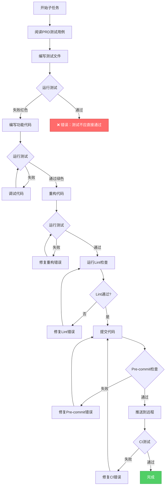
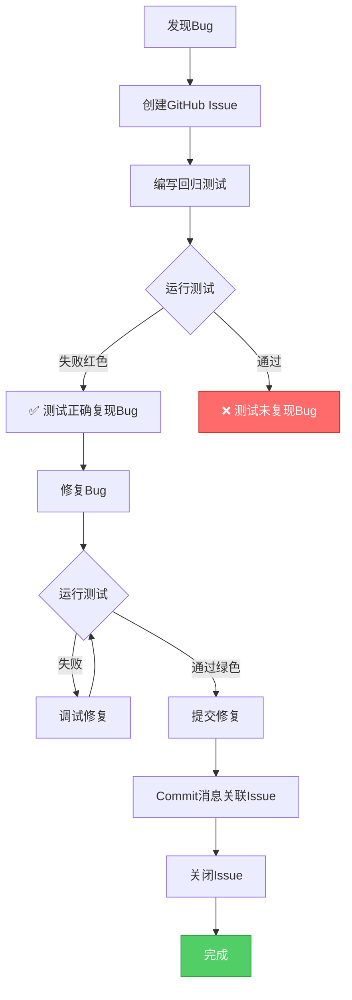

# PART4: 测试驱动TDD体系

> **版本**: V4.0
> **主题**: 测试层次、目录结构、TDD工作流、测试验证
> **定位**: 理解如何强制执行测试驱动开发并确保测试质量

---

## 目录

- [1. 测试驱动开发理念](#1-测试驱动开发理念)
- [2. 四层测试体系](#2-四层测试体系)
- [3. 测试目录强制规范](#3-测试目录强制规范)
- [4. TDD工作流](#4-tdd工作流)
- [5. 测试文件与代码文件关联](#5-测试文件与代码文件关联)
- [6. 测试验证与覆盖率](#6-测试验证与覆盖率)
- [7. 测试失败处理](#7-测试失败处理)
- [8. 回归测试机制](#8-回归测试机制)

---

## 1. 测试驱动开发理念

### 1.1 为什么需要TDD

**常见问题**:

1. **先写代码后写测试**: 测试变成形式，无法真正保证质量
2. **不写测试**: 每次修改都担心破坏现有功能
3. **测试覆盖率低**: 只测试happy path，忽略边界和异常
4. **测试与代码脱节**: 代码修改后忘记更新测试

**TDD解决方案**:

```
红色阶段（Red）: 编写测试，运行失败
  ↓
绿色阶段（Green）: 编写最少代码使测试通过
  ↓
重构阶段（Refactor）: 重构代码提高质量
  ↓
循环
```

### 1.2 TDD的强制执行

| 阶段         | 强制机制                                      | 工具            |
| ------------ | --------------------------------------------- | --------------- |
| **PRD阶段**  | PRD必须包含测试用例清单                       | PRD验证脚本     |
| **任务阶段** | Task-Master生成的任务中，测试任务先于代码任务 | 适配层          |
| **提交阶段** | Pre-commit检查测试文件是否存在                | Pre-commit Hook |
| **CI阶段**   | 运行所有测试，强制最低覆盖率                  | GitHub Actions  |

### 1.3 TDD的收益

| 收益         | 说明                          |
| ------------ | ----------------------------- |
| **质量保证** | 每个功能都有测试覆盖，减少Bug |
| **重构信心** | 有测试保护，放心重构代码      |
| **文档作用** | 测试即文档，展示如何使用代码  |
| **快速反馈** | 每次修改立即知道是否破坏功能  |

---

## 2. 四层测试体系

### 2.1 测试金字塔

```
       ┌─────────────┐
       │ E2E Tests   │  <- 少量，测试完整用户流程
       │   (10%)     │
       └─────────────┘
      ┌───────────────┐
      │ Integration   │  <- 中等，测试模块间交互
      │   Tests (30%) │
      └───────────────┘
     ┌─────────────────┐
     │  Unit Tests     │  <- 大量，测试单个函数/类
     │     (60%)       │
     └─────────────────┘
```

### 2.2 单元测试 (Unit Tests)

**定义**: 测试单个函数、类、模块的最小单位

**目录**: `backend/tests/unit/`

**命名**: `test_{module}.py`

**示例**:

```python
# backend/tests/unit/test_user_login.py

def test_validate_email_format():
    """测试邮箱格式验证"""
    assert validate_email("user@example.com") == True
    assert validate_email("invalid-email") == False

def test_validate_password_length():
    """测试密码长度验证"""
    assert validate_password("12345678") == True  # 8位合法
    assert validate_password("1234567") == False  # 7位不合法

def test_hash_password():
    """测试密码哈希"""
    hashed = hash_password("password123")
    assert hashed != "password123"  # 哈希后不应与明文相同
    assert verify_password("password123", hashed) == True  # 验证哈希

def test_generate_jwt_token():
    """测试JWT Token生成"""
    token = generate_jwt_token(user_id=123, expires_in=3600)
    payload = decode_jwt_token(token)
    assert payload['user_id'] == 123
    assert payload['exp'] > time.time()  # 过期时间在未来
```

**覆盖范围**:

- [x] 正常输入
- [x] 边界输入（最小值、最大值）
- [x] 异常输入（null、空字符串、非法格式）
- [x] 业务逻辑

### 2.3 集成测试 (Integration Tests)

**定义**: 测试多个模块间的交互，涉及数据库、Redis等外部依赖

**目录**: `backend/tests/integration/`

**命名**: `test_{feature}.py`

**示例**:

```python
# backend/tests/integration/test_user_authentication.py

@pytest.fixture
def client():
    """测试客户端"""
    return TestClient(app)

@pytest.fixture
def test_user(db):
    """测试用户"""
    user = User.objects.create(
        email="user@example.com",
        password_hash=hash_password("password123")
    )
    return user

def test_login_success(client, test_user):
    """测试登录成功流程"""
    response = client.post('/api/auth/login', json={
        'email': 'user@example.com',
        'password': 'password123'
    })
    assert response.status_code == 200
    assert 'token' in response.json()
    assert response.json()['user']['email'] == 'user@example.com'

    # 验证数据库更新
    test_user.refresh_from_db()
    assert test_user.last_login_at is not None

def test_login_invalid_email(client):
    """测试邮箱不存在"""
    response = client.post('/api/auth/login', json={
        'email': 'nonexistent@example.com',
        'password': 'password123'
    })
    assert response.status_code == 401
    assert response.json()['error'] == 'INVALID_CREDENTIALS'

def test_login_rate_limit(client, test_user, redis_client):
    """测试登录限流"""
    # 连续5次错误登录
    for i in range(5):
        client.post('/api/auth/login', json={
            'email': 'user@example.com',
            'password': 'wrongpassword'
        })

    # 验证Redis记录了尝试次数
    attempts = redis_client.get('login:attempts:user@example.com')
    assert int(attempts) == 5

    # 第6次应该被限流
    response = client.post('/api/auth/login', json={
        'email': 'user@example.com',
        'password': 'wrongpassword'
    })
    assert response.status_code == 429
    assert response.json()['error'] == 'TOO_MANY_ATTEMPTS'
```

**覆盖范围**:

- [x] API端点完整流程
- [x] 数据库读写
- [x] Redis缓存
- [x] 多模块协作
- [x] 事务处理

### 2.4 E2E测试 (End-to-End Tests)

**定义**: 测试完整的用户流程，从前端到后端

**目录**: `e2e/tests/`

**命名**: `test-{feature}.spec.ts`

**示例**:

```typescript
// e2e/tests/test-user-login.spec.ts

import { test, expect } from "@playwright/test";

test.describe("用户登录", () => {
  test.beforeEach(async ({ page }) => {
    // 每个测试前重置数据库
    await page.request.post("/api/test/reset-database");

    // 创建测试用户
    await page.request.post("/api/test/create-user", {
      data: {
        email: "user@example.com",
        password: "password123",
      },
    });
  });

  test("用户可以使用有效凭证登录", async ({ page }) => {
    // 访问登录页面
    await page.goto("/login");

    // 填写表单
    await page.fill('input[name="email"]', "user@example.com");
    await page.fill('input[name="password"]', "password123");

    // 提交表单
    await page.click('button[type="submit"]');

    // 验证重定向到首页
    await page.waitForURL("/");

    // 验证显示欢迎消息
    const heading = await page.textContent("h1");
    expect(heading).toBe("欢迎回来");

    // 验证LocalStorage中有Token
    const token = await page.evaluate(() => localStorage.getItem("auth_token"));
    expect(token).toBeTruthy();
  });

  test("用户看到无效凭证错误", async ({ page }) => {
    await page.goto("/login");

    await page.fill('input[name="email"]', "user@example.com");
    await page.fill('input[name="password"]', "wrongpassword");
    await page.click('button[type="submit"]');

    // 验证显示错误消息
    const errorMessage = await page.textContent(".error-message");
    expect(errorMessage).toBe("邮箱或密码错误");

    // 验证停留在登录页面
    expect(page.url()).toContain("/login");
  });

  test("用户勾选记住我后保持登录", async ({ page, context }) => {
    await page.goto("/login");

    await page.fill('input[name="email"]', "user@example.com");
    await page.fill('input[name="password"]', "password123");
    await page.check('input[name="remember_me"]');
    await page.click('button[type="submit"]');

    await page.waitForURL("/");

    // 关闭页面
    await page.close();

    // 打开新页面
    const newPage = await context.newPage();
    await newPage.goto("/");

    // 应该已登录（因为remember_me）
    const heading = await newPage.textContent("h1");
    expect(heading).toBe("欢迎回来");
  });

  test("登录尝试次数限制", async ({ page }) => {
    await page.goto("/login");

    // 连续5次输入错误密码
    for (let i = 0; i < 5; i++) {
      await page.fill('input[name="email"]', "user@example.com");
      await page.fill('input[name="password"]', "wrongpassword");
      await page.click('button[type="submit"]');
      await page.waitForTimeout(500); // 等待错误消息显示
    }

    // 第6次应该看到限流消息
    await page.fill('input[name="email"]', "user@example.com");
    await page.fill('input[name="password"]', "wrongpassword");
    await page.click('button[type="submit"]');

    const errorMessage = await page.textContent(".error-message");
    expect(errorMessage).toContain("登录尝试过多，请15分钟后再试");
  });
});
```

**覆盖范围**:

- [x] 完整用户流程
- [x] 前端交互
- [x] 后端API
- [x] 数据持久化
- [x] 跨页面流程

### 2.5 回归测试 (Regression Tests)

**定义**: 针对已修复的Bug编写测试，防止Bug复现

**目录**:

- `backend/tests/regression/` (后端)
- `e2e/tests/regression/` (前端)

**命名**: `test_{bug_id}.py` 或 `test-{bug_id}.spec.ts`

**示例**:

```python
# backend/tests/regression/test_issue_123.py

def test_issue_123_password_with_special_chars(client, test_user):
    """
    Bug #123: 密码包含特殊字符时登录失败

    问题: 密码中的特殊字符（如 @#$%）未正确编码，导致验证失败
    修复: 在验证前对密码进行URL解码
    """
    # 创建密码包含特殊字符的用户
    user = User.objects.create(
        email="test@example.com",
        password_hash=hash_password("P@ssw0rd#123")
    )

    # 测试登录
    response = client.post('/api/auth/login', json={
        'email': 'test@example.com',
        'password': 'P@ssw0rd#123'
    })

    # 应该登录成功
    assert response.status_code == 200
    assert 'token' in response.json()
```

**编写时机**:

1. 发现Bug并修复后立即编写
2. 提交代码时必须包含回归测试
3. PR Review时检查是否有回归测试

---

## 3. 测试目录强制规范

### 3.1 后端测试目录

```
backend/tests/
├── unit/                   # 单元测试
│   ├── test_user_login.py
│   ├── test_user_model.py
│   └── test_jwt_utils.py
├── integration/            # 集成测试
│   ├── test_user_authentication.py
│   └── test_user_api.py
├── regression/             # 回归测试
│   ├── test_issue_123.py
│   └── test_issue_456.py
├── fixtures/               # 测试数据
│   ├── users.json
│   └── auth_tokens.json
├── conftest.py             # Pytest配置和全局Fixtures
└── pytest.ini              # Pytest配置文件
```

### 3.2 前端E2E测试目录

```
e2e/tests/
├── smoke/                  # 冒烟测试（核心功能快速验证）
│   └── test-critical-paths.spec.ts
├── regression/             # 回归测试
│   └── test-issue-789.spec.ts
├── performance/            # 性能测试
│   └── test-page-load-time.spec.ts
├── test-user-login.spec.ts
├── test-user-profile.spec.ts
└── fixtures/               # 测试数据
    └── users.ts
```

### 3.3 Pre-commit强制检查

**脚本**: `.compliance/checkers/test_checker.py`

```python
def check_test_directory(test_file):
    """检查测试文件是否在正确的目录"""

    # 后端测试
    if test_file.startswith('backend/tests/'):
        valid_dirs = ['unit/', 'integration/', 'regression/', 'fixtures/']
        parent_dir = test_file.split('/')[2] + '/'

        if parent_dir not in valid_dirs:
            raise ComplianceError(
                f"后端测试文件必须在以下目录之一: {valid_dirs}\n"
                f"当前文件: {test_file}"
            )

    # E2E测试
    if test_file.startswith('e2e/tests/'):
        # E2E测试可以直接在tests/下，也可以在子目录
        pass

    # 命名检查
    if test_file.endswith('.py'):
        if not os.path.basename(test_file).startswith('test_'):
            raise ComplianceError(
                f"Python测试文件必须以 test_ 开头: {test_file}"
            )

    if test_file.endswith('.spec.ts'):
        if not os.path.basename(test_file).startswith('test-'):
            raise ComplianceError(
                f"TypeScript测试文件必须以 test- 开头: {test_file}"
            )
```

---

## 4. TDD工作流

### 4.1 完整TDD流程



### 4.2 红色阶段（Red）

**目标**: 编写测试，确认测试失败

**步骤**:

1. 阅读PRD中的测试用例
2. 创建测试文件
3. 编写测试函数
4. 运行测试，确认失败

**示例**:

```python
# backend/tests/unit/test_user_login.py

def test_login_success():
    """测试登录成功"""
    # 这个函数还不存在，测试会失败
    result = login_user("user@example.com", "password123")
    assert result['success'] == True
    assert 'token' in result
```

**运行测试**:

```bash
pytest backend/tests/unit/test_user_login.py::test_login_success
```

**预期结果**:

```
FAILED backend/tests/unit/test_user_login.py::test_login_success
NameError: name 'login_user' is not defined
```

### 4.3 绿色阶段（Green）

**目标**: 编写最少的代码使测试通过

**步骤**:

1. 实现功能代码
2. 运行测试，确认通过
3. 不追求完美，只求通过

**示例**:

```python
# backend/apps/users/services.py

def login_user(email, password):
    """用户登录（最小实现）"""
    # 硬编码实现，只是为了让测试通过
    if email == "user@example.com" and password == "password123":
        return {
            'success': True,
            'token': 'fake-token'
        }
    return {'success': False}
```

**运行测试**:

```bash
pytest backend/tests/unit/test_user_login.py::test_login_success
```

**预期结果**:

```
PASSED backend/tests/unit/test_user_login.py::test_login_success
```

### 4.4 重构阶段（Refactor）

**目标**: 重构代码提高质量，同时保持测试通过

**步骤**:

1. 识别代码坏味道（重复、硬编码、复杂度高）
2. 重构代码
3. 运行测试，确认仍然通过
4. 重复直到满意

**示例**:

```python
# backend/apps/users/services.py

def login_user(email, password):
    """用户登录（重构后）"""
    # 1. 查询用户
    user = User.objects.filter(email=email).first()
    if not user:
        return {'success': False, 'error': 'USER_NOT_FOUND'}

    # 2. 验证密码
    if not verify_password(password, user.password_hash):
        return {'success': False, 'error': 'INVALID_PASSWORD'}

    # 3. 生成Token
    token = generate_jwt_token(user.id)

    return {'success': True, 'token': token}
```

**运行测试**:

```bash
pytest backend/tests/unit/test_user_login.py::test_login_success
```

**预期结果**:

```
PASSED backend/tests/unit/test_user_login.py::test_login_success
```

---

## 5. 测试文件与代码文件关联

### 5.1 关联策略

| 代码文件                           | 测试文件                                                                                | 关联方式          |
| ---------------------------------- | --------------------------------------------------------------------------------------- | ----------------- |
| `backend/apps/users/models.py`     | `backend/tests/unit/test_user_model.py`                                                 | 命名对应          |
| `backend/apps/users/views.py`      | `backend/tests/unit/test_user_views.py`<br>`backend/tests/integration/test_user_api.py` | 单元测试+集成测试 |
| `frontend/src/views/LoginView.vue` | `e2e/tests/test-user-login.spec.ts`                                                     | E2E测试           |

### 5.2 PRD元数据关联

**PRD中记录关联**:

```yaml
---
req_id: REQ-2025-001-user-login
test_files:
  - backend/tests/unit/test_user_login.py
  - backend/tests/integration/test_user_authentication.py
  - e2e/tests/test-user-login.spec.ts
implementation_files:
  - backend/apps/users/models.py
  - backend/apps/users/views.py
  - backend/apps/users/serializers.py
  - frontend/src/views/LoginView.vue
---
```

### 5.3 Pre-commit关联检查

**检查逻辑**:

```python
def check_test_code_association(prd_path):
    """检查测试文件和代码文件是否都存在"""
    metadata = read_prd_metadata(prd_path)

    # 检查测试文件
    missing_tests = []
    for test_file in metadata['test_files']:
        if not os.path.exists(test_file):
            missing_tests.append(test_file)

    if missing_tests:
        print(f"❌ 以下测试文件不存在:")
        for f in missing_tests:
            print(f"   - {f}")
        return False

    # 检查实现文件
    missing_impl = []
    for impl_file in metadata['implementation_files']:
        if not os.path.exists(impl_file):
            missing_impl.append(impl_file)

    if missing_impl:
        print(f"⚠️ 以下实现文件不存在（可能还未实现）:")
        for f in missing_impl:
            print(f"   - {f}")
        # 实现文件缺失不阻止提交（可能测试先写）

    return True
```

---

## 6. 测试验证与覆盖率

### 6.1 测试覆盖率要求

| 测试类型 | 最低覆盖率   | 理想覆盖率 |
| -------- | ------------ | ---------- |
| 单元测试 | 80%          | 90%+       |
| 集成测试 | 70%          | 85%+       |
| E2E测试  | 核心流程100% | 所有流程   |

### 6.2 覆盖率测试命令

**后端覆盖率**:

```bash
# 运行测试并生成覆盖率报告
pytest --cov=backend/apps \
       --cov-report=html \
       --cov-report=term \
       --cov-fail-under=80 \
       backend/tests/

# 查看HTML报告
open htmlcov/index.html
```

**前端覆盖率**:

```bash
# E2E测试覆盖率
playwright test --coverage

# 查看覆盖率报告
npx playwright show-report
```

### 6.3 CI/CD覆盖率检查

**GitHub Actions工作流**: `.github/workflows/test-coverage.yml`

```yaml
name: Test Coverage

on:
  push:
    branches: [dev, main]
  pull_request:
    branches: [dev, main]

jobs:
  backend-coverage:
    runs-on: ubuntu-latest
    steps:
      - uses: actions/checkout@v3

      - name: Set up Python
        uses: actions/setup-python@v4
        with:
          python-version: "3.9"

      - name: Install dependencies
        run: |
          pip install -r backend/requirements/test.txt

      - name: Run tests with coverage
        run: |
          pytest --cov=backend/apps \
                 --cov-report=xml \
                 --cov-report=term \
                 --cov-fail-under=80 \
                 backend/tests/

      - name: Upload coverage to Codecov
        uses: codecov/codecov-action@v3
        with:
          file: ./coverage.xml
          flags: backend
          fail_ci_if_error: true

  e2e-coverage:
    runs-on: ubuntu-latest
    steps:
      - uses: actions/checkout@v3

      - name: Set up Node.js
        uses: actions/setup-node@v3
        with:
          node-version: "18"

      - name: Install dependencies
        run: npm ci
        working-directory: e2e

      - name: Run E2E tests
        run: npx playwright test
        working-directory: e2e

      - name: Upload coverage
        uses: codecov/codecov-action@v3
        with:
          flags: e2e
```

---

## 7. 测试失败处理

### 7.1 测试失败拦截

**Pre-commit Hook拦截**:

```bash
# .githooks/pre-commit

# 运行后端测试
pytest backend/tests/
if [ $? -ne 0 ]; then
    echo "❌ 后端测试失败，拒绝提交"
    exit 1
fi

# 运行E2E测试（仅smoke测试，快速验证）
cd e2e && npx playwright test tests/smoke/
if [ $? -ne 0 ]; then
    echo "❌ E2E冒烟测试失败，拒绝提交"
    exit 1
fi
```

### 7.2 Cursor行为约束

**Cursor规则** (`.cursorrules`):

```yaml
rules:
  - name: test-first-development
    trigger: "开始实现代码"
    system_prompt: |
      在编写功能代码之前，你必须：
      1. 阅读PRD中的测试用例
      2. 编写测试文件
      3. 运行测试，确认失败（红色阶段）
      4. 只有在测试失败后，才能编写功能代码

      你不应该：
      - 直接编写功能代码
      - 跳过测试
      - 修改测试使其通过（除非测试本身有Bug）

  - name: no-skip-tests
    trigger: "测试失败"
    system_prompt: |
      检测到测试失败，你应该：
      1. 分析测试失败原因
      2. 修复代码使测试通过
      3. 重新运行测试验证

      你不应该：
      - 删除失败的测试
      - 注释掉失败的测试
      - 使用@pytest.mark.skip跳过测试
      - 修改测试期望值使其通过（除非测试本身错误）

  - name: no-delete-tests
    trigger: "删除测试文件"
    system_prompt: |
      检测到你试图删除测试文件，这是禁止的。

      如果测试文件确实需要删除（如功能被PRD移除），你应该：
      1. 先修改PRD，移除该功能
      2. 在PRD的test_files元数据中移除该测试文件
      3. 然后才能删除测试文件
```

### 7.3 自动回滚测试删除

**Post-commit Hook检测**:

```bash
# .githooks/post-commit

# 检测是否删除了测试文件
deleted_tests=$(git diff --name-status HEAD~1 HEAD | grep "^D" | grep "test_\|test-" | awk '{print $2}')

if [ -n "$deleted_tests" ]; then
    echo "⚠️ 检测到删除测试文件:"
    echo "$deleted_tests"

    # 检查是否有PRD授权
    for test_file in $deleted_tests; do
        authorized=$(python scripts/compliance/check_test_deletion_authorized.py "$test_file")

        if [ "$authorized" != "true" ]; then
            echo "❌ 未经授权删除测试文件: $test_file"
            echo "💡 正在自动回滚..."
            git revert HEAD --no-edit
            echo "✅ 已回滚删除操作"
            exit 1
        fi
    done
fi
```

---

## 8. 回归测试机制

### 8.1 Bug修复流程



### 8.2 回归测试命名

**格式**: `test_{issue_id}_{bug_description}`

**示例**:

- `test_issue_123_password_special_chars.py`
- `test_issue_456_login_rate_limit_bypass.py`
- `test-issue-789-forgot-password-link.spec.ts`

### 8.3 回归测试模板

```python
# backend/tests/regression/test_issue_123.py

def test_issue_123_password_with_special_chars(client, test_user):
    """
    Bug #123: 密码包含特殊字符时登录失败

    **问题描述**:
    用户密码中包含特殊字符（如 @#$%）时，登录验证失败。

    **根本原因**:
    密码在传输过程中未正确编码，导致特殊字符被转义。

    **修复方案**:
    1. 前端：使用encodeURIComponent编码密码
    2. 后端：使用urllib.parse.unquote解码密码

    **测试目标**:
    验证包含特殊字符的密码可以正常登录。

    **GitHub Issue**: https://github.com/yourrepo/issues/123
    **PR**: https://github.com/yourrepo/pull/456
    **Fixed In**: v1.2.3
    **Fixed At**: 2025-10-24
    """
    # 创建密码包含特殊字符的用户
    user = User.objects.create(
        email="test@example.com",
        password_hash=hash_password("P@ssw0rd#123$%^&*()")
    )

    # 测试登录（这次应该成功）
    response = client.post('/api/auth/login', json={
        'email': 'test@example.com',
        'password': 'P@ssw0rd#123$%^&*()'
    })

    assert response.status_code == 200
    assert 'token' in response.json()

    # 额外验证：测试各种特殊字符组合
    special_passwords = [
        'P@ssw0rd',
        'P#ssw0rd',
        'P$ssw0rd',
        'P%ssw0rd',
        'P^ssw0rd',
        'P&ssw0rd',
        'P*ssw0rd',
        'P(ssw0rd)',
        'P@#$%^&*()',
    ]

    for password in special_passwords:
        user = User.objects.create(
            email=f"test{special_passwords.index(password)}@example.com",
            password_hash=hash_password(password)
        )

        response = client.post('/api/auth/login', json={
            'email': user.email,
            'password': password
        })

        assert response.status_code == 200, f"Failed for password: {password}"
```

### 8.4 回归测试集成到CI

**自动运行所有回归测试**:

```yaml
# .github/workflows/regression-tests.yml

name: Regression Tests

on:
  push:
    branches: [dev, main]
  pull_request:
    branches: [dev, main]
  schedule:
    # 每天凌晨2点运行一次，防止回归
    - cron: "0 2 * * *"

jobs:
  backend-regression:
    runs-on: ubuntu-latest
    steps:
      - uses: actions/checkout@v3

      - name: Set up Python
        uses: actions/setup-python@v4
        with:
          python-version: "3.9"

      - name: Run regression tests
        run: |
          pytest backend/tests/regression/ -v

      - name: Notify on failure
        if: failure()
        uses: 8398a7/action-slack@v3
        with:
          status: ${{ job.status }}
          text: "回归测试失败！可能有Bug复现"
          webhook_url: ${{ secrets.SLACK_WEBHOOK }}

  e2e-regression:
    runs-on: ubuntu-latest
    steps:
      - uses: actions/checkout@v3

      - name: Run E2E regression tests
        run: npx playwright test e2e/tests/regression/
```

---

## 小结

本章节详细阐述了测试驱动开发（TDD）体系，包括：

1. **TDD理念**: 红-绿-重构循环，强制执行机制
2. **四层测试体系**: 单元测试（60%）、集成测试（30%）、E2E测试（10%）、回归测试
3. **测试目录规范**: 强制的目录结构和命名规范
4. **TDD工作流**: 完整的红-绿-重构流程
5. **测试与代码关联**: PRD元数据关联，Pre-commit检查
6. **测试覆盖率**: 80%+最低要求，CI/CD验证
7. **测试失败处理**: Pre-commit拦截，Cursor行为约束，自动回滚
8. **回归测试机制**: Bug修复流程，回归测试模板，定时执行

**下一步**: 阅读 [PART5-合规引擎与五道防线](./AI-WORKFLOW-V4-PART5-COMPLIANCE.md) 了解如何通过技术手段强制执行所有规则。
