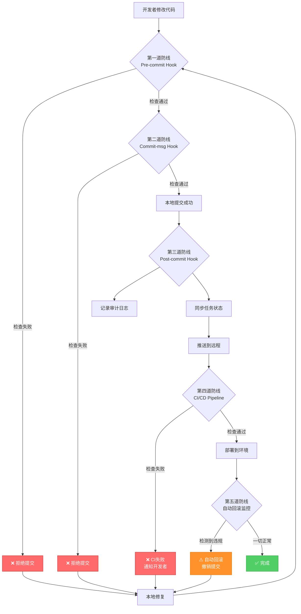

# PART5: 合规引擎与五道防线

> **版本**: V4.0
> **主题**: 规则引擎架构、五道防线、Git Hooks、CI/CD、自动回滚
> **定位**: 理解如何通过技术手段强制执行所有规则，确保AI无法绕过

---

## 目录

- [1. 合规引擎架构](#1-合规引擎架构)
- [2. 五道防线总览](#2-五道防线总览)
- [3. 第一道防线：Pre-commit Hook](#3-第一道防线pre-commit-hook)
- [4. 第二道防线：Commit-msg Hook](#4-第二道防线commit-msg-hook)
- [5. 第三道防线：Post-commit Hook](#5-第三道防线post-commit-hook)
- [6. 第四道防线：CI/CD Pipeline](#6-第四道防线cicd-pipeline)
- [7. 第五道防线：自动回滚机制](#7-第五道防线自动回滚机制)
- [8. 禁用--no-verify的终极方案](#8-禁用--no-verify的终极方案)

---

## 1. 合规引擎架构

### 1.1 设计理念

**核心目标**: 建立一个可扩展、可配置的规则引擎，将所有合规检查统一管理

**设计原则**:

1. **规则与代码分离**: 规则定义在YAML文件中，便于修改
2. **检查器插件化**: 每种检查逻辑是独立的Python模块
3. **统一入口**: 所有检查通过同一个引擎执行
4. **分层验证**: 本地检查（快速反馈）+ 远程验证（最终保障）
5. **审计日志**: 记录所有检查结果和绕过尝试

### 1.2 目录结构

```
.compliance/
├── config.yaml                 # 全局配置
├── rules/                      # 规则定义
│   ├── prd.yaml                # PRD规则
│   ├── test.yaml               # 测试规则
│   ├── code.yaml               # 代码规则
│   ├── commit.yaml             # 提交规则
│   └── task.yaml               # 任务规则
├── checkers/                   # 检查器插件
│   ├── __init__.py
│   ├── prd_checker.py          # PRD检查器
│   ├── test_checker.py         # 测试检查器
│   ├── code_checker.py         # 代码检查器
│   ├── commit_checker.py       # 提交检查器
│   └── task_checker.py         # 任务检查器
├── engine.py                   # 规则引擎核心
├── runner.py                   # Pre-commit入口
└── audit.log                   # 审计日志
```

### 1.3 全局配置

**文件**: `.compliance/config.yaml`

```yaml
# 合规引擎全局配置

# 引擎配置
engine:
  version: "1.0"
  strict_mode: true # 严格模式：任何规则失败都拒绝提交
  enable_audit_log: true # 启用审计日志
  audit_log_path: .compliance/audit.log

# 规则加载配置
rules:
  enabled: true
  auto_discover: true # 自动发现rules/目录下的规则文件
  rules_dir: .compliance/rules

# 检查器配置
checkers:
  enabled: true
  auto_discover: true # 自动发现checkers/目录下的检查器
  checkers_dir: .compliance/checkers

# 绕过机制配置
bypass:
  allow_bypass: false # 禁止绕过（除了特殊情况）
  bypass_require_reason: true # 绕过需要提供理由
  bypass_require_approval: true # 绕过需要人工批准
  bypass_approval_file: .compliance/bypass_approvals.yaml

# 通知配置
notifications:
  enabled: true
  slack_webhook: ${SLACK_WEBHOOK_URL}
  notify_on_failure: true
  notify_on_bypass_attempt: true

# 文件路径映射（哪些文件类型使用哪些规则）
file_rules_mapping:
  - pattern: "docs/00_product/requirements/**/*.md"
    rules: [prd]
  - pattern: "backend/tests/**/*.py"
    rules: [test, code]
  - pattern: "e2e/tests/**/*.ts"
    rules: [test, code]
  - pattern: "backend/apps/**/*.py"
    rules: [code]
  - pattern: "frontend/src/**/*.{vue,ts}"
    rules: [code]
  - pattern: ".taskmaster/tasks/**/*.json"
    rules: [task]
  - pattern: ".taskmaster/tasks/**/*.md"
    rules: [task]

# 排除路径（不检查）
exclude_paths:
  - "node_modules/**"
  - "venv/**"
  - ".git/**"
  - "*.pyc"
  - "__pycache__/**"
  - "build/**"
  - "dist/**"
```

### 1.4 规则引擎核心

**文件**: `.compliance/engine.py`

```python
#!/usr/bin/env python3
"""
合规引擎核心：加载规则、执行检查、聚合结果
"""

import os
import sys
import yaml
import json
import importlib
from pathlib import Path
from typing import List, Dict, Any
from datetime import datetime
import fnmatch


class ComplianceEngine:
    """合规引擎"""

    def __init__(self, config_path: str = '.compliance/config.yaml'):
        self.config_path = config_path
        self.config = self._load_config()
        self.rules = self._load_rules()
        self.checkers = self._load_checkers()
        self.audit_log = []

    def _load_config(self) -> Dict:
        """加载全局配置"""
        if not os.path.exists(self.config_path):
            raise FileNotFoundError(f"配置文件不存在: {self.config_path}")

        with open(self.config_path, 'r', encoding='utf-8') as f:
            config = yaml.safe_load(f)

        # 环境变量替换
        config = self._replace_env_vars(config)

        return config

    def _replace_env_vars(self, obj: Any) -> Any:
        """递归替换环境变量 ${VAR_NAME}"""
        if isinstance(obj, dict):
            return {k: self._replace_env_vars(v) for k, v in obj.items()}
        elif isinstance(obj, list):
            return [self._replace_env_vars(item) for item in obj]
        elif isinstance(obj, str) and obj.startswith('${') and obj.endswith('}'):
            var_name = obj[2:-1]
            return os.getenv(var_name, obj)
        else:
            return obj

    def _load_rules(self) -> Dict[str, Dict]:
        """加载所有规则文件"""
        rules = {}
        rules_dir = self.config['rules']['rules_dir']

        if not os.path.exists(rules_dir):
            print(f"⚠️ 规则目录不存在: {rules_dir}")
            return rules

        for rule_file in Path(rules_dir).glob('*.yaml'):
            rule_name = rule_file.stem
            with open(rule_file, 'r', encoding='utf-8') as f:
                rules[rule_name] = yaml.safe_load(f)

        print(f"✅ 加载 {len(rules)} 个规则文件")
        return rules

    def _load_checkers(self) -> Dict[str, Any]:
        """加载所有检查器插件"""
        checkers = {}
        checkers_dir = self.config['checkers']['checkers_dir']

        if not os.path.exists(checkers_dir):
            print(f"⚠️ 检查器目录不存在: {checkers_dir}")
            return checkers

        # 动态导入检查器模块
        sys.path.insert(0, os.path.dirname(checkers_dir))

        for checker_file in Path(checkers_dir).glob('*_checker.py'):
            module_name = checker_file.stem
            try:
                module = importlib.import_module(f".{module_name}", package="compliance.checkers")
                # 查找模块中的Checker类
                for attr_name in dir(module):
                    attr = getattr(module, attr_name)
                    if isinstance(attr, type) and attr_name.endswith('Checker') and attr_name != 'BaseChecker':
                        checker_instance = attr()
                        checkers[module_name] = checker_instance
                        print(f"✅ 加载检查器: {module_name}")
            except Exception as e:
                print(f"❌ 加载检查器失败 {module_name}: {e}")

        return checkers

    def check_files(self, file_paths: List[str]) -> Dict[str, Any]:
        """
        检查文件列表

        Args:
            file_paths: 文件路径列表

        Returns:
            检查结果字典
        """
        results = {
            'passed': [],
            'failed': [],
            'warnings': [],
            'summary': {
                'total': len(file_paths),
                'passed': 0,
                'failed': 0,
                'warnings': 0
            }
        }

        for file_path in file_paths:
            # 检查是否在排除路径中
            if self._is_excluded(file_path):
                continue

            # 匹配规则
            matched_rules = self._match_rules(file_path)

            if not matched_rules:
                # 没有匹配的规则，跳过
                continue

            # 执行检查
            file_result = self._check_file(file_path, matched_rules)

            if file_result['status'] == 'passed':
                results['passed'].append(file_result)
                results['summary']['passed'] += 1
            elif file_result['status'] == 'failed':
                results['failed'].append(file_result)
                results['summary']['failed'] += 1
            elif file_result['status'] == 'warning':
                results['warnings'].append(file_result)
                results['summary']['warnings'] += 1

        # 记录审计日志
        if self.config['engine']['enable_audit_log']:
            self._write_audit_log(results)

        return results

    def _is_excluded(self, file_path: str) -> bool:
        """检查文件是否在排除列表中"""
        for pattern in self.config['exclude_paths']:
            if fnmatch.fnmatch(file_path, pattern):
                return True
        return False

    def _match_rules(self, file_path: str) -> List[str]:
        """匹配文件路径对应的规则"""
        matched_rules = []

        for mapping in self.config['file_rules_mapping']:
            pattern = mapping['pattern']
            # 支持glob模式匹配
            if fnmatch.fnmatch(file_path, pattern):
                matched_rules.extend(mapping['rules'])

        # 去重
        return list(set(matched_rules))

    def _check_file(self, file_path: str, rule_names: List[str]) -> Dict[str, Any]:
        """
        对单个文件执行检查

        Args:
            file_path: 文件路径
            rule_names: 规则名称列表

        Returns:
            检查结果
        """
        result = {
            'file': file_path,
            'rules_applied': rule_names,
            'status': 'passed',
            'errors': [],
            'warnings': []
        }

        for rule_name in rule_names:
            if rule_name not in self.rules:
                result['warnings'].append(f"规则不存在: {rule_name}")
                continue

            rule = self.rules[rule_name]

            # 调用对应的检查器
            checker_name = f"{rule_name}_checker"
            if checker_name not in self.checkers:
                result['warnings'].append(f"检查器不存在: {checker_name}")
                continue

            checker = self.checkers[checker_name]

            try:
                # 执行检查
                check_result = checker.check(file_path, rule)

                if not check_result['passed']:
                    result['status'] = 'failed'
                    result['errors'].extend(check_result['errors'])

                if check_result.get('warnings'):
                    result['warnings'].extend(check_result['warnings'])

            except Exception as e:
                result['status'] = 'failed'
                result['errors'].append(f"检查器执行失败: {str(e)}")

        return result

    def _write_audit_log(self, results: Dict[str, Any]):
        """写入审计日志"""
        log_entry = {
            'timestamp': datetime.now().isoformat(),
            'summary': results['summary'],
            'failed_files': [f['file'] for f in results['failed']],
            'errors': [err for f in results['failed'] for err in f['errors']]
        }

        audit_log_path = self.config['engine']['audit_log_path']

        with open(audit_log_path, 'a', encoding='utf-8') as f:
            f.write(json.dumps(log_entry, ensure_ascii=False) + '\n')

    def print_results(self, results: Dict[str, Any]):
        """打印检查结果"""
        print("\n" + "="*60)
        print("合规检查结果")
        print("="*60)

        summary = results['summary']
        print(f"总计: {summary['total']} 个文件")
        print(f"✅ 通过: {summary['passed']}")
        print(f"❌ 失败: {summary['failed']}")
        print(f"⚠️ 警告: {summary['warnings']}")

        if results['failed']:
            print("\n失败文件:")
            for failed in results['failed']:
                print(f"\n  ❌ {failed['file']}")
                for error in failed['errors']:
                    print(f"      • {error}")

        if results['warnings']:
            print("\n警告:")
            for warning_file in results['warnings']:
                print(f"\n  ⚠️ {warning_file['file']}")
                for warning in warning_file['warnings']:
                    print(f"      • {warning}")

        print("\n" + "="*60)


def main():
    """命令行入口"""
    if len(sys.argv) < 2:
        print("用法: python .compliance/engine.py <file1> <file2> ...")
        sys.exit(1)

    file_paths = sys.argv[1:]

    engine = ComplianceEngine()
    results = engine.check_files(file_paths)
    engine.print_results(results)

    # 严格模式：有失败则退出码为1
    if engine.config['engine']['strict_mode'] and results['summary']['failed'] > 0:
        sys.exit(1)
    else:
        sys.exit(0)


if __name__ == '__main__':
    main()
```

### 1.5 检查器基类

**文件**: `.compliance/checkers/__init__.py`

```python
"""
检查器基类和公共工具
"""

from abc import ABC, abstractmethod
from typing import Dict, Any


class BaseChecker(ABC):
    """检查器基类"""

    @abstractmethod
    def check(self, file_path: str, rule: Dict[str, Any]) -> Dict[str, Any]:
        """
        执行检查

        Args:
            file_path: 文件路径
            rule: 规则定义

        Returns:
            检查结果字典:
            {
                'passed': bool,
                'errors': List[str],
                'warnings': List[str]
            }
        """
        pass

    def _read_file(self, file_path: str) -> str:
        """读取文件内容"""
        try:
            with open(file_path, 'r', encoding='utf-8') as f:
                return f.read()
        except Exception as e:
            raise IOError(f"读取文件失败 {file_path}: {e}")

    def _file_exists(self, file_path: str) -> bool:
        """检查文件是否存在"""
        import os
        return os.path.exists(file_path)
```

### 1.6 PRD检查器示例

**文件**: `.compliance/checkers/prd_checker.py`

```python
"""
PRD检查器：验证PRD文件的元数据和结构
"""

import re
import yaml
from . import BaseChecker


class PrdChecker(BaseChecker):
    """PRD检查器"""

    def check(self, file_path: str, rule: Dict) -> Dict:
        """执行PRD检查"""
        result = {
            'passed': True,
            'errors': [],
            'warnings': []
        }

        content = self._read_file(file_path)

        # 1. 检查YAML frontmatter
        if not content.startswith('---'):
            result['passed'] = False
            result['errors'].append("PRD必须包含YAML frontmatter")
            return result

        # 2. 解析元数据
        try:
            metadata = self._parse_metadata(content)
        except Exception as e:
            result['passed'] = False
            result['errors'].append(f"YAML frontmatter解析失败: {e}")
            return result

        # 3. 验证必填字段
        required_fields = rule.get('required_metadata_fields', [])
        for field in required_fields:
            if field not in metadata:
                result['passed'] = False
                result['errors'].append(f"缺少必填字段: {field}")

        # 4. 验证字段格式
        if 'req_id' in metadata:
            if not re.match(r'^REQ-\d{4}-\d{3}-.+$', metadata['req_id']):
                result['passed'] = False
                result['errors'].append("req_id格式错误，应为 REQ-YYYY-NNN-slug")

        if 'status' in metadata:
            valid_statuses = ['draft', 'refined', 'reviewed', 'approved', 'implementing', 'completed', 'archived']
            if metadata['status'] not in valid_statuses:
                result['passed'] = False
                result['errors'].append(f"status值无效: {metadata['status']}")

        # 5. 验证测试文件存在性
        if 'test_files' in metadata:
            if not isinstance(metadata['test_files'], list):
                result['passed'] = False
                result['errors'].append("test_files必须是数组")
            else:
                for test_file in metadata['test_files']:
                    if not self._file_exists(test_file):
                        result['warnings'].append(f"测试文件不存在: {test_file}")

        # 6. 验证API契约存在性
        if 'api_contract' in metadata:
            if not self._file_exists(metadata['api_contract']):
                result['warnings'].append(f"API契约文件不存在: {metadata['api_contract']}")

        return result

    def _parse_metadata(self, content: str) -> Dict:
        """解析YAML frontmatter"""
        parts = content.split('---', 2)
        if len(parts) < 3:
            raise ValueError("YAML frontmatter格式错误")

        metadata_yaml = parts[1]
        metadata = yaml.safe_load(metadata_yaml)

        return metadata
```

### 1.7 规则定义示例

**文件**: `.compliance/rules/prd.yaml`

```yaml
# PRD规则定义

name: prd
description: PRD文件合规规则
version: "1.0"

# 必填元数据字段
required_metadata_fields:
  - req_id
  - title
  - version
  - status
  - priority
  - type
  - created_at
  - updated_at
  - author
  - task_master_task
  - task_status
  - test_files
  - implementation_files
  - api_contract
  - deletable
  - delete_requires_review

# 元数据字段验证规则
metadata_validation:
  req_id:
    pattern: "^REQ-\\d{4}-\\d{3}-.+$"
    error_message: "req_id格式错误，应为 REQ-YYYY-NNN-slug"

  status:
    enum:
      - draft
      - refined
      - reviewed
      - approved
      - implementing
      - completed
      - archived
    error_message: "status值无效"

  priority:
    enum:
      - low
      - medium
      - high
      - critical
    error_message: "priority值无效"

  type:
    enum:
      - feature
      - enhancement
      - bugfix
      - refactor
    error_message: "type值无效"

  test_files:
    type: array
    min_items: 1
    error_message: "test_files必须是非空数组"

  implementation_files:
    type: array
    min_items: 1
    error_message: "implementation_files必须是非空数组"

  deletable:
    type: boolean
    error_message: "deletable必须是布尔值"

  delete_requires_review:
    type: boolean
    error_message: "delete_requires_review必须是布尔值"

# 文件关联检查
file_association_checks:
  enabled: true
  check_test_files_exist: true
  check_implementation_files_exist: false # 实现文件可能还未创建
  check_api_contract_exists: true
  check_task_master_task_exists: true

# PRD内容结构检查
content_structure_checks:
  enabled: true
  required_sections:
    - "功能概述"
    - "用户故事"
    - "验收标准"
    - "数据库设计"
    - "API接口定义"
    - "测试用例"
  warn_missing_sections: true
```

---

## 2. 五道防线总览

### 2.1 防线架构图



### 2.2 防线对比

| 防线            | 触发时机       | 检查内容                      | 失败后果       | 绕过难度                |
| --------------- | -------------- | ----------------------------- | -------------- | ----------------------- |
| **Pre-commit**  | `git commit`前 | PRD、测试、代码关联、功能删除 | 拒绝提交       | 中等（可用--no-verify） |
| **Commit-msg**  | 提交消息验证   | 提交消息格式、REQ-ID、Task-ID | 拒绝提交       | 中等（可用--no-verify） |
| **Post-commit** | 提交成功后     | 审计日志、状态同步、删除检测  | 记录但不阻止   | 低（总是执行）          |
| **CI/CD**       | 推送到远程后   | 重新执行所有检查+测试         | CI失败，不部署 | **无法绕过**            |
| **自动回滚**    | 部署后持续监控 | 未授权功能删除、测试文件删除  | 自动Git回滚    | **无法绕过**            |

### 2.3 分层防御策略

**第一层（Pre-commit + Commit-msg）**: 快速本地反馈

- **目标**: 在提交前就发现问题
- **优势**: 反馈快，节省时间
- **劣势**: 可用`--no-verify`绕过

**第二层（Post-commit）**: 审计和同步

- **目标**: 记录所有操作，同步任务状态
- **优势**: 无法绕过
- **劣势**: 不阻止提交

**第三层（CI/CD）**: 终极验证

- **目标**: 重新执行所有检查，确保无漏网之鱼
- **优势**: 无法绕过，服务器端执行
- **劣势**: 反馈较慢（需推送到远程）

**第四层（自动回滚）**: 兜底保障

- **目标**: 检测到严重违规自动回滚
- **优势**: 最后的保险
- **劣势**: 已经污染Git历史

---

## 3. 第一道防线：Pre-commit Hook

### 3.1 Pre-commit Hook架构

**文件**: `.githooks/pre-commit`

```bash
#!/bin/bash
# Pre-commit Hook - 第一道防线

set -e

echo "🔍 执行Pre-commit检查..."

# 颜色定义
RED='\033[0;31m'
GREEN='\033[0;32m'
YELLOW='\033[1;33m'
NC='\033[0m' # No Color

# 获取待提交文件
STAGED_FILES=$(git diff --cached --name-only --diff-filter=ACM)

if [ -z "$STAGED_FILES" ]; then
    echo "${GREEN}✅ 无文件需要检查${NC}"
    exit 0
fi

# 1. 调用合规引擎
echo "📋 1/6 执行合规引擎检查..."
python .compliance/engine.py $STAGED_FILES
if [ $? -ne 0 ]; then
    echo "${RED}❌ 合规引擎检查失败${NC}"
    exit 1
fi
echo "${GREEN}✅ 合规引擎检查通过${NC}"

# 2. 检查PRD关联
echo "📋 2/6 检查PRD关联..."
python scripts/compliance/check_prd_association.py $STAGED_FILES
if [ $? -ne 0 ]; then
    echo "${RED}❌ PRD关联检查失败${NC}"
    echo "${YELLOW}💡 提示: 所有代码修改必须关联到PRD${NC}"
    exit 1
fi
echo "${GREEN}✅ PRD关联检查通过${NC}"

# 3. 检查测试文件
echo "📋 3/6 检查测试文件..."
python scripts/compliance/check_test_files.py $STAGED_FILES
if [ $? -ne 0 ]; then
    echo "${RED}❌ 测试文件检查失败${NC}"
    echo "${YELLOW}💡 提示: 每个代码文件必须有对应的测试文件${NC}"
    exit 1
fi
echo "${GREEN}✅ 测试文件检查通过${NC}"

# 4. 检查功能删除授权
echo "📋 4/6 检查功能删除授权..."
python scripts/compliance/check_feature_deletion.py $STAGED_FILES
if [ $? -ne 0 ]; then
    echo "${RED}❌ 检测到未授权的功能删除${NC}"
    echo "${YELLOW}💡 提示: 删除功能前必须先修改PRD${NC}"
    exit 1
fi
echo "${GREEN}✅ 功能删除检查通过${NC}"

# 5. 运行测试（快速测试）
echo "📋 5/6 运行测试..."

# 后端单元测试
if echo "$STAGED_FILES" | grep -q "backend/apps/"; then
    echo "  运行后端单元测试..."
    pytest backend/tests/unit/ -q
    if [ $? -ne 0 ]; then
        echo "${RED}❌ 后端单元测试失败${NC}"
        exit 1
    fi
fi

# E2E冒烟测试（仅核心流程）
if echo "$STAGED_FILES" | grep -q "frontend/src/\|backend/apps/"; then
    echo "  运行E2E冒烟测试..."
    cd e2e && npx playwright test tests/smoke/ --quiet && cd ..
    if [ $? -ne 0 ]; then
        echo "${RED}❌ E2E冒烟测试失败${NC}"
        exit 1
    fi
fi

echo "${GREEN}✅ 测试通过${NC}"

# 6. 代码格式检查
echo "📋 6/6 代码格式检查..."

# Python代码格式
if echo "$STAGED_FILES" | grep -q "\.py$"; then
    echo "  检查Python代码格式..."
    black --check backend/
    if [ $? -ne 0 ]; then
        echo "${RED}❌ Python代码格式不符合规范${NC}"
        echo "${YELLOW}💡 运行: black backend/${NC}"
        exit 1
    fi
fi

# TypeScript代码格式
if echo "$STAGED_FILES" | grep -q "\.ts$\|\.vue$"; then
    echo "  检查TypeScript代码格式..."
    npm run lint --prefix frontend
    if [ $? -ne 0 ]; then
        echo "${RED}❌ TypeScript代码格式不符合规范${NC}"
        echo "${YELLOW}💡 运行: npm run lint:fix --prefix frontend${NC}"
        exit 1
    fi
fi

echo "${GREEN}✅ 代码格式检查通过${NC}"

echo ""
echo "${GREEN}🎉 所有Pre-commit检查通过！${NC}"
exit 0
```

### 3.2 PRD关联检查脚本

**文件**: `scripts/compliance/check_prd_association.py`

```python
#!/usr/bin/env python3
"""
检查代码文件是否关联到PRD
"""

import sys
import os
import glob
import yaml


def find_prd_for_file(file_path):
    """查找文件关联的PRD"""
    # 搜索所有PRD文件
    prd_files = glob.glob('docs/00_product/requirements/**/REQ-*.md', recursive=True)

    for prd_file in prd_files:
        # 读取PRD元数据
        with open(prd_file, 'r', encoding='utf-8') as f:
            content = f.read()

        if not content.startswith('---'):
            continue

        parts = content.split('---', 2)
        if len(parts) < 3:
            continue

        metadata = yaml.safe_load(parts[1])

        # 检查是否在implementation_files中
        if 'implementation_files' in metadata:
            if file_path in metadata['implementation_files']:
                return prd_file

        # 检查是否在test_files中
        if 'test_files' in metadata:
            if file_path in metadata['test_files']:
                return prd_file

    return None


def main():
    if len(sys.argv) < 2:
        print("用法: check_prd_association.py <file1> <file2> ...")
        sys.exit(1)

    file_paths = sys.argv[1:]

    # 过滤出需要检查的文件（代码文件和测试文件）
    code_patterns = [
        'backend/apps/',
        'frontend/src/',
        'backend/tests/',
        'e2e/tests/'
    ]

    files_to_check = []
    for file_path in file_paths:
        if any(pattern in file_path for pattern in code_patterns):
            files_to_check.append(file_path)

    if not files_to_check:
        # 没有代码文件需要检查
        sys.exit(0)

    missing_prd = []

    for file_path in files_to_check:
        prd = find_prd_for_file(file_path)
        if not prd:
            missing_prd.append(file_path)

    if missing_prd:
        print("❌ 以下文件未关联到PRD:")
        for file_path in missing_prd:
            print(f"   • {file_path}")
        print("\n💡 解决方案:")
        print("   1. 在PRD的元数据中添加该文件到implementation_files或test_files")
        print("   2. 或者创建新的PRD")
        sys.exit(1)

    print("✅ 所有文件都已关联到PRD")
    sys.exit(0)


if __name__ == '__main__':
    main()
```

### 3.3 功能删除检查脚本

**文件**: `scripts/compliance/check_feature_deletion.py`

```python
#!/usr/bin/env python3
"""
检查是否有未授权的功能删除
"""

import sys
import subprocess
import re


def get_deleted_lines():
    """获取删除的代码行"""
    # 获取git diff
    result = subprocess.run(
        ['git', 'diff', '--cached', '--unified=0'],
        capture_output=True,
        text=True
    )

    diff_output = result.stdout

    deleted_lines = []
    current_file = None

    for line in diff_output.split('\n'):
        # 文件标识
        if line.startswith('--- a/'):
            current_file = line[6:]
        elif line.startswith('-') and not line.startswith('---'):
            # 删除的行
            deleted_lines.append({
                'file': current_file,
                'content': line[1:]
            })

    return deleted_lines


def is_prd_feature(line_content):
    """判断是否是PRD定义的功能代码"""
    # 简单启发式：包含函数定义、类定义、关键业务逻辑
    patterns = [
        r'def\s+\w+\(',      # Python函数
        r'class\s+\w+',      # Python类
        r'async\s+function', # JS async函数
        r'export\s+function', # JS export函数
        r'export\s+class',    # JS export类
    ]

    for pattern in patterns:
        if re.search(pattern, line_content):
            return True

    return False


def check_deletion_authorized(file_path):
    """检查删除是否授权"""
    # 检查提交消息是否包含[BUGFIX]或[REFACTOR]标记
    # （在commit-msg hook中会验证）
    return True  # 这里简化处理，实际通过commit-msg验证


def main():
    deleted_lines = get_deleted_lines()

    if not deleted_lines:
        # 没有删除代码
        sys.exit(0)

    # 检查是否删除了PRD定义的功能
    unauthorized_deletions = []

    for deleted in deleted_lines:
        if is_prd_feature(deleted['content']):
            if not check_deletion_authorized(deleted['file']):
                unauthorized_deletions.append(deleted)

    if unauthorized_deletions:
        print("❌ 检测到未授权的功能删除:")
        for deletion in unauthorized_deletions[:5]:  # 最多显示5条
            print(f"   • {deletion['file']}: {deletion['content'][:60]}...")

        print("\n💡 解决方案:")
        print("   1. 如果是Bug修复，请在commit消息中添加[BUGFIX]标记")
        print("   2. 如果是重构，请在commit消息中添加[REFACTOR]标记")
        print("   3. 如果是功能删除，请先修改PRD并移除该功能")

        sys.exit(1)

    sys.exit(0)


if __name__ == '__main__':
    main()
```

---

## 4. 第二道防线：Commit-msg Hook

### 4.1 Commit-msg Hook

**文件**: `.githooks/commit-msg`

```bash
#!/bin/bash
# Commit-msg Hook - 第二道防线：验证提交消息格式

COMMIT_MSG_FILE=$1
COMMIT_MSG=$(cat "$COMMIT_MSG_FILE")

RED='\033[0;31m'
GREEN='\033[0;32m'
YELLOW='\033[1;33m'
NC='\033[0m'

echo "🔍 验证提交消息格式..."

# 提交消息格式：[REQ-ID] Task-X Subtask-Y 描述
# 或者：[BUGFIX] 描述
# 或者：[REFACTOR] 描述

# 检查格式
if echo "$COMMIT_MSG" | grep -qE '^\[(REQ-[0-9]{4}-[0-9]{3}-[a-z0-9-]+|BUGFIX|REFACTOR)\]'; then
    echo "${GREEN}✅ 提交消息格式正确${NC}"

    # 如果是REQ-ID格式，验证REQ-ID和Task-ID是否存在
    if echo "$COMMIT_MSG" | grep -qE '^\[REQ-'; then
        REQ_ID=$(echo "$COMMIT_MSG" | sed -E 's/^\[([^]]+)\].*/\1/')

        # 验证REQ-ID对应的PRD是否存在
        PRD_FILE="docs/00_product/requirements/${REQ_ID}/${REQ_ID}.md"

        if [ ! -f "$PRD_FILE" ]; then
            echo "${RED}❌ PRD文件不存在: $PRD_FILE${NC}"
            echo "${YELLOW}💡 请检查REQ-ID是否正确${NC}"
            exit 1
        fi

        # 提取Task-ID（如果有）
        if echo "$COMMIT_MSG" | grep -qE 'Task-[0-9]+'; then
            TASK_ID=$(echo "$COMMIT_MSG" | sed -E 's/.*Task-([0-9]+).*/\1/')

            # 验证Task-ID是否存在
            TASKS_JSON=".taskmaster/tasks/${REQ_ID}/tasks.json"

            if [ ! -f "$TASKS_JSON" ]; then
                echo "${YELLOW}⚠️ tasks.json不存在: $TASKS_JSON${NC}"
                echo "${YELLOW}💡 请先运行Task-Master生成任务${NC}"
                # 不阻止提交，只是警告
            else
                # 检查Task-ID是否在tasks.json中
                if ! grep -q "\"id\": $TASK_ID" "$TASKS_JSON"; then
                    echo "${RED}❌ Task-ID不存在: Task-$TASK_ID${NC}"
                    exit 1
                fi
            fi
        fi
    fi

    exit 0
else
    echo "${RED}❌ 提交消息格式错误${NC}"
    echo ""
    echo "正确格式:"
    echo "  [REQ-2025-001-user-login] Task-1 Subtask-2 实现登录API"
    echo "  [BUGFIX] 修复登录时密码验证错误"
    echo "  [REFACTOR] 重构登录逻辑"
    echo ""
    echo "当前消息:"
    echo "  $COMMIT_MSG"
    exit 1
fi
```

### 4.2 Commit消息模板

**文件**: `.gitmessage`

```
# 提交消息模板

# [REQ-ID] Task-X Subtask-Y <简短描述>
#
# 详细描述（可选）:
# - 做了什么
# - 为什么这样做
# - 如何验证
#
# 示例：
# [REQ-2025-001-user-login] Task-1 Subtask-2 实现登录API
#
# - 实现了POST /api/auth/login接口
# - 添加了密码哈希验证
# - 添加了Redis限流
#
# 测试：pytest backend/tests/unit/test_user_login.py

# 或者用于Bug修复：
# [BUGFIX] 修复登录时密码包含特殊字符的问题
#
# 问题：密码中的@#$%等字符导致验证失败
# 修复：在验证前对密码进行URL解码
# 测试：backend/tests/regression/test_issue_123.py

# 或者用于重构：
# [REFACTOR] 重构登录逻辑为Service层
#
# 将View中的业务逻辑提取到AuthService
# 提高代码可测试性和可维护性
```

**配置Git使用该模板**:

```bash
git config commit.template .gitmessage
```

---

## 5. 第三道防线：Post-commit Hook

### 5.1 Post-commit Hook

**文件**: `.githooks/post-commit`

```bash
#!/bin/bash
# Post-commit Hook - 第三道防线：提交后审计和状态同步

COMMIT_SHA=$(git rev-parse HEAD)
COMMIT_MSG=$(git log -1 --pretty=%B)
COMMIT_AUTHOR=$(git log -1 --pretty=%an)
COMMIT_DATE=$(git log -1 --pretty=%ci)

echo "📝 执行Post-commit操作..."

# 1. 记录审计日志
echo "1/4 记录审计日志..."
python scripts/compliance/log_commit.py \
    --commit-sha "$COMMIT_SHA" \
    --commit-msg "$COMMIT_MSG" \
    --author "$COMMIT_AUTHOR" \
    --date "$COMMIT_DATE"

# 2. 同步任务状态
echo "2/4 同步任务状态..."
if echo "$COMMIT_MSG" | grep -qE '^\[REQ-'; then
    REQ_ID=$(echo "$COMMIT_MSG" | sed -E 's/^\[([^]]+)\].*/\1/')

    if echo "$COMMIT_MSG" | grep -qE 'Task-[0-9]+'; then
        TASK_ID=$(echo "$COMMIT_MSG" | sed -E 's/.*Task-([0-9]+).*/\1/')

        SUBTASK_ID=""
        if echo "$COMMIT_MSG" | grep -qE 'Subtask-[0-9]+'; then
            SUBTASK_ID=$(echo "$COMMIT_MSG" | sed -E 's/.*Subtask-([0-9]+).*/\1/')
        fi

        # 同步任务状态
        if [ -n "$SUBTASK_ID" ]; then
            python scripts/task-master/sync_status.py \
                --req-id "$REQ_ID" \
                --task-id "task-$TASK_ID" \
                --subtask-id "subtask-$SUBTASK_ID" \
                --status completed \
                --commit-sha "$COMMIT_SHA"
        fi
    fi
fi

# 3. 检查是否删除了测试文件（警告但不阻止）
echo "3/4 检查测试文件删除..."
DELETED_TESTS=$(git diff --name-status HEAD~1 HEAD | grep "^D" | grep -E "test_|test-" | awk '{print $2}')

if [ -n "$DELETED_TESTS" ]; then
    echo "⚠️ 检测到删除测试文件:"
    echo "$DELETED_TESTS"

    # 检查是否有PRD授权
    for test_file in $DELETED_TESTS; do
        AUTHORIZED=$(python scripts/compliance/check_test_deletion_authorized.py "$test_file" "$REQ_ID")

        if [ "$AUTHORIZED" != "true" ]; then
            echo "❌ 未经授权删除测试文件: $test_file"
            echo "⚠️ 该操作已记录到审计日志，将在CI中进一步验证"

            # 记录到审计日志
            python scripts/compliance/log_unauthorized_deletion.py \
                --file "$test_file" \
                --commit-sha "$COMMIT_SHA" \
                --type "test"
        fi
    done
fi

# 4. 更新PRD元数据
echo "4/4 更新PRD元数据..."
if echo "$COMMIT_MSG" | grep -qE '^\[REQ-'; then
    python scripts/compliance/update_prd_commits.py \
        --req-id "$REQ_ID" \
        --commit-sha "$COMMIT_SHA"
fi

echo "✅ Post-commit操作完成"
exit 0
```

### 5.2 审计日志脚本

**文件**: `scripts/compliance/log_commit.py`

```python
#!/usr/bin/env python3
"""
记录Git提交到审计日志
"""

import sys
import json
import argparse
from datetime import datetime


def log_commit(commit_sha, commit_msg, author, date):
    """记录提交到审计日志"""
    log_entry = {
        'timestamp': datetime.now().isoformat(),
        'commit_sha': commit_sha,
        'commit_msg': commit_msg,
        'author': author,
        'date': date,
        'type': 'commit'
    }

    audit_log_path = '.compliance/audit.log'

    with open(audit_log_path, 'a', encoding='utf-8') as f:
        f.write(json.dumps(log_entry, ensure_ascii=False) + '\n')

    print(f"✅ 已记录提交到审计日志: {commit_sha[:7]}")


def main():
    parser = argparse.ArgumentParser(description='记录Git提交到审计日志')
    parser.add_argument('--commit-sha', required=True, help='提交SHA')
    parser.add_argument('--commit-msg', required=True, help='提交消息')
    parser.add_argument('--author', required=True, help='提交作者')
    parser.add_argument('--date', required=True, help='提交日期')

    args = parser.parse_args()

    log_commit(args.commit_sha, args.commit_msg, args.author, args.date)


if __name__ == '__main__':
    main()
```

---

## 6. 第四道防线：CI/CD Pipeline

### 6.1 GitHub Actions工作流

**文件**: `.github/workflows/compliance-check.yml`

```yaml
name: Compliance Check

on:
  push:
    branches: [dev, main]
  pull_request:
    branches: [dev, main]

jobs:
  compliance:
    runs-on: ubuntu-latest

    steps:
      - name: Checkout code
        uses: actions/checkout@v3
        with:
          fetch-depth: 0 # 获取完整历史用于diff

      - name: Set up Python
        uses: actions/setup-python@v4
        with:
          python-version: "3.9"

      - name: Install dependencies
        run: |
          pip install pyyaml

      - name: Get changed files
        id: changed-files
        run: |
          if [ "${{ github.event_name }}" == "pull_request" ]; then
            FILES=$(git diff --name-only ${{ github.event.pull_request.base.sha }} ${{ github.sha }})
          else
            FILES=$(git diff --name-only ${{ github.event.before }} ${{ github.sha }})
          fi
          echo "files=$FILES" >> $GITHUB_OUTPUT

      - name: Run compliance engine
        run: |
          python .compliance/engine.py ${{ steps.changed-files.outputs.files }}

      - name: Check PRD association
        run: |
          python scripts/compliance/check_prd_association.py ${{ steps.changed-files.outputs.files }}

      - name: Check test files
        run: |
          python scripts/compliance/check_test_files.py ${{ steps.changed-files.outputs.files }}

      - name: Check feature deletion
        run: |
          python scripts/compliance/check_feature_deletion.py

      - name: Run all tests
        run: |
          # 后端测试
          pytest backend/tests/ --cov=backend/apps --cov-fail-under=80

          # 前端E2E测试
          cd e2e && npm ci && npx playwright install
          npx playwright test

      - name: Upload audit log
        if: always()
        uses: actions/upload-artifact@v3
        with:
          name: compliance-audit-log
          path: .compliance/audit.log

      - name: Notify on failure
        if: failure()
        uses: 8398a7/action-slack@v3
        with:
          status: ${{ job.status }}
          text: "❌ Compliance检查失败！"
          webhook_url: ${{ secrets.SLACK_WEBHOOK }}
```

### 6.2 CI失败通知

**Slack通知格式**:

```
❌ Compliance检查失败！

仓库: Bravo
分支: feature/user-login
提交: abc123def
作者: @张三

失败原因:
• PRD关联检查失败
• backend/apps/users/views.py 未关联到PRD

查看详情: https://github.com/yourrepo/actions/runs/12345
```

---

## 7. 第五道防线：自动回滚机制

### 7.1 自动回滚触发条件

| 触发条件                | 检测方式            | 回滚操作          |
| ----------------------- | ------------------- | ----------------- |
| **PRD定义的功能被删除** | Post-merge Hook检测 | `git revert HEAD` |
| **测试文件被删除**      | Post-merge Hook检测 | `git revert HEAD` |
| **核心API被简化**       | API契约对比         | `git revert HEAD` |
| **测试覆盖率大幅下降**  | CI检测              | 阻止部署+通知     |

### 7.2 Post-merge Hook

**文件**: `.githooks/post-merge`

```bash
#!/bin/bash
# Post-merge Hook - 自动回滚检测

echo "🔍 检查合并后的代码..."

MERGE_COMMIT=$(git rev-parse HEAD)
PREV_COMMIT=$(git rev-parse HEAD~1)

# 1. 检测功能删除
echo "1/3 检测功能删除..."
DELETED_FUNCTIONS=$(git diff $PREV_COMMIT $MERGE_COMMIT --unified=0 | \
    grep -E '^-\s*(def|class|async function|export function)' | wc -l)

if [ "$DELETED_FUNCTIONS" -gt 5 ]; then
    echo "⚠️ 检测到大量功能删除（$DELETED_FUNCTIONS个）"

    # 检查是否有PRD授权
    AUTHORIZED=$(python scripts/compliance/check_merge_authorized.py "$MERGE_COMMIT")

    if [ "$AUTHORIZED" != "true" ]; then
        echo "❌ 未经授权的大量功能删除，自动回滚..."

        # 记录审计日志
        python scripts/compliance/log_unauthorized_deletion.py \
            --commit-sha "$MERGE_COMMIT" \
            --type "merge" \
            --count "$DELETED_FUNCTIONS"

        # 自动回滚
        git revert HEAD --no-edit

        # 推送回滚
        git push origin $(git rev-parse --abbrev-ref HEAD)

        # 发送通知
        python scripts/notifications/send_slack.py \
            --message "⚠️ 检测到未授权的功能删除，已自动回滚提交 $MERGE_COMMIT"

        echo "✅ 已自动回滚"
        exit 1
    fi
fi

# 2. 检测测试文件删除
echo "2/3 检测测试文件删除..."
DELETED_TESTS=$(git diff $PREV_COMMIT $MERGE_COMMIT --name-status | \
    grep "^D" | grep -E "test_|test-" | awk '{print $2}')

if [ -n "$DELETED_TESTS" ]; then
    echo "⚠️ 检测到测试文件删除:"
    echo "$DELETED_TESTS"

    # 检查授权
    AUTHORIZED=$(python scripts/compliance/check_test_deletion_batch.py "$DELETED_TESTS")

    if [ "$AUTHORIZED" != "true" ]; then
        echo "❌ 未经授权删除测试文件，自动回滚..."

        git revert HEAD --no-edit
        git push origin $(git rev-parse --abbrev-ref HEAD)

        python scripts/notifications/send_slack.py \
            --message "⚠️ 检测到未授权删除测试文件，已自动回滚提交 $MERGE_COMMIT"

        exit 1
    fi
fi

# 3. API契约验证
echo "3/3 验证API契约..."
python scripts/compliance/validate_api_contract_changes.py "$PREV_COMMIT" "$MERGE_COMMIT"

if [ $? -ne 0 ]; then
    echo "❌ API契约验证失败，自动回滚..."

    git revert HEAD --no-edit
    git push origin $(git rev-parse --abbrev-ref HEAD)

    python scripts/notifications/send_slack.py \
        --message "⚠️ API契约验证失败，已自动回滚提交 $MERGE_COMMIT"

    exit 1
fi

echo "✅ 合并后检查通过"
exit 0
```

### 7.3 回滚通知

**通知脚本**: `scripts/notifications/send_slack.py`

```python
#!/usr/bin/env python3
"""
发送Slack通知
"""

import sys
import json
import argparse
import requests
import os


def send_slack_notification(message, webhook_url=None):
    """发送Slack通知"""
    if not webhook_url:
        webhook_url = os.getenv('SLACK_WEBHOOK_URL')

    if not webhook_url:
        print("⚠️ SLACK_WEBHOOK_URL未配置，跳过通知")
        return

    payload = {
        'text': message,
        'username': 'Bravo Compliance Bot',
        'icon_emoji': ':robot_face:'
    }

    try:
        response = requests.post(webhook_url, json=payload)
        if response.status_code == 200:
            print("✅ Slack通知发送成功")
        else:
            print(f"❌ Slack通知发送失败: {response.status_code}")
    except Exception as e:
        print(f"❌ Slack通知发送异常: {e}")


def main():
    parser = argparse.ArgumentParser(description='发送Slack通知')
    parser.add_argument('--message', required=True, help='通知消息')
    parser.add_argument('--webhook-url', help='Slack Webhook URL')

    args = parser.parse_args()

    send_slack_notification(args.message, args.webhook_url)


if __name__ == '__main__':
    main()
```

---

## 8. 禁用--no-verify的终极方案

### 8.1 方案对比

| 方案               | 原理                   | 绕过难度     | 实施难度 |
| ------------------ | ---------------------- | ------------ | -------- |
| **Git Wrapper**    | 拦截`git commit`命令   | 高           | 中       |
| **Commit-msg验证** | 验证Pre-commit是否执行 | 中           | 低       |
| **CI/CD强制验证**  | 服务器端重新检查       | **无法绕过** | 低       |
| **审计日志**       | 记录绕过尝试           | 低（不阻止） | 低       |

### 8.2 Git Wrapper实现

**文件**: `scripts/git-wrapper/git`

```bash
#!/bin/bash
# Git Wrapper - 拦截--no-verify

# 获取真实git命令路径
REAL_GIT=$(which -a git | grep -v "scripts/git-wrapper" | head -1)

# 检查是否使用了--no-verify
if [[ "$*" == *"--no-verify"* ]] || [[ "$*" == *"-n"* ]]; then
    echo "❌ 禁止使用 --no-verify 绕过Pre-commit Hook"
    echo ""
    echo "如果Pre-commit检查失败，请修复问题后再提交。"
    echo "如果确实需要绕过（紧急情况），请联系团队负责人。"
    echo ""
    exit 1
fi

# 执行真实git命令
$REAL_GIT "$@"
```

**安装Git Wrapper**:

```bash
# 1. 赋予执行权限
chmod +x scripts/git-wrapper/git

# 2. 添加到PATH（在真实git之前）
export PATH="$(pwd)/scripts/git-wrapper:$PATH"

# 3. 验证
which git  # 应该显示 /path/to/Bravo/scripts/git-wrapper/git
```

**写入~/.bashrc或~/.zshrc**:

```bash
# Bravo项目Git Wrapper
if [ -d "$HOME/Projects/Bravo/scripts/git-wrapper" ]; then
    export PATH="$HOME/Projects/Bravo/scripts/git-wrapper:$PATH"
fi
```

### 8.3 CI/CD强制验证（终极方案）

**核心理念**: 即使本地绕过所有检查，CI/CD也会重新执行所有验证

**GitHub Actions配置**:

```yaml
# .github/workflows/final-validation.yml

name: Final Validation (Cannot Bypass)

on:
  push:
    branches: [dev, main]
  pull_request:
    branches: [dev, main]

jobs:
  final-check:
    runs-on: ubuntu-latest

    steps:
      - name: Checkout
        uses: actions/checkout@v3
        with:
          fetch-depth: 0

      - name: Force Pre-commit checks
        run: |
          # 重新执行Pre-commit所有检查
          bash .githooks/pre-commit

      - name: Force Commit-msg checks
        run: |
          # 验证所有提交消息格式
          for commit in $(git rev-list origin/dev..HEAD); do
            git log -1 --pretty=%B $commit | bash .githooks/commit-msg /dev/stdin
          done

      - name: Run all tests
        run: |
          pytest backend/tests/ --cov-fail-under=80
          cd e2e && npx playwright test

      - name: Block if any check fails
        if: failure()
        run: |
          echo "❌ 最终验证失败，阻止合并/部署"
          exit 1
```

### 8.4 审计日志分析

**查询尝试绕过的记录**:

```bash
# 查询审计日志中的绕过尝试
grep "bypass_attempt" .compliance/audit.log | tail -10
```

**示例审计日志**:

```json
{
  "timestamp": "2025-10-24T15:30:00Z",
  "event": "bypass_attempt",
  "user": "张三",
  "commit_sha": "abc123def",
  "method": "--no-verify",
  "blocked": true,
  "reason": "使用Git Wrapper拦截"
}
```

---

## 小结

本章节详细阐述了合规引擎与五道防线的完整实现，包括：

1. **合规引擎架构**: 规则与代码分离、检查器插件化、统一入口、审计日志
2. **五道防线总览**: Pre-commit、Commit-msg、Post-commit、CI/CD、自动回滚
3. **Pre-commit Hook**: PRD关联、测试文件、功能删除、运行测试、代码格式
4. **Commit-msg Hook**: 提交消息格式验证、REQ-ID和Task-ID验证
5. **Post-commit Hook**: 审计日志、任务状态同步、PRD元数据更新
6. **CI/CD Pipeline**: 服务器端重新执行所有检查，无法绕过
7. **自动回滚机制**: 检测未授权删除，自动Git回滚并通知
8. **禁用--no-verify**: Git Wrapper拦截、CI/CD强制验证

**核心保障**: 即使AI或开发者绕过本地检查，CI/CD也会强制验证，确保规则无法被绕过。

**下一步**: 阅读 [PART6-实施落地手册](./AI-WORKFLOW-V4-PART6-IMPL.md) 获取完整的安装脚本和配置示例。
