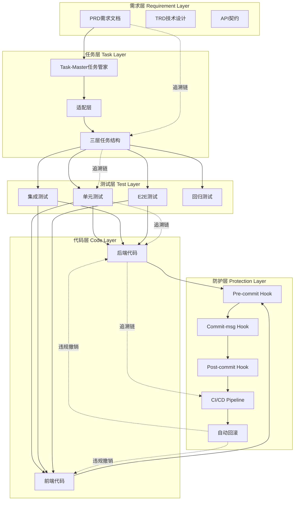

# AI驱动开发工作流 V4 架构文档

> **版本**: V4.0
> **更新日期**: 2025-10-24
> **设计理念**: 需求第一原则 + Task-Master任务管理 + 五道防线保障
> **核心目标**: 可追溯、可控制、可落地的AI驱动开发全生命周期管理

---

## 📋 文档导航

本架构文档分为**6个核心部分 + 1个Q&A附录**，逐层深入地阐述整个工作流的设计与落地措施。

### 核心文档

| 文档                                                              | 主题               | 关键内容                                                              |
| ----------------------------------------------------------------- | ------------------ | --------------------------------------------------------------------- |
| [PART1-核心架构与哲学](./AI-WORKFLOW-V4-PART1-ARCH.md)            | 架构设计与目录规范 | • 需求第一原则<br>• 三层目录结构<br>• AI角色分工<br>• 核心工作流      |
| [PART2-Task-Master深度集成](./AI-WORKFLOW-V4-PART2-TM-ADAPTER.md) | 任务管理系统       | • Task-Master集成<br>• 适配层设计<br>• 三层任务管理<br>• 任务状态同步 |
| [PART3-PRD与TRD标准](./AI-WORKFLOW-V4-PART3-PRD-TRD.md)           | 需求文档规范       | • PRD/TRD模板<br>• 元数据标准<br>• 状态机设计<br>• 验证规则           |
| [PART4-测试驱动TDD体系](./AI-WORKFLOW-V4-PART4-TDD-TEST.md)       | 测试工程体系       | • 四层测试标准<br>• 目录强制规范<br>• TDD工作流<br>• 测试验证         |
| [PART5-合规引擎与五道防线](./AI-WORKFLOW-V4-PART5-COMPLIANCE.md)  | 规则引擎与防护     | • 规则引擎架构<br>• Pre-commit Hook<br>• CI/CD防线<br>• 自动回滚      |
| [PART6-实施落地手册](./AI-WORKFLOW-V4-PART6-IMPL.md)              | 落地实施指南       | • 安装脚本<br>• 配置示例<br>• 完整演示<br>• 故障排查                  |

### 附录文档

| 文档                                               | 主题     | 说明                                             |
| -------------------------------------------------- | -------- | ------------------------------------------------ |
| [APPENDIX-QA映射](./AI-WORKFLOW-V4-APPENDIX-QA.md) | 问题解答 | 详细解答26个核心问题，映射到架构设计中的解决方案 |

---

## 🎯 V4版本核心特性

### 1. **Task-Master作为任务管家**

- **身份定位**: Task-Master是"管家"，负责任务生成与监督
- **Cursor身份**: Cursor是"工人"，负责具体执行
- **深度集成**: 通过适配层将Task-Master输出转化为三层结构化任务
- **状态同步**: 任务状态实时同步到PRD元数据

### 2. **需求第一原则的严格执行**

- **PRD元数据**: 每个PRD强制包含测试文件、Task-Master任务、实现文件的链接
- **修改先审PRD**: 任何代码修改/删除必须先修改PRD，否则被拦截
- **自动回滚**: 检测到未经PRD授权的功能删除，自动Git回滚
- **全生命周期追溯**: 从需求→任务→测试→代码→部署，全链路可追溯

### 3. **五道防线保障体系**

```
防线1: Pre-commit Hook (本地拦截)
  ↓
防线2: Commit-msg Hook (消息验证)
  ↓
防线3: Post-commit Hook (提交后审计)
  ↓
防线4: CI/CD Pipeline (云端验证)
  ↓
防线5: 自动回滚机制 (违规自动撤销)
```

### 4. **测试驱动的强制执行**

- **四层测试**: 单元测试、集成测试、E2E测试、回归测试
- **目录强制**: 测试文件必须放在指定目录，否则Pre-commit拒绝
- **TDD工作流**: 先写测试、再写代码、后通过测试
- **测试覆盖率**: 强制最低覆盖率要求

### 5. **API契约驱动并行开发**

- **OpenAPI规范**: 前后端通过OpenAPI契约并行开发
- **Mock Server**: 前端基于Mock数据开发，后端独立实现
- **契约测试**: 自动验证前后端是否符合契约

### 6. **完整的落地脚本与配置**

- **一键安装**: `scripts/setup/install_compliance.sh` 安装所有工具
- **规则引擎**: `.compliance/` 目录包含完整的规则配置
- **检查器插件**: `.compliance/checkers/` 提供可复用的检查逻辑
- **示例代码**: 提供完整的示例PRD、tasks.json、adapter.py

---

## 🚀 快速开始

### 前置条件

- Python 3.9+
- Node.js 18+
- Git 2.30+
- Docker & Docker Compose

### 安装步骤

```bash
# 1. 克隆仓库
git clone <repo-url>
cd Bravo

# 2. 运行安装脚本（会安装所有工具和Hook）
bash scripts/setup/install_compliance.sh

# 3. 验证安装
bash scripts/setup/verify_installation.sh

# 4. 查看示例工作流
cat docs/architecture/AI-WORKFLOW-V4-PART6-IMPL.md
```

### 第一个需求开发

```bash
# 1. 创建PRD
mkdir -p docs/00_product/requirements/REQ-2025-001-user-login
vim docs/00_product/requirements/REQ-2025-001-user-login/REQ-2025-001-user-login.md

# 2. Cursor精化PRD（补充技术细节、测试用例）
# 使用Cursor的AI能力分析项目上下文，完善PRD

# 3. 生成Task-Master任务
task-master -r docs/00_product/requirements/REQ-2025-001-user-login/REQ-2025-001-user-login.md

# 4. 适配器转换为三层结构
python scripts/task-master/adapter.py REQ-2025-001-user-login

# 5. Cursor开始执行任务（从Task-0自检开始）
# Task-Master监督，Cursor执行

# 6. 提交代码（Pre-commit自动检查）
git add .
git commit -m "[REQ-2025-001] Task-2完成用户登录接口实现"

# 7. CI/CD自动验证并部署
git push origin feature/user-login
```

---

## 📐 架构全景图



---

## 🔗 关键追溯链

### 需求 → 任务 → 测试 → 代码

```
REQ-2025-001-user-login.md
  ├── .taskmaster/tasks/REQ-2025-001-user-login/
  │   ├── task-1-implement-backend-api/
  │   │   ├── subtask-1-create-user-model.md
  │   │   ├── subtask-2-implement-login-endpoint.md
  │   │   └── subtask-3-write-unit-tests.md
  │   └── task-2-implement-frontend-ui/
  │       ├── subtask-1-create-login-form.md
  │       └── subtask-2-write-e2e-tests.md
  ├── backend/tests/unit/test_user_login.py
  ├── e2e/tests/test-user-login.spec.ts
  ├── backend/apps/users/views.py (login_view)
  └── frontend/src/views/LoginView.vue
```

### 验证链

```
Pre-commit Hook
  → 检查PRD是否存在
  → 检查测试文件是否存在
  → 检查代码是否关联Task-Master任务
  → 检查是否有未经授权的功能删除
  ↓
Commit-msg Hook
  → 验证Commit消息格式 [REQ-ID] Task-X 描述
  → 验证REQ-ID是否存在
  → 验证Task-X是否存在
  ↓
Post-commit Hook
  → 记录提交到审计日志
  → 更新Task-Master任务状态
  → 同步PRD元数据
  ↓
CI/CD Pipeline
  → 重新运行所有Pre-commit检查
  → 运行所有测试套件
  → 检查测试覆盖率
  → 构建Docker镜像
  → 部署到对应环境
  ↓
自动回滚机制
  → 检测未经授权的功能删除
  → 自动git revert
  → 通知开发者修改PRD
```

---

## 📚 核心概念速查

| 概念           | 定义                            | 示例                               |
| -------------- | ------------------------------- | ---------------------------------- |
| **REQ-ID**     | 需求唯一标识符                  | `REQ-2025-001-user-login`          |
| **Task-ID**    | Task-Master生成的任务ID         | `task-1-implement-backend-api`     |
| **Subtask-ID** | 任务的子任务ID                  | `subtask-1-create-user-model`      |
| **PRD元数据**  | PRD文件头部的YAML配置           | 包含测试文件、任务、实现文件链接   |
| **TRD**        | 技术需求文档                    | 数据库设计、API接口、架构决策      |
| **API契约**    | OpenAPI/Swagger规范             | `docs/01_guideline/api-contracts/` |
| **四层测试**   | Unit/Integration/E2E/Regression | 强制目录结构                       |
| **适配层**     | Task-Master输出转三层结构       | `scripts/task-master/adapter.py`   |
| **规则引擎**   | 合规检查核心                    | `.compliance/engine.py`            |
| **五道防线**   | Pre/Commit-msg/Post/CI/Rollback | 层层保障                           |

---

## ⚠️ 重要约束

### 不可绕过的规则

1. **PRD先行**: 没有PRD，不能写代码
2. **测试先行**: 没有测试文件，不能提交代码
3. **任务先行**: 没有Task-Master任务，不能开始实现
4. **修改PRD先行**: 删除/简化功能必须先修改PRD
5. **不可--no-verify**: Git commit wrapper拦截

### 自动回滚触发条件

1. 检测到PRD定义的功能被删除（无[BUGFIX]标记）
2. 检测到测试文件被删除（无PRD授权）
3. 检测到核心API被简化（无PRD授权）
4. CI/CD检测到合规性严重违规

---

## 🎓 学习路径

### 初学者

1. 阅读 [PART1-核心架构与哲学](./AI-WORKFLOW-V4-PART1-ARCH.md) 理解设计理念
2. 阅读 [PART6-实施落地手册](./AI-WORKFLOW-V4-PART6-IMPL.md) 跟随示例操作
3. 查看 [APPENDIX-QA映射](./AI-WORKFLOW-V4-APPENDIX-QA.md) 解答常见疑问

### 进阶开发者

1. 阅读 [PART2-Task-Master深度集成](./AI-WORKFLOW-V4-PART2-TM-ADAPTER.md) 理解任务管理
2. 阅读 [PART3-PRD与TRD标准](./AI-WORKFLOW-V4-PART3-PRD-TRD.md) 掌握文档规范
3. 阅读 [PART4-测试驱动TDD体系](./AI-WORKFLOW-V4-PART4-TDD-TEST.md) 实践TDD

### 架构师/DevOps

1. 阅读 [PART5-合规引擎与五道防线](./AI-WORKFLOW-V4-PART5-COMPLIANCE.md) 理解防护机制
2. 研究 `.compliance/` 目录中的规则引擎实现
3. 自定义规则和检查器插件

---

## 🛠️ 工具链

| 工具               | 用途         | 文档                                                         |
| ------------------ | ------------ | ------------------------------------------------------------ |
| **Task-Master**    | AI任务管理   | [GitHub](https://github.com/eyaltoledano/claude-task-master) |
| **Cursor**         | AI代码助手   | 内置Cursor规则                                               |
| **Pre-commit**     | Git Hook框架 | `.pre-commit-config.yaml`                                    |
| **Pytest**         | Python测试   | `backend/pytest.ini`                                         |
| **Playwright**     | E2E测试      | `e2e/playwright.config.ts`                                   |
| **Docker Compose** | 容器编排     | `docker-compose.yml`                                         |
| **GitHub Actions** | CI/CD        | `.github/workflows/`                                         |

---

## 📞 支持与反馈

- **问题追踪**: GitHub Issues
- **架构讨论**: GitHub Discussions
- **紧急问题**: 查看 [PART6-实施落地手册](./AI-WORKFLOW-V4-PART6-IMPL.md) 故障排查章节

---

## 📜 变更日志

### V4.0 (2025-10-24)

- ✅ 深度集成Task-Master作为任务管家
- ✅ 设计适配层转换三层任务结构
- ✅ 完善PRD/TRD元数据标准
- ✅ 实现五道防线保障体系
- ✅ 提供完整落地脚本和配置
- ✅ 新增API契约驱动并行开发
- ✅ 新增自动回滚机制

### V3.0 (2025-10-23)

- 初版规则引擎设计
- 初版PRD状态机
- 初版Pre-commit Hook

---

**🚀 立即开始**: 跳转到 [PART1-核心架构与哲学](./AI-WORKFLOW-V4-PART1-ARCH.md) 开始你的AI驱动开发之旅！
