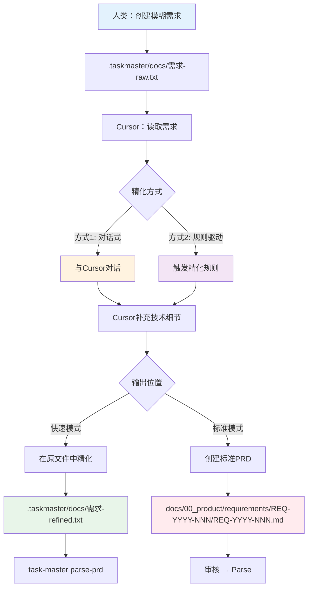

# PRD精化工作流程 - 从模糊需求到标准PRD

> **版本**: V4.0
> **日期**: 2025-12-03
> **作者**: Claude Sonnet 4.5

---

## 📋 问题1：`.taskmaster/docs/`的命名和目录规则

### ❌ 不要担心！没有严格规则

**核心原则**：`.taskmaster/docs/`是**灵活的草稿区**，不受严格约束。

**推荐但不强制的命名规范**：

```
.taskmaster/docs/
├── {功能名}-raw.txt           # 原始需求
├── {功能名}-refined.txt       # 精化后（可选）
├── {功能名}-v1.txt             # 版本化（可选）
├── {功能名}-v2.txt
└── templates/
    └── example_prd.txt        # 模板
```

### ✅ 推荐的命名模式

| 文件类型     | 命名模式                  | 示例                        |
| ------------ | ------------------------- | --------------------------- |
| **原始需求** | `{功能名}-raw.txt`        | `user-login-raw.txt`        |
| **精化版本** | `{功能名}-refined.txt`    | `user-login-refined.txt`    |
| **版本化**   | `{功能名}-v{N}.txt`       | `user-login-v1.txt`         |
| **草稿**     | `{功能名}-draft.txt`      | `shopping-cart-draft.txt`   |
| **实验性**   | `{功能名}-experiment.txt` | `ai-chatbot-experiment.txt` |

### 🎯 命名建议

**好的命名**（推荐）：

```
✅ user-authentication-raw.txt
✅ shopping-cart-v1.txt
✅ payment-gateway-draft.txt
✅ product-catalog-refined.txt
```

**可以接受但不推荐**：

```
⚠️ login.txt              # 太简短，容易混淆
⚠️ new-feature.txt        # 不够具体
⚠️ 20250103-需求.txt      # 使用日期不如功能名
```

**应该避免**：

```
❌ 需求1.txt              # 不能看出是什么功能
❌ temp.txt               # 没有意义的名字
❌ 测试.txt               # 可能与测试文件混淆
```

---

### 📁 目录结构规则

**完全自由，无强制规则！**

**选项1：扁平结构（推荐新手）**

```
.taskmaster/docs/
├── user-login-raw.txt
├── shopping-cart-raw.txt
├── product-catalog-raw.txt
├── payment-gateway-raw.txt
└── templates/
    └── example_prd.txt
```

**优点**：

- ✅ 简单直观
- ✅ 易于查找
- ✅ 适合小项目

---

**选项2：按功能模块分组**

```
.taskmaster/docs/
├── user-management/
│   ├── login-raw.txt
│   ├── registration-raw.txt
│   └── profile-raw.txt
├── shopping/
│   ├── cart-raw.txt
│   ├── checkout-raw.txt
│   └── payment-raw.txt
├── product/
│   ├── catalog-raw.txt
│   ├── search-raw.txt
│   └── reviews-raw.txt
└── templates/
    └── example_prd.txt
```

**优点**：

- ✅ 结构清晰
- ✅ 易于管理大量需求
- ✅ 适合大项目

---

**选项3：按状态分组**

```
.taskmaster/docs/
├── raw/                    # 原始需求
│   ├── user-login.txt
│   ├── shopping-cart.txt
│   └── product-catalog.txt
├── refined/                # 已精化
│   ├── user-login-refined.txt
│   └── shopping-cart-refined.txt
├── approved/               # 已批准
│   └── user-login-approved.txt
└── archive/                # 已归档
    └── old-feature.txt
```

**优点**：

- ✅ 清晰的工作流状态
- ✅ 易于跟踪进度
- ✅ 适合团队协作

---

**选项4：混合模式（推荐高级用户）**

```
.taskmaster/docs/
├── active/                 # 当前活跃的需求
│   ├── user-management/
│   │   ├── login-raw.txt
│   │   └── login-refined.txt
│   └── shopping/
│       ├── cart-raw.txt
│       └── cart-refined.txt
├── backlog/                # 待开发
│   ├── ai-chatbot-raw.txt
│   └── recommendation-engine-raw.txt
├── archive/                # 已完成或废弃
│   └── old-feature.txt
└── templates/
    └── example_prd.txt
```

**优点**：

- ✅ 功能分组 + 状态管理
- ✅ 最灵活
- ✅ 适合复杂项目

---

### 🎯 推荐方案

**如果你不确定，使用这个**：

```
.taskmaster/docs/
├── {功能名}-raw.txt        # 人类原始需求
├── {功能名}-refined.txt    # Cursor精化后（可选）
└── templates/
    └── example_prd.txt
```

**为什么？**

- ✅ 简单直观
- ✅ 不需要思考目录结构
- ✅ 后续可以随时重组

---

## 📋 问题2：如何让Cursor精化需求？

### 🔄 完整精化流程



---

### 方式1：对话式精化（推荐）

#### 步骤1：创建原始需求

```bash
# 在.taskmaster/docs/创建文件
cat > .taskmaster/docs/user-notification-raw.txt << 'EOF'
# 用户通知系统

## 需求描述
我需要一个通知系统，用户可以：
- 接收站内消息
- 接收邮件通知
- 可以设置通知偏好

## 优先级
中等优先级

## 技术栈
- 后端：Django
- 前端：Vue 3
- 实时通知：WebSocket（可选）
EOF
```

#### 步骤2：与Cursor对话

**方式2A：直接对话**

```
你：@user-notification-raw.txt 请帮我精化这个需求，补充：
1. 数据库表设计
2. API接口定义
3. 前端组件设计
4. 测试策略
5. 技术实现细节

请在同一文件中补充，或者创建一个新的refined版本
```

**方式2B：使用Cursor规则**

创建一个Cursor规则文件（如果还没有）：

`.cursor/rules/prd-refinement.md`:

```markdown
# PRD精化规则

当我提供一个原始需求文件（.taskmaster/docs/\*-raw.txt），请：

1. **保留原始需求**（不要删除）
2. **补充以下内容**：
   - 数据库设计（表结构、字段、关系）
   - API接口定义（端点、请求/响应格式）
   - 前端组件设计（页面、组件、交互）
   - 测试策略（单元测试、集成测试、E2E测试）
   - 技术实现细节（第三方库、架构决策）
3. **创建refined版本**：{原文件名}-refined.txt
4. **使用清晰的章节结构**

## 精化模板

### 数据库设计

[表结构、字段、约束、关系]

### API接口定义

[端点、方法、请求参数、响应格式、错误码]

### 前端组件设计

[页面结构、组件层次、状态管理、交互流程]

### 测试策略

[测试文件路径、测试用例、测试数据]

### 技术实现

[技术选型、架构决策、第三方库]
```

然后对话：

```
你：@user-notification-raw.txt 按照PRD精化规则，请精化这个需求
```

#### 步骤3：Cursor精化输出

Cursor会创建或更新文件：

`.taskmaster/docs/user-notification-refined.txt`:

````markdown
# 用户通知系统

## 原始需求

（保留人类的原始描述）

## 数据库设计

### Notification表

| 字段名     | 类型         | 说明     | 约束                           |
| ---------- | ------------ | -------- | ------------------------------ |
| id         | UUID         | 主键     | PK, NOT NULL                   |
| user_id    | UUID         | 用户ID   | FK → User.id, NOT NULL         |
| type       | VARCHAR(20)  | 通知类型 | ENUM('system', 'email', 'sms') |
| title      | VARCHAR(200) | 通知标题 | NOT NULL                       |
| content    | TEXT         | 通知内容 | NOT NULL                       |
| is_read    | BOOLEAN      | 是否已读 | DEFAULT FALSE                  |
| created_at | TIMESTAMP    | 创建时间 | DEFAULT NOW()                  |

### NotificationPreference表

| 字段名        | 类型    | 说明         | 约束                 |
| ------------- | ------- | ------------ | -------------------- |
| id            | UUID    | 主键         | PK, NOT NULL         |
| user_id       | UUID    | 用户ID       | FK → User.id, UNIQUE |
| email_enabled | BOOLEAN | 邮件通知开关 | DEFAULT TRUE         |
| sms_enabled   | BOOLEAN | 短信通知开关 | DEFAULT FALSE        |
| push_enabled  | BOOLEAN | 推送通知开关 | DEFAULT TRUE         |

## API接口定义

### GET /api/notifications

获取用户通知列表

**请求参数**：

- page: int (页码，默认1)
- per_page: int (每页数量，默认20)
- is_read: bool (可选，筛选已读/未读)

**响应**：

```json
{
  "count": 100,
  "results": [
    {
      "id": "uuid",
      "type": "system",
      "title": "系统通知",
      "content": "内容",
      "is_read": false,
      "created_at": "2025-01-03T10:00:00Z"
    }
  ]
}
```
````

### POST /api/notifications/{id}/mark-read

标记通知为已读

### GET /api/notification-preferences

获取用户通知偏好设置

### PUT /api/notification-preferences

更新用户通知偏好设置

## 前端组件设计

### 页面结构

- NotificationCenter.vue (通知中心主页面)
  - NotificationList.vue (通知列表组件)
    - NotificationItem.vue (单条通知)
  - NotificationPreferences.vue (偏好设置)

### 状态管理

- store/notifications.ts (Pinia store)
  - state: notifications[], unreadCount, preferences
  - actions: fetchNotifications, markAsRead, updatePreferences

### 交互流程

1. 用户点击导航栏通知图标
2. 打开NotificationCenter弹窗
3. 显示未读通知列表（红点标记）
4. 用户点击通知 → 标记为已读 → 跳转相关页面
5. 用户点击"设置" → 打开偏好设置面板

## 测试策略

### 后端测试

**单元测试**：

- backend/tests/unit/test_notification_model.py
  - 测试Notification模型的CRUD操作
  - 测试字段验证和约束
- backend/tests/unit/test_notification_views.py
  - 测试API端点逻辑
  - 测试权限验证

**集成测试**：

- backend/tests/integration/test_notification_api.py
  - 测试完整的通知发送流程
  - 测试邮件/短信发送集成

### 前端测试

**组件测试**：

- frontend/src/components/**tests**/NotificationCenter.spec.ts
  - 测试组件渲染
  - 测试用户交互

**E2E测试**：

- e2e/tests/notification.spec.ts
  - 测试完整的通知接收和处理流程
  - 测试偏好设置更新

## 技术实现

### 后端

- Django REST framework (API开发)
- Celery (异步任务：邮件/短信发送)
- django-channels (WebSocket实时通知，可选)

### 前端

- Vue 3 Composition API
- Pinia (状态管理)
- VueUse (工具库)
- Socket.io-client (WebSocket客户端，可选)

### 第三方服务

- SendGrid (邮件发送)
- Twilio (短信发送，可选）

## 实施优先级

### Phase 1 (MVP)

- 数据库表创建
- 基础API实现（CRUD）
- 前端通知列表展示

### Phase 2

- 邮件通知集成
- 偏好设置功能

### Phase 3

- WebSocket实时推送
- 短信通知集成

````

---

### 方式2：自动化精化（高级）

创建一个脚本来自动触发Cursor精化：

`scripts/refine-prd.sh`:

```bash
#!/bin/bash
# PRD精化辅助脚本

RAW_FILE=$1

if [ -z "$RAW_FILE" ]; then
    echo "Usage: bash scripts/refine-prd.sh <raw-file>"
    exit 1
fi

# 提取文件名（无扩展名）
BASENAME=$(basename "$RAW_FILE" .txt)
REFINED_FILE=".taskmaster/docs/${BASENAME}-refined.txt"

echo "📝 正在请求Cursor精化: $RAW_FILE"
echo "📁 输出文件: $REFINED_FILE"
echo ""
echo "请在Cursor中执行以下操作："
echo "1. 打开文件: @$RAW_FILE"
echo "2. 输入提示词: '请按照PRD精化规则，补充技术细节并保存到 $REFINED_FILE'"
echo ""
echo "或者直接复制以下提示词："
echo "---"
echo "@$RAW_FILE 请精化这个需求，补充数据库设计、API接口、前端组件、测试策略和技术实现，保存到 $REFINED_FILE"
echo "---"
````

使用方法：

```bash
bash scripts/refine-prd.sh .taskmaster/docs/user-notification-raw.txt
```

---

### 方式3：使用Task Master模板

Task Master提供了PRD模板，可以基于模板创建：

```bash
# 1. 复制模板
cp .taskmaster/templates/example_prd.txt .taskmaster/docs/my-feature-raw.txt

# 2. 编辑模板，填写原始需求
vim .taskmaster/docs/my-feature-raw.txt

# 3. 请Cursor根据模板精化
# 在Cursor中：
# "@my-feature-raw.txt 请根据模板结构，补充所有章节的详细内容"
```

---

## 📋 问题3：如何从`.taskmaster/docs/`迁移到`docs/00_product/`？

### 🔄 迁移流程

#### 手动迁移（推荐，更可控）

**步骤1：创建REQ-ID和目录**

```bash
# 决定REQ-ID（格式：REQ-YYYY-NNN-description）
REQ_ID="REQ-2025-001-user-notification"

# 创建目录
mkdir -p "docs/00_product/requirements/${REQ_ID}"

# 创建PRD文件
touch "docs/00_product/requirements/${REQ_ID}/${REQ_ID}.md"
```

**步骤2：请Cursor迁移内容**

在Cursor中对话：

```
你：@user-notification-refined.txt @REQ-2025-001-user-notification.md

请将refined文件的内容迁移到标准PRD文件中，并添加以下YAML frontmatter：

---
req_id: REQ-2025-001-user-notification
title: 用户通知系统
status: draft
priority: medium
type: feature
author: human
refined_by: cursor
test_files:
  - backend/tests/unit/test_notification_model.py
  - backend/tests/unit/test_notification_views.py
  - backend/tests/integration/test_notification_api.py
  - e2e/tests/notification.spec.ts
implementation_files:
  - backend/apps/notifications/models.py
  - backend/apps/notifications/views.py
  - backend/apps/notifications/serializers.py
  - frontend/src/views/NotificationCenter.vue
  - frontend/src/components/NotificationList.vue
api_contract: docs/01_guideline/api-contracts/REQ-2025-001/api.yaml
deletable: false
---

然后将refined文件的所有内容复制过来，确保章节结构完整
```

**步骤3：验证迁移结果**

```bash
# 查看生成的PRD
cat "docs/00_product/requirements/REQ-2025-001-user-notification/REQ-2025-001-user-notification.md"

# 检查YAML frontmatter格式
head -30 "docs/00_product/requirements/REQ-2025-001-user-notification/REQ-2025-001-user-notification.md"
```

---

#### 半自动迁移（使用脚本）

创建迁移脚本：

`scripts/migrate-to-standard-prd.sh`:

```bash
#!/bin/bash
# PRD迁移脚本：从.taskmaster/docs/到docs/00_product/

REFINED_FILE=$1
REQ_ID=$2

if [ -z "$REFINED_FILE" ] || [ -z "$REQ_ID" ]; then
    echo "Usage: bash scripts/migrate-to-standard-prd.sh <refined-file> <REQ-ID>"
    echo ""
    echo "Example:"
    echo "  bash scripts/migrate-to-standard-prd.sh .taskmaster/docs/user-notification-refined.txt REQ-2025-001-user-notification"
    exit 1
fi

# 检查文件是否存在
if [ ! -f "$REFINED_FILE" ]; then
    echo "❌ Error: File not found: $REFINED_FILE"
    exit 1
fi

# 创建目标目录
TARGET_DIR="docs/00_product/requirements/${REQ_ID}"
TARGET_FILE="${TARGET_DIR}/${REQ_ID}.md"

mkdir -p "$TARGET_DIR"

# 提取功能标题（从第一行）
TITLE=$(head -1 "$REFINED_FILE" | sed 's/^# //')

echo "📋 迁移PRD:"
echo "   源文件: $REFINED_FILE"
echo "   目标文件: $TARGET_FILE"
echo "   REQ-ID: $REQ_ID"
echo "   标题: $TITLE"
echo ""

# 创建YAML frontmatter
cat > "$TARGET_FILE" << EOF
---
req_id: $REQ_ID
title: $TITLE
status: draft
priority: medium
type: feature
created_at: $(date -u +"%Y-%m-%dT%H:%M:%SZ")
updated_at: $(date -u +"%Y-%m-%dT%H:%M:%SZ")
author: human
refined_by: cursor
test_files: []  # TODO: 填写测试文件列表
implementation_files: []  # TODO: 填写实现文件列表
api_contract: docs/01_guideline/api-contracts/${REQ_ID}/api.yaml
deletable: false
---

EOF

# 复制refined文件内容（跳过frontmatter如果有）
if grep -q "^---$" "$REFINED_FILE"; then
    # 文件已有frontmatter，跳过
    sed -n '/^---$/,/^---$/!p;//!p' "$REFINED_FILE" >> "$TARGET_FILE"
else
    # 直接复制所有内容
    cat "$REFINED_FILE" >> "$TARGET_FILE"
fi

echo "✅ 迁移完成!"
echo ""
echo "📝 下一步:"
echo "1. 打开文件并补充 test_files 和 implementation_files"
echo "2. 审核PRD内容"
echo "3. 修改status: draft → review → approved"
echo "4. 运行: task-master parse-prd --input=$TARGET_FILE"
```

使用方法：

```bash
bash scripts/migrate-to-standard-prd.sh \
  .taskmaster/docs/user-notification-refined.txt \
  REQ-2025-001-user-notification
```

---

## 🎯 完整工作流程示例

### 场景：从零开始开发一个新功能

```bash
# ==========================================
# 阶段1：人类提出模糊需求
# ==========================================

# 1. 创建原始需求文件
cat > .taskmaster/docs/ai-chatbot-raw.txt << 'EOF'
# AI聊天机器人

## 需求描述
需要一个AI聊天功能：
- 用户可以与AI对话
- 支持上下文理解
- 支持历史记录查看

## 技术要求
- 使用OpenAI API
- 需要支持流式响应
- 前端实时展示
EOF

# ==========================================
# 阶段2：Cursor精化需求
# ==========================================

# 2. 在Cursor中对话
# 你: @ai-chatbot-raw.txt 请精化这个需求，补充：
#     1. 数据库设计（对话历史存储）
#     2. API接口定义
#     3. 前端组件设计
#     4. OpenAI集成方案
#     5. 测试策略
#
# Cursor会创建: ai-chatbot-refined.txt

# ==========================================
# 阶段3：快速验证（可选）
# ==========================================

# 3. 快速parse，评估可行性
task-master parse-prd --input=.taskmaster/docs/ai-chatbot-refined.txt

# 4. 查看任务
task-master list

# 5. 分析复杂度
task-master analyze-complexity

# 如果评估OK，继续下一步；如果太复杂，回到阶段2继续精化

# ==========================================
# 阶段4：正式立项（迁移到标准PRD）
# ==========================================

# 6. 创建标准PRD
bash scripts/migrate-to-standard-prd.sh \
  .taskmaster/docs/ai-chatbot-refined.txt \
  REQ-2025-005-ai-chatbot

# 7. 补充元数据（在Cursor中编辑）
vim docs/00_product/requirements/REQ-2025-005-ai-chatbot/REQ-2025-005-ai-chatbot.md
# 补充 test_files 和 implementation_files

# ==========================================
# 阶段5：审核和Parse
# ==========================================

# 8. 审核流程
# status: draft → review → approved （人工修改）

# 9. Parse PRD
task-master parse-prd --input=docs/00_product/requirements/REQ-2025-005-ai-chatbot/REQ-2025-005-ai-chatbot.md

# Parse成功后:
# ✅ PRD状态自动更新：approved → implementing
# ✅ 生成tasks.json

# ==========================================
# 阶段6：开发
# ==========================================

# 10. 展开任务
task-master expand --all --research

# 11. 开始开发
task-master next

# 12. 提交代码（受V4合规保护）
git add backend/apps/chatbot/views.py
git commit -m "feat(chatbot): 实现AI对话API"
```

---

## 📚 工具和脚本汇总

### 创建的辅助脚本

1. **`scripts/refine-prd.sh`**

   - 功能：辅助提示Cursor精化需求
   - 使用：`bash scripts/refine-prd.sh <raw-file>`

2. **`scripts/migrate-to-standard-prd.sh`**
   - 功能：从`.taskmaster/docs/`迁移到`docs/00_product/`
   - 使用：`bash scripts/migrate-to-standard-prd.sh <refined-file> <REQ-ID>`

### Cursor规则文件

**`.cursor/rules/prd-refinement.md`**（推荐创建）：

```markdown
# PRD精化规则

当处理.taskmaster/docs/中的需求文件时，请：

1. 保留原始需求内容
2. 补充以下章节：
   - 数据库设计
   - API接口定义
   - 前端组件设计
   - 测试策略
   - 技术实现细节
3. 使用清晰的Markdown格式
4. 提供具体的表结构、API端点、组件层次
5. 指定测试文件路径和实现文件路径
```

---

## 🎯 最佳实践总结

### 命名规范

| 场景         | 命名模式                 | 示例                         |
| ------------ | ------------------------ | ---------------------------- |
| **初始需求** | `{功能}-raw.txt`         | `user-login-raw.txt`         |
| **精化版本** | `{功能}-refined.txt`     | `user-login-refined.txt`     |
| **标准PRD**  | `REQ-YYYY-NNN-{描述}.md` | `REQ-2025-001-user-login.md` |

### 目录结构

**简单项目**（推荐）：

```
.taskmaster/docs/
├── {功能}-raw.txt
└── {功能}-refined.txt
```

**复杂项目**：

```
.taskmaster/docs/
├── active/
│   └── {模块}/{功能}-raw.txt
├── backlog/
└── archive/
```

### 精化流程

1. **创建raw.txt**（人类）
2. **对话Cursor**（"@raw.txt 请精化需求"）
3. **Cursor创建refined.txt**
4. **快速parse验证**（可选）
5. **迁移到标准PRD**（如果正式立项）
6. **审核和parse**

---

## ✅ 核心要点

1. **`.taskmaster/docs/`没有严格规则**：

   - ✅ 命名随意（建议使用`{功能}-raw.txt`）
   - ✅ 目录自由（扁平或分组都可以）
   - ✅ 格式随意（纯文本即可）

2. **Cursor精化是对话式的**：

   - ✅ 使用`@文件名`引用
   - ✅ 明确告诉Cursor要补充什么
   - ✅ 可以创建Cursor规则文件自动化

3. **迁移到标准PRD**：
   - ✅ 手动迁移（更可控）
   - ✅ 脚本辅助（更快速）
   - ✅ Cursor帮助复制内容

---

**完整的精化工作流程已明确！** 🎉

_文档模型：Claude Sonnet 4.5 (claude-sonnet-4-20250514)_
