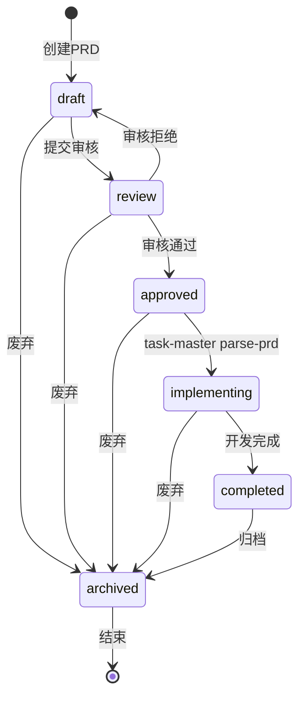

# PRD状态机设计方案

> **设计日期**: 2025-12-03
> **设计者**: Claude Sonnet 4.5
> **状态**: 设计完成，待实施

---

## 📋 问题分析

### 现有问题

1. **状态定义不一致**：

   - `prd.yaml`定义：`draft, refined, reviewed, approved, implementing, completed, archived`
   - `prd_checker.py`代码：`draft, review, approved, archived`
   - 存在不一致性

2. **状态管理混乱**：

   - 缺少明确的状态转换规则
   - 没有强制状态流转顺序
   - 没有防止非法状态跳转

3. **开发流程缺失**：
   - 没有强制PRD必须approved才能parse
   - 没有检查parse时的状态
   - pre-commit阶段检查不够严格

---

## 🎯 设计目标

1. **严格的状态机制**：明确定义状态和转换规则
2. **强制人工审核**：PRD状态只能人工修改，不能自动修改
3. **开发流程保障**：必须approved才能parse PRD
4. **多层防护**：parse时检查 + pre-commit时检查

---

## 📊 PRD状态机定义

### 1. 状态定义

```yaml
PRD_STATES:
  draft: # 草稿
    description: "PRD初稿，内容未完成"
    level: "writing"
    can_develop: false
    can_parse: false

  review: # 审核中
    description: "PRD已完成，等待审核"
    level: "review"
    can_develop: false
    can_parse: false

  approved: # 已批准
    description: "PRD已通过审核，可以开始开发"
    level: "approved"
    can_develop: true # ⭐ 唯一允许开发的状态
    can_parse: true # ⭐ 唯一允许parse的状态

  implementing: # 实施中
    description: "PRD对应功能正在开发"
    level: "development"
    can_develop: true
    can_parse: false # 已parse过，不能重复parse

  completed: # 已完成
    description: "PRD对应功能已完成"
    level: "done"
    can_develop: false
    can_parse: false

  archived: # 已归档
    description: "PRD不再使用"
    level: "archived"
    can_develop: false
    can_parse: false
```

### 2. 状态转换流程



### 3. 状态转换矩阵

| 当前状态         | 可转换到     | 触发条件                      | 人工/自动   |
| ---------------- | ------------ | ----------------------------- | ----------- |
| **draft**        | review       | PRD内容完成，提交审核         | **人工**    |
| **draft**        | archived     | 需求废弃                      | **人工**    |
| **review**       | approved     | 审核通过                      | **人工**    |
| **review**       | draft        | 审核拒绝，需要修改            | **人工**    |
| **review**       | archived     | 需求废弃                      | **人工**    |
| **approved**     | implementing | **task-master parse-prd执行** | **自动** ⭐ |
| **approved**     | archived     | 需求废弃                      | **人工**    |
| **implementing** | completed    | 所有功能开发完成              | **人工**    |
| **implementing** | archived     | 需求废弃                      | **人工**    |
| **completed**    | archived     | 归档                          | **人工**    |

**关键规则**：

- ✅ **只有一个自动转换**：`approved → implementing`（由task-master parse-prd触发）
- ✅ **其他所有转换都是人工**：防止状态被意外修改
- ✅ **不可逆转换**：completed和archived状态不能返回

---

## 🛡️ 多层防护机制

### 第一层：parse-prd工具检查

**位置**：Task Master CLI工具内部

**检查逻辑**：

```python
# task-master parse-prd执行时
def parse_prd(input_file):
    # 1. 读取PRD文件
    metadata = extract_prd_metadata(input_file)

    # 2. 检查status字段
    status = metadata.get("status", "").lower()

    if status != "approved":
        raise ValueError(
            f"❌ PRD状态为 '{status}'，无法执行parse-prd\n\n"
            f"📋 PRD必须处于 'approved' 状态才能解析为任务\n"
            f"🔄 当前状态转换流程：\n"
            f"   1. draft（草稿）→ review（审核中）→ approved（已批准）\n"
            f"   2. 人工修改PRD中的status字段为 'approved'\n"
            f"   3. 重新运行 task-master parse-prd\n\n"
            f"⚠️  状态只能人工修改，不能自动修改"
        )

    # 3. parse成功后，自动更新状态为implementing
    parse_tasks(input_file)
    update_prd_status(input_file, "implementing")  # ⭐ 唯一的自动状态修改

    print("✅ PRD已解析为任务，状态已更新为 'implementing'")
```

**效果**：

- ✅ 阻止未审核的PRD被parse
- ✅ 自动标记已parse的PRD（implementing状态）
- ✅ 防止重复parse（implementing状态不能再parse）

---

### 第二层：pre-commit检查（PRD Checker）

**位置**：`.compliance/checkers/prd_checker.py`

**检查逻辑**：

```python
def _validate_metadata(self, metadata: Dict):
    """验证PRD元数据"""
    status = metadata.get("status", "").lower()

    # 检查1：状态必须是有效值
    valid_states = ["draft", "review", "approved", "implementing", "completed", "archived"]
    if status not in valid_states:
        self.errors.append(
            f"❌ PRD状态 '{status}' 无效\n"
            f"有效状态：{', '.join(valid_states)}"
        )
        return

    # 检查2：draft状态不允许提交代码
    if status == "draft":
        self.errors.append(
            "❌ PRD状态为 'draft'，不允许提交代码\n\n"
            "📋 PRD审核流程：\n"
            "  1. draft（草稿）→ 完善PRD内容\n"
            "  2. review（审核中）→ 提交审核\n"
            "  3. approved（已批准）→ 可以开始开发\n\n"
            "⚠️  请先将PRD状态改为 'review' 或 'approved'"
        )

    # 检查3：review状态警告（允许提交PRD修改，但不允许提交实现代码）
    elif status == "review":
        # 如果是PRD文件自身的修改，允许
        # 如果是implementation_files的修改，拒绝
        # 这需要在Task0Checker中检查
        pass
```

---

### 第三层：pre-commit检查（Task0 Checker）

**位置**：`.compliance/checkers/task0_checker.py`

**检查逻辑**：

```python
def _validate_prd_metadata(self, req_id: str) -> Dict[str, Any]:
    """验证PRD元数据和状态"""
    # ... 现有逻辑 ...

    # 读取PRD元数据
    metadata = yaml.safe_load(parts[1])
    status = metadata.get("status", "").lower()

    # 状态校验（严格模式）
    if status == "draft":
        return {
            "level": "error",
            "message": "Task-0检查失败: PRD状态为draft，不允许开发",
            "file": str(prd_path),
            "help": (
                "❌ PRD状态为 'draft'，不允许提交实现代码\n\n"
                "📋 开发前置条件：\n"
                "  1. PRD必须通过审核（status = 'approved'）\n"
                "  2. 运行 task-master parse-prd 生成任务\n"
                "  3. PRD状态自动变为 'implementing'\n\n"
                "🔄 如果PRD还在草稿阶段，请先完善内容并提交审核"
            )
        }

    elif status == "review":
        # 检查是否在提交implementation_files
        impl_files = metadata.get("implementation_files", [])

        # 如果当前提交的代码文件在implementation_files中，拒绝
        # 这需要检查git staged files
        return {
            "level": "error",
            "message": "Task-0检查失败: PRD状态为review，不允许提交实现代码",
            "file": str(prd_path),
            "help": (
                "❌ PRD状态为 'review'（审核中），不允许提交实现代码\n\n"
                "📋 当前可以做的：\n"
                "  ✅ 修改PRD文件本身（完善需求）\n"
                "  ❌ 提交implementation_files中的代码\n\n"
                "🔄 等待PRD审核通过后再开发"
            )
        }

    elif status not in ["approved", "implementing", "completed"]:
        return {
            "level": "warning",
            "message": f"Task-0警告: PRD状态 '{status}' 不常见",
            "file": str(prd_path),
            "help": f"PRD状态为 '{status}'，请确认这是预期的状态"
        }

    # approved 和 implementing 状态允许开发
    return None
```

---

## 🔐 状态修改规则

### 1. 人工修改（大部分情况）

**方式**：直接编辑PRD文件的YAML frontmatter

**示例**：

```yaml
---
req_id: REQ-2025-001-user-login
title: 用户登录功能
status: draft # ← 人工修改这里
---
```

**允许的人工修改**：

- `draft → review`：PRD完成，提交审核
- `review → approved`：审核通过
- `review → draft`：审核拒绝，需要修改
- `implementing → completed`：开发完成
- `任何状态 → archived`：废弃需求

**禁止的人工修改**：

- ❌ `approved → implementing`：这个只能由task-master parse-prd自动触发
- ❌ `completed → implementing`：不可逆
- ❌ `archived → 任何状态`：不可逆

### 2. 自动修改（唯一场景）

**场景**：执行`task-master parse-prd`

**触发条件**：

1. PRD状态必须是`approved`
2. 运行`task-master parse-prd --input=<prd-file>`

**自动操作**：

```python
# task-master parse-prd内部
def parse_prd_with_status_update(input_file, output_file):
    # 1. 检查状态
    if status != "approved":
        raise ValueError("PRD状态必须是approved")

    # 2. parse任务
    tasks = generate_tasks_from_prd(input_file)
    save_tasks(output_file, tasks)

    # 3. 自动更新PRD状态 ⭐
    update_prd_frontmatter_status(input_file, "implementing")

    print(f"✅ PRD已解析为任务")
    print(f"✅ PRD状态已自动更新：approved → implementing")
```

---

## 🎯 实施计划

### Phase 1：修复现有不一致

**文件**：`.compliance/rules/prd.yaml`

```yaml
metadata_validation:
  status:
    enum:
      - draft # 草稿
      - review # 审核中
      - approved # 已批准（唯一可以parse的状态）
      - implementing # 实施中
      - completed # 已完成
      - archived # 已归档
    required: true
```

**文件**：`.compliance/checkers/prd_checker.py`

```python
# 统一使用配置中的枚举值
valid_states = self.rule_config.get("metadata_validation", {}).get("status", {}).get("enum", [])

if status not in valid_states:
    self.errors.append(f"PRD状态 '{status}' 无效，有效状态：{', '.join(valid_states)}")

if status == "draft":
    self.errors.append("PRD状态为draft，不允许开发")
```

---

### Phase 2：增强Task0Checker状态校验

**文件**：`.compliance/checkers/task0_checker.py`

**新增方法**：

```python
def _check_prd_status_for_development(self, prd_path: Path, metadata: Dict) -> Optional[Dict]:
    """
    检查PRD状态是否允许开发

    规则：
    - draft: 不允许提交任何代码
    - review: 只允许修改PRD本身，不允许提交实现代码
    - approved/implementing/completed: 允许开发
    """
    status = metadata.get("status", "").lower()

    # 草稿状态：完全拒绝
    if status == "draft":
        return {
            "level": "error",
            "message": "PRD状态为draft，不允许开发",
            "file": str(prd_path),
            "help": "请将PRD提交审核（status改为review）"
        }

    # 审核状态：检查是否在修改实现代码
    elif status == "review":
        impl_files = metadata.get("implementation_files", [])

        # 检查当前提交的文件是否是实现代码
        staged_files = self._get_staged_files()

        for staged_file in staged_files:
            # 如果staged_file匹配impl_files中的路径，拒绝
            if any(impl_pattern in staged_file for impl_pattern in impl_files):
                return {
                    "level": "error",
                    "message": "PRD状态为review，不允许提交实现代码",
                    "file": str(prd_path),
                    "help": (
                        f"当前提交的文件 '{staged_file}' 是实现代码\n"
                        f"PRD审核期间只能修改PRD文件本身"
                    )
                }

    # approved/implementing/completed: 允许开发
    return None

def _get_staged_files(self) -> List[str]:
    """获取git暂存区的文件列表"""
    try:
        result = subprocess.run(
            ["git", "diff", "--cached", "--name-only"],
            capture_output=True,
            text=True
        )
        return result.stdout.strip().split("\n")
    except Exception:
        return []
```

---

### Phase 3：Task Master集成

**文件**：`task-master` CLI工具（假设在Task Master仓库）

**修改parse-prd命令**：

```python
def parse_prd_command(input_file, output_file, **kwargs):
    """
    Parse PRD with status validation
    """
    # 1. 读取PRD元数据
    metadata = extract_prd_metadata(input_file)
    status = metadata.get("status", "").lower()

    # 2. 状态校验
    if status != "approved":
        print(f"❌ Error: PRD状态为 '{status}'，无法执行parse-prd")
        print()
        print("📋 PRD必须处于 'approved' 状态才能解析为任务")
        print()
        print("🔄 状态转换流程：")
        print("   1. 完善PRD内容")
        print("   2. 修改status字段：draft → review → approved")
        print("   3. 重新运行 task-master parse-prd")
        print()
        print("⚠️  状态只能人工修改，不能自动修改")
        sys.exit(1)

    # 3. Parse任务
    print(f"✅ PRD状态检查通过：{status}")
    print(f"🔄 开始解析PRD...")

    tasks = generate_tasks_from_prd(input_file, **kwargs)
    save_tasks(output_file, tasks)

    # 4. 自动更新PRD状态
    update_prd_status(input_file, "implementing")

    print()
    print("✅ PRD已成功解析为任务")
    print(f"✅ PRD状态已自动更新：approved → implementing")
    print()
    print("📝 下一步：")
    print("   1. 查看生成的任务：task-master list")
    print("   2. 开始开发：根据任务顺序实施")
```

---

## 📊 状态检查汇总表

| 检查点           | 检查器       | draft   | review    | approved | implementing      | completed | archived  |
| ---------------- | ------------ | ------- | --------- | -------- | ----------------- | --------- | --------- |
| **parse-prd**    | Task Master  | ❌拒绝  | ❌拒绝    | ✅允许   | ❌拒绝（已parse） | ❌拒绝    | ❌拒绝    |
| **PRD文件检查**  | PRDChecker   | ❌ERROR | ⚠️WARNING | ✅通过   | ✅通过            | ✅通过    | ⚠️WARNING |
| **实现代码检查** | Task0Checker | ❌ERROR | ❌ERROR\* | ✅通过   | ✅通过            | ✅通过    | ⚠️WARNING |

**说明**：

- `*` review状态时，只允许修改PRD文件，不允许提交实现代码

---

## 🎯 用户使用流程

### 场景1：正常开发流程

```bash
# 1. 创建PRD（status: draft）
vim docs/00_product/requirements/REQ-2025-001/REQ-2025-001.md

# 2. 完善PRD内容
# ...

# 3. 提交审核（人工修改status: draft → review）
# 修改PRD中的status字段
status: review

# 4. 审核通过（人工修改status: review → approved）
# 审核人修改PRD中的status字段
status: approved

# 5. 解析PRD为任务（自动更新status: approved → implementing）
task-master parse-prd --input=docs/00_product/requirements/REQ-2025-001/REQ-2025-001.md

# 输出：
# ✅ PRD状态检查通过：approved
# 🔄 开始解析PRD...
# ✅ PRD已成功解析为任务
# ✅ PRD状态已自动更新：approved → implementing

# 6. 开始开发
task-master list
task-master next
# ...

# 7. 开发完成（人工修改status: implementing → completed）
# 修改PRD中的status字段
status: completed
```

### 场景2：未审核就parse（错误流程）

```bash
# 1. PRD状态为draft
status: draft

# 2. 尝试parse
task-master parse-prd --input=REQ-2025-001.md

# 输出：
# ❌ Error: PRD状态为 'draft'，无法执行parse-prd
#
# 📋 PRD必须处于 'approved' 状态才能解析为任务
#
# 🔄 状态转换流程：
#    1. 完善PRD内容
#    2. 修改status字段：draft → review → approved
#    3. 重新运行 task-master parse-prd
#
# ⚠️  状态只能人工修改，不能自动修改
```

### 场景3：未审核就提交代码（错误流程）

```bash
# 1. PRD状态为draft，但开发者已经写了代码
status: draft

# 2. 尝试提交代码
git add backend/apps/users/views.py
git commit -m "实现用户登录"

# 输出（pre-commit阶段）：
# ========================================
# 🔍 [第四层] V4合规引擎检查
# ========================================
#
# ❌ Task-0检查失败: PRD状态为draft，不允许开发
#
# 文件: docs/00_product/requirements/REQ-2025-001/REQ-2025-001.md
#
# ❌ PRD状态为 'draft'，不允许提交实现代码
#
# 📋 开发前置条件：
#   1. PRD必须通过审核（status = 'approved'）
#   2. 运行 task-master parse-prd 生成任务
#   3. PRD状态自动变为 'implementing'
#
# 🔄 如果PRD还在草稿阶段，请先完善内容并提交审核
#
# [ERROR] 提交被拒绝
```

---

## ✅ 实施验证清单

### PRD状态机实施

- [ ] 统一状态定义（prd.yaml和prd_checker.py）
- [ ] 实现PRDChecker状态校验增强
- [ ] 实现Task0Checker状态校验增强
- [ ] Task Master parse-prd命令增加状态检查
- [ ] Task Master parse-prd成功后自动更新状态

### 文档完善

- [ ] PRD模板更新（包含状态说明）
- [ ] 开发流程文档更新
- [ ] 状态转换流程图
- [ ] 用户使用指南

### 测试验证

- [ ] 测试draft状态拒绝parse
- [ ] 测试review状态拒绝parse
- [ ] 测试approved状态允许parse
- [ ] 测试parse后自动更新为implementing
- [ ] 测试draft状态拒绝提交实现代码
- [ ] 测试review状态拒绝提交实现代码
- [ ] 测试approved/implementing状态允许提交代码

---

## 🎯 总结

**核心原则**：

1. **状态严格管理**：明确定义6种状态，清晰的转换规则
2. **人工审核为主**：只有一个自动状态转换（approved → implementing）
3. **多层防护机制**：parse工具检查 + pre-commit检查
4. **用户友好提示**：详细的错误信息和修复指导

**关键规则**：

- ✅ **PRD必须approved才能parse**
- ✅ **parse成功后自动变为implementing**
- ✅ **draft和review状态不允许提交实现代码**
- ✅ **所有其他状态转换都必须人工修改**

---

**状态机设计完成，确保PRD管理规范化！** 🎉

_设计模型：Claude Sonnet 4.5 (claude-sonnet-4-20250514)_
