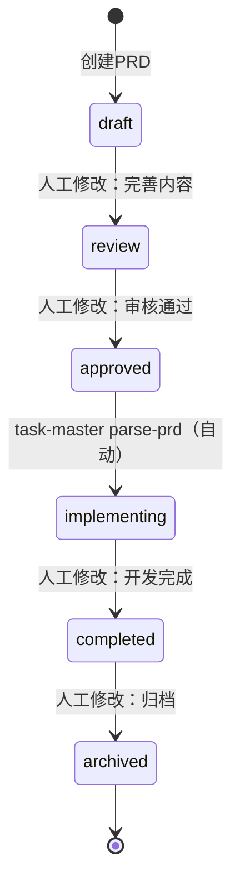

# PRD状态机验证实现方案

## 📋 背景

根据V4设计方案，只有`approved`状态的PRD才能被task-master parse，其他状态应该拒绝并给出清晰提示。

## 🎯 目标

实现一个PRD状态验证机制，在parse-prd执行前自动检查PRD状态，无论是CLI还是MCP工具都能生效。

## 🏗️ 实现方案

### 方案选择

由于task-master是外部工具（npm全局安装），我们无法直接修改其源码。因此采用**包装脚本方案**：

1. 创建Python验证器：`scripts/task-master/prd_status_validator.py`
2. 在需要parse-prd的地方，先调用验证器
3. 验证通过后，再调用真实的task-master parse-prd

### 架构图

```
用户/AI调用
    ↓
PRD状态验证器 (prd_status_validator.py)
    ↓
检查PRD frontmatter status字段
    ↓
    ├─ 标准PRD路径（docs/00_product/requirements/） → 严格检查status
    │   ├─ status == "approved" → ✅ 允许parse
    │   └─ status != "approved" → ❌ 拒绝parse，显示详细错误
    │
    └─ 快速需求路径（.taskmaster/docs/） → 跳过状态检查
        └─ ✅ 允许parse（无frontmatter要求）
    ↓
调用真实的task-master parse-prd
    ↓
Parse成功后，自动更新status → implementing
```

## 📝 核心实现

### 1. PRD状态验证器

**文件**：`scripts/task-master/prd_status_validator.py`

**核心功能**：

```python
class PRDStatusValidator:
    def validate(self) -> Tuple[bool, Optional[str]]:
        """验证PRD状态是否允许parse"""
        # 1. 检查文件是否存在
        # 2. 判断是否为标准PRD路径
        # 3. 标准PRD：严格检查status字段
        # 4. 快速需求：跳过状态检查
        # 5. 返回验证结果和错误消息

    def update_status_to_implementing(self) -> bool:
        """Parse成功后，自动更新status为implementing"""
        # 唯一允许的自动状态修改
```

**路径判断逻辑**：

| 路径类型                        | 检查策略       | 原因                               |
| ------------------------------- | -------------- | ---------------------------------- |
| `docs/00_product/requirements/` | 严格检查status | 标准PRD，需要审核流程              |
| `.taskmaster/docs/`             | 跳过状态检查   | 快速需求文件，无frontmatter要求    |
| 其他路径                        | 跳过状态检查   | 兼容性考虑，避免阻塞非标准使用场景 |

### 2. 状态检查规则

**只允许approved状态parse**：

```python
if status != "approved":
    return False, error_message  # 拒绝parse
```

**拒绝其他状态的原因**：

| 状态           | 是否允许parse | 拒绝原因                 | 用户操作提示                            |
| -------------- | ------------- | ------------------------ | --------------------------------------- |
| `draft`        | ❌            | PRD还在草稿阶段，未完成  | 完善PRD内容，修改status为approved       |
| `review`       | ❌            | PRD正在审核中，未批准    | 等待审核通过，修改status为approved      |
| `approved`     | ✅            | PRD已批准，可以开始开发  | 可以parse                               |
| `implementing` | ❌            | PRD已被parse，任务已生成 | 查看现有任务或强制重新parse（谨慎操作） |
| `completed`    | ❌            | PRD对应的需求已完成      | 创建新PRD                               |
| `archived`     | ❌            | PRD已归档/废弃           | 恢复PRD或创建新PRD                      |

### 3. 错误消息设计

针对不同状态，提供详细的错误消息和操作指导：

```
❌ PRD状态为 'draft'（草稿），无法执行parse-prd

📋 PRD信息:
   REQ-ID: REQ-2025-003-user-login
   标题: 用户登录功能
   文件: docs/00_product/requirements/REQ-2025-003-user-login/REQ-2025-003-user-login.md

🔄 PRD必须处于 'approved' 状态才能解析为任务

✅ 状态转换流程:
   1. draft（草稿） → 完善PRD内容
   2. review（审核中） → 提交审核
   3. approved（已批准） → 可以parse

📝 操作步骤:
   1. 打开PRD文件: docs/00_product/requirements/...
   2. 修改frontmatter中的status字段:
      status: draft  →  status: approved
   3. 保存文件后重新运行parse-prd

⚠️  状态只能人工修改，不能自动修改
```

## 🔧 使用方式

### 独立使用（测试）

```bash
# 验证PRD状态
python scripts/task-master/prd_status_validator.py docs/00_product/requirements/REQ-2025-001/REQ-2025-001.md

# 退出码:
#   0 - 验证通过，可以parse
#   1 - 验证失败，不能parse
```

### 集成到parse-prd流程

#### 方式1：通过shell脚本包装

创建 `scripts/task-master-parse-prd.sh`：

```bash
#!/bin/bash
# Task-Master parse-prd包装脚本，带PRD状态验证

PRD_FILE="$1"

# 1. 验证PRD状态
python scripts/task-master/prd_status_validator.py "$PRD_FILE"
if [ $? -ne 0 ]; then
    echo ""
    echo "❌ PRD状态验证失败，parse-prd操作被拒绝"
    exit 1
fi

# 2. 调用真实的task-master parse-prd
echo ""
echo "🚀 开始执行parse-prd..."
task-master parse-prd --input="$PRD_FILE" "${@:2}"
PARSE_EXIT_CODE=$?

# 3. Parse成功后，自动更新PRD状态为implementing
if [ $PARSE_EXIT_CODE -eq 0 ]; then
    python -c "
from scripts.task_master.prd_status_validator import PRDStatusValidator
validator = PRDStatusValidator('$PRD_FILE')
validator.update_status_to_implementing()
"
fi

exit $PARSE_EXIT_CODE
```

#### 方式2：通过MCP工具集成

修改MCP工具的parse-prd实现，在调用task-master前添加验证：

```python
async def mcp_taskmaster_parse_prd(input_file: str, **kwargs):
    """Parse PRD with status validation"""

    # 1. 验证PRD状态
    validator = PRDStatusValidator(input_file)
    is_valid, error_msg = validator.validate()

    if not is_valid:
        raise ValueError(error_msg)

    # 2. 调用真实的parse-prd
    result = await call_taskmaster_parse_prd(input_file, **kwargs)

    # 3. 更新PRD状态
    validator.update_status_to_implementing()

    return result
```

#### 方式3：通过pre-commit hook（备选）

如果无法修改parse-prd调用链，可以通过pre-commit hook阻止提交未审核PRD生成的任务：

```python
# .compliance/checkers/taskmaster_checker.py
def check_taskmaster_tasks(self, files):
    """检查task-master生成的任务对应的PRD状态"""
    for task_file in files:
        if ".taskmaster/tasks/" in task_file:
            req_id = extract_req_id_from_path(task_file)
            prd_path = get_prd_path(req_id)

            validator = PRDStatusValidator(prd_path)
            is_valid, error_msg = validator.validate()

            if not is_valid:
                return {
                    "level": "error",
                    "message": f"检测到未审核PRD生成的任务: {req_id}",
                    "help": error_msg
                }
```

## 📊 状态转换流程

### 正常流程



### 状态修改权限

| 状态转换                    | 修改方式 | 触发条件                      |
| --------------------------- | -------- | ----------------------------- |
| draft → review              | 人工     | PRD内容完善                   |
| review → approved           | 人工     | PRD审核通过                   |
| review → draft              | 人工     | PRD需要修改                   |
| **approved → implementing** | **自动** | **task-master parse-prd成功** |
| implementing → completed    | 人工     | 开发完成                      |
| 任何状态 → archived         | 人工     | 废弃需求                      |

### 特殊规则

1. **implementing状态不能重复parse**：

   - 防止意外覆盖已生成的任务
   - 如需重新parse，需人工修改status回approved

2. **completed和archived不可逆**：
   - 确保已完成/归档的PRD不被误操作
   - 如需修改，应创建新PRD

## 🧪 测试验证

### 测试场景

| 场景                                  | PRD路径类型 | PRD status              | 预期结果     |
| ------------------------------------- | ----------- | ----------------------- | ------------ |
| 标准PRD，draft状态                    | 标准路径    | draft                   | ❌ 拒绝parse |
| 标准PRD，review状态                   | 标准路径    | review                  | ❌ 拒绝parse |
| 标准PRD，approved状态                 | 标准路径    | approved                | ✅ 允许parse |
| 标准PRD，implementing状态             | 标准路径    | implementing            | ❌ 拒绝parse |
| 标准PRD，completed状态                | 标准路径    | completed               | ❌ 拒绝parse |
| 标准PRD，archived状态                 | 标准路径    | archived                | ❌ 拒绝parse |
| 快速需求，无frontmatter               | 快速路径    | (无)                    | ✅ 允许parse |
| 快速需求，有frontmatter但status=draft | 快速路径    | draft                   | ✅ 允许parse |
| Parse成功后，状态自动更新             | 标准路径    | approved → implementing | ✅ 自动更新  |

### 测试命令

```bash
# 1. 准备测试PRD
mkdir -p docs/00_product/requirements/REQ-TEST-001
cat > docs/00_product/requirements/REQ-TEST-001/REQ-TEST-001.md << 'EOF'
---
req_id: REQ-TEST-001
title: 测试PRD
status: draft
---
# 测试PRD内容
EOF

# 2. 测试draft状态（应该失败）
python scripts/task-master/prd_status_validator.py docs/00_product/requirements/REQ-TEST-001/REQ-TEST-001.md
echo "退出码: $?"  # 应该是1

# 3. 修改为approved状态
sed -i 's/status: draft/status: approved/' docs/00_product/requirements/REQ-TEST-001/REQ-TEST-001.md

# 4. 测试approved状态（应该成功）
python scripts/task-master/prd_status_validator.py docs/00_product/requirements/REQ-TEST-001/REQ-TEST-001.md
echo "退出码: $?"  # 应该是0

# 5. 测试快速需求（应该成功）
echo "快速需求测试" > .taskmaster/docs/test-quick.txt
python scripts/task-master/prd_status_validator.py .taskmaster/docs/test-quick.txt
echo "退出码: $?"  # 应该是0
```

## 🔄 集成建议

### 推荐方案（短期）

创建包装脚本 `scripts/task-master-parse-prd.sh`，在项目文档中引导用户使用：

```bash
# 不要直接使用 task-master parse-prd
# 使用项目提供的包装脚本
./scripts/task-master-parse-prd.sh docs/00_product/requirements/REQ-2025-001/REQ-2025-001.md
```

### 理想方案（长期）

1. **贡献到task-master上游**：

   - 向task-master项目提PR，内置PRD状态检查
   - 成为task-master的标准功能

2. **自定义task-master分支**：
   - Fork task-master仓库
   - 添加状态检查功能
   - 在项目中使用自定义版本

## 📚 相关文档

- [PRD状态机设计方案](./PRD_STATE_MACHINE_DESIGN.md)
- [PRD工作流完整指南](./PRD_WORKFLOW_COMPLETE_GUIDE.md)
- [Task-Master命令参考](.cursor/rules/taskmaster/taskmaster.mdc)

## ✅ 实现检查清单

- [x] 创建PRD状态验证器 (`prd_status_validator.py`)
- [ ] 创建包装脚本 (`task-master-parse-prd.sh`)
- [ ] 更新项目文档，引导使用包装脚本
- [ ] 添加测试用例
- [ ] 集成到MCP工具（可选）
- [ ] 集成到pre-commit hook（备选方案）
