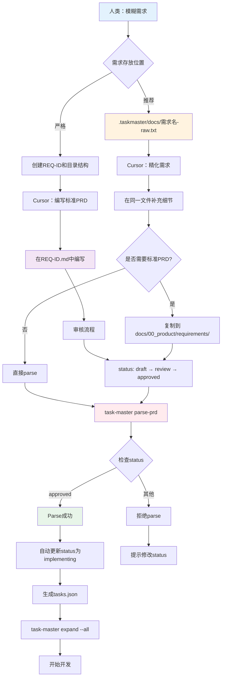

# PRD工作流完整指南 - 从模糊需求到开发落地

> **版本**: V4.0
> **日期**: 2025-12-03
> **作者**: Claude Sonnet 4.5

---

## 📊 核心问题解答

### Q1: 人类的模糊需求放在哪里？

**答案**：`.taskmaster/docs/` 目录

**路径约定**：

```
.taskmaster/docs/
├── {需求名称}-raw.txt        # 人类的原始需求（模糊、简短）
├── {需求名称}-refined.txt    # Cursor第一次精化（可选）
└── example_prd.txt           # 示例模板
```

**特点**：

- ✅ 格式自由，可以是简短的文本
- ✅ 不需要YAML frontmatter
- ✅ 不需要严格的章节结构
- ✅ 仅用于Task Master parse-prd的输入

---

### Q2: Cursor精化之后的PRD放在哪里？

**答案**：`docs/00_product/requirements/{REQ-ID}/` 目录

**路径约定**：

```
docs/00_product/requirements/
└── {REQ-ID}/
    ├── {REQ-ID}.md           # ⭐ 精化后的标准PRD（主文件）
    ├── {REQ-ID}-TRD.md       # 技术需求文档（可选）
    ├── attachments/          # 附件（图片、原型）
    └── history/              # 历史版本
```

**特点**：

- ✅ 必须包含YAML frontmatter（元数据）
- ✅ 必须包含所有必需章节（功能概述、用户故事等）
- ✅ 必须关联test_files和implementation_files
- ✅ 受V4合规引擎检查（pre-commit阶段）

**REQ-ID格式**：`REQ-YYYY-NNN-description`

- YYYY：年份（如2025）
- NNN：三位数字序号（001-999）
- description：简短描述（kebab-case）

**示例**：

- `REQ-2025-001-user-login`
- `REQ-2025-002-product-catalog`
- `REQ-2025-003-shopping-cart`

---

### Q3: 路径约束

**严格约束的路径**：

| 文件类型            | 路径模式                                                     | 是否强制 | 检查器     |
| ------------------- | ------------------------------------------------------------ | -------- | ---------- |
| **原始需求**        | `.taskmaster/docs/*.txt`                                     | 推荐     | 无检查     |
| **精化PRD**         | `docs/00_product/requirements/{REQ-ID}/{REQ-ID}.md`          | **强制** | Task0, PRD |
| **API契约**         | `docs/01_guideline/api-contracts/{REQ-ID}/{REQ-ID}-api.yaml` | 推荐     | Task0      |
| **Task-Master任务** | `.taskmaster/tasks/tasks.json`                               | 强制     | Task0      |

**违反路径约束的后果**：

- ❌ Task0检查失败：找不到PRD文件
- ❌ PRD检查失败：文件不在预期路径
- ❌ pre-commit拒绝提交

---

### Q4: 如何parse精化后的PRD？

**答案**：使用Task Master的两种方式

#### 方式1：Parse .taskmaster/docs/下的原始需求（推荐）

```bash
# 1. 人类创建原始需求
cat > .taskmaster/docs/user-login-raw.txt << EOF
我需要一个用户登录功能
- 支持邮箱和密码登录
- 需要JWT认证
- 要有前端登录页面
EOF

# 2. Cursor精化为详细的PRD内容（在.taskmaster/docs/目录）
# Cursor会补充技术细节、数据库设计、API定义等

# 3. Task Master解析（自动生成tasks.json）
task-master parse-prd --input=.taskmaster/docs/user-login-raw.txt

# 输出：.taskmaster/tasks/tasks.json
```

#### 方式2：Parse docs/00_product下的标准PRD（严格模式）

```bash
# 1. 创建标准PRD目录和文件
mkdir -p docs/00_product/requirements/REQ-2025-001-user-login
touch docs/00_product/requirements/REQ-2025-001-user-login/REQ-2025-001-user-login.md

# 2. Cursor在标准PRD文件中编写内容（包含YAML frontmatter）
# ... 编辑REQ-2025-001-user-login.md ...

# 3. 人工修改PRD状态
# 修改PRD中的status字段：draft → review → approved

# 4. Task Master解析（检查status必须是approved）
task-master parse-prd --input=docs/00_product/requirements/REQ-2025-001-user-login/REQ-2025-001-user-login.md

# 5. parse成功后，PRD status自动更新为implementing
```

---

## 🔄 完整工作流程

### 流程图



### 详细步骤说明

#### 阶段1：人类提需求

**方式A：快速开发模式（推荐新手）**

```bash
# 步骤1：在.taskmaster/docs/创建原始需求文件
cat > .taskmaster/docs/user-profile-management.txt << 'EOF'
# 用户个人资料管理功能

## 需求描述
我需要一个用户个人资料管理页面，用户可以：
- 查看自己的个人信息（姓名、邮箱、头像）
- 编辑这些信息
- 保存后立即生效

## 技术要求
- 后端使用Django REST framework
- 前端使用Vue 3
- 数据存储在MySQL

## 优先级
高优先级，计划在本周完成
EOF

# 状态：人类需求已记录 ✅
```

**方式B：严格流程模式（推荐团队协作）**

```bash
# 步骤1：创建REQ-ID和目录结构
mkdir -p docs/00_product/requirements/REQ-2025-001-user-profile

# 步骤2：创建PRD文件（从模板开始）
cat > docs/00_product/requirements/REQ-2025-001-user-profile/REQ-2025-001-user-profile.md << 'EOF'
---
req_id: REQ-2025-001-user-profile
title: 用户个人资料管理功能
status: draft  # ⭐ 初始状态：draft
priority: high
type: feature
author: human
test_files: []  # 待Cursor补充
implementation_files: []  # 待Cursor补充
deletable: false
---

# 功能概述

用户可以查看和编辑自己的个人资料。

# 用户故事

作为一个注册用户，我希望能够...

（待Cursor精化）
EOF

# 状态：PRD框架已创建 ✅
```

---

#### 阶段2：Cursor精化PRD

**方式A：精化.taskmaster/docs/中的原始需求**

```bash
# Cursor在.taskmaster/docs/user-profile-management.txt中补充：

# 用户个人资料管理功能

## 需求描述
（保留原始需求）

## 数据库设计

### UserProfile表
| 字段名 | 类型 | 说明 | 约束 |
|--------|------|------|------|
| id | UUID | 主键 | PK, NOT NULL |
| user_id | UUID | 用户ID | FK → User.id, UNIQUE |
| avatar_url | VARCHAR(500) | 头像URL | |
| bio | TEXT | 个人简介 | |

## API接口定义

### GET /api/users/profile
获取当前用户的个人资料...

### PUT /api/users/profile
更新当前用户的个人资料...

## 测试策略

### 单元测试
- test_user_profile_model.py
- test_user_profile_views.py

### E2E测试
- test-user-profile.spec.ts

## 前端实现

### 组件设计
- ProfileView.vue（主页面）
- ProfileForm.vue（编辑表单）
...

# 状态：详细PRD已完成 ✅
```

**方式B：精化docs/00_product中的标准PRD**

```bash
# Cursor在REQ-2025-001-user-profile.md中补充完整的内容

---
req_id: REQ-2025-001-user-profile
title: 用户个人资料管理功能
status: draft  # ⭐ 仍然是draft
priority: high
type: feature
author: human
refined_by: cursor  # ⭐ 标记精化者
test_files:  # ⭐ Cursor补充
  - backend/tests/unit/test_user_profile.py
  - e2e/tests/test-user-profile.spec.ts
implementation_files:  # ⭐ Cursor补充
  - backend/apps/users/models.py
  - backend/apps/users/views.py
  - frontend/src/views/UserProfile.vue
api_contract: docs/01_guideline/api-contracts/REQ-2025-001/api.yaml
deletable: false
---

# 功能概述
（Cursor补充详细说明）

# 业务背景
（Cursor补充）

# 用户故事
（Cursor补充）

# 验收标准
1. ...
2. ...
3. ...

# 数据库设计
（Cursor补充完整表结构）

# API接口定义
（Cursor补充完整API规范）

# 前端UI/UX设计
（Cursor补充）

# 测试用例
（Cursor补充）

# 状态：完整PRD已生成 ✅
```

---

#### 阶段3：PRD审核（方式B必需）

**只有方式B（标准PRD）需要审核**

```bash
# 步骤1：提交审核
# 人工修改PRD中的status字段
status: review  # draft → review

# 步骤2：审核通过
# 审核人修改PRD中的status字段
status: approved  # review → approved

# 状态：PRD已批准 ✅
```

**方式A（快速模式）可以跳过审核**，直接parse。

---

#### 阶段4：Parse PRD为任务

**方式A：Parse .taskmaster/docs/（快速模式）**

```bash
# 直接parse，无需审核
task-master parse-prd --input=.taskmaster/docs/user-profile-management.txt

# 输出：
# ✅ PRD已解析为任务
# 📁 任务文件：.taskmaster/tasks/tasks.json

# 查看生成的任务
task-master list
```

**方式B：Parse docs/00_product/（严格模式）**

```bash
# 检查status必须是approved
task-master parse-prd --input=docs/00_product/requirements/REQ-2025-001-user-profile/REQ-2025-001-user-profile.md

# 如果status不是approved，会报错：
# ❌ Error: PRD状态为 'draft'，无法执行parse-prd
#
# 📋 PRD必须处于 'approved' 状态才能解析为任务
#
# 🔄 当前状态转换流程：
#    1. 完善PRD内容
#    2. 修改status字段：draft → review → approved
#    3. 重新运行 task-master parse-prd

# 如果status是approved，parse成功：
# ✅ PRD状态检查通过：approved
# 🔄 开始解析PRD...
# ✅ PRD已成功解析为任务
# ✅ PRD状态已自动更新：approved → implementing  ⭐ 自动更新
```

---

#### 阶段5：展开任务和开发

```bash
# 1. 分析任务复杂度
task-master analyze-complexity --research

# 2. 展开所有任务为子任务
task-master expand --all --research

# 3. 生成txt文件（方便AI查看）
task-master generate

# 4. 查看下一个任务
task-master next

# 5. 开始开发
# ...

# 状态：开发进行中 ✅
```

---

## 📁 完整目录结构

```
Bravo/
├── .taskmaster/                        # Task Master工作目录
│   ├── docs/                           # ⭐ 人类的原始需求（模糊、简短）
│   │   ├── user-login-raw.txt         # 原始需求1
│   │   ├── product-catalog-raw.txt    # 原始需求2
│   │   ├── user-profile-refined.txt   # 精化需求（可选）
│   │   └── templates/
│   │       └── example_prd.txt        # 示例模板
│   │
│   ├── tasks/                          # Task Master生成的任务
│   │   ├── tasks.json                 # 主任务列表
│   │   ├── task-1.txt                 # 任务1的txt文件
│   │   └── task-2.txt                 # 任务2的txt文件
│   │
│   └── reports/                        # 复杂度分析报告
│       └── task-complexity-report.json
│
├── docs/                               # 项目文档根目录
│   ├── 00_product/                     # 产品文档
│   │   └── requirements/               # ⭐ Cursor精化后的标准PRD
│   │       ├── REQ-2025-001-user-login/
│   │       │   ├── REQ-2025-001-user-login.md     # ⭐ 精化后的标准PRD
│   │       │   ├── REQ-2025-001-user-login-TRD.md # 技术文档（可选）
│   │       │   ├── attachments/                   # 附件
│   │       │   └── history/                       # 历史版本
│   │       │
│   │       ├── REQ-2025-002-product-catalog/
│   │       │   └── REQ-2025-002-product-catalog.md
│   │       │
│   │       └── REQ-2025-003-user-profile/
│   │           └── REQ-2025-003-user-profile.md
│   │
│   └── 01_guideline/                   # 开发指南
│       └── api-contracts/              # API契约
│           ├── REQ-2025-001/
│           │   └── REQ-2025-001-api.yaml
│           └── REQ-2025-002/
│               └── REQ-2025-002-api.yaml
```

---

## 🎯 两种模式对比

### 快速开发模式（方式A）

**适用场景**：

- ✅ 个人开发
- ✅ 原型验证
- ✅ 快速迭代

**流程**：

```
人类需求(.taskmaster/docs/)
  → Cursor精化（同一文件）
  → Task Master parse（无状态检查）
  → 生成任务
  → 开始开发
```

**优点**：

- ✅ 流程简单，快速上手
- ✅ 无需审核流程
- ✅ 灵活自由

**缺点**：

- ❌ 缺少审核环节
- ❌ 不受V4合规检查
- ❌ 不适合团队协作

---

### 严格流程模式（方式B）

**适用场景**：

- ✅ 团队协作
- ✅ 正式项目
- ✅ 需要审核流程

**流程**：

```
人类需求(.taskmaster/docs/)
  → Cursor精化（创建标准PRD in docs/00_product/）
  → PRD审核（draft → review → approved）
  → Task Master parse（检查status=approved）
  → PRD自动更新（implementing）
  → 生成任务
  → 开始开发
```

**优点**：

- ✅ 强制审核流程
- ✅ V4合规检查保护
- ✅ 状态机管理
- ✅ 适合团队协作

**缺点**：

- ❌ 流程相对复杂
- ❌ 需要人工审核

---

## 📋 Parse-PRD命令详解

### 基本命令

```bash
task-master parse-prd --input=<prd-file-path> [options]
```

### 参数说明

| 参数          | 说明             | 示例                                                                                        |
| ------------- | ---------------- | ------------------------------------------------------------------------------------------- |
| `--input`     | PRD文件路径      | `.taskmaster/docs/login.txt` 或 `docs/00_product/requirements/REQ-2025-001/REQ-2025-001.md` |
| `--output`    | 输出路径（可选） | `.taskmaster/tasks/tasks.json`（默认）                                                      |
| `--num-tasks` | 生成任务数量     | `--num-tasks=5`（可选）                                                                     |
| `--force`     | 强制覆盖         | `--force`（可选）                                                                           |
| `--research`  | 使用research模型 | `--research`（可选）                                                                        |

### 实际例子

**例子1：Parse快速需求**

```bash
# 输入文件：.taskmaster/docs/shopping-cart.txt
task-master parse-prd --input=.taskmaster/docs/shopping-cart.txt

# 无状态检查，直接parse
```

**例子2：Parse标准PRD**

```bash
# 输入文件：docs/00_product/requirements/REQ-2025-005-checkout/REQ-2025-005-checkout.md
task-master parse-prd --input=docs/00_product/requirements/REQ-2025-005-checkout/REQ-2025-005-checkout.md

# 检查status必须是approved
# parse成功后自动更新status为implementing
```

**例子3：使用research模型（更智能）**

```bash
task-master parse-prd \
  --input=docs/00_product/requirements/REQ-2025-006-payment/REQ-2025-006-payment.md \
  --research \
  --num-tasks=8

# 使用Perplexity research模型
# 生成8个主任务
```

---

## 🛡️ Pre-commit检查机制

### 检查时机

**触发条件**：提交包含implementation_files中的代码文件

**检查逻辑**：

```python
# Task0Checker检查流程
def check(files):
    # 1. 从代码文件中提取REQ-ID
    req_ids = extract_req_ids(files)

    # 2. 查找对应的PRD文件
    prd_path = f"docs/00_product/requirements/{req_id}/{req_id}.md"

    # 3. 读取PRD元数据
    metadata = extract_yaml_frontmatter(prd_path)
    status = metadata.get("status")

    # 4. 状态检查
    if status == "draft":
        return ERROR("PRD状态为draft，不允许开发")

    elif status == "review":
        # 检查是否在提交实现代码
        if is_implementation_file(file) and file in metadata["implementation_files"]:
            return ERROR("PRD审核中，不允许提交实现代码")

    elif status == "approved":
        return WARNING("PRD已批准但未parse，建议先运行 task-master parse-prd")

    elif status in ["implementing", "completed"]:
        return PASS("允许开发")
```

### 检查结果

| PRD状态          | 提交PRD文件 | 提交实现代码 | 是否阻断  |
| ---------------- | ----------- | ------------ | --------- |
| **draft**        | ⚠️ WARNING  | ❌ ERROR     | ✅ 阻断   |
| **review**       | ✅ PASS     | ❌ ERROR     | ✅ 阻断   |
| **approved**     | ✅ PASS     | ⚠️ WARNING   | ⚠️ 警告   |
| **implementing** | ✅ PASS     | ✅ PASS      | ❌ 不阻断 |
| **completed**    | ✅ PASS     | ✅ PASS      | ❌ 不阻断 |
| **archived**     | ⚠️ WARNING  | ⚠️ WARNING   | ⚠️ 警告   |

---

## 🎯 推荐工作流程

### 推荐流程：混合模式

**结合快速模式和严格模式的优点**

```bash
# ============================================
# 阶段1：快速探索（使用.taskmaster/docs/）
# ============================================

# 1. 人类提原始需求
cat > .taskmaster/docs/user-profile-raw.txt << 'EOF'
需要用户个人资料管理功能
- 查看和编辑个人信息
- 包括姓名、邮箱、头像
EOF

# 2. Cursor在同一文件中精化
# （补充数据库设计、API定义等）

# 3. 快速parse，生成初步任务
task-master parse-prd --input=.taskmaster/docs/user-profile-raw.txt

# 4. 查看任务，评估可行性
task-master list
task-master analyze-complexity

# ============================================
# 阶段2：正式立项（迁移到标准PRD）
# ============================================

# 5. 创建标准PRD（如果评估通过）
mkdir -p docs/00_product/requirements/REQ-2025-003-user-profile

# 6. 将精化后的内容复制到标准PRD
# 添加YAML frontmatter
cat > docs/00_product/requirements/REQ-2025-003-user-profile/REQ-2025-003-user-profile.md << 'EOF'
---
req_id: REQ-2025-003-user-profile
title: 用户个人资料管理功能
status: draft  # ⭐ 重新开始状态机
author: human
refined_by: cursor
test_files:
  - backend/tests/unit/test_user_profile.py
  - e2e/tests/test-user-profile.spec.ts
implementation_files:
  - backend/apps/users/models.py
  - backend/apps/users/views.py
  - frontend/src/views/UserProfile.vue
deletable: false
---

（复制.taskmaster/docs/user-profile-raw.txt的精化内容）
EOF

# 7. 提交审核
# status: draft → review → approved

# 8. 重新parse（使用标准PRD）
task-master parse-prd --input=docs/00_product/requirements/REQ-2025-003-user-profile/REQ-2025-003-user-profile.md

# parse成功后：
# ✅ PRD状态自动更新：approved → implementing
# ✅ 现在受V4合规检查保护

# ============================================
# 阶段3：开发（受合规保护）
# ============================================

# 9. 展开任务
task-master expand --all --research

# 10. 生成txt文件
task-master generate

# 11. 开始开发
task-master next

# 12. 提交代码（pre-commit会检查PRD状态）
git add backend/apps/users/views.py
git commit -m "feat(users): 实现用户资料API"

# Pre-commit检查：
# ✅ PRD状态为implementing，允许提交
# ✅ 代码关联到REQ-2025-003
# ✅ 代码质量检查通过
# ✅ 提交成功
```

---

## ⚠️ 常见错误和解决

### 错误1：Parse时PRD状态不对

```bash
task-master parse-prd --input=docs/00_product/requirements/REQ-2025-001/REQ-2025-001.md

# 错误：
❌ Error: PRD状态为 'draft'，无法执行parse-prd

# 解决：
# 1. 打开PRD文件
# 2. 修改status字段
status: approved  # 改为approved

# 3. 重新parse
task-master parse-prd --input=...
```

### 错误2：提交代码时PRD状态不对

```bash
git commit -m "实现功能"

# Pre-commit错误：
❌ Task-0检查失败: PRD状态为draft，不允许开发

# 解决：
# 方式1：完成PRD审核流程
status: draft → review → approved
task-master parse-prd

# 方式2：如果只是测试，使用快速模式
# 在.taskmaster/docs/创建需求文件并parse
```

### 错误3：找不到PRD文件

```bash
git commit -m "实现功能"

# Pre-commit错误：
❌ Task-0检查失败: PRD文件不存在
文件: docs/00_product/requirements/REQ-2025-999/REQ-2025-999.md

# 原因：代码中的REQ-ID与PRD路径不匹配

# 解决：
# 1. 检查代码中的REQ-ID格式
# 2. 确保PRD文件路径正确
# 3. 确保文件名与REQ-ID一致
```

---

## 📊 决策树：选择哪种模式？

```
开始新需求
  ↓
  需要团队协作？
  ├─ 是 → 使用严格模式
  │      ├─ 创建标准PRD (docs/00_product/)
  │      ├─ 状态机审核流程
  │      └─ V4合规保护
  │
  └─ 否 → 需要快速验证？
         ├─ 是 → 使用快速模式
         │      ├─ 创建原始需求 (.taskmaster/docs/)
         │      ├─ 快速parse
         │      └─ 快速开发
         │
         └─ 否 → 使用混合模式
                ├─ 先快速探索 (.taskmaster/docs/)
                ├─ 评估可行性
                └─ 正式立项后迁移到标准PRD (docs/00_product/)
```

---

## 🎯 最佳实践建议

### 1. 对于新项目/个人开发

```bash
# 推荐：快速模式
.taskmaster/docs/需求名.txt
  → Cursor精化
  → task-master parse-prd
  → 快速开发
```

### 2. 对于团队项目/正式需求

```bash
# 推荐：严格模式
docs/00_product/requirements/REQ-YYYY-NNN/REQ-YYYY-NNN.md
  → 状态机审核
  → task-master parse-prd（检查approved）
  → V4合规保护
  → 开发
```

### 3. 对于探索式开发

```bash
# 推荐：混合模式
第一阶段：快速探索（.taskmaster/docs/）
第二阶段：正式立项（迁移到docs/00_product/）
```

---

## ✅ 核心要点总结

### 路径约定

1. **人类的模糊需求**：

   - 路径：`.taskmaster/docs/{需求名}.txt`
   - 格式：自由文本，无需YAML
   - 检查：无强制检查

2. **Cursor精化的PRD**：

   - 路径：`docs/00_product/requirements/{REQ-ID}/{REQ-ID}.md`
   - 格式：必须包含YAML frontmatter
   - 检查：Task0 + PRD Checker

3. **Task Master任务**：
   - 路径：`.taskmaster/tasks/tasks.json`
   - 格式：JSON
   - 检查：Task0 Checker

### Parse命令

```bash
# 快速模式（无状态检查）
task-master parse-prd --input=.taskmaster/docs/需求.txt

# 严格模式（检查status=approved）
task-master parse-prd --input=docs/00_product/requirements/REQ-YYYY-NNN/REQ-YYYY-NNN.md
```

### 状态机规则

- ✅ **draft状态**：不能parse，不能提交代码
- ✅ **review状态**：不能parse，不能提交实现代码
- ✅ **approved状态**：可以parse，parse后自动变为implementing
- ✅ **implementing状态**：不能重复parse，可以提交代码
- ✅ **唯一自动转换**：approved → implementing（由task-master parse-prd触发）

---

**完整工作流程已明确，灵活使用两种模式！** 🚀

_文档模型：Claude Sonnet 4.5 (claude-sonnet-4-20250514)_
