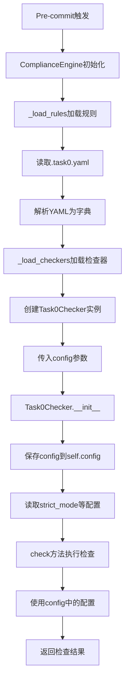

# Task0.yaml规则配置文件作用机制详解

> **文档日期**: 2025-12-03
> **作者**: Claude Sonnet 4.5

---

## 📋 概述

`task0.yaml` 是Task0检查器的**规则配置文件**，它定义了：

- 检查器的行为规则
- 检查项的启用/禁用状态
- 检查级别的设置（ERROR/WARNING/INFO）
- 帮助信息和提示文本

---

## 🔄 完整工作流程

### 流程图



---

## 📁 文件位置和加载

### 1. 配置文件位置

```
.compliance/
├── rules/
│   └── task0.yaml          ← 规则配置文件
└── checkers/
    └── task0_checker.py    ← 检查器实现
```

### 2. 加载流程（engine.py）

```python
# .compliance/engine.py

class ComplianceEngine:
    def __init__(self, config_path: str = ".compliance/config.yaml"):
        self.config = self._load_config()      # 加载全局配置
        self.rules = self._load_rules()        # 加载所有规则文件 ⭐
        self.checkers = self._load_checkers()  # 加载检查器实例 ⭐

    def _load_rules(self) -> Dict[str, Dict]:
        """加载所有规则文件"""
        rules = {}
        rules_dir = self.config["rules"]["rules_dir"]  # .compliance/rules

        # 遍历rules目录下的所有.yaml文件
        for rule_file in Path(rules_dir).glob("*.yaml"):
            rule_name = rule_file.stem  # "task0"
            with open(rule_file, "r", encoding="utf-8") as f:
                rules[rule_name] = yaml.safe_load(f)  # 解析YAML

        return rules  # {"task0": {...}, "prd": {...}, ...}
```

**关键代码**（第68-72行）：

```python
for rule_file in Path(rules_dir).glob("*.yaml"):
    rule_name = rule_file.stem  # "task0"
    with open(rule_file, "r", encoding="utf-8") as f:
        rules[rule_name] = yaml.safe_load(f)  # 解析为Python字典
```

**结果**：

```python
self.rules = {
    "task0": {
        "name": "task0",
        "enabled": True,
        "strict_mode": True,
        "rules": [...],
        "checker": {...},
        "task_master_checks": {...}  # ⭐ 新增配置
    },
    "prd": {...},
    ...
}
```

---

## 🔧 检查器实例化

### 3. 创建检查器实例（engine.py）

```python
# .compliance/engine.py (第116-118行)

for rule_name, checker_class in checker_classes.items():
    if rule_name in self.rules:
        # ⭐ 关键：将规则配置传递给检查器
        checkers[rule_name] = checker_class(self.rules[rule_name])
        print(f"✅ 加载检查器: {rule_name}", file=sys.stderr)
```

**执行过程**：

```python
# rule_name = "task0"
# checker_class = Task0Checker
# self.rules["task0"] = {...从task0.yaml解析的字典...}

checkers["task0"] = Task0Checker(self.rules["task0"])
# 等价于：
# Task0Checker({
#     "name": "task0",
#     "enabled": True,
#     "strict_mode": True,
#     "rules": [...],
#     "checker": {...},
#     "task_master_checks": {...}
# })
```

---

## 🎯 检查器如何使用配置

### 4. 检查器初始化（task0_checker.py）

```python
# .compliance/checkers/task0_checker.py (第23-33行)

class Task0Checker:
    def __init__(self, config: Dict[str, Any]):
        """
        初始化Task-0检查器

        Args:
            config: 配置字典（来自task0.yaml）
        """
        self.config = config  # ⭐ 保存完整配置
        self.strict_mode = config.get("strict_mode", True)  # ⭐ 读取strict_mode
        self.errors = []
        self.warnings = []
```

**配置访问**：

```python
# 从task0.yaml读取的配置
self.config = {
    "name": "task0",
    "enabled": True,
    "strict_mode": True,  # ← 被读取
    "rules": [...],
    "checker": {...},
    "task_master_checks": {  # ← 新增配置
        "task_ordering": {
            "enabled": True,
            "level": "warning",
            ...
        },
        "task_expansion": {
            "enabled": True,
            "level": "warning",
            "min_complexity_for_expansion": 5,  # ← 被使用
            ...
        },
        "task_files_generation": {
            "enabled": True,
            "level": "info",
            ...
        }
    }
}
```

### 5. 配置在检查方法中的使用

#### 示例1：strict_mode的使用

```python
# task0_checker.py (第30-31行)

self.strict_mode = config.get("strict_mode", True)

# 在检查方法中使用
if self.strict_mode:
    # 严格模式：PRD不完整时拒绝提交
    return {"level": "error", ...}
else:
    # 宽松模式：只警告
    return {"level": "warning", ...}
```

#### 示例2：task_master_checks配置的使用

```python
# task0_checker.py (_check_task_expansion方法)

def _check_task_expansion(self, req_id: str) -> Dict[str, Any]:
    """检查任务是否已展开为子任务"""

    # ⭐ 从配置中读取最小复杂度阈值
    task_master_config = self.config.get("task_master_checks", {})
    expansion_config = task_master_config.get("task_expansion", {})
    min_complexity = expansion_config.get("min_complexity_for_expansion", 5)

    # 使用配置的阈值
    if complexity >= min_complexity:  # 默认5，可从配置修改
        # 返回警告
        return {
            "level": expansion_config.get("level", "warning"),
            ...
        }
```

#### 示例3：检查项启用/禁用

```python
# task0_checker.py (check方法中)

def check(self, files: List[str]) -> List[Dict[str, Any]]:
    results = []

    # ... 基础检查 ...

    # ⭐ 检查task_master_checks是否启用
    task_master_config = self.config.get("task_master_checks", {})

    # 任务排序检查
    if task_master_config.get("task_ordering", {}).get("enabled", True):
        ordering_result = self._check_task_ordering(req_id)
        if ordering_result:
            results.append(ordering_result)

    # 任务展开检查
    if task_master_config.get("task_expansion", {}).get("enabled", True):
        expansion_result = self._check_task_expansion(req_id)
        if expansion_result:
            results.append(expansion_result)

    # txt文件检查
    if task_master_config.get("task_files_generation", {}).get("enabled", True):
        files_result = self._check_task_files_generated(req_id)
        if files_result:
            results.append(files_result)

    return results
```

---

## 📊 配置项详解

### task0.yaml结构

```yaml
# 1. 基本信息
name: task0
description: Task-0自检规则
version: "1.0"
enabled: true # ← 是否启用此检查器
strict_mode: true # ← 严格模式（ERROR级别）

# 2. 规则定义（用于文档和帮助信息）
rules:
  - id: TASK0-001
    name: prd_metadata_validation
    severity: error
    enabled: true
    message: "Task-0检查失败: PRD元数据不完整"
    help: |
      详细的帮助信息...

# 3. 检查器配置（告诉引擎如何加载）
checker:
  name: task0_checker
  module: .compliance.checkers.task0_checker
  class: Task0Checker
  enabled: true

# 4. 文件过滤规则
applies_to:
  - "backend/apps/**/*.py"
  - "frontend/src/**/*.{vue,ts,tsx,js,jsx}"

excludes:
  - "tests/**"
  - "docs/**"

# 5. Task Master检查配置（新增）⭐
task_master_checks:
  task_ordering:
    enabled: true # ← 是否启用此检查
    level: "warning" # ← 检查级别
    description: "..."
    help: |
      TDD最佳实践要求...

  task_expansion:
    enabled: true
    level: "warning"
    min_complexity_for_expansion: 5 # ← 阈值配置
    description: "..."
    help: |
      复杂度>=5的任务建议展开...

  task_files_generation:
    enabled: true
    level: "info"
    description: "..."
    help: |
      txt/md文件方便AI查看...
```

---

## 🔍 配置传递路径

### 完整调用链

```
1. Pre-commit钩子
   ↓
2. ComplianceEngine.__init__()
   ↓
3. engine._load_rules()
   ├─ 读取 .compliance/rules/task0.yaml
   ├─ yaml.safe_load() 解析为字典
   └─ 存储到 self.rules["task0"]
   ↓
4. engine._load_checkers()
   ├─ 导入 Task0Checker 类
   ├─ 创建实例：Task0Checker(self.rules["task0"])
   └─ 存储到 self.checkers["task0"]
   ↓
5. engine.check_files()
   ├─ 遍历 self.checkers
   ├─ 调用 checker.check(files)
   └─ 收集检查结果
   ↓
6. Task0Checker.check()
   ├─ 读取 self.config["strict_mode"]
   ├─ 读取 self.config["task_master_checks"]
   ├─ 执行各项检查
   └─ 返回结果列表
```

---

## 💡 配置的实际作用

### 1. 控制检查器行为

**strict_mode配置**：

```python
# task0.yaml
strict_mode: true  # 严格模式

# task0_checker.py
if self.strict_mode:
    # PRD不完整 → ERROR（阻断提交）
    return {"level": "error", ...}
else:
    # PRD不完整 → WARNING（允许提交）
    return {"level": "warning", ...}
```

### 2. 启用/禁用检查项

**task_master_checks配置**：

```python
# task0.yaml
task_master_checks:
  task_ordering:
    enabled: true  # ← 启用任务排序检查

# task0_checker.py
if task_master_config.get("task_ordering", {}).get("enabled", True):
    # 执行检查
    ordering_result = self._check_task_ordering(req_id)
```

**效果**：

- `enabled: true` → 执行检查
- `enabled: false` → 跳过检查

### 3. 设置检查级别

**level配置**：

```python
# task0.yaml
task_master_checks:
  task_ordering:
    level: "warning"  # ← 警告级别

# task0_checker.py
return {
    "level": expansion_config.get("level", "warning"),  # 使用配置的级别
    "message": "...",
    ...
}
```

**效果**：

- `level: "error"` → 阻断提交
- `level: "warning"` → 警告但允许提交
- `level: "info"` → 仅提示信息

### 4. 配置阈值参数

**min_complexity_for_expansion配置**：

```python
# task0.yaml
task_master_checks:
  task_expansion:
    min_complexity_for_expansion: 5  # ← 阈值

# task0_checker.py
min_complexity = expansion_config.get("min_complexity_for_expansion", 5)

if complexity >= min_complexity:
    # 复杂度>=5的任务建议展开
    return {"level": "warning", ...}
```

**效果**：

- 可以调整复杂度阈值，控制哪些任务需要展开

### 5. 提供帮助信息

**help配置**：

```python
# task0.yaml
task_master_checks:
  task_ordering:
    help: |
      TDD最佳实践要求任务按以下顺序排列：
      1. 编写测试（红色阶段）
      ...

# task0_checker.py
return {
    "level": "warning",
    "message": "任务排序建议优化",
    "help": expansion_config.get("help", ""),  # 使用配置的帮助信息
    ...
}
```

**效果**：

- 用户看到错误时，会显示配置的帮助信息
- 帮助信息可以随时在YAML中修改，无需改代码

---

## 🎯 配置的优势

### 1. 解耦配置和代码

**好处**：

- ✅ 修改检查规则无需改代码
- ✅ 可以针对不同项目调整配置
- ✅ 配置变更不需要重新部署

**示例**：

```yaml
# 开发环境：宽松模式
strict_mode: false
task_master_checks:
  task_ordering:
    enabled: false  # 开发时关闭，避免干扰

# 生产环境：严格模式
strict_mode: true
task_master_checks:
  task_ordering:
    enabled: true
    level: "error"  # 生产环境必须符合TDD
```

### 2. 灵活的检查项控制

**好处**：

- ✅ 可以临时禁用某个检查项
- ✅ 可以调整检查级别
- ✅ 可以修改阈值参数

**示例**：

```yaml
# 临时禁用任务排序检查（调试时）
task_master_checks:
  task_ordering:
    enabled: false  # 临时关闭

# 调整复杂度阈值（项目初期）
task_master_checks:
  task_expansion:
    min_complexity_for_expansion: 7  # 提高阈值，只检查高复杂度任务
```

### 3. 统一的配置管理

**好处**：

- ✅ 所有规则配置在一个文件中
- ✅ 易于查看和修改
- ✅ 版本控制友好

---

## 📝 实际使用示例

### 场景1：修改检查级别

**需求**：将任务排序检查从WARNING改为ERROR

**操作**：

```yaml
# .compliance/rules/task0.yaml
task_master_checks:
  task_ordering:
    level: "error" # 改为error
```

**效果**：

- 下次提交时，任务排序不符合TDD会**阻断提交**
- 无需修改Python代码

### 场景2：调整复杂度阈值

**需求**：只检查复杂度>=7的任务

**操作**：

```yaml
# .compliance/rules/task0.yaml
task_master_checks:
  task_expansion:
    min_complexity_for_expansion: 7 # 从5改为7
```

**效果**：

- 复杂度5-6的任务不再提示展开
- 只有复杂度>=7的任务会提示

### 场景3：临时禁用检查

**需求**：临时关闭txt文件检查（不影响其他检查）

**操作**：

```yaml
# .compliance/rules/task0.yaml
task_master_checks:
  task_files_generation:
    enabled: false # 临时关闭
```

**效果**：

- txt文件检查被跳过
- 其他检查（任务排序、任务展开）正常执行

---

## 🔗 相关代码位置

### 配置文件

- `.compliance/rules/task0.yaml` - 规则配置定义

### 引擎代码

- `.compliance/engine.py`:
  - `_load_rules()` (第59-78行) - 加载规则文件
  - `_load_checkers()` (第80-174行) - 创建检查器实例
  - `check_files()` (第176行+) - 执行检查

### 检查器代码

- `.compliance/checkers/task0_checker.py`:
  - `__init__()` (第23-33行) - 接收配置
  - `check()` (第35-103行) - 使用配置执行检查
  - `_check_task_ordering()` (第565-624行) - 使用task_master_checks配置
  - `_check_task_expansion()` (第626-680行) - 使用min_complexity配置
  - `_check_task_files_generated()` (第682-730行) - 使用enabled配置

---

## ✅ 总结

**task0.yaml的作用机制**：

1. **配置定义**：在YAML文件中定义检查规则、参数、帮助信息
2. **配置加载**：引擎启动时自动加载所有.yaml文件
3. **配置传递**：通过构造函数传递给检查器实例
4. **配置使用**：检查器在运行时读取配置，控制检查行为
5. **配置优势**：解耦、灵活、易维护

**核心价值**：

- ✅ **无需改代码**：修改配置即可调整检查行为
- ✅ **灵活控制**：可以启用/禁用、调整级别、修改阈值
- ✅ **易于维护**：配置集中管理，版本控制友好

---

**配置驱动设计，让检查器更加灵活和可维护！** 🎯

_文档模型：Claude Sonnet 4.5 (claude-sonnet-4-20250514)_
