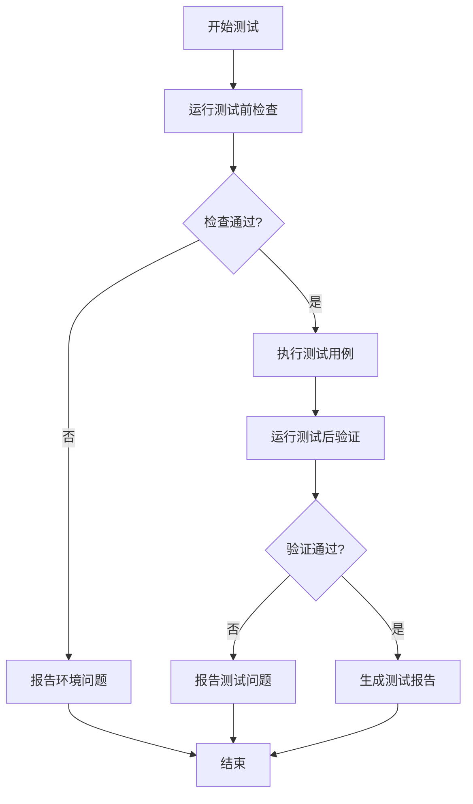

# 测试体系改进方案

> **版本**: V1.0
> **日期**: 2025-12-14
> **问题**: 验证码错误问题持续2天未被测试发现
> **目标**: 建立能够发现类似问题的测试体系

---

## 问题分析

### 发现的问题

1. **验证码被加载两次**（响应式布局导致两个RegisterForm实例）
2. **Redis缓存配置错误**（测试环境使用DummyCache）

### 为什么测试没有发现？

#### 1. **测试覆盖不足**

**缺失的测试场景**：

- ❌ 响应式布局下的组件实例数量验证
- ❌ 验证码ID的唯一性验证
- ❌ 缓存配置一致性验证
- ❌ 跨环境配置差异验证

**现有测试的盲点**：

- ✅ 只测试了功能流程（注册成功/失败）
- ✅ 只测试了UI元素存在性
- ❌ **没有测试组件实例数量**
- ❌ **没有测试环境配置一致性**
- ❌ **没有测试数据流完整性**

#### 2. **测试环境差异**

**问题**：

- E2E测试在容器内运行，可能只渲染一个布局
- 测试环境配置与开发环境不一致（DummyCache vs Redis）

**根本原因**：

- 缺少环境配置验证测试
- 缺少跨环境一致性检查

#### 3. **测试思维局限**

**当前测试思维**：

- 测试"功能是否工作"（黑盒测试）
- 测试"UI元素是否存在"

**缺失的测试思维**：

- ❌ 测试"系统状态是否正确"（组件实例数、缓存状态）
- ❌ 测试"数据流是否完整"（captcha_id传递链）
- ❌ 测试"环境配置是否一致"（缓存后端类型）

---

## 改进方案

### 1. 组件实例验证测试

**目标**: 确保响应式布局下只有一个组件实例被激活

```typescript
// e2e/tests/auth/test-register-form-instances.spec.ts
test("注册表单应该只有一个活跃实例（响应式布局验证）", async ({ page }) => {
  // 1. 检查DOM中RegisterForm组件的数量
  const formInstances = await page.evaluate(() => {
    const forms = document.querySelectorAll("form.register-form");
    return forms.length;
  });

  // 2. 检查可见的表单数量
  const visibleForms = await page.locator("form.register-form:visible").count();

  // 3. 检查验证码组件实例数量
  const captchaInstances = await page.evaluate(() => {
    const captchas = document.querySelectorAll('[data-testid="captcha"]');
    return captchas.length;
  });

  // 断言：应该只有一个可见的表单和一个验证码组件
  expect(visibleForms).toBe(1);
  expect(captchaInstances).toBe(1);

  // 4. 验证captcha_id的唯一性
  const captchaIds = await page.evaluate(() => {
    const logs = window.console._logs || [];
    const captchaUpdateLogs = logs.filter((log) =>
      log.includes("Captcha update received"),
    );
    return captchaUpdateLogs
      .map((log) => {
        const match = log.match(/captcha_id:\s*([a-f0-9-]+)/);
        return match ? match[1] : null;
      })
      .filter(Boolean);
  });

  // 断言：应该只有一个captcha_id被设置
  expect(new Set(captchaIds).size).toBe(1);
});
```

### 2. 数据流完整性测试

**目标**: 验证captcha_id从生成到提交的完整传递链

```typescript
// e2e/tests/auth/test-captcha-data-flow.spec.ts
test("验证码数据流应该完整（从生成到提交）", async ({ page }) => {
  // 1. 监听网络请求，记录captcha_id
  const captchaIds: string[] = [];

  page.on("response", async (response) => {
    if (response.url().includes("/api/auth/captcha/")) {
      const data = await response.json();
      captchaIds.push(data.captcha_id);
    }
  });

  await page.goto(`${BASE_URL}/register`);
  await page.waitForTimeout(2000);

  // 2. 验证只生成了一次验证码
  expect(captchaIds.length).toBe(1);
  const expectedCaptchaId = captchaIds[0];

  // 3. 填写表单
  await page.fill('input[type="email"]', "test@example.com");
  await page.fill('input[type="password"]', "Test123456");
  await page.fill('input[name="password_confirm"]', "Test123456");
  await page.fill('input[placeholder*="验证码"]', "TEST");

  // 4. 拦截注册请求，验证captcha_id是否正确传递
  let submittedCaptchaId: string | null = null;

  page.on("request", async (request) => {
    if (request.url().includes("/api/auth/register/")) {
      const postData = request.postDataJSON();
      submittedCaptchaId = postData.captcha_id;
    }
  });

  await page.click('button:has-text("创建账户")');
  await page.waitForTimeout(1000);

  // 5. 验证captcha_id一致
  expect(submittedCaptchaId).toBe(expectedCaptchaId);
});
```

### 3. 环境配置一致性测试

**目标**: 验证测试环境与开发环境的配置一致性

```typescript
// e2e/tests/infrastructure/test-environment-config.spec.ts
test("缓存配置应该与开发环境一致", async ({ page, request }) => {
  // 1. 检查后端缓存配置
  const response = await request.get(`${API_BASE_URL}/api/health/`);
  const healthData = await response.json();

  // 2. 验证缓存后端类型
  expect(healthData.cache_backend).toBe("redis");
  expect(healthData.cache_connected).toBe(true);

  // 3. 测试缓存功能
  const testKey = `test-${Date.now()}`;
  const testValue = "test-value";

  // 设置缓存
  const setResponse = await request.post(`${API_BASE_URL}/api/test/cache/`, {
    data: { key: testKey, value: testValue, timeout: 60 },
  });
  expect(setResponse.ok()).toBeTruthy();

  // 获取缓存
  const getResponse = await request.get(
    `${API_BASE_URL}/api/test/cache/?key=${testKey}`,
  );
  const cachedValue = await getResponse.json();
  expect(cachedValue).toBe(testValue);
});
```

### 4. 验证码生命周期测试

**目标**: 验证验证码的完整生命周期（生成→存储→验证→删除）

```typescript
// e2e/tests/auth/test-captcha-lifecycle.spec.ts
test("验证码生命周期应该完整", async ({ page, request }) => {
  // 1. 生成验证码
  const captchaResponse = await request.get(
    `${API_BASE_URL}/api/auth/captcha/`,
  );
  const captchaData = await captchaResponse.json();
  const { captcha_id, captcha_image } = captchaData;

  expect(captcha_id).toBeTruthy();
  expect(captcha_image).toBeTruthy();

  // 2. 验证验证码已存储（通过后端API检查）
  const checkResponse = await request.get(
    `${API_BASE_URL}/api/test/captcha/check/?captcha_id=${captcha_id}`,
  );
  expect(checkResponse.ok()).toBeTruthy();
  const checkData = await checkResponse.json();
  expect(checkData.exists).toBe(true);

  // 3. 使用正确的验证码验证
  const verifyResponse = await request.post(
    `${API_BASE_URL}/api/test/captcha/verify/`,
    {
      data: { captcha_id, captcha_answer: checkData.answer },
    },
  );
  expect(verifyResponse.ok()).toBeTruthy();

  // 4. 验证验证码已被删除（防止重复使用）
  const checkAfterResponse = await request.get(
    `${API_BASE_URL}/api/test/captcha/check/?captcha_id=${captcha_id}`,
  );
  const checkAfterData = await checkAfterResponse.json();
  expect(checkAfterData.exists).toBe(false);
});
```

### 5. 响应式布局测试

**目标**: 在不同屏幕尺寸下验证组件行为

```typescript
// e2e/tests/auth/test-responsive-layout.spec.ts
const viewports = [
  { width: 375, height: 667, name: "mobile" },
  { width: 768, height: 1024, name: "tablet" },
  { width: 1920, height: 1080, name: "desktop" },
];

viewports.forEach(({ width, height, name }) => {
  test(`响应式布局测试 - ${name} (${width}x${height})`, async ({ page }) => {
    await page.setViewportSize({ width, height });
    await page.goto(`${BASE_URL}/register`);
    await page.waitForTimeout(2000);

    // 1. 验证只有一个可见的表单
    const visibleForms = await page
      .locator("form.register-form:visible")
      .count();
    expect(visibleForms).toBe(1);

    // 2. 验证只有一个验证码组件
    const captchaComponents = await page
      .locator('[data-testid="captcha"]:visible')
      .count();
    expect(captchaComponents).toBe(1);

    // 3. 验证验证码只加载一次
    const captchaRequests = await page.evaluate(() => {
      return window.performance
        .getEntriesByType("resource")
        .filter((entry: any) => entry.name.includes("/api/auth/captcha/"))
        .length;
    });
    expect(captchaRequests).toBe(1);
  });
});
```

### 6. 集成测试：完整注册流程

**目标**: 端到端验证注册流程的完整性

```typescript
// e2e/tests/auth/test-register-integration.spec.ts
test("完整注册流程集成测试", async ({ page, request }) => {
  const uniqueEmail = `test-${Date.now()}@example.com`;

  // 1. 访问注册页面
  await page.goto(`${BASE_URL}/register`);
  await page.waitForTimeout(2000);

  // 2. 验证验证码已加载
  const captchaImage = await page.locator('img[alt="验证码"]').first();
  await expect(captchaImage).toBeVisible();

  // 3. 获取验证码ID（从网络请求）
  const captchaId = await page.evaluate(() => {
    return new Promise((resolve) => {
      const observer = new PerformanceObserver((list) => {
        for (const entry of list.getEntries()) {
          if (entry.name.includes("/api/auth/captcha/")) {
            // 从响应中提取captcha_id
            fetch(entry.name)
              .then((r) => r.json())
              .then((data) => resolve(data.captcha_id));
          }
        }
      });
      observer.observe({ entryTypes: ["resource"] });
    });
  });

  // 4. 从后端获取验证码答案（测试专用API）
  const captchaAnswerResponse = await request.get(
    `${API_BASE_URL}/api/test/captcha/answer/?captcha_id=${captchaId}`,
  );
  const { answer } = await captchaAnswerResponse.json();

  // 5. 填写表单
  await page.fill('input[type="email"]', uniqueEmail);
  await page.fill('input[type="password"]', "Test123456");
  await page.fill('input[name="password_confirm"]', "Test123456");
  await page.fill('input[placeholder*="验证码"]', answer);

  // 6. 提交表单
  await page.click('button:has-text("创建账户")');
  await page.waitForTimeout(2000);

  // 7. 验证注册成功
  const successMessage = await page.locator(
    '.success-message, [data-testid="success-message"]',
  );
  await expect(successMessage).toBeVisible();
  await expect(successMessage).toContainText("验证");
});
```

---

## 测试流程改进

### 1. 测试前检查清单

```typescript
// e2e/tests/_helpers/pre-test-checks.ts
export async function runPreTestChecks(page: Page, request: APIRequestContext) {
  const checks = [];

  // 1. 环境配置检查
  const healthResponse = await request.get(`${API_BASE_URL}/api/health/`);
  const health = await healthResponse.json();
  checks.push({
    name: "缓存配置",
    passed: health.cache_backend === "redis" && health.cache_connected,
    message:
      health.cache_backend === "redis"
        ? "缓存配置正确"
        : `缓存配置错误: 期望redis, 实际${health.cache_backend}`,
  });

  // 2. 服务可用性检查
  const captchaResponse = await request.get(
    `${API_BASE_URL}/api/auth/captcha/`,
  );
  checks.push({
    name: "验证码API",
    passed: captchaResponse.ok(),
    message: captchaResponse.ok() ? "验证码API可用" : "验证码API不可用",
  });

  // 3. 前端页面加载检查
  await page.goto(`${BASE_URL}/register`);
  const formExists = (await page.locator("form.register-form").count()) > 0;
  checks.push({
    name: "注册页面",
    passed: formExists,
    message: formExists ? "注册页面加载成功" : "注册页面加载失败",
  });

  // 报告检查结果
  const failedChecks = checks.filter((c) => !c.passed);
  if (failedChecks.length > 0) {
    console.error("测试前检查失败:");
    failedChecks.forEach((check) => {
      console.error(`  - ${check.name}: ${check.message}`);
    });
    throw new Error("测试前检查失败，请修复环境配置");
  }

  return checks;
}
```

### 2. 测试后验证

```typescript
// e2e/tests/_helpers/post-test-verification.ts
export async function verifyTestResults(page: Page) {
  // 1. 检查控制台错误
  const consoleErrors = await page.evaluate(() => {
    return window.console._errors || [];
  });

  if (consoleErrors.length > 0) {
    console.warn("测试过程中发现控制台错误:");
    consoleErrors.forEach((error) => console.warn(`  - ${error}`));
  }

  // 2. 检查网络请求失败
  const failedRequests = await page.evaluate(() => {
    return window.performance
      .getEntriesByType("resource")
      .filter((entry: any) => {
        return entry.responseStatus && entry.responseStatus >= 400;
      })
      .map((entry: any) => ({
        url: entry.name,
        status: entry.responseStatus,
      }));
  });

  if (failedRequests.length > 0) {
    console.warn("测试过程中发现失败的请求:");
    failedRequests.forEach((req) => {
      console.warn(`  - ${req.url}: ${req.status}`);
    });
  }

  return {
    consoleErrors: consoleErrors.length,
    failedRequests: failedRequests.length,
  };
}
```

---

## 测试工具改进

### 1. 测试辅助函数

```typescript
// e2e/tests/_helpers/captcha-helper.ts
export class CaptchaHelper {
  constructor(
    private page: Page,
    private request: APIRequestContext,
  ) {}

  /**
   * 获取验证码并返回答案（测试专用）
   */
  async getCaptchaWithAnswer(): Promise<{
    id: string;
    answer: string;
    image: string;
  }> {
    // 1. 从页面获取验证码
    await this.page.goto(`${BASE_URL}/register`);
    await this.page.waitForTimeout(2000);

    // 2. 从网络请求获取captcha_id
    const captchaResponse = await this.request.get(
      `${API_BASE_URL}/api/auth/captcha/`,
    );
    const captchaData = await captchaResponse.json();

    // 3. 从测试API获取答案
    const answerResponse = await this.request.get(
      `${API_BASE_URL}/api/test/captcha/answer/?captcha_id=${captchaData.captcha_id}`,
    );
    const { answer } = await answerResponse.json();

    return {
      id: captchaData.captcha_id,
      answer,
      image: captchaData.captcha_image,
    };
  }

  /**
   * 验证captcha_id是否正确传递
   */
  async verifyCaptchaIdFlow(expectedId: string): Promise<boolean> {
    // 监听注册请求
    let submittedId: string | null = null;

    this.page.on("request", async (request) => {
      if (request.url().includes("/api/auth/register/")) {
        const postData = request.postDataJSON();
        submittedId = postData.captcha_id;
      }
    });

    await this.page.click('button:has-text("创建账户")');
    await this.page.waitForTimeout(1000);

    return submittedId === expectedId;
  }
}
```

### 2. 环境配置验证工具

```typescript
// e2e/tests/_helpers/env-validator.ts
export class EnvironmentValidator {
  constructor(private request: APIRequestContext) {}

  async validateCacheConfig(): Promise<{ valid: boolean; message: string }> {
    try {
      const response = await this.request.get(`${API_BASE_URL}/api/health/`);
      const health = await response.json();

      if (health.cache_backend !== "redis") {
        return {
          valid: false,
          message: `缓存后端配置错误: 期望redis, 实际${health.cache_backend}`,
        };
      }

      if (!health.cache_connected) {
        return {
          valid: false,
          message: "Redis连接失败",
        };
      }

      return { valid: true, message: "缓存配置正确" };
    } catch (error) {
      return {
        valid: false,
        message: `环境检查失败: ${error}`,
      };
    }
  }

  async validateDatabaseConfig(): Promise<{ valid: boolean; message: string }> {
    // 类似实现
  }
}
```

---

## 测试执行流程

### 改进后的测试流程



### 测试命令改进

```bash
# 测试前检查
npm run test:pre-check

# 运行测试（自动包含前后检查）
npm run test:e2e

# 运行特定测试套件
npm run test:e2e -- --grep "验证码"
```

---

## 总结

### 核心改进点

1. **测试覆盖扩展**：

   - ✅ 组件实例数量验证
   - ✅ 数据流完整性验证
   - ✅ 环境配置一致性验证
   - ✅ 响应式布局验证

2. **测试思维升级**：

   - 从"功能是否工作" → "系统状态是否正确"
   - 从"UI元素是否存在" → "数据流是否完整"
   - 从"单点测试" → "端到端验证"

3. **测试工具完善**：
   - 测试前检查清单
   - 测试后验证
   - 测试辅助函数
   - 环境配置验证

### 预期效果

- ✅ 能够发现组件实例数量问题
- ✅ 能够发现环境配置不一致问题
- ✅ 能够发现数据流中断问题
- ✅ 能够发现响应式布局问题

### 下一步行动

1. 实现上述测试用例
2. 添加测试前/后检查
3. 集成到CI/CD流程
4. 建立测试文档和最佳实践
