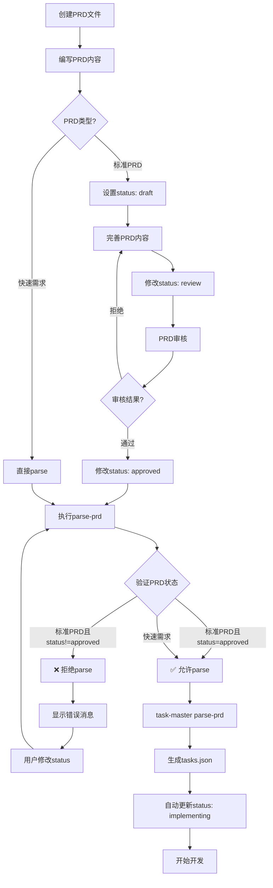

# PRD状态验证使用指南

## 🎯 核心功能

PRD状态验证器确保只有`approved`状态的PRD才能被task-master parse，防止未审核的需求进入开发流程。

## 🚀 快速开始

### 场景1：Parse标准PRD（带状态检查）

```bash
# 1. 确保PRD状态为approved
# 打开PRD文件，修改frontmatter：
#   status: draft  →  status: approved

# 2. 使用包装脚本parse（自动验证状态）
./scripts/task-master-parse-prd.sh \
  docs/00_product/requirements/REQ-2025-001-user-login/REQ-2025-001-user-login.md

# 3. Parse成功后，状态自动更新为implementing
```

### 场景2：Parse快速需求（跳过状态检查）

```bash
# 快速需求文件无需frontmatter和状态检查
./scripts/task-master-parse-prd.sh .taskmaster/docs/shopping-cart.txt
```

## 📋 状态检查规则

### 路径判断

| PRD路径                         | 是否检查状态 | 原因                        |
| ------------------------------- | ------------ | --------------------------- |
| `docs/00_product/requirements/` | ✅ 是        | 标准PRD，需要审核流程       |
| `.taskmaster/docs/`             | ❌ 否        | 快速需求，无frontmatter要求 |
| 其他路径                        | ❌ 否        | 兼容性考虑                  |

### 状态规则

| PRD状态        | 是否允许parse | 错误提示                                  |
| -------------- | ------------- | ----------------------------------------- |
| `draft`        | ❌            | PRD还在草稿阶段，需要完善内容并审核       |
| `review`       | ❌            | PRD正在审核中，需要等待审核通过           |
| `approved`     | ✅            | PRD已批准，可以parse                      |
| `implementing` | ❌            | PRD已被parse，任务已生成（防止重复parse） |
| `completed`    | ❌            | PRD对应的需求已完成，应创建新PRD          |
| `archived`     | ❌            | PRD已归档/废弃，应恢复或创建新PRD         |

## 🔧 使用方式

### 方式1：包装脚本（推荐）

**脚本**：`scripts/task-master-parse-prd.sh`

**功能**：

1. 自动验证PRD状态
2. 调用task-master parse-prd
3. Parse成功后自动更新status为implementing

**用法**：

```bash
./scripts/task-master-parse-prd.sh <prd-file> [task-master参数]

# 示例
./scripts/task-master-parse-prd.sh \
  docs/00_product/requirements/REQ-2025-001/REQ-2025-001.md

# 带参数
./scripts/task-master-parse-prd.sh \
  docs/00_product/requirements/REQ-2025-001/REQ-2025-001.md \
  --num-tasks=8 --research
```

### 方式2：独立验证器（测试用）

**脚本**：`scripts/task-master/prd_status_validator.py`

**用法**：

```bash
# 在Docker容器内执行
docker-compose exec -T backend python \
  /app/project_scripts/task-master/prd_status_validator.py \
  /app/docs/00_product/requirements/REQ-2025-001/REQ-2025-001.md

# 退出码：
#   0 - 验证通过
#   1 - 验证失败
```

## 📊 完整工作流程

### 流程图



### 详细步骤

#### 步骤1：创建PRD

**标准PRD**：

```bash
mkdir -p docs/00_product/requirements/REQ-2025-001-user-login
cat > docs/00_product/requirements/REQ-2025-001-user-login/REQ-2025-001-user-login.md << 'EOF'
---
req_id: REQ-2025-001-user-login
title: 用户登录功能
status: draft
priority: high
type: feature
created_at: 2025-12-04T10:00:00Z
updated_at: 2025-12-04T10:00:00Z
author: human
test_files: []
implementation_files: []
---

# 用户登录功能

## 功能概述
...
EOF
```

**快速需求**：

```bash
cat > .taskmaster/docs/user-login-raw.txt << 'EOF'
我需要一个用户登录功能
- 支持邮箱和密码登录
- 需要JWT认证
EOF
```

#### 步骤2：完善PRD内容

使用Cursor精化PRD，补充：

- 数据库设计
- API接口定义
- 前端组件设计
- 测试策略
- 技术实现细节

#### 步骤3：修改PRD状态

**标准PRD**：人工修改status字段

```yaml
status: draft  →  status: approved
```

**快速需求**：无需修改（无frontmatter）

#### 步骤4：执行parse-prd

```bash
# 使用包装脚本（推荐）
./scripts/task-master-parse-prd.sh docs/00_product/requirements/REQ-2025-001/REQ-2025-001.md

# 或直接使用task-master（需手动验证）
task-master parse-prd --input=docs/00_product/requirements/REQ-2025-001/REQ-2025-001.md
```

#### 步骤5：验证结果

```bash
# 查看生成的任务
task-master list

# 查看PRD状态（应该自动更新为implementing）
grep "status:" docs/00_product/requirements/REQ-2025-001/REQ-2025-001.md
```

## ❌ 常见错误和解决方案

### 错误1：PRD状态为draft

**错误消息**：

```
❌ PRD状态为 'draft'（草稿），无法执行parse-prd
```

**解决方案**：

1. 打开PRD文件
2. 修改frontmatter中的status字段：`status: draft` → `status: approved`
3. 保存文件
4. 重新运行parse-prd

### 错误2：PRD状态为review

**错误消息**：

```
❌ PRD状态为 'review'（审核中），无法执行parse-prd
```

**解决方案**：

1. 完成PRD审核
2. 修改status字段：`status: review` → `status: approved`
3. 重新运行parse-prd

### 错误3：PRD状态为implementing

**错误消息**：

```
❌ PRD状态为 'implementing'（开发中），不能重复parse
```

**解决方案**：

- **情况A**：任务已生成，无需重新parse

  - 查看现有任务：`task-master list`

- **情况B**：确实需要重新parse（谨慎操作）
  1. 备份现有任务：`cp .taskmaster/tasks/tasks.json .taskmaster/tasks/tasks.json.bak`
  2. 修改status：`implementing` → `approved`
  3. 重新parse（会覆盖现有任务）

### 错误4：PRD文件不存在

**错误消息**：

```
❌ PRD文件不存在: <path>
```

**解决方案**：

1. 检查文件路径是否正确
2. 确保PRD文件已创建
3. 注意路径大小写（Linux区分大小写）

### 错误5：无法解析PRD元数据

**错误消息**：

```
❌ 无法解析PRD元数据
💡 标准PRD必须包含YAML frontmatter
```

**解决方案**：

1. 检查PRD文件是否以`---`开始
2. 检查frontmatter是否有结束标记`---`
3. 检查YAML格式是否正确（缩进、冒号、引号等）

## 🔐 状态修改权限

### 人工修改（大部分情况）

**允许的修改**：

- `draft → review`：PRD完成，提交审核
- `review → approved`：审核通过
- `review → draft`：审核拒绝，需要修改
- `implementing → completed`：开发完成
- `任何状态 → archived`：废弃需求

**禁止的修改**：

- ❌ `approved → implementing`：这个只能由task-master parse-prd自动触发
- ❌ `completed → implementing`：不可逆
- ❌ `archived → 任何状态`：不可逆（除非人工恢复）

### 自动修改（唯一场景）

**场景**：执行`task-master parse-prd`成功

**修改**：`approved → implementing`

**触发条件**：

1. PRD状态为approved
2. parse-prd执行成功
3. 自动更新PRD的status字段

## 📚 相关文档

- [PRD状态机设计方案](../architecture/V4/PRD_STATE_MACHINE_DESIGN.md)
- [PRD状态验证实现方案](../architecture/V4/PRD_STATUS_VALIDATION_IMPL.md)
- [PRD工作流完整指南](../architecture/V4/PRD_WORKFLOW_COMPLETE_GUIDE.md)
- [Task-Master命令参考](.cursor/rules/taskmaster/taskmaster.mdc)

## 🎓 最佳实践

1. **始终使用包装脚本**：`./scripts/task-master-parse-prd.sh`而不是直接调用`task-master parse-prd`
2. **严格遵守状态流程**：draft → review → approved → implementing
3. **不要跳过审核**：即使是小需求，也应该经过review状态
4. **谨慎重复parse**：implementing状态的PRD不应该重新parse
5. **记录状态变更**：在PRD中添加状态变更日志（可选）

## 🔍 调试技巧

### 检查PRD状态

```bash
# 方法1：使用grep
grep "status:" docs/00_product/requirements/REQ-2025-001/REQ-2025-001.md

# 方法2：使用验证器
docker-compose exec -T backend python \
  /app/project_scripts/task-master/prd_status_validator.py \
  /app/docs/00_product/requirements/REQ-2025-001/REQ-2025-001.md
```

### 查看详细错误

```bash
# 验证器会输出详细的错误消息，包括：
# - REQ-ID
# - PRD标题
# - 文件路径
# - 状态转换流程
# - 操作步骤
```

### 测试不同状态

```bash
# 创建测试PRD
mkdir -p docs/00_product/requirements/REQ-TEST-001
cat > docs/00_product/requirements/REQ-TEST-001/REQ-TEST-001.md << 'EOF'
---
req_id: REQ-TEST-001
title: 测试PRD
status: draft
---
# 测试内容
EOF

# 测试draft（应该失败）
./scripts/task-master-parse-prd.sh docs/00_product/requirements/REQ-TEST-001/REQ-TEST-001.md

# 修改为approved
sed -i 's/status: draft/status: approved/' docs/00_product/requirements/REQ-TEST-001/REQ-TEST-001.md

# 测试approved（应该成功）
./scripts/task-master-parse-prd.sh docs/00_product/requirements/REQ-TEST-001/REQ-TEST-001.md
```

## 🎁 额外功能

### 状态自动更新

Parse成功后，验证器会自动更新PRD状态：

```
approved → implementing
```

这是**唯一允许的自动状态修改**，确保：

- PRD状态与开发进度同步
- 防止重复parse
- 提供清晰的需求生命周期追踪

### 智能路径识别

验证器会自动识别PRD类型：

```python
# 标准PRD（严格检查）
docs/00_product/requirements/REQ-2025-001/REQ-2025-001.md

# 快速需求（跳过检查）
.taskmaster/docs/user-login.txt
.taskmaster/docs/shopping-cart-raw.txt
```

## 🛡️ 安全保护

### 防止意外覆盖

implementing状态的PRD不能重复parse，防止：

- 意外覆盖已生成的任务
- 丢失任务进度和状态
- 破坏任务依赖关系

### 强制审核流程

draft和review状态的PRD不能parse，确保：

- PRD经过充分审核
- 需求清晰明确
- 减少返工和修改

## 📞 获取帮助

### 查看验证器帮助

```bash
python scripts/task-master/prd_status_validator.py
```

### 查看包装脚本帮助

```bash
./scripts/task-master-parse-prd.sh
```

### 常见问题

**Q：为什么我的PRD不能parse？**

A：检查PRD状态是否为`approved`。使用以下命令验证：

```bash
docker-compose exec -T backend python \
  /app/project_scripts/task-master/prd_status_validator.py \
  /app/docs/00_product/requirements/<REQ-ID>/<REQ-ID>.md
```

**Q：如何修改PRD状态？**

A：直接编辑PRD文件的frontmatter，修改`status`字段。

**Q：快速需求文件需要frontmatter吗？**

A：不需要。快速需求文件（`.taskmaster/docs/`下）跳过状态检查，无需frontmatter。

**Q：Parse成功后状态会自动更新吗？**

A：是的。使用包装脚本时，parse成功后会自动更新`approved → implementing`。

**Q：implementing状态的PRD能重新parse吗？**

A：可以，但需要谨慎操作：

1. 备份现有任务
2. 手动修改status回`approved`
3. 重新parse（会覆盖现有任务）

## 🎯 总结

PRD状态验证器通过以下机制确保需求质量：

1. ✅ **路径识别**：自动区分标准PRD和快速需求
2. ✅ **状态检查**：只允许approved状态parse
3. ✅ **友好提示**：详细的错误消息和操作指导
4. ✅ **自动更新**：parse成功后自动更新状态
5. ✅ **防止覆盖**：implementing状态不能重复parse

**使用包装脚本是最佳实践，确保所有保护机制生效。**
