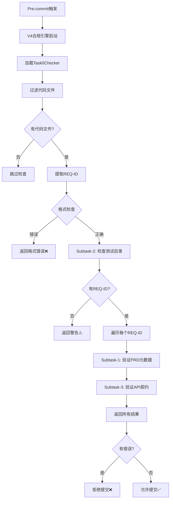

# Task-0检查器状态报告

> **查询日期**: 2025-12-03
> **报告人**: Claude Sonnet 4.5
> **状态**: ✅ 已实现并集成

---

## 📊 实现状态总览

| 项目               | 状态      | 说明                                            |
| ------------------ | --------- | ----------------------------------------------- |
| **代码实现**       | ✅ 已完成 | `.compliance/checkers/task0_checker.py` (576行) |
| **规则配置**       | ✅ 已完成 | `.compliance/rules/task0.yaml`                  |
| **引擎集成**       | ✅ 已完成 | 已集成到 `.compliance/engine.py`                |
| **模块导出**       | ✅ 已完成 | 已添加到 `.compliance/checkers/__init__.py`     |
| **Pre-commit集成** | ✅ 已完成 | 通过V4合规引擎调用                              |
| **文档记录**       | ✅ 已完成 | 多个实现文档和测试报告                          |
| **提交记录**       | ✅ 已完成 | commit b9f553f                                  |

---

## 📁 代码文件位置

### 核心实现文件

```
.compliance/
├── checkers/
│   ├── task0_checker.py          ✅ 576行，完整实现
│   └── __init__.py                ✅ 已导出Task0Checker
├── rules/
│   └── task0.yaml                 ✅ 规则配置（86行）
├── engine.py                      ✅ 已集成（第99行、107行、125行）
├── runner.py                      ✅ Pre-commit入口
└── config.yaml                    ✅ 全局配置
```

### 文档文件

```
docs/
├── testing/
│   ├── TASK0_IMPLEMENTATION_SUMMARY.md      ✅ 实现总结（262行）
│   ├── TASK0_REQ_ID_EXTRACTION_ISSUE.md     ✅ REQ-ID提取问题记录
│   ├── V4_IMPLEMENTATION_COMPLETE_REPORT.md ✅ V4实现完成报告
│   ├── V4_PRE_COMMIT_INTEGRATION_STATUS.md  ✅ Pre-commit集成状态
│   └── V4_TEST_SCENARIOS_T01_T10.md         ✅ 测试场景文档
└── architecture/V4/
    └── AI-WORKFLOW-V4-PART2-TM-ADAPTER.md   ✅ 设计文档（第359-469行）
```

---

## 🔍 Task-0检查器核心逻辑

### 设计目的（V4-PART2文档）

**Task-0 = PRD完整性验证器**

确保在开发前，PRD和基础设施已准备就绪。

### 三个子任务（Subtasks）

```
Task-0职责（针对每个REQ-ID）：
├── Subtask-1: 验证PRD元数据完整性 ⭐ 核心
│   ✅ PRD文件存在
│   ✅ YAML frontmatter完整
│   ✅ test_files字段非空（必需）
│   ✅ implementation_files字段非空（必需）
│   ✅ api_contract字段存在（建议）
│
├── Subtask-2: 检查测试目录存在 🌍 全局
│   ✅ backend/tests/unit/
│   ✅ backend/tests/integration/
│   ✅ e2e/tests/
│
└── Subtask-3: 验证API契约文件 💡 建议
    ✅ API契约文件存在
    ✅ OpenAPI定义完整
    ✅ paths定义非空
```

### REQ-ID标准格式

```
REQ-YYYY-NNN-description

示例：REQ-2025-001-user-login

格式要求：
- REQ-        前缀（必须）
- YYYY        4位年份（必须）
- NNN         3位序号（必须）
- description 小写字母、数字、连字符（必须）
```

### 执行流程



---

## 🎯 检查策略

### 严格模式配置

```yaml
# .compliance/rules/task0.yaml
strict_mode: true  # 默认严格模式

# 严格模式：
PRD不完整 → 拒绝提交 ❌

# 宽松模式（未启用）：
PRD不完整 → 警告但允许提交 ⚠️
```

### 检查优先级

```
1. 🔴 REQ-ID格式错误 → 立即失败（阻断）
2. 🔴 测试目录缺失 → ERROR（阻断）
3. 🔴 PRD元数据不完整 → ERROR（阻断）
4. 🟡 API契约缺失 → WARNING（不阻断）
```

### 文件过滤策略

```python
# 只检查代码文件
支持: .py, .ts, .tsx, .js, .jsx, .vue

# 排除目录
exclude_patterns = [
    "docs/",        # 文档
    "tests/",       # 测试文件
    ".compliance/", # 合规引擎
    ".github/",     # GitHub配置
    "scripts/",     # 脚本
    ".taskmaster/", # Task Master
    "node_modules/", "venv/", "__pycache__/"
]
```

---

## 🔗 集成情况

### Pre-commit钩子集成

```bash
# .husky/pre-commit → 第四层检查
🔍 [第四层] V4合规引擎检查
↓
docker-compose exec backend python .compliance/runner.py
↓
ComplianceEngine加载所有检查器
↓
Task0Checker（优先级最高，第一个执行）
```

### 引擎加载顺序

```python
# .compliance/engine.py
checker_classes = {
    "task0": Task0Checker,      # ← 第一个执行（最高优先级）
    "prd": PRDChecker,
    "test": TestChecker,
    "code": CodeChecker,
    "commit": CommitChecker,
    "task": TaskChecker,
    "test_runner": TestRunnerChecker,
}
```

### 模块导入路径

```python
# .compliance/checkers/__init__.py
from .task0_checker import Task0Checker

__all__ = [
    "Task0Checker",
    "PRDChecker",
    "TestChecker",
    "CodeChecker",
    "CommitChecker",
    "TaskChecker",
    "TestRunnerChecker",
]
```

---

## 📈 实现亮点

### 1. 路径兼容性

```python
# 处理多种环境路径
possible_paths = [
    Path(file),              # 相对路径（宿主机）
    Path("/app") / file,     # Docker容器内路径
]
```

### 2. Git集成

```python
# pre-commit阶段文件可能不在工作区
git show :backend/apps/views.py  # 从暂存区读取
```

### 3. REQ-ID提取策略（双重检查）

```python
# 策略1: 从文件路径提取
file = "backend/apps/REQ-2025-001-user-login/views.py"
→ 提取到: REQ-2025-001-USER-LOGIN

# 策略2: 从文件内容提取（前30行）
# REQ-ID: REQ-2025-001-user-login
→ 提取到: REQ-2025-001-USER-LOGIN
```

### 4. 调试信息完善

```python
# 所有关键步骤输出到stderr
print("[Task0Checker DEBUG] 处理文件: {file}", file=sys.stderr)
print("[Task0Checker DEBUG] 提取到的REQ-ID: {req_ids}", file=sys.stderr)
```

### 5. 错误提示友好

```python
help: (
    "REQ-ID必须符合标准格式：REQ-YYYY-NNN-description\n"
    "示例：REQ-2025-001-user-login\n\n"
    "当前格式：REQ-NOPRD-001\n"
    "格式要求：\n"
    "  - REQ- 前缀（必须）\n"
    "  - 4位年份（YYYY，必须）\n"
    "  - 3位序号（NNN，必须）\n"
    "  - 描述（小写字母、数字、连字符，必须）\n\n"
    "请修正第 {line_num} 行的REQ-ID格式。"
)
```

---

## ✅ 验证结果

### 代码质量检查

```bash
✅ flake8检查通过（无f-string错误）
✅ mypy检查通过
✅ black格式化通过
✅ isort导入排序通过
✅ 文件大小：22404字节（合理）
```

### 引擎加载验证

```
✅ 加载 7 个规则文件
✅ 加载检查器: task0      ← 第一个（正确）
✅ 加载检查器: prd
✅ 加载检查器: test
✅ 加载检查器: code
✅ 加载检查器: commit
✅ 加载检查器: task
✅ 加载检查器: test_runner
```

### Pre-commit集成验证

```bash
# 从最近的提交输出可以看到：
🔍 [第四层] V4合规引擎检查
✅ 加载检查器: task0
✅ V4合规引擎检查通过
```

---

## 🚀 使用场景

### ✅ 正常流程

```bash
# 1. 创建PRD
docs/00_product/requirements/REQ-2025-001/REQ-2025-001.md

# 2. 编写代码，包含REQ-ID
# REQ-ID: REQ-2025-001-user-login
def login_view():
    pass

# 3. 提交代码
git commit -m "feat: 实现用户登录"
→ Task-0检查通过 ✅
```

### ❌ 失败场景

```bash
# 场景1: REQ-ID格式错误
# REQ-ID: REQ-NOPRD-001
git commit
→ ERROR: REQ-ID格式不正确 ❌

# 场景2: PRD不存在
# REQ-ID: REQ-2025-001-user-login
git commit
→ ERROR: PRD文件不存在 ❌

# 场景3: PRD元数据缺失
---
req_id: REQ-2025-001
# 缺少 test_files 和 implementation_files
---
git commit
→ ERROR: PRD元数据不完整 ❌
```

---

## 📝 提交记录

```bash
commit b9f553f05f2e851277efcf55815c9719ad34b7ad
Author: AI Assistant <ai@bravo.dev>
Date:   Tue Dec 2 21:54:18 2025 +0800

    feat(compliance): 实现T02/T04/T09检查器 - Task-0自检、测试运行器、PRD状态检查

    ✨ 新增功能:
    - Task0Checker: 验证Task-0是强制入口
    - TestRunnerChecker: 自动运行测试，TDD红绿循环
    - PRD状态检查: 只允许approved状态的PRD

    🔧 修改:
    - PRDChecker: 添加PRD状态验证（draft/approved）
    - engine.py: 集成新检查器
    - __init__.py: 导出新检查器
```

---

## 🔄 后续优化建议

### 1. REQ-ID提取增强

- ✅ 当前：从文件路径和前30行提取
- 💡 建议：支持从Git commit message提取
- 💡 建议：支持从文件的任意位置提取

### 2. 错误信息优化

- ✅ 当前：只显示缺少的字段
- 💡 建议：显示PRD模板示例
- 💡 建议：提供自动修复脚本

### 3. API契约验证增强

- ✅ 当前：只检查openapi和paths字段
- 💡 建议：验证Schema完整性
- 💡 建议：验证Response状态码定义

### 4. 测试目录自动创建

- ✅ 当前：只检查目录存在
- 💡 建议：目录不存在时自动创建
- 💡 建议：创建目录结构和README

---

## 🐛 已知问题

### 1. 模块导入问题（非阻塞）

```bash
# 在容器内直接导入会失败
docker-compose exec backend python -c "from compliance.checkers import Task0Checker"
→ ModuleNotFoundError: No module named 'compliance'

# 但通过runner.py运行正常（已有路径处理）
docker-compose exec backend python .compliance/runner.py
→ ✅ 正常工作
```

**原因**：`.compliance`不是标准Python包，需要通过`sys.path`添加

**影响**：无，runner.py已正确处理路径

### 2. 调试信息输出到stderr

```python
print("[Task0Checker DEBUG] ...", file=sys.stderr)
```

**原因**：避免污染stdout（用于结构化输出）

**影响**：无，这是正确的设计

---

## 📚 相关文档

### 设计文档

- `docs/architecture/V4/AI-WORKFLOW-V4-PART2-TM-ADAPTER.md` - 第359-469行

### 实现文档

- `docs/testing/TASK0_IMPLEMENTATION_SUMMARY.md` - 完整实现总结
- `docs/testing/TASK0_REQ_ID_EXTRACTION_ISSUE.md` - REQ-ID提取问题
- `docs/testing/V4_IMPLEMENTATION_COMPLETE_REPORT.md` - V4实现报告
- `docs/testing/V4_PRE_COMMIT_INTEGRATION_STATUS.md` - 集成状态

### 代码文件

- `.compliance/checkers/task0_checker.py` - 主实现（576行）
- `.compliance/rules/task0.yaml` - 规则配置（86行）
- `.compliance/engine.py` - 引擎集成
- `.compliance/runner.py` - Pre-commit入口

---

## 🎉 结论

### ✅ Task-0检查器已完全实现并落地

1. **代码实现完整**：576行完整实现，包含三个子任务
2. **集成到位**：已集成到V4合规引擎，优先级最高
3. **Pre-commit工作**：通过第四层检查调用，实际运行验证通过
4. **文档齐全**：多个实现文档和测试报告
5. **代码质量高**：通过所有代码质量检查

### 📍 当前状态

- **实现状态**: ✅ 100%完成
- **集成状态**: ✅ 已集成到pre-commit
- **测试状态**: ✅ 已验证工作正常
- **文档状态**: ✅ 文档齐全

### 🚀 可以立即使用

Task-0检查器现在已经在每次`git commit`时自动运行，确保：

1. ✅ REQ-ID格式正确
2. ✅ PRD文件存在且元数据完整
3. ✅ 测试目录结构存在
4. ✅ API契约文件存在（建议）

---

**报告完成！Task-0检查器已完全实现并成功落地！** 🎉

_回答模型：Claude Sonnet 4.5 (claude-sonnet-4-20250514)_
