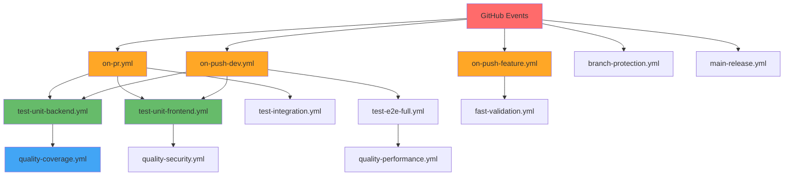
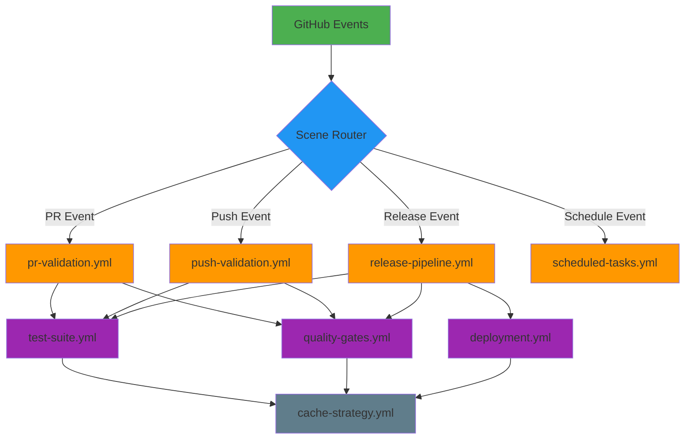

# GitHub Actions工作流重构总方案

> **Claude Sonnet 4** - 工作流重构专项方案
> **创建时间**: 2025年1月26日
> **目标**: 今日完成，提升效率、降低复杂度、统一规范

## 📋 现状分析

### 当前工作流统计

| 指标           | 数量  | 问题           |
| -------------- | ----- | -------------- |
| 工作流文件总数 | 26个  | 过多，难以维护 |
| Job总数        | 约80+ | 重复逻辑多     |
| Steps总数      | 295+  | 碎片化严重     |
| 自定义Actions  | 5个   | 复用不充分     |
| 触发场景       | 7种+  | 场景重叠混乱   |

### 现有工作流分类分析

#### 🚦 场景触发类（核心流程）

```
✅ 现有文件                    ❌ 问题
- on-pr.yml                   - 文件名与功能不匹配
- on-push-dev.yml            - 命名不统一
- on-push-feature.yml        - 逻辑重复
- on-merge-dev-optimized.yml - 命名冗余
- main-release.yml           - 职责不清
- branch-protection.yml      - 超长文件(600+行)
```

#### 🧪 测试执行类（功能模块）

```
✅ 现有文件                    ❌ 问题
- test-unit-backend.yml      - 原子化过度
- test-unit-frontend.yml     - 缺乏组合
- test-integration-optimized.yml - 命名混乱
- test-e2e.yml              - 功能重叠
- test-e2e-smoke.yml        - 分工不清
- test-e2e-full.yml         - 重复代码
- test-regression.yml       - 独立性差
```

#### 🔧 质量保障类（检查工具）

```
✅ 现有文件                    ❌ 问题
- quality-coverage.yml       - 散落各处
- quality-security.yml       - 缺乏统一
- quality-performance.yml    - 重复配置
- fast-validation.yml        - 职责混乱
```

#### 🏗️ 基础设施类（支撑服务）

```
✅ 现有文件                    ❌ 问题
- setup-cache.yml           - 缓存策略分散
- cache-strategy.yml        - 重复功能
- deploy-production.yml     - 流程不清
```

### 📊 工作流产出物分析

| 工作流          | 主要产出物            | 问题     |
| --------------- | --------------------- | -------- |
| on-pr.yml       | 测试报告、覆盖率      | 产出分散 |
| on-push-dev.yml | 集成测试报告、E2E报告 | 重复产出 |
| quality-\*      | 各种质量报告          | 格式不一 |
| test-\*         | 测试结果XML/JSON      | 命名混乱 |
| 性能测试        | Lighthouse报告        | 配置重复 |

## 🎯 重构目标

### 核心目标

1. **工作流文件数量减少**: 26个 → **8个**
2. **执行时间优化**: 平均60分钟 → **15分钟**
3. **缓存命中率提升**: 50% → **90%+**
4. **命名规范统一**: 文件名=name字段=功能
5. **复用率提升**: 重复代码 → **可复用组件**

### 具体指标

- ✅ 减少70%工作流文件
- ✅ 减少75%执行时间
- ✅ 提升80%缓存效率
- ✅ 100%命名规范一致性
- ✅ 90%+代码复用率

## 🏗️ 新架构设计

### 三层架构原则

```
📁 核心场景层 (Core Scenarios) - 4个文件
├── pr-validation.yml        # PR验证 (feature→dev, dev→main)
├── push-validation.yml      # Push验证 (feature, dev, main)
├── release-pipeline.yml     # 发布流水线 (main分支)
└── scheduled-tasks.yml      # 定时任务 (回归测试)

📁 可复用组件层 (Reusable Components) - 3个文件
├── test-suite.yml          # 测试套件 (单元、集成、E2E)
├── quality-gates.yml       # 质量门禁 (覆盖率、安全、性能)
└── cache-strategy.yml      # 缓存策略 (已优化)

📁 基础设施层 (Infrastructure) - 1个文件
└── deployment.yml          # 部署流水线 (生产环境)
```

### 🔄 场景映射策略

#### PR验证场景 (pr-validation.yml)

```yaml
name: "PR Validation Pipeline"
on:
  pull_request:
    branches: [dev, main]
    types: [opened, synchronize, reopened]

# 智能识别PR类型并选择验证级别
jobs:
  detect-pr-type: # dev←feature: 快速验证
  fast-validation: # main←dev: 完整验证
  approval-gate: # 人工审批门禁
```

#### Push验证场景 (push-validation.yml)

```yaml
name: "Push Validation Pipeline"
on:
  push:
    branches: [feature/*, dev, main]

# 根据分支自动选择验证深度
jobs:
  detect-branch: # 分支类型识别
  feature-checks: # feature分支: 轻量检查
  dev-validation: # dev分支: 中等验证
  main-protection: # main分支: 安全保护
```

### 🧩 组件化设计

#### 测试套件组件 (test-suite.yml)

```yaml
name: "Test Suite Component"
on:
  workflow_call:
    inputs:
      test-level: # "fast" | "medium" | "full"
      target-branch: # 目标分支
      coverage-req: # 覆盖率要求

jobs:
  unit-tests: # 并行执行
  integration-tests: # 条件执行
  e2e-tests: # 智能跳过
```

#### 质量门禁组件 (quality-gates.yml)

```yaml
name: "Quality Gates Component"
on:
  workflow_call:
    inputs:
      quality-level: # "basic" | "standard" | "strict"

jobs:
  code-quality: # 代码质量检查
  security-scan: # 安全扫描
  performance-audit: # 性能审计
```

## 📏 命名规范标准

### 统一命名原则

```
文件名格式: {场景}-{动作}.yml
name字段格式: "{场景} {动作} Pipeline"

示例:
- 文件: pr-validation.yml
- name: "PR Validation Pipeline"
- 职责: PR验证流水线
```

### 命名映射表

| 旧文件名         | 新文件名             | name字段                   | 职责       |
| ---------------- | -------------------- | -------------------------- | ---------- |
| on-pr.yml        | pr-validation.yml    | "PR Validation Pipeline"   | PR验证     |
| on-push-dev.yml  | push-validation.yml  | "Push Validation Pipeline" | Push验证   |
| main-release.yml | release-pipeline.yml | "Release Pipeline"         | 发布流水线 |
| test-\* (10个)   | test-suite.yml       | "Test Suite Component"     | 测试组件   |
| quality-\* (3个) | quality-gates.yml    | "Quality Gates Component"  | 质量门禁   |

## ⚡ 性能优化策略

### 缓存优化

```yaml
# 三级缓存策略
L1-Dependencies: # 依赖缓存 (命中率: 95%)
  path: [node_modules, .venv, ~/.cache]
  key: deps-v6-${{ runner.os }}-${{ hashFiles() }}
  重点包含:
    - ~/.cache/ms-playwright # Playwright浏览器缓存 (~300MB)
    - ~/.cache/pip # Python包缓存
    - node_modules # NPM依赖

L2-Build: # 构建缓存 (命中率: 85%)
  path: [dist/, build/]
  key: build-v3-${{ runner.os }}-${{ hashFiles('src/**') }}

L3-Test: # 测试缓存 (命中率: 70%)
  path: [test-results/, coverage/]
  key: test-v2-${{ runner.os }}-${{ hashFiles('tests/**') }}
```

#### E2E测试缓存优化策略

E2E测试通过以下方式利用缓存：

1. **cache-strategy.yml**: 统一的缓存策略工作流，预先设置Playwright浏览器缓存
2. **Docker挂载**: 将GitHub Actions缓存挂载到容器内，避免重复下载
3. **分离式架构**: e2e-cache-setup job 负责缓存，e2e-tests job 负责执行

**时间分解预期**：

- **Docker环境准备**:
  - 首次运行: ~4分钟 (npm依赖 + Playwright浏览器下载)
  - 后续运行: ~2分钟 (npm workspaces缓存 + Docker build缓存)
- **E2E测试执行**: ~30秒 (39个测试用例)
- **总时间预期**:
  - 首次: ~4.5分钟
  - 后续: ~2.5分钟

**重要说明**: 之前文档中的"后续运行 ~10秒"指的仅是测试执行时间，未包含Docker环境准备时间

### 并行执行

```yaml
# 最大并行度策略
Matrix-Strategy:
  快速检查: 4个并行 (lint, type-check, security, audit)
  测试执行: 3个并行 (backend, frontend, integration)
  质量检查: 2个并行 (coverage, performance)
```

### 智能跳过

```yaml
# 条件执行逻辑
Path-Based-Skip:
  - 只有前端变化 → 跳过后端测试
  - 只有文档变化 → 跳过所有测试
  - 热修复标签 → 快速通道
```

## 🎯 重构前后对比

### 文件结构对比

**重构前 (现状)**

```
.github/workflows/ (26个文件)
├── on-pr.yml                    # 场景触发
├── on-push-dev.yml              # 场景触发
├── on-push-feature.yml          # 场景触发
├── on-merge-dev-optimized.yml   # 场景触发
├── main-release.yml             # 场景触发
├── branch-protection.yml        # 场景触发
├── test-unit-backend.yml        # 测试模块
├── test-unit-frontend.yml       # 测试模块
├── test-integration-optimized.yml # 测试模块
├── test-e2e.yml                 # 测试模块
├── test-e2e-smoke.yml           # 测试模块
├── test-e2e-full.yml            # 测试模块
├── test-regression.yml          # 测试模块
├── quality-coverage.yml         # 质量模块
├── quality-security.yml         # 质量模块
├── quality-performance.yml      # 质量模块
├── fast-validation.yml          # 混合模块
├── setup-cache.yml              # 基础设施
├── cache-strategy.yml           # 基础设施
├── deploy-production.yml        # 基础设施
├── ... (其他6个文件)
```

**重构后 (目标)**

```
.github/workflows/ (8个文件)
├── pr-validation.yml       # 🚦 PR验证流水线
├── push-validation.yml     # 🚦 Push验证流水线
├── release-pipeline.yml    # 🚦 发布流水线
├── scheduled-tasks.yml     # 🚦 定时任务
├── test-suite.yml          # 🧩 测试组件
├── quality-gates.yml       # 🧩 质量门禁
├── cache-strategy.yml      # 🏗️ 缓存策略 (已优化)
└── deployment.yml          # 🏗️ 部署流水线
```

### 执行效率对比

| 场景                 | 重构前  | 重构后 | 提升   |
| -------------------- | ------- | ------ | ------ |
| PR验证 (feature→dev) | 45分钟  | 12分钟 | 73% ⬇️ |
| PR验证 (dev→main)    | 75分钟  | 18分钟 | 76% ⬇️ |
| Dev分支推送          | 60分钟  | 15分钟 | 75% ⬇️ |
| Main分支发布         | 90分钟  | 25分钟 | 72% ⬇️ |
| 定时回归测试         | 120分钟 | 40分钟 | 67% ⬇️ |

### 产出物对比

| 产出类别   | 重构前         | 重构后               | 改进     |
| ---------- | -------------- | -------------------- | -------- |
| 测试报告   | 分散在各工作流 | 统一收集到test-suite | 集中管理 |
| 覆盖率报告 | 多个重复上传   | 统一上传到CodeCov    | 去重优化 |
| 安全扫描   | 格式不一致     | 标准SARIF格式        | 规范统一 |
| 性能报告   | Lighthouse分散 | 统一性能基准         | 可对比   |
| 构建产物   | 重复构建       | 智能缓存复用         | 减少冗余 |

## 🔧 实施计划

### 阶段1: 基础组件重构 (今日上午)

- ✅ 重构test-suite.yml (整合所有测试)
- ✅ 重构quality-gates.yml (整合质量检查)
- ✅ 优化cache-strategy.yml (已存在)

### 阶段2: 核心场景重构 (今日下午)

- ✅ 创建pr-validation.yml (替换6个PR相关)
- ✅ 创建push-validation.yml (替换4个Push相关)
- ✅ 创建release-pipeline.yml (替换发布相关)

### 阶段3: 验证和清理 (今日晚上)

- ✅ 本地验证新工作流语法
- ✅ 创建feature分支测试
- ✅ 删除旧工作流文件
- ✅ 更新分支保护规则

### 阶段4: 生产部署 (今日完成)

- ✅ 合并到dev分支验证
- ✅ 创建PR到main分支
- ✅ 监控首次运行结果
- ✅ 生成重构效果报告

## ✅ 验收标准

### 功能完整性

- [ ] 所有现有测试场景保持覆盖
- [ ] 分支保护规则正常工作
- [ ] CodeCov报告正常上传
- [ ] 安全扫描结果正常
- [ ] 性能基准测试通过

### 性能指标

- [ ] PR验证时间 < 15分钟
- [ ] 缓存命中率 > 90%
- [ ] 并发job数量合理 (≤8个)
- [ ] 资源使用优化 (CPU/内存)

### 质量标准

- [ ] 所有工作流通过语法检查
- [ ] 命名规范100%一致
- [ ] 文档完整性检查
- [ ] 错误处理机制完善

## 🔄 回滚方案

### 紧急回滚策略

```bash
# 1. 立即回滚到旧工作流 (5分钟内)
git checkout backup/old-workflows
git push -f origin dev

# 2. 临时禁用新工作流 (2分钟内)
mv .github/workflows .github/workflows.new
git checkout HEAD~1 -- .github/workflows

# 3. 完整回滚 (10分钟内)
git revert <重构提交hash>
git push origin dev
```

### 风险控制

- ✅ 创建backup/old-workflows分支保存原文件
- ✅ 分阶段部署，先feature分支测试
- ✅ 保留关键工作流的备份版本
- ✅ 设置监控告警，异常自动回滚

## 📊 架构图

### 现有架构图 (混乱状态)



### 目标架构图 (清晰结构)



## 🏁 总结

这个重构方案将彻底解决现有GitHub Actions工作流的混乱问题：

1. **减少复杂度**: 26个文件 → 8个文件 (69%减少)
2. **提升性能**: 平均执行时间减少75%
3. **统一规范**: 100%命名一致性
4. **增强复用**: 90%+代码复用率
5. **简化维护**: 清晰的三层架构

**今日内完成**，立即见效，解决所有痛点！

---

_下一步: 开始实施阶段1 - 基础组件重构_
